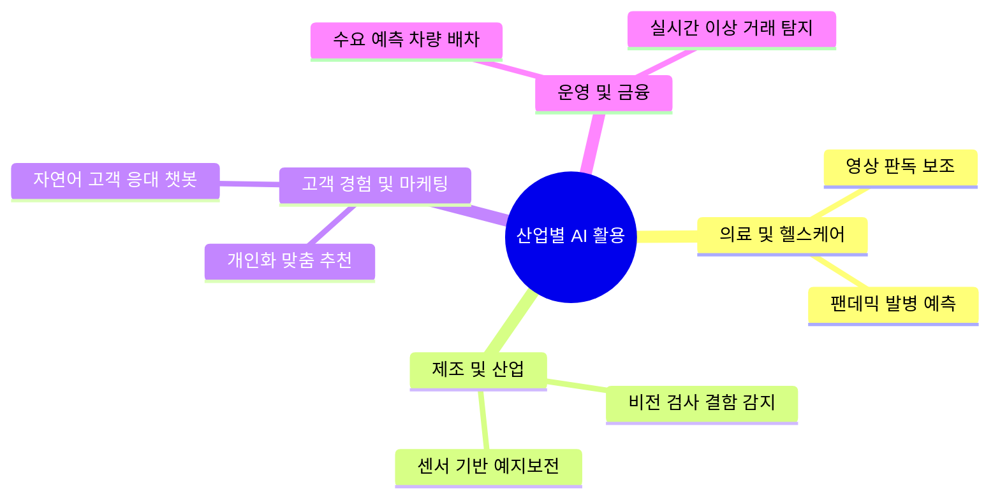
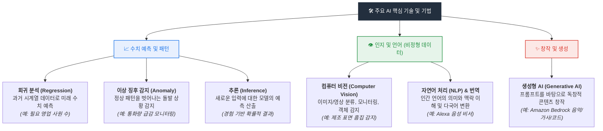
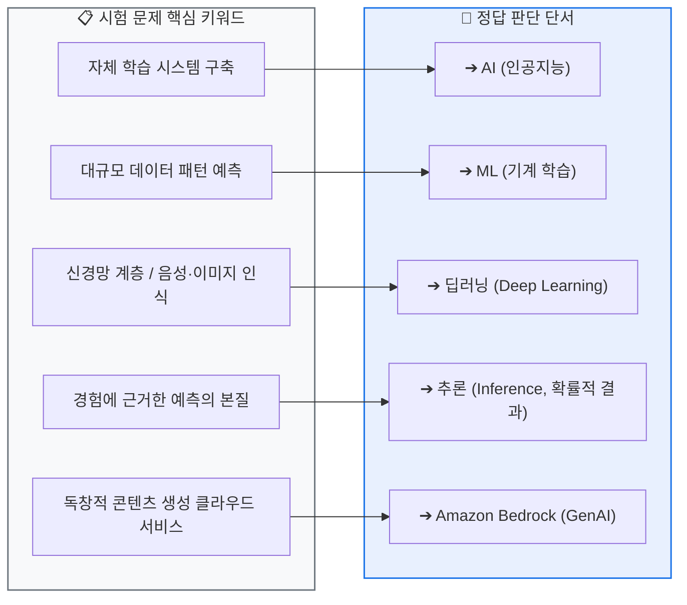
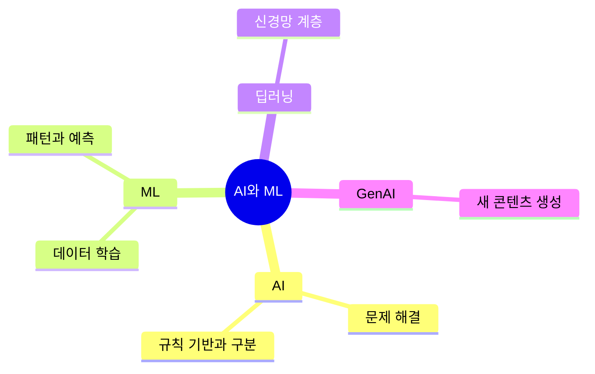

<!-- metadata-badges -->
<p></p>

# AIF-C01 Task 1.1 Part 1 - 기본 AI 개념과 용어

> 기본 AI 개념과 용어를 설명하는 영역 1의 첫 번째 태스크 목표. 5개 강의 중 1번째.

## 1. 핵심 개념 3단계

| 구분 | 정의 | 목표/특징 | 예시 |
| :--- | :--- | :--- | :--- |
| **AI (인공지능)** | 학습, 창조, 이미지 인식 등 일반적으로 인간 지능과 관련된 인지 문제를 해결하는 컴퓨터 과학 분야 | 데이터에서 의미를 도출하는 자체 학습 시스템 만들기. 방대한 데이터 빠른 처리, 반복적 업무 자동화, 패턴/트렌드 예측 | Alexa, ChatGPT |
| **ML (기계 학습)** | 데이터와 알고리즘을 사용하여 인간 학습 방식 모방에 중점 둔 AI 및 CS 한 분야 | 정확도를 점차적으로 높임. 대규모 데이터셋으로 패턴 식별 및 예측 | 온라인 쇼핑 제품 추천 |
| **딥러닝** | 인간 뇌에서 영감받은 ML 모델 유형, 신경망 계층으로 정보 처리 | 인간 음성, 사물, 이미지 인식 | - |

**계층 구조:** AI > ML > 딥러닝


```mermaid
flowchart TB
  subgraph AI ["🤖 AI (인공지능) - 인간의 지능적 행동(학습·추론·인지)을 모방하는 광범위한 컴퓨터 과학"]
    direction TB
    subgraph ML ["📊 ML (기계 학습) - 명시적 프로그래밍 없이 데이터 패턴을 학습해 예측"]
      direction TB
      subgraph DL ["🧠 딥러닝 (Deep Learning) - 다층 인공신경망으로 복잡한 비정형 데이터 처리"]
        direction TB
        GenAI ["✨ 생성형 AI (GenAI)<br/>학습된 패턴을 바탕으로 새로운 독창적 콘텐츠(글·그림·코드) 생성"]
      end
    end
  end
  style AI fill:#F0F4F8,stroke:#232F3E,stroke-width:2px,color:#232F3E
  style ML fill:#E8F0FE,stroke:#1A73E8,stroke-width:2px,color:#1A73E8
  style DL fill:#FEF7E0,stroke:#F9AB00,stroke-width:2px,color:#B06000
  style GenAI fill:#FCE8E6,stroke:#D93025,stroke-width:2px,color:#D93025
```

## 2. AI의 기능

- 질문에 의미 있게 응답
- 텍스트 및 이미지 같은 독창적 콘텐츠 생성
- 방대한 데이터 빠르게 처리 -> 실시간 사기 탐지 같은 복잡한 문제 해결
- 반복적/단조로운 태스크 수행 -> 직원 창의적 태스크 집중, 비즈니스 효율성 향상
- 데이터에서 패턴 찾기, 트렌드 예측 -> 스마트 의사결정, 빠른 대응

## 3. 산업별/부서별 활용 사례

| 분야 | 활용 | 예시 |
| :--- | :--- | :--- |
| **의료** | 엑스레이/스캔 판독, 진단 보조, 팬데믹 예측 | CDC가 AI로 전세계 팬데믹/발병 예측, 인력/자원 파견 |
| **제조** | 컴퓨터 비전으로 조립라인 모니터링, 품질 유지, 예지보전 | Koch Industries - 센서 데이터 모니터링해 고장 전 유지보수 예측 |
| **고객 경험** | 언어 인식 채팅/검색 시스템, 제품 추천 | 쇼핑 기록 기반 추천, Discovery - 시청 기록 기반 맞춤형 콘텐츠 추천 |
| **운영 효율** | 수요 예측으로 더 효율적 서비스 | 택시 회사 - 고객 필요 위치/시간에 차량 배치 |
| **금융** | 비정상 활동 감지 | MasterCard - 사기 거래 탐지 |
| **HR** | 이력서 처리, 직무 매칭 | 채용 관리자 생산성 향상 |
| **마케팅** | 고객 정보 기반 타겟 프로모션, 스팸 방지 | TicketTek - 관심사 기반 쇼/이벤트 추천 |



## 4. AI 기술/기법

- **회귀 분석:** 시계열 데이터(과거 데이터) 처리해 미래 값 예측. 예) 특정 날짜에 필요한 영업 사원 수 예측
- **추론 (Inference):** AI가 수행하는 예측. 경험에 근거한 추측이므로 확률적 결과 제공
- **이상 징후 감지 (Anomaly Detection):** 예상 패턴에서 벗어나는 현상. 예) 콜센터 통화량이 예측 가능한데 앱 오프라인으로 통화량 감소 -> IT에 알림
- **컴퓨터 비전:** 이미지/비디오 처리 - 분류, 추천, 모니터링, 탐지, 물체 식별, 얼굴 인식. 예) 표면 긁힌 자국 감지 후 빨간 박스 표시, 회로 기판 콘덴서 누락 식별
- **번역:** 단어 간 번역 넘어 모든 텍스트 요소 분석, 단어 영향 인식해 의미 정확 전달. 예) 고객 지원 채팅 스페인어-영어 실시간 번역
- **NLP (자연어 처리):** 컴퓨터가 인간 언어를 자연스럽게 이해/해석/생성. 예) Alexa, 호텔 예약 챗봇
- **생성형 AI:** AI의 다음 단계. 지능적 대화 + 스토리/이미지/비디오/음악 등 독창적 콘텐츠 생성. 프롬프트로 시작. 예) Amazon Bedrock - 가사로 노래 생성. 단일 프롬프트로 2절, 코러스, 브릿지, 아웃트로 + 운율



## 5. 시험 체크포인트

- AI 목표 = 데이터에서 의미 도출하는 자체 학습 시스템
- ML = 대규모 데이터셋으로 패턴 식별 및 예측
- 딥러닝 = 신경망 계층, 음성/사물/이미지 인식
- 추론 = 확률적 결과
- Bedrock = 생성형 AI 서비스



## 학습 문서 메타데이터

- 도메인: D1 — AI 및 ML의 기초
- 원본 보존 링크: [AIF-C01-Task1-1-Part1.md](../../../docs/Refs/AIF-C01-Task1-1-Part1.md)
- 이 문서는 원본 본문을 보존한 복사본이며, 이 섹션·도식·네비게이션은 학습용으로 추가했습니다.

이 마인드맵은 중심 개념에서 AI, ML, 딥러닝, GenAI로 가지가 뻗는 계층 관계를 보여 줍니다. Mermaid가 렌더링되지 않아도 들여쓰기 순서로 관계를 이해할 수 있습니다.



---

없음 | [인덱스](README.md) | [다음](part-2.md)
