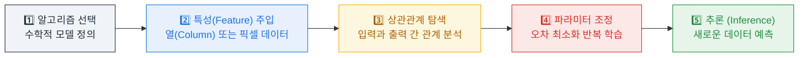
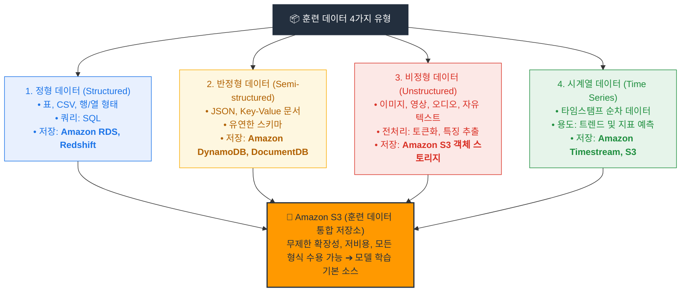
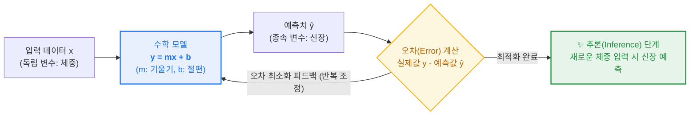
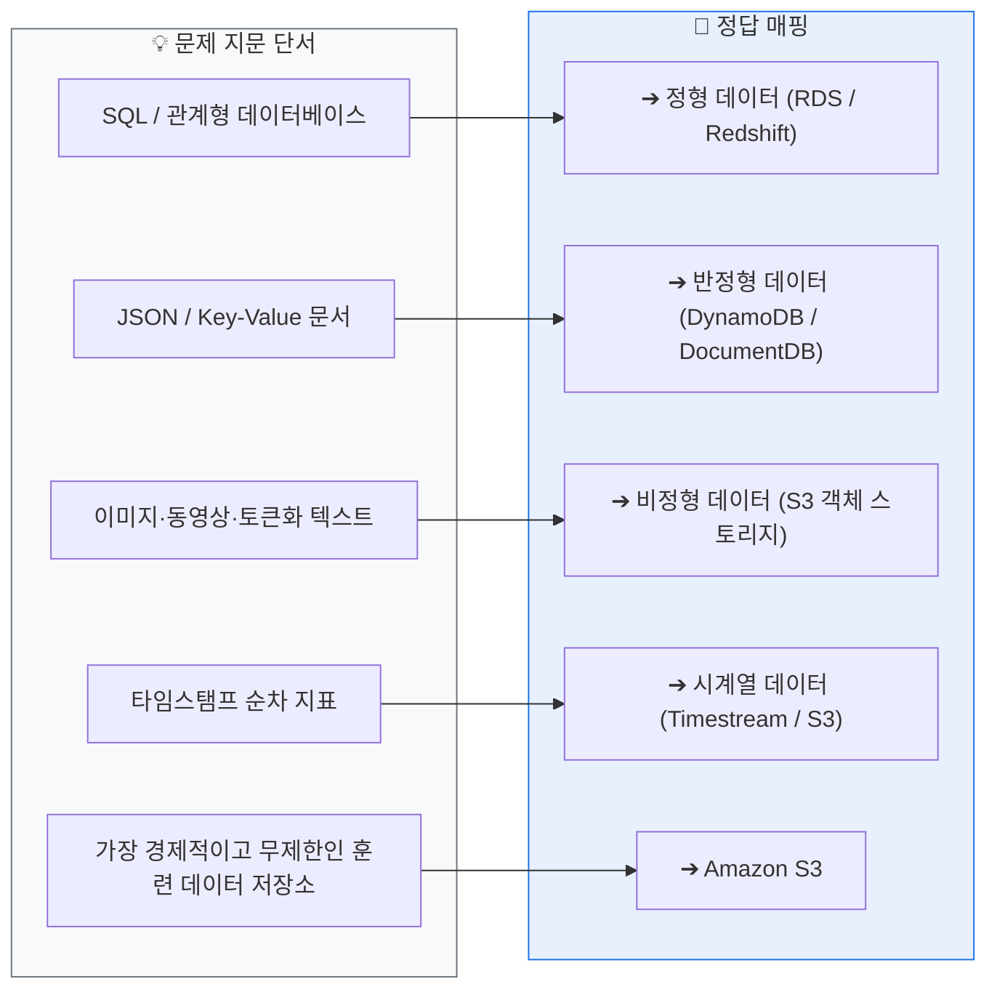
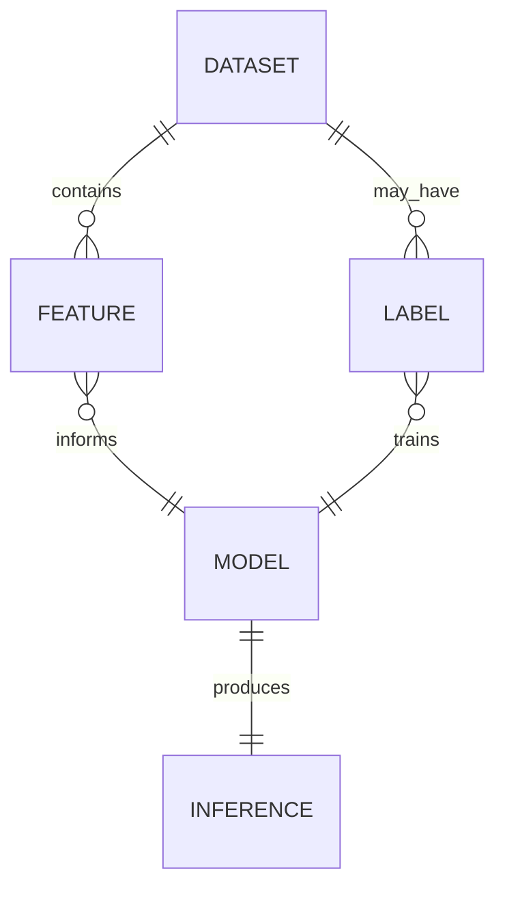

  

# AIF-C01 Task 1.1 Part 2 - 기계 학습과 데이터 유형

> 태스크 1.1 계속, 특정 유형인 기계 학습에 집중

## 1. 기계 학습(ML) 정의

- 컴퓨터 시스템에서 명시적 지침 없이 복잡한 태스크 수행하는 알고리즘과 통계 모델 개발하는 과학
- ML 알고리즘으로 대량 과거 데이터 처리, 데이터 패턴 식별

### ML 학습 과정 5단계

1. **알고리즘 시작:** 데이터를 입력으로 받아 출력 생성하는 수학적 알고리즘
2. **특성 제공:** 특성으로 구성된 알려진 데이터 제공. 특성은 표의 열 또는 이미지의 픽셀로 생각
3. **상관관계 찾기:** 알고리즘 임무는 입력 데이터 특성과 알려진 예상 출력 간 상관관계 찾기
4. **파라미터 조정:** 예상 출력 안정적 생성까지 내부 파라미터 값 변경하며 조정
5. **추론:** 훈련된 모델은 정확한 예측 가능, 훈련 중 보지 못한 새로운 데이터로 출력 생성 = 추론

## 2. 4가지 데이터 유형

> ML 모델은 다양한 소스의 다양한 데이터 유형에서 훈련. 모든 유형은 최종적으로 Amazon S3로 내보내 훈련. S3는 모든 유형 저장 가능, 저렴, 거의 무제한 용량 -> 훈련 데이터 기본 소스

| 유형 | 정의/특징 | 저장/쿼리/AWS 서비스 | 예시 |
| :--- | :--- | :--- | :--- |
| **정형 데이터** | 가장 쉽게 이해/처리. 열이 특성으로 사용되는 테이블 행 | 텍스트 파일(CSV) 또는 관계형 DB **RDS, Redshift**. **SQL**로 쿼리 가능 | 표 형태 데이터 |
| **반정형 데이터** | 테이블 형식 정형 데이터 규칙 완전히 따르지 않음. 속성 다르거나 누락 가능 | 텍스트 파일(JSON). 키-값 페어로 특성 표현. **DynamoDB(MongoDB 호환), DocumentDB** - 반정형에 맞게 구축된 트랜잭션 DB | JSON 문서 |
| **비정형 데이터** | 특정 데이터 모델 따르지 않음, 테이블로 저장 불가 | **S3 같은 객체 스토리지**에 객체로 저장. 특성은 **토큰화** 같은 처리 기법으로 파생 (텍스트를 단어/문구 개별 단위로 나눔) | 이미지, 비디오, 텍스트 파일, 소셜미디어 게시물 |
| **시계열 데이터** | 미래 추세 예측에 중요. 각 레코드는 타임스탬프로 레이블, 순차 저장 | 샘플링 속도에 따라 매우 커질 수 있음, S3 저장. 패턴 검색 후 부하 증가 전 인프라 사전 확장 | 마이크로서비스 성능 지표 (사용된 메모리, CPU %, 초당 트랜잭션 수) |

## 3. 모델 생성 - 선형 회귀 예시

- **시작:** 출력과 입력 간 수학적 관계 정의하는 알고리즘
- **예시:** 입력 데이터와 일치하는 선의 최적 적합 찾기. 훈련 데이터: 여러 사람 키와 몸무게
- **수식:** `y = mx + b` 또는 `h = mw + b`
  - w: 독립 변수, h: 종속 변수
  - m: 기울기, b: 절편 -> 훈련 중 반복 조정되는 **모델 파라미터**
- **최적 적합 결정:** **오차(Error) 최소화**하는 파라미터 찾기. 오차 = 데이터 포인트와 선 사이 거리
- **훈련 완료 후:** 추론 시작 준비. 예) 몸무게에서 키 유추

## 4. 시험 체크포인트

- 특성 = 열 또는 픽셀
- 정형=SQL/RDS/Redshift, 반정형=JSON/DynamoDB/DocumentDB, 비정형=S3/토큰화, 시계열=타임스탬프/순차
- S3가 훈련 데이터 기본 소스인 이유 3가지
- 선형 회귀 파라미터 m,b는 훈련 중 조정, 오차 최소화

## 학습 문서 메타데이터

- 도메인: D1 — AI 및 ML의 기초
- 원본 보존 링크: [AIF-C01-Task1-1-Part2.md](../../../docs/Refs/AIF-C01-Task1-1-Part2.md)
- 이 문서는 원본 본문을 보존한 복사본이며, 이 섹션·도식·네비게이션은 학습용으로 추가했습니다.

이 ER 다이어그램은 데이터셋, 특성, 레이블, 모델, 추론 결과 사이의 데이터 관계를 보여 줍니다. Mermaid가 렌더링되지 않아도 각 관계의 방향과 필수 여부를 읽을 수 있습니다.

## 초보자 학습 보조

### 이 문서에서 배울 것

특성·파라미터·추론의 역할을 구분하고, 정형·반정형·비정형·시계열 데이터에서 문제 단서를 찾는 연습을 합니다.

### 선수 지식과 한 줄 요약

- 선수 지식: **특성(feature)** 은 모델에 주는 입력 정보이고, **레이블(label)** 은 학습 때 비교하는 기대 답입니다.
- 한 줄 요약: **ML은 입력 특성에서 패턴을 학습하고, 훈련에서 보지 못한 새 입력에 결과를 만드는 과정이 추론입니다.**

### 자주 하는 오해

- **오해:** 데이터 형식이 정해지면 반드시 하나의 AWS 저장 서비스를 사용해야 한다.
- **바로잡기:** 데이터 형식은 처리 방법과 모델 입력을 판단하는 단서입니다. Amazon S3는 다양한 훈련 데이터를 저장하는 흔한 선택지이지만, 모든 데이터가 반드시 S3에만 있어야 하는 것은 아닙니다.

### 스스로 답하는 확인 질문

1. 고객의 월별 구매액을 예측하려면 입력 특성과 기대 출력은 각각 무엇일 수 있나요?
2. 시간 순서가 중요한 CPU 사용률 기록은 어떤 데이터 유형이며, 그 이유는 무엇인가요?

### 공식 범위와 출처

- **시험 핵심:** AIF-C01 Domain 1 Task 1.1의 AI 모델 데이터 유형과 훈련·추론 용어에 연결됩니다.
- **AWS 실무 확장:** 표의 저장 서비스 예시는 데이터 유형을 이해하기 위한 보조 사례입니다. 서비스 선택은 보안·쿼리·운영 요구사항도 함께 검토해야 합니다.
- [콘텐츠 도메인 1: AI 및 ML의 기초 — AWS 공식 시험 안내서](https://docs.aws.amazon.com/ko_kr/aws-certification/latest/ai-practitioner-01/ai-practitioner-01-domain1.html), 확인일: 2026-09-09

---

[이전](part-1.md) | [인덱스](README.md) | [다음](part-3.md)
