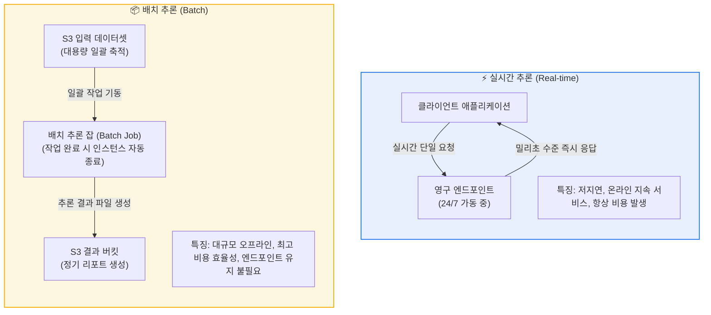
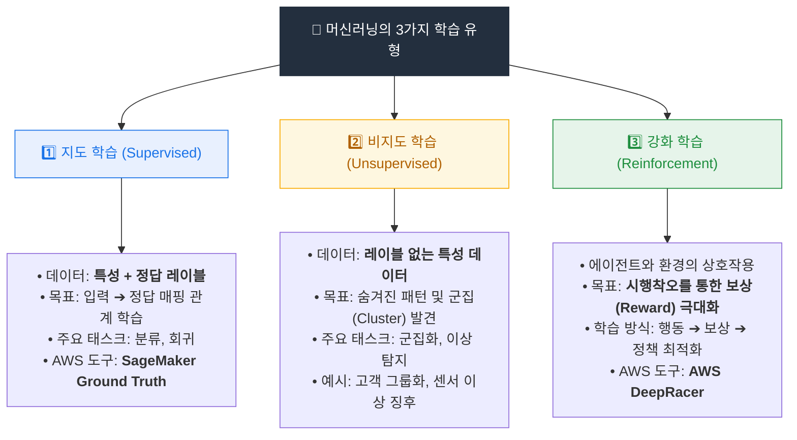
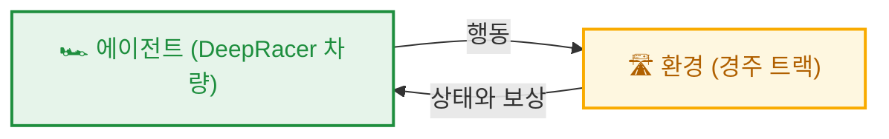
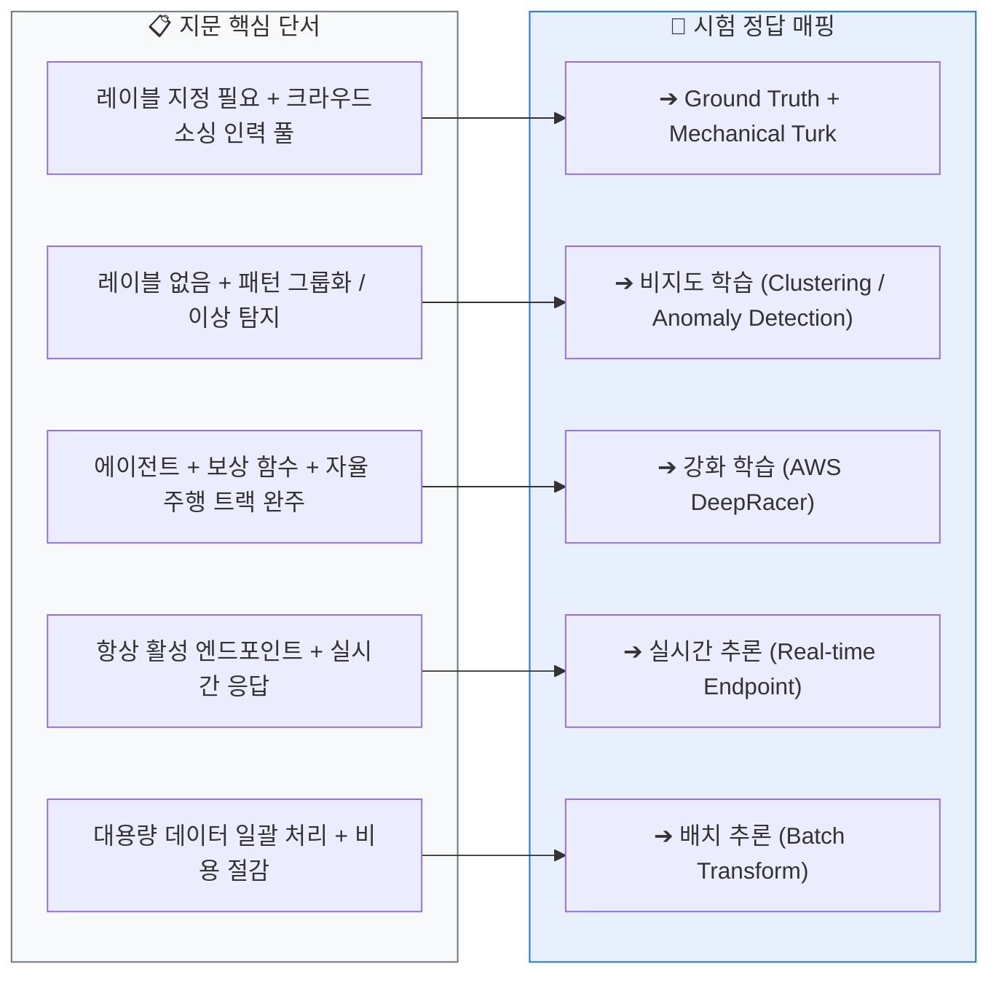
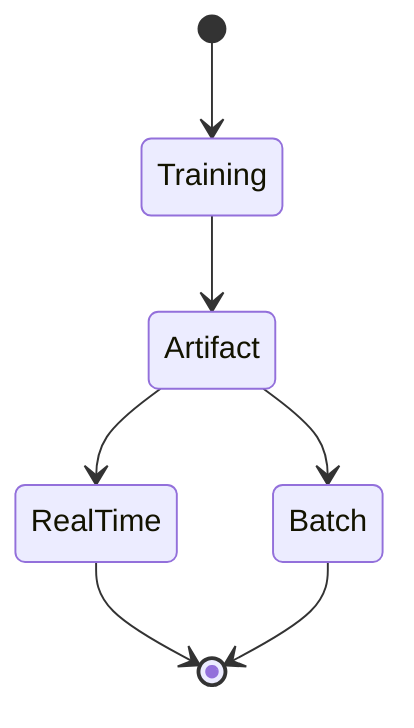

  

# AIF-C01 Task 1.1 Part 3 - 모델 아티팩트와 배포, 학습 유형

> 모델 훈련 관련 마지막 강의

## 1. 모델 아티팩트와 배포

- **훈련 프로세스 결과:** 훈련된 파라미터, 추론 계산 방법 설명하는 모델 정의, 기타 메타데이터로 구성된 **모델 아티팩트** 생성
- **저장:** 일반적으로 **Amazon S3**
- **배포 가능한 모델 = 모델 아티팩트 + 추론 코드**
  - 추론 코드: 아티팩트 읽어 모델 구현하는 소프트웨어

### 호스팅 2가지 옵션

| 구분 | 실시간 추론 (Real-time) | 배치 (Batch) |
| :--- | :--- | :--- |
| 방식 | 엔드포인트가 항상 실시간으로 추론 요청 수락 | 배치 작업이 추론 수행 |
| 특징 | 지연 시간 짧음, 처리량 높음, 온라인 추론. 영구 엔드포인트에 배포, 지속적인 요청 흐름 처리 | 대량 데이터 미리 사용 가능, 영구 엔드포인트 불필요, 오프라인 처리. **비용 효율적** |
| 예시 | 클라이언트가 입력 보내면 매우 빠르게 결과 반환 | 판매 기록 데이터로 카탈로그 각 제품 다음달 필요 재고 예측. 월별 일정으로 한꺼번에 처리해 보고서 생성 |
| 핵심 차이 | 컴퓨팅 리소스 항상 실행, 요청 처리 가능 | 컴퓨팅 리소스가 배치 처리할 때만 실행 후 종료 |

## 2. 기계 학습 유형 - 예상 출력과 입력 유형에 따라 구분

### (1) 지도 학습 (Supervised Learning)

- **정의:** 레이블 미리 지정된 데이터로 모델 훈련
- **예시:** 어류 모델 사진에는 어류 레이블, 해우 같은 다른 동물 사진은 비어류 레이블. 훈련 데이터는 입력과 원하는 출력 모두 지정
- **작동:** 이미지 분류 - 이미지 픽셀 보고 클러스터/패턴 인식, 내부 파라미터 조정, 어류 vs 비어류 성공적 식별까지 계속
- **중요:** ML 추론이 항상 정확하지 않음. 실제로 생성하는 것은 **이미지가 어류일 확률**
- **과제:** 데이터 레이블 지정. 수천 장 레이블링에 사람 직접 작업 필요
- **해결 서비스:** **Amazon SageMaker Ground Truth** - 레이블 지정 서비스. **Amazon Mechanical Turk** 크라우드소싱 서비스 활용, 전세계 대규모 저렴 노동력 풀 액세스 제공

### (2) 비지도 학습 (Unsupervised Learning)

- **정의:** 특성은 있지만 레이블 없는 데이터 대상 훈련
- **기능:** 패턴 찾아내거나 데이터 클러스터로 그룹화, 특정 수 그룹으로 나눔
- **장점:** 레이블 필요 없으므로 설정 간단. 추가 모델링 위해 데이터 자동 정리/처리에도 사용
- **사용 사례:** 패턴 인식, 이상 탐지, 데이터 자동 카테고리 그룹화
- **예시 1 - 클러스터링:** 다양한 유형 네트워크 트래픽 식별해 잠재적 보안 인시던트 예측
- **예시 2 - 이상 탐지:** 센서 수집 데이터 검사, 정상 범위 크게 벗어나면 유정 온도 센서 고장 감지. 일반적으로 이상 탐지에 사용

### (3) 강화 학습 (RL, Reinforcement Learning)

- **정의:** 에이전트 자율적 의사결정에 초점
- **작동:** 에이전트는 특정 목표 달성 위해 환경 내에서 액션 수행. 시행착오 통해 학습, 레이블 입력 불필요. 목표 달성에 가까워지는 액션은 **보상** 받음. 학습 장려 위해 때때로 보상 없는 액션도 취해야 함
- **교육용 서비스:** **AWS DeepRacer** 경주용 자동차 모델
  - 자동차=에이전트, 트랙=환경, 액션=트랙에서 앞으로 나아가는 자동차, 목표=트랙에 머물며 최대한 효율적 완주

### 비지도 vs 강화 학습 비교

- **공통점:** 둘 다 레이블 지정 데이터 없이 작동
- **차이점:** 비지도는 훈련 중 지정 출력 없는 입력 받음 / 강화 학습은 **미리 정해진 최종 목표** 있음. 탐색적 접근 필요하지만 지속 검증/개선되어 최종 목표 도달 확률 높아짐

## 3. 시험 체크포인트

- 모델 아티팩트 = 파라미터 + 모델 정의 + 메타데이터, S3 저장, 추론 코드와 패키징
- 실시간 = 영구 엔드포인트/저지연/온라인, 배치 = 대량/오프라인/비용 효율/자원 처리시에만 실행
- 지도 학습 = 레이블 필요, 확률 출력, 과제=레이블링, 해결=Ground Truth + Mechanical Turk
- 비지도 = 레이블 없는 특성, 클러스터링/이상탐지
- RL = 에이전트/환경/액션/보상/목표, DeepRacer

## 학습 문서 메타데이터

- 도메인: D1 — AI 및 ML의 기초
- 원본 보존 링크: [AIF-C01-Task1-1-Part3.md](../../../docs/Refs/AIF-C01-Task1-1-Part3.md)
- 이 문서는 원본 본문을 보존한 복사본이며, 이 섹션·도식·네비게이션은 학습용으로 추가했습니다.

이 상태 다이어그램은 모델 아티팩트가 훈련 결과에서 추론 배포 상태로 전환되는 과정을 보여 줍니다. Mermaid가 렌더링되지 않아도 상태 이름과 전이 방향으로 실시간·배치 차이를 이해할 수 있습니다.

## 초보자 학습 보조

### 이 문서에서 배울 것

훈련 결과인 모델 아티팩트가 추론에 어떻게 사용되는지와, 지도·비지도·강화 학습을 문제 단서로 구분하는 방법을 배웁니다.

### 선수 지식과 한 줄 요약

- 선수 지식: **훈련**은 데이터로 모델의 패턴을 만드는 단계이고, **추론**은 완성된 모델로 새 입력의 결과를 만드는 단계입니다.
- 한 줄 요약: **정답 레이블이 있으면 지도 학습, 숨은 구조를 찾으면 비지도 학습, 행동의 보상을 통해 개선하면 강화 학습을 먼저 떠올립니다.**

### 자주 하는 오해

- **오해:** 실시간 추론은 항상 배치 추론보다 좋은 선택이다.
- **바로잡기:** 실시간 추론은 즉시 응답이 필요할 때 적합합니다. 많은 데이터를 한꺼번에 처리하고 결과를 기다릴 수 있다면 배치 추론이 더 알맞을 수 있습니다.

### 스스로 답하는 확인 질문

1. 매일 밤 전날 판매 기록 전체를 처리해 재고 예측 보고서를 만드는 경우, 어떤 추론 방식이 더 알맞고 왜 그런가요?
2. 정답 레이블 없이 고객을 비슷한 행동 패턴으로 묶고 싶다면 어떤 학습 유형을 고려하나요?

### 공식 범위와 출처

- **시험 핵심:** AIF-C01 Domain 1 Task 1.1의 추론 유형과 지도·비지도·강화 학습 설명에 연결됩니다.
- **AWS 실무 확장:** 모델 아티팩트와 SageMaker 관련 예시는 개념을 AWS 환경에 연결하기 위한 보조 설명입니다.
- [콘텐츠 도메인 1: AI 및 ML의 기초 — AWS 공식 시험 안내서](https://docs.aws.amazon.com/ko_kr/aws-certification/latest/ai-practitioner-01/ai-practitioner-01-domain1.html), 확인일: 2026-09-09

---

[이전](part-2.md) | [인덱스](README.md) | [다음](part-4.md)
