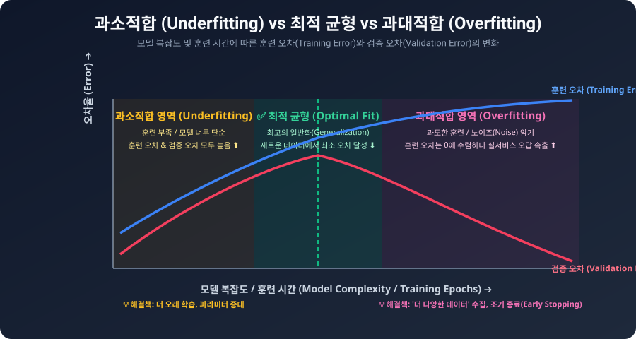
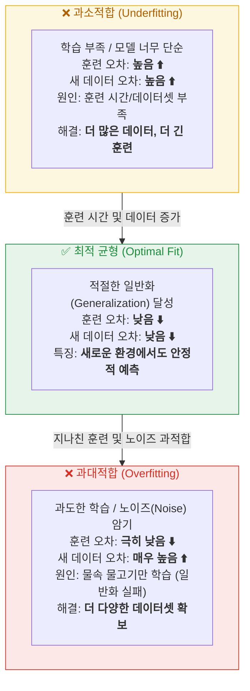
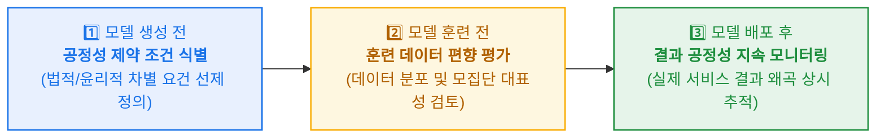
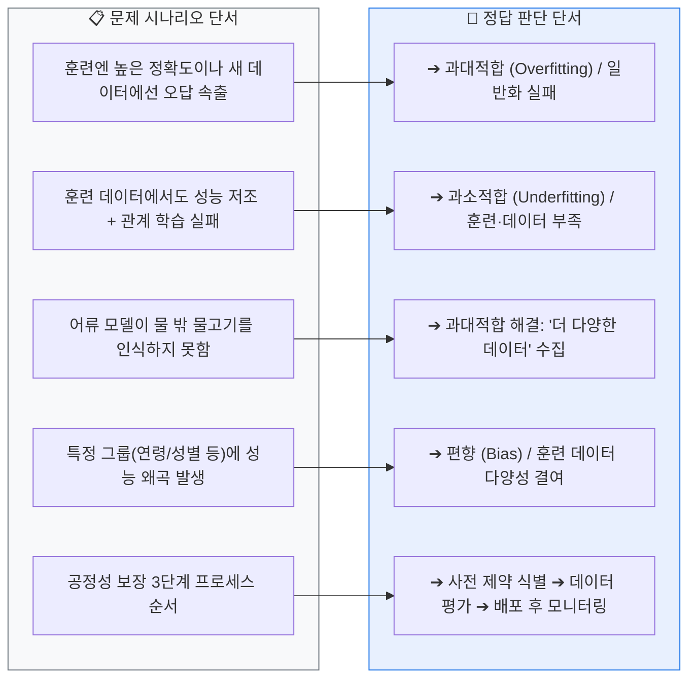
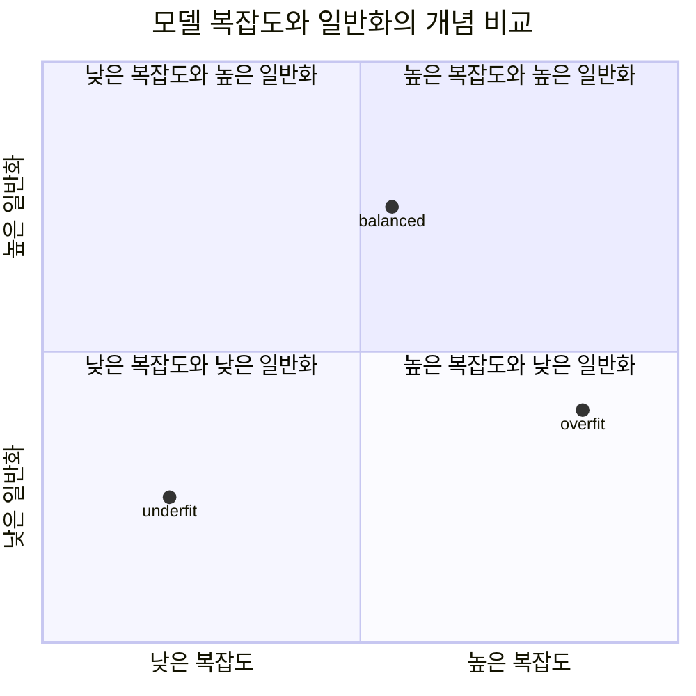

<!-- metadata-badges -->

<kbd>도메인 D1</kbd> <kbd>입문</kbd> <kbd>초안</kbd>

# AIF-C01 Task 1.1 Part 4 - 과대적합, 과소적합, 편향

> 모델 훈련 실패 원인

## 1. 과대적합 (Overfitting)

- **상황:** 어류 예제 - 물속 헤엄치는 이미지로 훈련 -> 배포된 모델이 물 밖 물고기 이미지 보고 물고기로 인식 못함
- **정의:** 모델이 **새로운 데이터보다 훈련 데이터에서 더 나은 성능** 보이는 경우. 모델이 잘 일반화하지 못함
- **원인:** 훈련 데이터에 너무 잘 맞음. 약간 다른 것 발견하면 어류일 확률 낮다고 인식
- **해결:** **더 다양한 데이터**로 훈련
- **또 다른 방식:** 너무 오래 훈련하면 중요하지 않은 특성 = **노이즈(Noise)** 지나치게 강조 -> 과대적합

## 2. 과소적합 (Underfitting)

- **정의:** 모델에서 입력/출력 간 의미 있는 관계 결정 못할 때 발생하는 오류 유형
- **결과:** 훈련 데이터셋과 새 데이터 모두 부정확한 결과 제공
- **원인:** 모델 충분히 오래 훈련 안함, 충분히 큰 데이터셋 사용 안함
- **균형:** 너무 오래 훈련하면 과대적합 발생하므로 데이터 과학자는 과소/과대적합 되지 않는 **최적 훈련 시간** 찾으려 함

### 비교표

| 구분 | 과대적합 | 과소적합 |
| :--- | :--- | :--- |
| 정의 | 새 데이터보다 훈련 데이터 성능 좋음, 일반화 실패 | 의미 있는 관계 결정 못함 |
| 결과 | 훈련엔 정확, 새 데이터엔 부정확 (물 밖 물고기 인식 실패) | 훈련/새 데이터 모두 부정확 |
| 원인 | 다양한 데이터 부족, 너무 오래 훈련해 노이즈 강조 | 훈련 시간 부족, 데이터셋 크기 부족 |
| 해결 | 더 다양한 데이터 | 더 오래, 더 큰 데이터셋 |

## 3. 편향 (Bias)

- **정의:** 여러 그룹에 걸쳐 모델 성능 차이 있는 경우. 결과가 특정 클래스에 유리/불리하게 왜곡
- **예시 - 대출 신청 자동 개선 모델:**
  - 훈련 데이터: 승인/미승인 예 포함
  - 특성: 소득, 직업 이력, 연령, 성별, 위치
  - 문제: 다양한 모집단 커버리지 부족. 예) 위스콘신 거주 25세 여성 승인 신청이 훈련 데이터에 없음 -> 소득/직업 이력 등 다른 특성 자격 있어도 승인하면 안된다고 학습
  - 원인: 특정 그룹에 편향된 패턴 학습
- **품질:** 모델 품질은 기본 데이터 품질과 양에 따라 달라짐
- **기술적 조정:** 편향 보이면 노이즈 유발 특성 가중치 데이터 과학자가 직접 조정 가능. 예) 성별 고려 완전 제거
- **프로세스 (시험 핵심):**
  1. 생성 전: 연령/성 차별 같은 **공정성 제약 조건 처음부터 식별**
  2. 훈련 전: 훈련 데이터 검사, 잠재적 편향 평가
  3. 배포 후: 결과 공정성 검사해 지속 평가

## 4. 시험 체크포인트

- 과대적합 키워드: 훈련>새 데이터, 일반화 실패, 노이즈, 물 밖 물고기 인식 실패, 해결=다양한 데이터
- 과소적합 키워드: 둘 다 부정확, 의미 있는 관계 학습 실패, 원인=훈련 부족/데이터 부족
- 최적 훈련 시간: 과소와 과대 사이 균형
- 편향: 그룹별 성능 차이, 왜곡, 커버리지 부족, 품질 의존
- 공정성: 처음부터 제약 식별 + 데이터 검사 + 지속 평가

## 학습 문서 메타데이터

- 도메인: D1 — AI 및 ML의 기초
- 원본 보존 링크: [AIF-C01-Task1-1-Part4.md](../../../docs/Refs/AIF-C01-Task1-1-Part4.md)
- 이 문서는 원본 본문을 보존한 복사본이며, 이 섹션·도식·네비게이션은 학습용으로 추가했습니다.

이 사분면 차트는 모델 복잡도와 일반화의 두 축 절충을 개념적으로 비교합니다. 점의 위치는 실제 측정값이 아니라 과소적합·균형·과대적합의 관계를 설명하는 예시입니다.

---

[이전](part-3.md) | [인덱스](README.md) | [다음](part-5.md)
