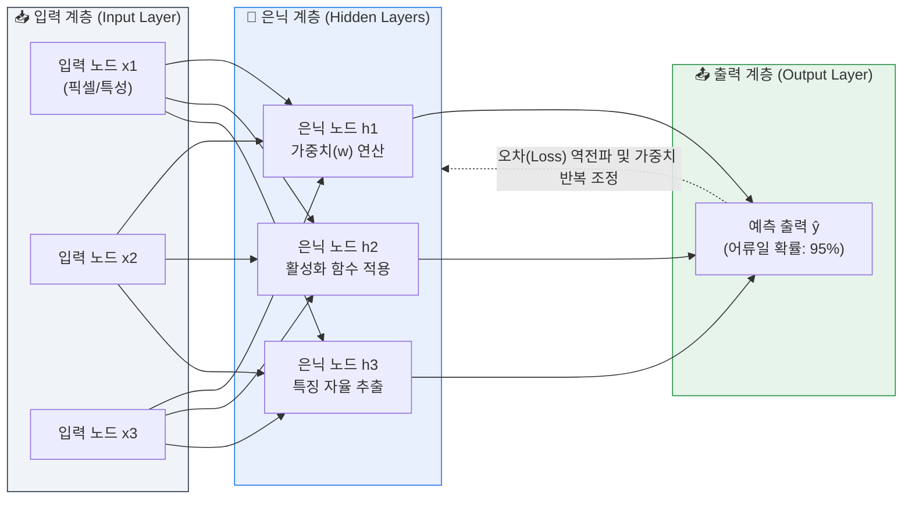
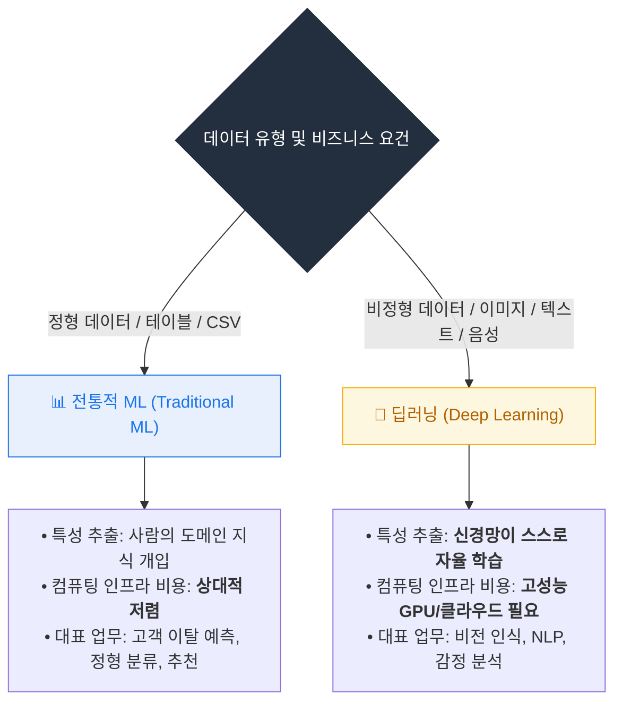
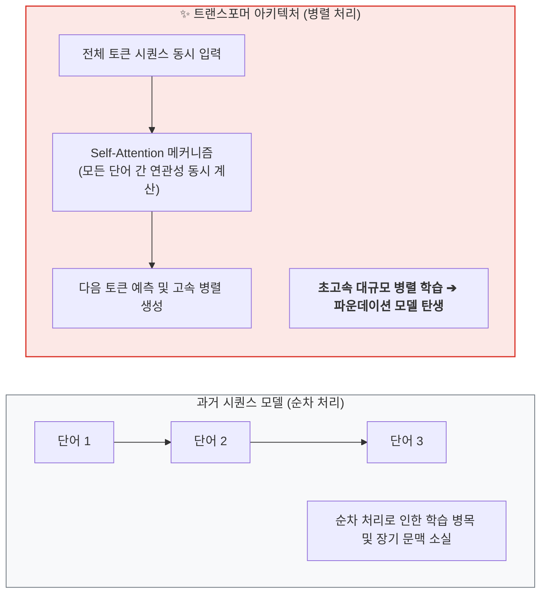
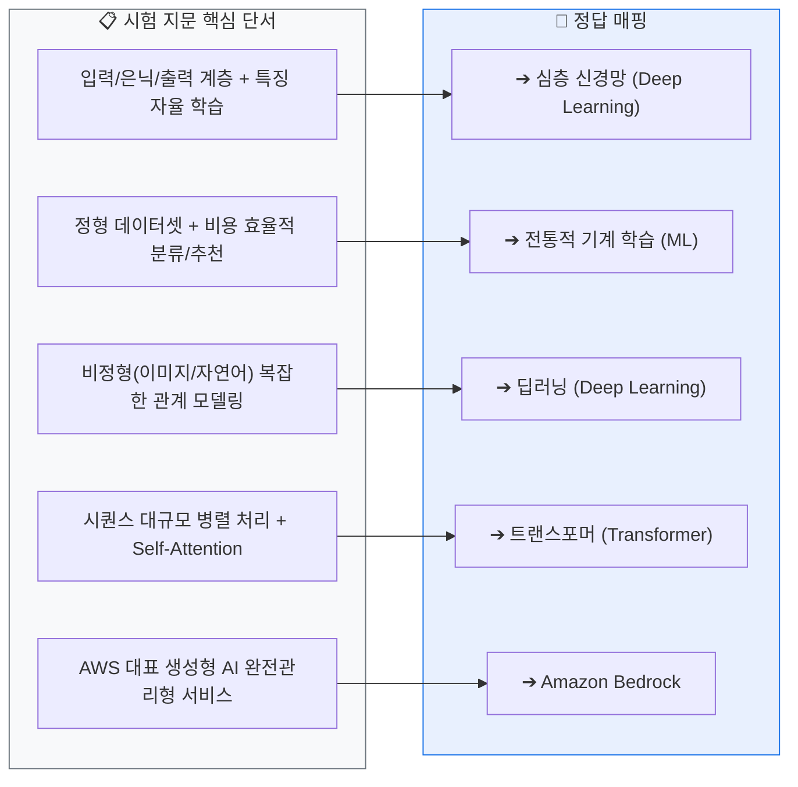
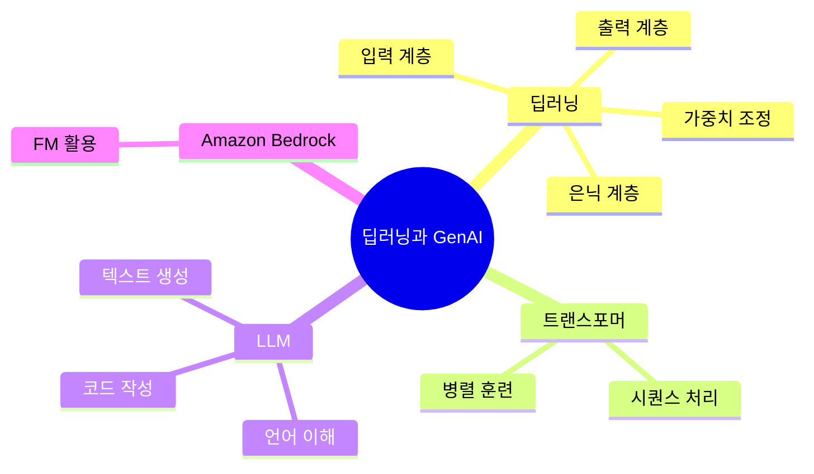

  

# AIF-C01 Task 1.1 Part 5 - 딥러닝과 생성형 AI

> 특정 유형인 딥러닝에 집중, 마지막 강의

## 1. 딥러닝 정의와 구조

- **정의:** 신경망이라는 알고리즘 구조 사용하는 ML 일종. 인간 뇌 구조 기반
- **뇌:** 뉴런이라는 뇌 세포가 복잡한 네트워크 형성, 서로 전기 신호 보내 정보 처리
- **딥러닝 모델:** **노드**라는 소프트웨어 모듈로 뉴런 동작 시뮬레이션
- **심층 신경망 구성:** 입력 계층 + 여러 은닉 계층 + 출력 계층
- **훈련 원리:**
  1. 모든 노드는 자율적으로 가중치를 각 특성에 할당
  2. 정보는 입력에서 출력으로 네트워크 통해 순방향 흐름
  3. 훈련 중 예측 출력과 실제 출력 차이 계산
  4. 가중치는 오차 최소화 위해 반복 조정

## 2. 딥러닝이 표준이 된 이유

- **과거:** 어류 예제 - 이미지 분류/객체 감지 등 컴퓨터 비전에서 전통적 방식 = 수천 개 이미지 레이블 지정, 인간 노력 많이 필요
- **개념:** 신경망 이용한 딥러닝 개념은 오래 존재
- **전환점:** 저렴한 클라우드 컴퓨팅 도입 전엔 필요한 컴퓨팅 성능 확보 못함. 이제 클라우드에서 강력한 컴퓨팅 자원 쉽게 사용 가능 -> 신경망이 컴퓨터 비전 표준 알고리즘 접근 방식 됨
- **장점:** 관련 특성 따로 제공 불필요. 이미지 패턴 식별, 중요한 특성 자체 추출 가능
- **단점:** 정확히 감지/레이블 위해 수백만 장 어류 사진 필요할 수도, 대규모 데이터셋 반복 훈련 컴퓨팅 인프라는 기존 접근 방식보다 비용 더 많이 듦

## 3. 전통 ML vs 딥러닝 - 데이터 유형에 따라 선택

| 구분 | 전통적 ML | 딥러닝 |
| :--- | :--- | :--- |
| 공통점 | 통계 알고리즘 사용 | 통계 알고리즘 사용 |
| 차별점 | 신경망 사용 안함 | **신경망으로 인간 지능 시뮬레이션** |
| 잘하는 데이터 | **정형 데이터, 레이블된 데이터**에서 패턴 식별 우수/효율적 | **비정형 데이터** (이미지, 비디오, 텍스트)에 더 적합 |
| 잘하는 태스크 | 분류, 추천 시스템 | 이미지 분류, 자연어 처리 (픽셀/단어 간 복잡한 관계 식별 필요) |
| 특성 추출 | 선택/추출에 많은 노력 필요 | 스스로 학습하므로 노력 적음 |
| 비용 | 상대적 저렴 | 인프라 비용 훨씬 높음 |
| 예시 | 휴대폰 회사가 이전 고객 이탈 데이터 기반 고객 통신사 변경 시기 예측 | 소셜미디어 멘션이나 제품 피드백 분석해 사용자 감정 파악 |

## 4. 생성형 AI 심화

- **정의:** 텍스트 문자열 또는 AI 용어로 **시퀀스** 포함된 매우 큰 데이터셋에서 사전 훈련된 딥러닝 모델로 구현
- **모델:** **트랜스포머 신경망** 사용
  - 역할: 프롬프트라는 입력 시퀀스를 프롬프트에 대한 응답인 출력 시퀀스로 변경
  - 작동: 시퀀스 요소를 한 번에 한 단어씩 순차 처리
  - 장점: 트랜스포머는 시퀀스를 **병렬로 처리**하므로 훈련 속도 빨라지고 훨씬 더 큰 데이터셋 사용 가능
- **LLM (대규모 언어 모델):**
  - 수십억 개 특성 포함, 인간 광범위 지식 캡처
  - 모든 훈련 통해 수행 태스크에서 매우 유연, NLP에 대한 다른 ML 접근 방식보다 성능 뛰어남
  - 잘하는 것:
    1. 인간 언어 이해 -> 긴 문서 읽고 요약
    2. 인간 비슷한 텍스트 생성 -> 언어 번역, 독창적 이야기/편지/기사/시 작성
    3. 컴퓨터 프로그래밍 언어 알고 있음 -> 개발자용 코드 작성
- **AWS 연결:**
  - **Amazon Bedrock**에 LLM 설명 요청 예시
  - 무료 체험: **partyrock.aws**에서 자신만의 AI 앱 구축 가능

## 5. 시험 체크포인트

- 딥러닝 = 노드/입력/은닉/출력 계층, 가중치 자율 할당, 순방향, 오차 최소화
- 딥러닝 장점 = 특성 자체 추출, 단점 = 수백만 장 필요 + 비용 높음 + 클라우드 컴퓨팅으로 표준화
- 전통 ML = 정형/레이블/분류/추천/효율, 딥러닝 = 비정형/이미지/NLP/감정분석/스스로 학습
- 생성형 AI = 시퀀스/트랜스포머/병렬 처리/프롬프트/LLM 수십억 특성/Bedrock
- 다음 강의 = 태스크 1.2 시작

## 학습 문서 메타데이터

- 도메인: D1 — AI 및 ML의 기초
- 원본 보존 링크: [AIF-C01-Task1-1-Part5.md](../../../docs/Refs/AIF-C01-Task1-1-Part5.md)
- 이 문서는 원본 본문을 보존한 복사본이며, 이 섹션·도식·네비게이션은 학습용으로 추가했습니다.

이 마인드맵은 딥러닝과 생성형 AI의 중심 개념에서 구조·훈련·활용 가지가 뻗는 관계를 보여 줍니다. Mermaid가 렌더링되지 않아도 계층과 핵심 용어를 읽을 수 있습니다.

## 초보자 학습 보조

### 이 문서에서 배울 것

신경망의 기본 계층과 딥러닝의 강점·비용을 이해하고, 전통적 ML·딥러닝·생성형 AI를 데이터와 문제 유형으로 구분합니다.

### 선수 지식과 한 줄 요약

- 선수 지식: **신경망**은 여러 계산 노드가 입력을 변환해 결과를 만드는 모델 구조이고, **가중치**는 각 입력의 영향을 조절하는 값입니다.
- 한 줄 요약: **딥러닝은 복잡한 비정형 데이터에서 강점을 보일 수 있지만, 데이터·컴퓨팅·설명 가능성 요구를 함께 고려해 선택해야 합니다.**

### 자주 하는 오해

- **오해:** 딥러닝은 전통적 ML보다 항상 더 정확하고 더 좋은 선택이다.
- **바로잡기:** 데이터 양·형식, 지연 시간, 비용, 설명 가능성에 따라 단순한 모델이나 전통적 ML이 더 적합할 수 있습니다.

### 스스로 답하는 확인 질문

1. 행과 열로 정리된 고객 이탈 데이터와 대규모 이미지 데이터 중 딥러닝을 우선 검토할 가능성이 높은 것은 무엇이며 왜 그런가요?
2. 생성형 AI와 일반적인 분류 모델의 출력 목적은 어떻게 다른가요?

### 공식 범위와 출처

- **시험 핵심:** AIF-C01 Domain 1 Task 1.1의 딥 러닝·신경망·LLM 용어와 AI·ML·GenAI 비교에 연결됩니다.
- **AWS 실무 확장:** 트랜스포머와 Amazon Bedrock은 생성형 AI 개념을 AWS에서 적용하는 사례입니다. 세부 모델 선택은 후속 도메인에서 더 깊게 다룹니다.
- [콘텐츠 도메인 1: AI 및 ML의 기초 — AWS 공식 시험 안내서](https://docs.aws.amazon.com/ko_kr/aws-certification/latest/ai-practitioner-01/ai-practitioner-01-domain1.html), 확인일: 2026-09-09

---

[이전](part-4.md) | [인덱스](README.md) | [다음](../task-1-2/part-1.md)
