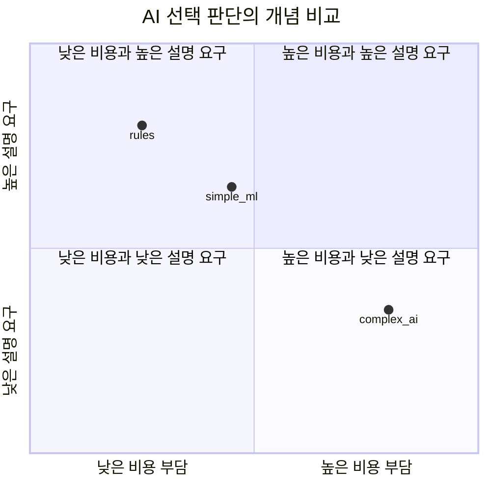

# AIF-C01 Task 1.2 Part 1 - AI를 고려해야 하는 경우 vs 아닌 경우

> 영역 1 두 번째 태스크 목표: AI의 실제 사용 사례 파악. 5개 강의 중 1번째

## 1. AI/ML을 고려해야 하는 사용 사례

- **24/7 무저하 운영:** 인간과 달리 성능 저하 없이 매일, 하루 종일 작동
- **반복/지루한 태스크 자동화:** 직원들이 어려워하거나 지루해하는 반복적 업무 집중 -> 워크로드 감소, 비즈니스 운영 간소화
- **복잡한 문제 해결:** ML/딥러닝 네트워크로 인간 유사 지능으로 복잡한 문제 해결
- **방대한 데이터 고속 분석:** 인간이 할 수 없는 방대한 양 데이터 빠르게 분석해야 하는 문제에 최적
- **패턴 인식 강점:** 패턴 편차 탐지, 사기 적발에 탁월
- **수요 예측으로 낭비 감소:** 제품/리소스 수요 예측
- **결과:** 더 나은 선택, 효율성 향상, 고객 요구사항 더 잘 해결

## 2. AI가 최선의 선택이 아닌 경우 - 시험 핵심

### (1) 비용 vs 이점

- **문제:** ML 훈련에 엄청난 리소스 소모, 처리 성능 비용 많이 듦, 자주 재훈련 필요
- **판단 기준:** 비즈니스 이점이 AI 솔루션 비용보다 클지 확인 필요
- **예시:** 사기/낭비 감소 목표 금액 설정 -> 목표 달성 모델 구축 비용 추정 -> **비용이 절감액 초과하면 진행하지 않는 것이 좋음**

### (2) 해석 가능성 (Interpretability) / 투명성 요구

- **상황:** AI 모델이 고객 영향 결정에 사용 (예: 대출 신청) -> 모델 신뢰 가능하고 이해 가능해야 함
- **문제:** 복잡한 신경망은 인간 뇌 모델링, 내부 메커니즘이 예측에 영향 미치는 방식/이유 완전 이해 불가 = **모델의 해석 가능성** 부족
- **트레이드오프:** 복잡한 모델은 일반적으로 **해석 가능성 vs 성능** 절충안 제시. 완전한 투명성이 비즈니스/규정 준수 요구사항이면 덜 복잡한 모델 사용해야 하며 일반적으로 성능 저하 초래
- **대안:** AI 필요 없는 **규칙 기반 시스템**
  - 예) 신용 점수 약 750점이면 10,000달러 이하 대출 자동 승인 규칙

### (3) 결정론적 (Deterministic) 결과가 필요한 경우

- **결정론적:** 항상 동일한 입력에 대해 동일한 출력 생성. 규칙 기반 애플리케이션은 누군가 규칙 변경하지 않는 한 결정론적
- **확률적 (Probabilistic):** ML 모델은 무언가의 가능도 결정. 시간 지나며 학습/적응, 접근 방식에 무작위성 통합. 따라서 동일 입력 값 집합으로 일관되지 않은 다양한 결과 생성
- **판단:** 결정성이 필요하면 규칙 기반 시스템이 더 나은 옵션

## 3. 시험 체크포인트

- AI 고려해야 할 때 키워드: 24/7, 반복/지루, 방대 데이터 고속 분석, 패턴 인식/사기 탐지, 수요 예측/낭비 감소
- AI 피해야 할 때 키워드 3가지:
  1. 비용 > 이점 (훈련/재훈련 비용 높음)
  2. 해석 가능성/투명성/규정 준수 요구 (대출 심사) -> 복잡한 신경망은 해석 불가
  3. 결정론적 결과 필요 -> ML은 확률적
- 규칙 기반 시스템 예시: 신용 점수 750 -> 대출 자동 승인
- 결정론적 vs 확률적 구분

## 학습 문서 메타데이터

- 도메인: D1 — AI 및 ML의 기초
- 원본 보존 링크: [AIF-C01-Task1-2-Part1.md](../../../docs/Refs/AIF-C01-Task1-2-Part1.md)
- 이 문서는 원본 본문을 보존한 복사본이며, 이 섹션·도식·네비게이션은 학습용으로 추가했습니다.

이 사분면 차트는 AI를 선택할 때 비용·이점과 요구되는 결정성·해석 가능성의 두 축 절충을 개념적으로 보여 줍니다. 점은 정량 평가가 아닌 판단 기준의 예시입니다.

---

[이전](../task-1-1/part-5.md) | [인덱스](README.md) | [다음](part-2.md)
