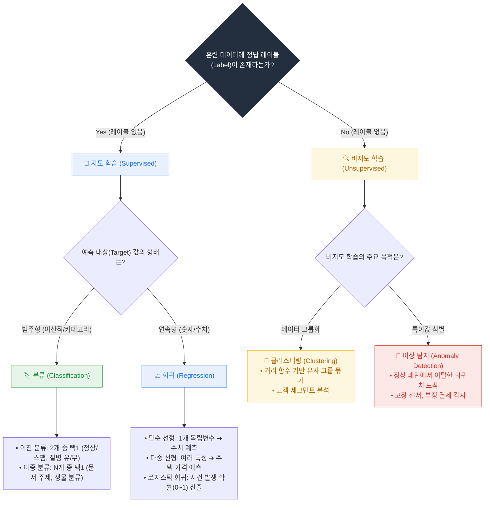
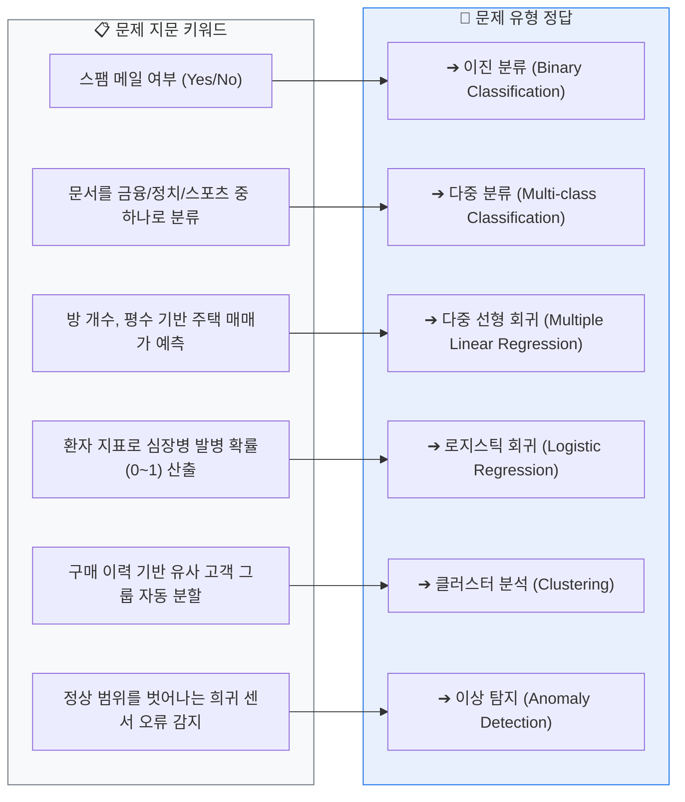
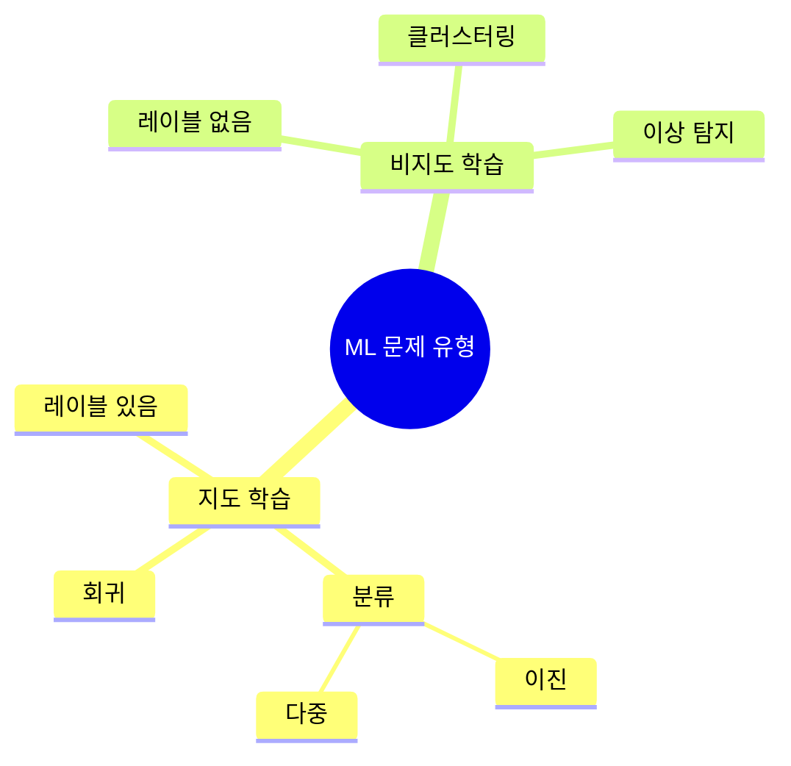

  

# AIF-C01 Task 1.2 Part 2 - ML 문제 유형 파악 방법

> 다양한 ML 문제 유형과 이를 파악하는 방법

## 1. 지도 학습 vs 비지도 학습 구분법

| 데이터셋 구성 | 문제 유형 | 목표 |
| :--- | :--- | :--- |
| 입력(특성/속성) + 출력(레이블이 지정된 대상 값) 포함 | **지도 학습** | 알려진 입력/출력 데이터로 모델 훈련 |
| 입력(특성/속성)만 포함, 레이블/대상 값 없음 | **비지도 학습** | 입력 데이터에서 발견된 패턴 기반 출력 예측, 그룹화 같은 패턴 발견 |

## 2. 지도 학습 2대 유형: 분류 vs 회귀

- **대상 값이 범주형** = 하나 이상 불연속적 값 = **분류 문제**
- **대상 값이 연속형** = 수학적으로 연속 = **회귀 문제**

### (1) 분류 문제

#### 이진 분류 (Binary)

- 정의: 입력을 속성에 따라 미리 정의되고 상호 배타적인 **두 클래스 중 하나**에 할당
- 예시 1: 진단 검사 결과에 따른 개인 질병 유무 의학적 진단
- 예시 2: 어류 또는 비어류

#### 다중 분류 (Multi-class)

- 정의: 입력을 속성에 따라 **여러 클래스 중 하나**에 할당
- 예시 1: 세금 문서 주제 예측 - 종교/정치/금융 등 여러 주제 클래스 중 하나
- 예시 2: 어류 예제를 해양 생물 여러 범주 식별하는 것으로 확장

### (2) 회귀 문제

- **정의:** 하나 이상 다른 변수/상관 속성 기반 종속 대상 변수 값 추정

| 유형 | 설명 | 예시 |
| :--- | :--- | :--- |
| **단순 선형 회귀** | 입력/출력 간 직접적 선형 관계, 단일 독립 변수 | 몸무게(독립)로 키(종속) 예측 |
| **다중 선형 회귀** | 여러 독립 변수 | 몸무게+나이로 키 예측 / 욕실/침실 수, 주택/정원 면적으로 주택 가격 예측 |
| **로지스틱 회귀** | 이벤트 발생 확률 측정. 예측 0~1 사이 값 (0=가능도 낮음, 1=가장 높음). 로그 함수 사용해 회귀선 계산. 하나/여러 독립 변수 사용 가능. 상당한 양 레이블 데이터 필요 | BMI, 흡연 상태, 유전적 소인으로 심장병 발병 여부 예측 / 거래가 사기인지 여부 예측 (사기/비사기 레이블로 훈련) |

- **공통점:** 로지스틱/선형 회귀 모두 정확한 예측 위해 상당한 양 레이블 데이터 필요

## 3. 비지도 학습 2대 유형: 클러스터링 vs 이상 탐지

### (1) 클러스터 분석 (Clustering)

- **정의:** 데이터 객체를 클러스터(그룹)로 분류하는 기법. 데이터 내 개별 그룹 찾기 시도
- **원칙:** 한 그룹 멤버는 서로 최대한 비슷, 다른 그룹 멤버와는 최대한 다름
- **과정:**
  1. 유사성 결정에 사용할 특성/속성 정의
  2. 유사성 측정할 거리 함수 선택
  3. 분석에 사용할 클러스터/그룹 수 지정
- **예시:** 구매 내역 또는 클릭스트림 활동 기준 고객 그룹 분할

### (2) 이상 탐지 (Anomaly Detection)

- **정의:** 다른 데이터와 크게 달라 의심 불러일으키는 희귀 항목/이벤트/관찰 결과 식별
- **예시:** 고장난 센서 또는 의료 오류 탐지

## 4. 시험 체크포인트

- 입력+출력(레이블) = 지도, 입력만 = 비지도
- 대상이 범주형(불연속) = 분류, 연속형 = 회귀
- 이진=2개 클래스 상호배타 (질병 유무, 어류/비어류), 다중=여러 클래스 중 하나 (세금 문서 주제, 해양 생물 여러 범주)
- 단순 선형=독립 1개, 다중 선형=독립 여러 개 (욕실/침실/면적 -> 주택 가격)
- 로지스틱 회귀 = 확률 0~1, 로그 함수, 예) BMI+흡연+유전 -> 심장병, 사기 거래 예측. 선형/로지스틱 모두 레이블 많이 필요
- 클러스터링 = 그룹 내 유사 최대, 그룹 간 차이 최대, 거리 함수, 그룹 수 지정 필요, 예) 구매 내역 고객 분할
- 이상 탐지 = 희귀/의심 항목 식별

## 학습 문서 메타데이터

- 도메인: D1 — AI 및 ML의 기초
- 원본 보존 링크: [AIF-C01-Task1-2-Part2.md](../../../docs/Refs/AIF-C01-Task1-2-Part2.md)
- 이 문서는 원본 본문을 보존한 복사본이며, 이 섹션·도식·네비게이션은 학습용으로 추가했습니다.

이 마인드맵은 입력과 레이블의 유무에서 분류·회귀·클러스터링·이상 탐지로 가지가 뻗는 ML 문제 유형을 보여 줍니다. Mermaid가 렌더링되지 않아도 들여쓰기와 용어 계층으로 판단 순서를 이해할 수 있습니다.

## 초보자 학습 보조

### 한 줄 요약과 선수 지식

- 선수 지식: **레이블**은 학습 데이터에 미리 붙인 기대 답입니다.
- 한 줄 요약: **레이블 유무를 먼저 보고, 답이 범주면 분류·수치면 회귀·숨은 그룹이면 클러스터링을 판단합니다.**

### 자주 하는 오해

- **오해:** 로지스틱 회귀는 이름에 회귀가 있으므로 연속값 예측만 한다.
- **바로잡기:** 로지스틱 회귀는 사건 발생 확률을 구해 분류 문제에 활용할 수 있습니다.

### 스스로 답하는 확인 질문

1. 주택 가격 예측과 스팸 여부 판단은 각각 회귀와 분류 중 무엇인가요?
2. 정답 없이 구매 행동이 비슷한 고객을 묶으려면 어떤 기법을 고르나요?

### 공식 범위와 출처

- **시험 핵심:** AIF-C01 Domain 1 Task 1.2의 사용 사례에 맞는 AI/ML 기법 선택에 연결됩니다.
- [콘텐츠 도메인 1: AI 및 ML의 기초 — AWS 공식 시험 안내서](https://docs.aws.amazon.com/ko_kr/aws-certification/latest/ai-practitioner-01/ai-practitioner-01-domain1.html), 확인일: 2026-09-09

---

[이전](part-1.md) | [인덱스](README.md) | [다음](part-3.md)
