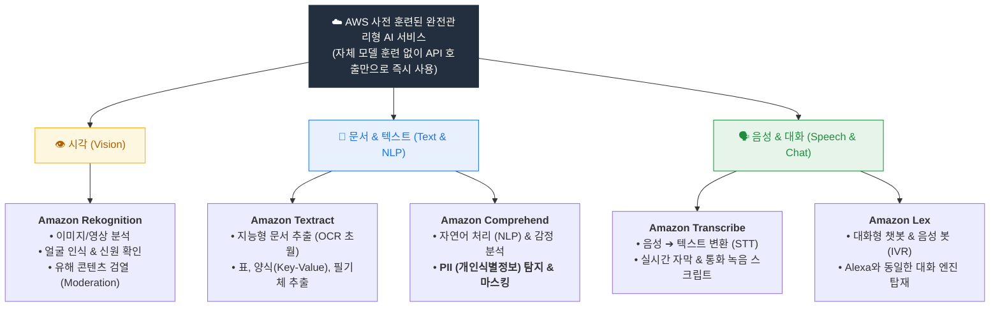
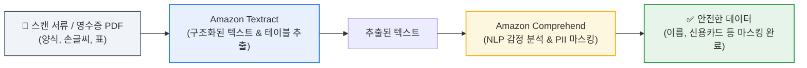
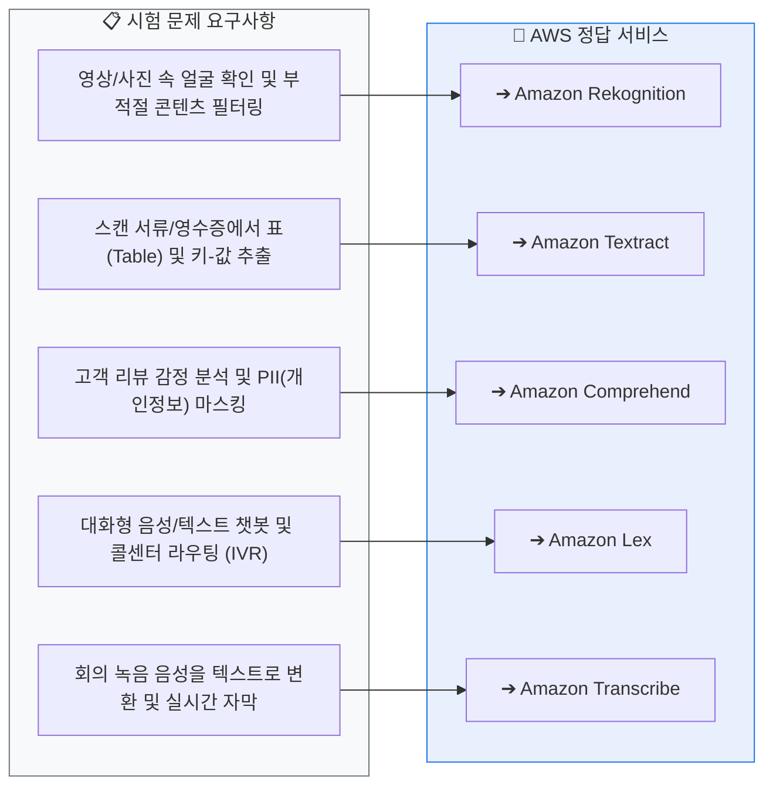
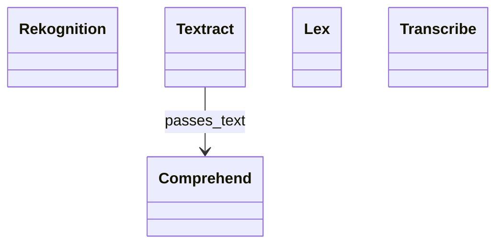

<!-- metadata-badges -->

<kbd>도메인 D1</kbd> <kbd>입문</kbd> <kbd>초안</kbd>

# AIF-C01 Task 1.2 Part 3 - 사전 훈련된 AWS AI 서비스

> 대부분의 일반적인 사용 사례에서는 자체 사용자 지정 모델 구축/훈련 불필요. AWS API로 접근 가능한 사전 훈련된 서비스 먼저 조사해야 함

## 1. 컴퓨터 비전 - Amazon Rekognition

- **정의:** 컴퓨터 비전용 사전 훈련된 딥러닝 서비스. 고객 자체 모델 훈련 없이 일반적인 컴퓨터 비전 요구 충족. 이미지/비디오 모두 작동 (스트리밍 비디오 포함)

### 주요 기능

| 기능 | 설명 | 예시 |
| :--- | :--- | :--- |
| **얼굴 인식/신원 확인** | 배지/운전면허증 같은 참조 이미지와 비교해 신원 확인 | 직원 얼굴 모음 제공 -> 이미지/스트리밍 비디오에서 자동 인식/찾기. 99.8% 신뢰도 일치 항목 찾음, 다른 얼굴은 일치 안함 표시 |
| **객체 탐지/레이블 지정** | 이미지/비디오 라이브러리 검색 가능하게 만듦 | 보안 시스템 실시간 스트리밍 비디오에서 객체 감지/식별 후 알림 |
| **사용자 지정 객체** | 레이블 지정된 이미지 제공해 학습시키면 독점 객체 인식 가능 | - |
| **텍스트 탐지** | 도로 표지판처럼 보이는 모든 텍스트에 레이블 추가 | - |
| **콘텐츠 조정** | 노골적/부적절/폭력적 콘텐츠 탐지 및 필터링, 사람 검토 필요 콘텐츠 플래그 지정 | 사용자 업로드 콘텐츠 게시 전 검토 자동화 |

## 2. 문서/텍스트 서비스

### Amazon Textract

- 단순 OCR 넘어서는 서비스
- 스캔 문서에서 **텍스트, 필기, 양식, 테이블 형식 데이터** 추출

### Amazon Comprehend - NLP

- **정의:** 텍스트에서 인사이트/관계 검색하는 자연어 처리 서비스
- **일반 사용 사례:** 고객 피드백 감정 분류
  - 예) AWS가 Certification 시험 댓글 분석
- **조합 사용:** Textract + Comprehend 함께 사용 많음
  - Textract 추출 콘텐츠 -> Comprehend에 제공해 감정 분석

### PII 탐지 - Comprehend 활용

- **사용 사례:** 텍스트에서 개인 식별 정보(PII) 탐지
- **상황:** 스팸 이메일 탐지 모델 훈련 위해 데이터 수집 시 PII 찾아 훈련 데이터에서 제거해야 함
- **기능:** PII 찾도록 사전 훈련됨. 이메일에서 이름, 주소, 이메일, 전화, 신용카드 번호 찾고 **신뢰도 점수** 반환
- **활용:** 데이터에서 PII 제거 작업 시 최소 신뢰 수준 임계값 설정해 연결된 엔터티 자동 제거

## 3. 대화형/음성 서비스

### Amazon Lex

- **정의:** 고객과 소통 위한 음성/텍스트 인터페이스 구축. **Alexa 디바이스 구동 동일 기술** 사용
- **사용 사례:** 콜센터 적절한 상담원에게 통화 라우팅하는 고객 서비스 챗봇, 대화형 음성 응답 시스템(IVR)

### Amazon Transcribe

- **정의:** **100개 이상 언어** 지원 자동 음성 인식 서비스
- **기능:** 라이브 및 녹음/녹화된 오디오/비디오 입력 처리해 검색/분석 위한 고품질 트랜스크립트 제공
- **사용 사례:** 실시간으로 자막을 스트리밍 오디오에 추가

## 4. 시험 체크포인트

- 커스텀 모델 구축 전 기존 사전 훈련 서비스 있는지 먼저 조사해야 함
- Rekognition = 컴퓨터 비전 / 얼굴 인식(99.8% 신뢰도)/객체 탐지/사용자 지정 객체/콘텐츠 조정/스트리밍 비디오
- Textract = 텍스트+필기+양식+테이블 추출 (OCR 이상)
- Comprehend = NLP/감정 분류/ PII 탐지(이름,주소,이메일,전화,신용카드) + 신뢰도 점수 + Textract와 함께 사용
- Lex = 음성/텍스트 인터페이스, Alexa 동일 기술, 챗봇/IVR/콜 라우팅
- Transcribe = 100+ 언어 음성 인식, 라이브/녹음 오디오/비디오 -> 트랜스크립트, 실시간 자막

## 학습 문서 메타데이터

- 도메인: D1 — AI 및 ML의 기초
- 원본 보존 링크: [AIF-C01-Task1-2-Part3.md](../../../docs/Refs/AIF-C01-Task1-2-Part3.md)
- 이 문서는 원본 본문을 보존한 복사본이며, 이 섹션·도식·네비게이션은 학습용으로 추가했습니다.

이 클래스 다이어그램은 사전 훈련된 AWS AI 서비스의 역할과 입력·출력 관계를 정적으로 비교합니다. Mermaid가 렌더링되지 않아도 서비스별 책임과 연결을 읽을 수 있습니다.

---

[이전](part-2.md) | [인덱스](README.md) | [다음](part-4.md)
