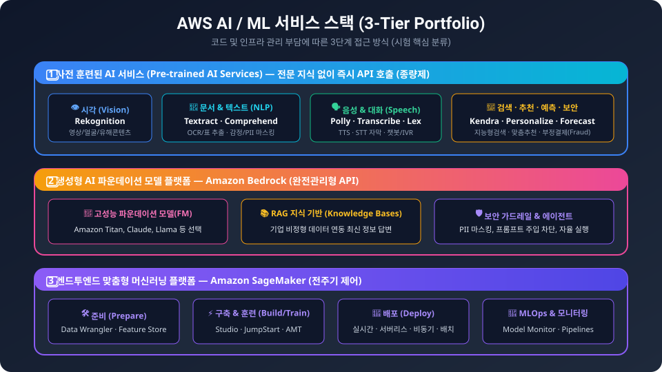
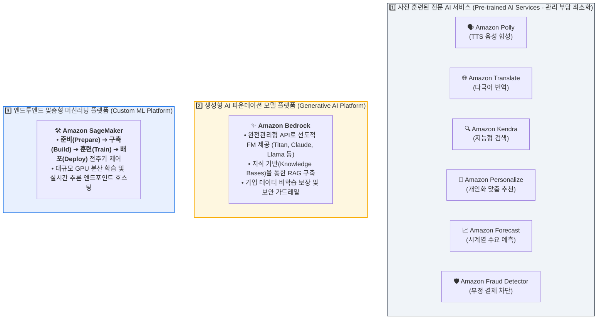
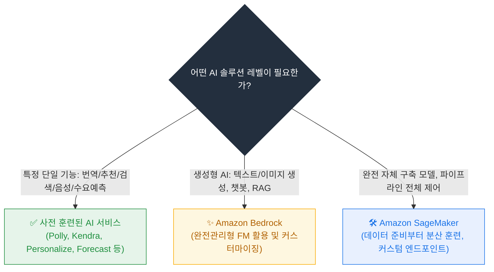
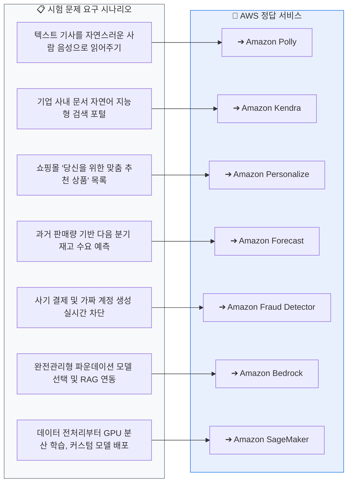
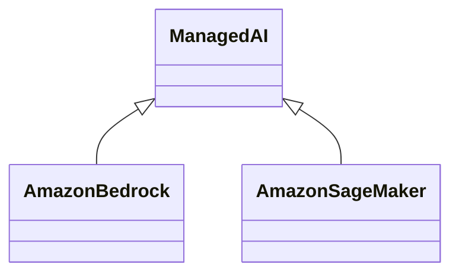

  

# AIF-C01 Task 1.2 Part 4 - 사전 훈련된 AWS AI 서비스 (2) + SageMaker

> Polly, Kendra, Personalize, Translate, Forecast, Fraud Detector, Bedrock, SageMaker

## 1. 음성/검색/추천/번역/예측/사기 탐지 서비스

| 서비스 | 정의/핵심 기술 | 사용 사례/특징 | 시험 키워드 |
| :--- | :--- | :--- | :--- |
| **Amazon Polly** | 텍스트를 수십 개 언어의 자연스러운 음성으로 변환. 딥러닝으로 사람 음성 합성 | 기사 음성 변환, IVR 시스템 발신자 메시지. 자연 음성으로 제품 참여도↑, 시각장애 고객 접근성↑. 예) Washington Post, USA Today가 속보/헤드라인 오디오 제작 | 수십 개 언어, 딥러닝 음성 합성 |
| **Amazon Kendra** | ML로 엔터프라이즈 시스템에서 **지능형 검색** 수행, 콘텐츠 빠르게 찾기 | NLP로 "Echo Plus를 네트워크에 어떻게 연결하나요?" 같은 질문 이해, 지능적 이해 기반 응답 | 지능형 검색, NLP 질문 이해 |
| **Amazon Personalize** | 소매/미디어/엔터테인먼트 산업 고객 위한 **맞춤형 추천** 자동 생성 | 전자상거래 앱 "당신이 좋아할 만한 제품" 섹션, 관심 고객에게 맞춤형 추천. 선호도 기반 세분화로 효과적 마케팅 캠페인 | 맞춤형 추천, 소매/미디어/엔터테인먼트 |
| **Amazon Translate** | **75개 언어** 텍스트 유창 번역. 소스 문장 전체 맥락 + 지금까지 생성 번역 고려하는 신경망 기반 | 더 정확/유창 번역. 온라인 채팅 앱 실시간 번역 | 75개 언어, 전체 맥락 고려 신경망 |
| **Amazon Forecast** | **시계열 예측** AI 서비스. 과거 시계열 데이터 제공 -> 미래 시점 예측 | 소매/재무 계획/공급망/의료에 유용. 예) 판매 예측 및 재고 수준 관리 | 시계열 예측 |
| **Amazon Fraud Detector** | 잠재적 온라인 사기 행위 식별 | 온라인 결제 사기, 가짜 계정 생성 등. 사전 훈련된 데이터 모델 보유: 온라인 거래, 제품 리뷰, 결제/체크아웃, 신규 계좌, 계좌 인수 | 사기 탐지, 사전 훈련 모델 |

## 2. 생성형 AI - Amazon Bedrock

- **정의:** AWS에서 생성형 AI 애플리케이션 구축하는 **완전관리형** 서비스
- **모델 선택:** Amazon, Meta 및 선도적 AI 스타트업이 훈련한 **고성능 파운데이션 모델** 중 선택
- **사용자 지정:** 자체 훈련 데이터 제공하거나 모델이 쿼리할 **지식 기반** 생성해 파운데이션 모델 사용자 지정 가능
- **RAG (Retrieval Augmented Generation, 검색 증강 생성):** 생성형 AI 모델이 외부 지식 시스템 호출해 훈련 데이터 외부 정보 검색하는 것
- **예시:** Amazon **Titan Image Generator** 파운데이션 모델로 프롬프트 응답 이미지 생성

## 3. 사용자 지정 ML 필요시 - Amazon SageMaker 제품군

- **언제 사용:** 핵심 AI 서비스 사전 구축 기능 이상으로 더 세밀하게 사용자 지정된 ML 모델/워크플로 필요할 때
- **정의:** 데이터 과학자/개발자가 고품질 ML 모델 효율적으로 **준비, 구축, 훈련, 배포**할 수 있는 ML 기능 제공
- **구성:** 사용자 지정 ML 모델 구축/훈련에 최적화된 여러 서비스로 구성
  - 데이터 준비 및 레이블 지정
  - 여러 인스턴스 또는 GPU 클러스터에서 **대규모 병렬 학습**
  - 모델 배포, **실시간 추론 엔드포인트**
- **가속화:** 데이터 준비/모델 훈련 리소스 줄이고 시작점으로 사용 가능한 **사전 훈련된 모델** 제공

## 4. 시험 체크포인트

- Polly = 텍스트->수십 개 언어 자연 음성, 딥러닝 합성, Washington Post/USA Today 예시
- Kendra = 지능형 검색, NLP 질문 이해 ("Echo Plus 네트워크 연결")
- Personalize = 맞춤형 추천, "좋아할 만한 제품", 소매/미디어/엔터테인먼트, 세분화 마케팅
- Translate = 75개 언어, 전체 맥락 신경망, 실시간 채팅 번역
- Forecast = 시계열 예측, 과거->미래, 판매/재고
- Fraud Detector = 사기 탐지, 사전 훈련 모델 (거래/리뷰/결제/신규계좌/계좌인수)
- Bedrock = 완전관리형 생성형 AI, 파운데이션 모델 선택(Amazon, Meta, 스타트업), RAG=외부 지식 검색, Titan Image Generator
- SageMaker = 세밀한 사용자 지정 필요시, 준비/구축/훈련/배포, 대규모 병렬 학습, 실시간 엔드포인트, 사전 훈련 모델 제공

## 학습 문서 메타데이터

- 도메인: D1 — AI 및 ML의 기초
- 원본 보존 링크: [AIF-C01-Task1-2-Part4.md](../../../docs/Refs/AIF-C01-Task1-2-Part4.md)
- 이 문서는 원본 본문을 보존한 복사본이며, 이 섹션·도식·네비게이션은 학습용으로 추가했습니다.

이 클래스 다이어그램은 관리형 AI 서비스와 사용자 지정 ML을 담당하는 Amazon SageMaker 및 Amazon Bedrock의 정적 역할 관계를 보여 줍니다. Mermaid가 렌더링되지 않아도 언제 어떤 계층을 고르는지 이해할 수 있습니다.

## 초보자 학습 보조

### 한 줄 요약과 선수 지식

- 선수 지식: **관리형 서비스**는 AWS가 기반 인프라 운영을 맡고, 사용자는 기능·데이터·사용 사례에 집중하는 방식입니다.
- 한 줄 요약: **단일 전문 기능이면 관리형 AI 서비스, 생성형 AI면 Bedrock, 자체 모델의 전 과정을 제어해야 하면 SageMaker AI를 검토합니다.**

### 자주 하는 오해

- **오해:** Bedrock과 SageMaker AI는 같은 수준의 서비스라 어느 쪽이든 같다.
- **바로잡기:** 목적과 제어 범위가 다릅니다. 요구하는 모델 종류·사용자 지정 수준·운영 책임을 비교해야 합니다.

### 스스로 답하는 확인 질문

1. 텍스트를 음성으로 바꾸는 단일 기능에는 어떤 유형의 서비스를 먼저 찾나요?
2. 자체 데이터를 이용해 사용자 지정 모델을 훈련·배포하려면 어떤 선택지가 더 적합한가요?

### 공식 범위와 출처

- **시험 핵심:** AIF-C01 Domain 1 Task 1.2의 관리형 AI/ML 서비스 기능과 FM 적합성 판단에 연결됩니다.
- **AWS 실무 확장:** 본문의 서비스별 언어 수·모델·기능 세부 사항은 변동 가능하므로 개별 공식 문서로 추가 검증이 필요합니다.
- [콘텐츠 도메인 1: AI 및 ML의 기초 — AWS 공식 시험 안내서](https://docs.aws.amazon.com/ko_kr/aws-certification/latest/ai-practitioner-01/ai-practitioner-01-domain1.html), 확인일: 2026-09-09

---

[이전](part-3.md) | [인덱스](README.md) | [다음](part-5.md)
