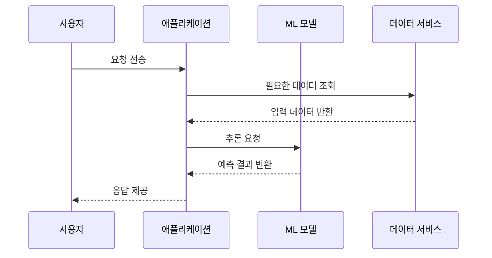

# AIF-C01 Task 1.2 Part 5 - 실제 AI 애플리케이션 사례

> 실제 AI 애플리케이션 논의

## 1. MasterCard - 사기 탐지

- **회사:** 구매량 기준 두 번째로 큰 신용카드 네트워크. 각 거래 즉시 AI로 사기 가능성 점수 부여
- **SageMaker 활용:** 사기 행위 탐지 모델 훈련
  - 탐지된 사기 거래 건수 **3배 증가**
  - 거짓 긍정 수 **10배 감소**
- **생성형 AI 추가 (2024년 발표):** 사기 탐지 평균 **20% 개선**
  - LLM에 고객 거래 내역을 프롬프트로 제공
  - 모델이 거래 관련 비즈니스가 고객이 방문할 만한 곳인지 예측해 점수에 반영

## 2. DoorDash - IVR 교체

- **기존 문제:** 터치 톤 프롬프트 탐색해야 하는 구형 IVR. 고객 불만, 0번 눌러 상담원 연결, 상담원은 다른 담당자에게 연결
- **해결:** **Amazon Lex** 자연어 처리 사용, 버튼 대신 말하기만 하면 되는 새 시스템 구현
- **효과:** 고객 경험 개선, 대기 시간 감소, 셀프 서비스 채택 증가

## 3. Laredo Petroleum - 예지 보전 / 환경 보호

- **회사:** 텍사스 서부 1,300개 이상 유정/가스정 운영. 압력/온도/유량 센서로 중요 운영 파라미터 측정
- **구현:** 데이터 스트리밍 솔루션 AWS에 구현, **SageMaker**로 ML 모델 구축해 데이터 실시간 모니터링
- **효과:**
  - 운영팀 유지보수 집중 지점 파악, 잠재 문제 방지
  - 천연가스 연소/누출 가능 문제 빠르게 식별/해결 -> 환경 영향 감소
  - 저장 탱크/복도 라인 누출 감지 모델 배포

## 4. Booking.com - 추천 + RAG

- **회사:** 호텔/항공편/렌터카/관광 명소 여행 마켓플레이스. 54개국 이상 2,800만+ 숙박 목록, 150TB+ 데이터 관리
- **SageMaker 활용:** 예약 추천 ML 모델 구축
- **생성형 AI 앱 - AI Trip Planner:**
  - 자연어 사용 고객 소통
  - 고객이 찾는 것 파악 즉시 -> **예약 추천 API 호출 + 고객 리뷰 검색 -> 추천**
  - **검색 증강 생성(RAG)** 한 예, 더 정확/최신 응답 제공 이유

## 5. Pinterest - 시각적 검색

- **회사:** 4억 5천만+ 사용자 개인화된 디지털 영감 보드 탐색/저장/핀. 수십억 이미지 호스팅하는 시각적 검색 엔진
- **기능 - Pinterest Lens:** 물체 사진 찍으면 판매 중인 유사 품목 즉시 보여주고 온라인 카탈로그 제품에 직접 연결
- **학습 방식:**
  - 레이블 지정된 제품 이미지 방대한 모음을 **S3**에서 유지 보수
  - 새로운 객체 학습하도록 ML 모델 자주 재훈련
  - **Amazon Mechanical Turk + SageMaker Ground Truth**로 이미지 레이블 지정

## 6. AffordableTours.com - 수요 예측

- **회사:** 미국 최대 여행사 중 하나, 에스코트 투어/크루즈/리버 크루즈/액티브 휴가. 저렴 패키지 + 실시간 전화 상담으로 차별화
- **기존 문제:** ML 요청 전 고객 통화량 처리 상담원 너무 많거나 적음 -> 고객 경험 일관성 없음, 부재중 호출률 증가, 운영 비용 낭비
- **해결:** **Amazon Forecast**로 시계열 예측 생성
  - 통화량 더 잘 예측, 적절한 수 상담원 배치
  - 부재중 호출률 **20% 향상**
- **Forecast 특징:** 신경망과 더 전통적 통계 알고리즘 포함한 다양한 빌트인 예측 알고리즘 지원

## 7. 시험 체크포인트

- MasterCard = SageMaker 사기 탐지 3배 증가/거짓긍정 10배 감소, 2024 생성형 AI 추가 20% 개선, 거래 내역 프롬프트 -> 방문 가능성 예측
- DoorDash = Lex로 IVR 교체, 터치 톤 -> 음성, 대기 시간 감소/셀프 서비스 증가
- Laredo = SageMaker 실시간 모니터링, 센서(압력/온도/유량), 환경 영향 감소, 누출 감지
- Booking.com = SageMaker 추천 + AI Trip Planner RAG (API 호출 + 리뷰 검색)
- Pinterest = Lens 시각적 검색, S3 이미지, 재훈련, MTurk+Ground Truth 레이블
- AffordableTours = Forecast 시계열 예측, 통화량 예측, 부재중 호출률 20% 향상, 신경망+통계 알고리즘

## 학습 문서 메타데이터

- 도메인: D1 — AI 및 ML의 기초
- 원본 보존 링크: [AIF-C01-Task1-2-Part5.md](../../../docs/Refs/AIF-C01-Task1-2-Part5.md)
- 이 문서는 원본 본문을 보존한 복사본이며, 이 섹션·도식·네비게이션은 학습용으로 추가했습니다.

이 시퀀스 다이어그램은 실제 AI 애플리케이션에서 사용자 요청, 데이터, 모델, 서비스 응답이 시간 순서로 상호작용하는 방식을 보여 줍니다. Mermaid가 렌더링되지 않아도 호출과 응답의 순서를 읽을 수 있습니다.

---

[이전](part-4.md) | [인덱스](README.md) | [다음](../task-1-3/part-1.md)
