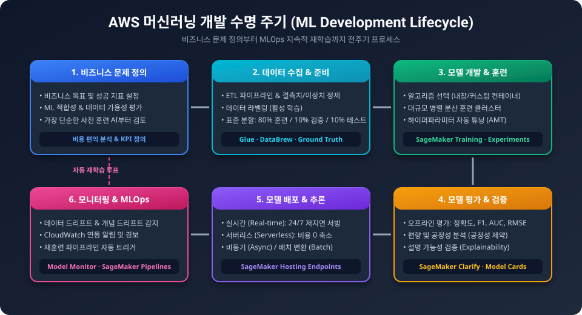
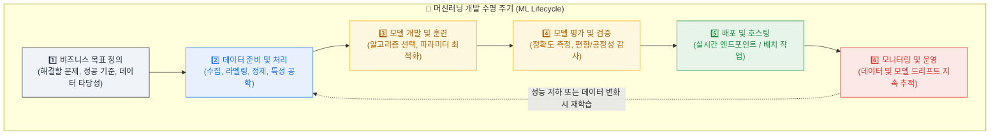
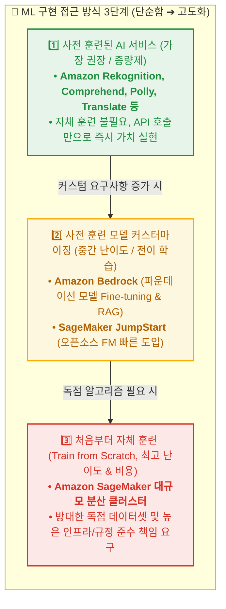
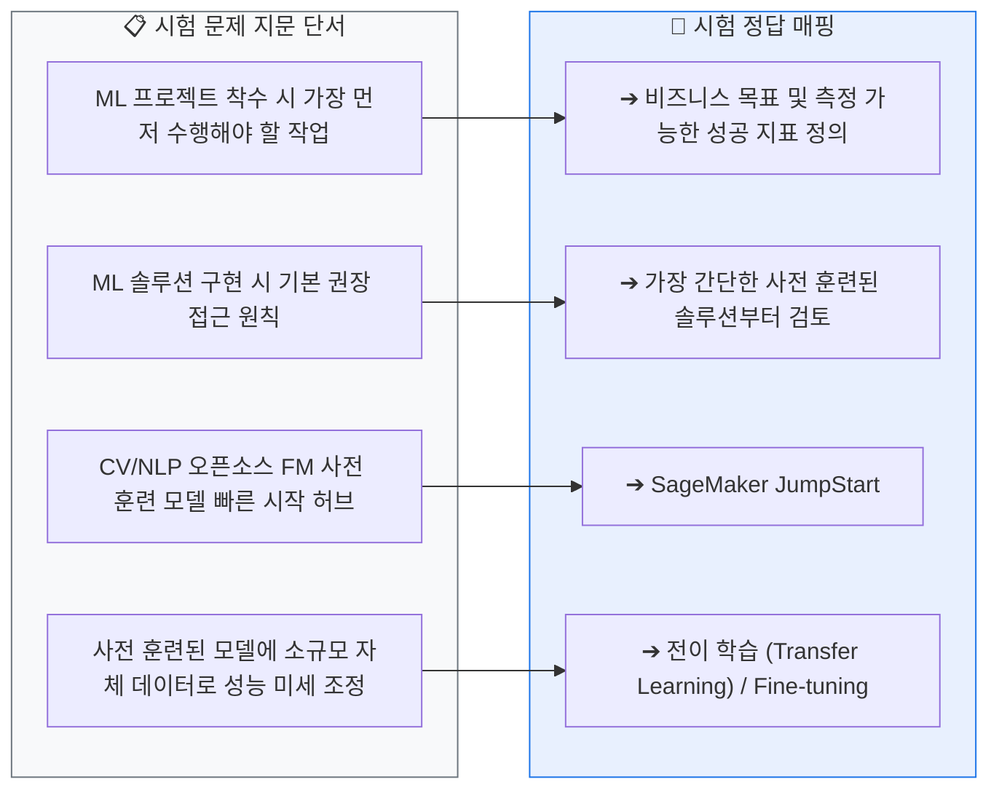
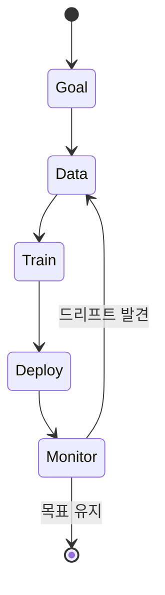

<!-- metadata-badges -->

<kbd>도메인 D1</kbd> <kbd>입문</kbd> <kbd>초안</kbd>

# AIF-C01 Task 1.3 Part 1 - ML 파이프라인/수명 주기와 비즈니스 목표

> 영역 1 세 번째 태스크 목표: ML 개발 수명 주기 설명. 7개 강의 중 1번째

## 1. ML 파이프라인 = 수명 주기 (Lifecycle)

- **정의:** 비즈니스 목표로 시작해 배포된 ML 모델 운영으로 끝나는 일련의 상호 연결된 단계
- **단계:** 문제 정의 -> 훈련 데이터 수집/준비 -> 모델 훈련/배포 -> 모니터링
- **특징:** 일부 단계는 특정 목표 달성까지 반복되는 **반복적 프로세스**. 모델 설계상 동적 -> 새 데이터로 재훈련, 성능/비즈니스 지표 기준 지속 평가, 드리프트/편향 모니터링, 필요시 조정/재구축. 따라서 많은 사람이 ML 파이프라인을 **수명 주기**로 봄. 배포 후에도 일부/전체 반복됨

## 2. 1단계: 비즈니스 목표 식별 - 항상 여기서 시작

### 목표 정의

- ML 고려 조직은 해결할 문제와 얻을 비즈니스 가치에 대한 **명확한 아이디어** 가져야 함
- 단순 아이디어 X -> **특정 비즈니스 목표 + 성공 기준**으로 비즈니스 가치 측정 가능해야 함
- 명확한 성공 기준 없으면 모델 평가 불가, ML이 최선 솔루션인지 판단 불가
- 이해 관계자와 조율해 프로젝트 목표 합의 이끌어내야 함
- 성공 기준 결정 후 조직 능력 평가. 목표는 **달성 가능**해야 하며 프로덕션 가는 **명확한 경로** 제공해야 함

### ML 적합성 평가

1. ML이 비즈니스 목표 충족 적합한 접근 방식인지 결정
2. 목표 달성 가능한 모든 옵션 평가
3. 각 접근 방식 **비용/확장성** 고려하면서 결과 정확도 확인
4. 충분한 관련성 있는 **고품질 훈련 데이터** 사용 가능한지 확인
5. 데이터 신중 평가해 올바른 데이터 소스 사용 가능하고 액세스 가능한지 확인
6. 입력, 원하는 출력, 최적화하려는 **성능 지표** 측면에서 ML 질문 공식화
7. ML 문제 고려해 사용 가능한 모든 옵션 조사
8. 더 많은 복잡성 필요 판단 전 **가장 간단한 솔루션부터 시작**
9. **비용 편익 분석** 수행해 프로젝트 다음 단계 진행 여부 확인

## 3. 접근 방식 3단계 - 쉬운 것부터 어려운 순서로

### (1) 사전 훈련된 AI 서비스 (가장 쉬움)

- AWS는 ML 대중화/누구나 이용 가능 위해 여러 AI 서비스 도입, 쉽고 사용 가능하며 완벽히 훈련된 ML 모델 개발, 전적으로 호스팅, **종량제**
- 비즈니스 목표 충족 가능 여부 평가 권장, 일부 출력 사용자 지정 가능
- 예) **Amazon Comprehend** - 훈련 데이터 제공해 자체 범주 사용하는 커스텀 분류자 생성 가능

### (2) 기존 모델로 시작해 자체 모델 구축 (중간)

- 호스팅 서비스 목표 달성 못하면 다음 고려
- 생성형 AI: **Amazon Bedrock** -> 완전히 훈련된 **파운데이션 모델**로 시작, **전이 학습** 통해 자체 데이터로 모델 미세 조정
- 다른 사용 사례: **Amazon SageMaker**에 모델 개발 빠르게 시작할 수 있는 사전 훈련된 여러 오픈 소스 모델 있음

### (3) 처음부터 자체 모델 훈련 (가장 어렵고 비쌈)

- 기술적으로 가장 어려울 뿐 아니라 보안/규정 준수에 대한 가장 큰 책임 필요

### SageMaker JumpStart

- 컴퓨터 비전/자연어 처리 문제 유형에 대해 사전 훈련된 AI **파운데이션 모델 및 태스크별 모델** 제공
- 대규모 퍼블릭 데이터세트에서 사전 훈련
- 자체 데이터셋 사용 **증분 훈련** 통해 모델 미세 조정 가능 = **전이 학습(Transfer Learning)** 프로세스
- 처음부터 사용자 지정 모델 생성보다 **비용/개발 시간 크게 절약**

## 4. 시험 체크포인트

- ML 파이프라인 단계: 문제 정의->데이터 수집/준비->훈련/배포->모니터링, 반복적/수명 주기/동적/재훈련/드리프트/편향 모니터링
- 시작은 항상 비즈니스 목표 식별, 명확한 성공 기준 필요, 이해 관계자 합의, 달성 가능+프로덕션 경로, 가장 간단한 솔루션부터, 비용 편익 분석
- 접근 방식 우선순위: (1) 사전 훈련 AI 서비스(종량제, 완전 호스팅, Comprehend 커스텀 분류자) -> (2) 기존 모델 시작+미세 조정(Bedrock 파운데이션+전이 학습, SageMaker 오픈 소스) -> (3) 처음부터 훈련(가장 어렵고 비쌈)
- JumpStart = CV/NLP 파운데이션+태스크별 모델, 대규모 퍼블릭 데이터셋 사전 훈련, 증분 훈련=전이 학습, 비용/시간 절약

## 학습 문서 메타데이터

- 도메인: D1 — AI 및 ML의 기초
- 원본 보존 링크: [AIF-C01-Task1-3-Part1.md](../../../docs/Refs/AIF-C01-Task1-3-Part1.md)
- 이 문서는 원본 본문을 보존한 복사본이며, 이 섹션·도식·네비게이션은 학습용으로 추가했습니다.

이 상태 다이어그램은 ML 수명 주기가 비즈니스 목표에서 모니터링과 재학습으로 순환하는 상태 전이를 보여 줍니다. Mermaid가 렌더링되지 않아도 단계와 반복 조건을 읽을 수 있습니다.

---

[이전](../task-1-2/part-5.md) | [인덱스](README.md) | [다음](part-2.md)
