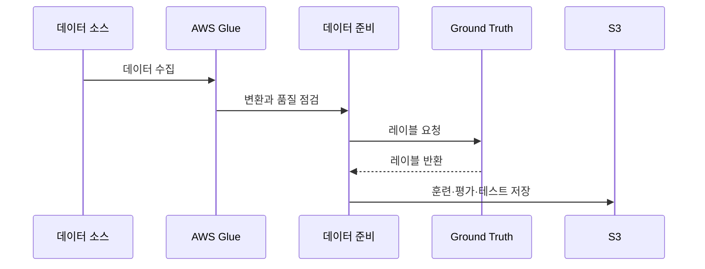

# AIF-C01 Task 1.3 Part 2 - 훈련 데이터 수집/처리

> 파이프라인 다음 단계: 데이터 식별, 수집, 준비, 분할, 특성 결정

## 1. 데이터 수집

- **식별:** 모델 개발 필요한 훈련 데이터와 생성/저장 위치 알아야 함
- **수집 방식:** 스트리밍 데이터인지 배치 로드 가능한지 알아야 함
- **ETL (추출, 변환, 로드):** 여러 소스에서 데이터 수집해 중앙 집중식 리포지토리에 저장하도록 프로세스 구성. 모델은 새 데이터로 자주 재훈련해야 하므로 프로세스 반복 가능해야 함
- **레이블:** 데이터 레이블 지정 여부 또는 지정 방법 알아야 함. 정확히 레이블된 데이터 아직 존재 안할 가능성 높음 -> 프로세스에서 가장 긴 부분 중 하나 될 수 있음

## 2. 데이터 준비

- **포함:** 데이터 전처리 + 특성 추출
- **EDA (탐색적 데이터 분석):** 시각화 도구 사용해 데이터 심층적 빠르게 이해
- **데이터 랭글링:** 대화형 데이터 분석 수행, 모델 구축 위한 데이터 준비
- **처리:**
  - 누락/비정상 값 -> 필터링 또는 복구
  - PII 데이터 -> 마스킹 또는 제거

## 3. 데이터 분할과 특성 결정

### 데이터 분할

- 재처리 후 훈련 시작 거의 완료지만 먼저 분할 방법 결정 필요
- 일반적으로 3개 데이터세트 생성
- **일반 권장:** 80% 모델 훈련, 10% 모델 평가, 나머지 10% 프로덕션 배포 전 최종 테스트

### 특성 결정

- 모델 훈련 위해 특성으로 사용해야 할 데이터세트 특성 결정
- 하위 집합은 관련성 높고 훈련된 모델 오류율 최소화 기여
- 훈련 데이터 특성을 추론 필요한 것으로만 줄여야 함
- 특성 결합해 수 더 줄일 수 있음
- 특성 수 줄이면 훈련 필요 메모리/컴퓨팅 성능 양 줄어듦

## 4. AWS 서비스 - 데이터 수집/준비

### AWS Glue - 완전관리형 ETL

- Management Console 클릭 몇 번으로 ETL 작업 생성/실행
- AWS에 저장된 데이터로 지정 -> Glue가 데이터 검색, 관련 메타데이터(테이블 정의/스키마)를 **Glue Data Catalog**에 저장
- 카탈로그 작성되면 데이터 즉시 검색/쿼리 가능, ETL에 사용 가능
- Glue는 데이터 변환/로드 프로세스 실행 코드 생성. 자체 변환 외에 중복 레코드 삭제, 누락 값 채우기, 데이터세트 분할 같은 변환 기본 제공
- 다양한 데이터 스토어에서 추출/변환/로드 가능: 관계형 DB, 데이터 웨어하우스, 다른 클라우드 또는 스트리밍 서비스 (**MSK, Kinesis**)

**Glue Data Catalog 핵심 개념 (시험 중요):**

- ETL 작업 소스/대상으로 사용되는 데이터에 대한 참조 포함
- 테이블에는 데이터 위치, 스키마, 런타임 지표 인덱스 포함
- 정보 사용해 ETL 작업 생성/모니터링
- 일반적으로 **크롤러** 실행해 데이터 스토어 인벤토리 작성하지만 수동 입력도 가능
- Glue는 데이터 소스 크롤링해 분류기 사용해 스키마 자동 결정, Data Catalog 테이블에 스키마 작성
- **중요:** 소스 데이터 자체는 기록 안됨, 위치/스키마 같은 **메타데이터만** Data Catalog에 저장
- ETL 작업은 이 정보 사용해 일반적으로 **S3 버킷**인 대상 데이터 스토어에 데이터 수집/변환/저장

### AWS Glue DataBrew - 비주얼 데이터 준비 (코드 없이)

- 사용자가 코드 작성 없이 데이터 정리/정규화하는 비주얼 도구
- 원시 데이터 대화형 검색/시각화/정리/변환
- 찾기 어렵고 해결 시간 오래 걸리는 데이터 품질 문제 식별 도움 **스마트 제안** 제공
- 변환 단계 **레시피**에 저장해 나중에 업데이트/다른 데이터셋 재사용/지속 배포 가능
- **250+ 빌트인 변환** + 비주얼 포인트 앤 클릭 인터페이스: null 제거, 누락 값 대체, 스키마 불일치 수정, 열 기반 함수 생성 등
- 규칙 세트 정의, 프로파일링 작업 실행해 데이터 품질 평가 가능

### SageMaker Ground Truth - 레이블링

- 지도형 ML 훈련 위해 레이블된 대규모 고품질 데이터세트 필요
- 고품질 훈련 데이터세트 구축 도움
- **활성 학습:** ML 모델 사용해 훈련 데이터 레이블 지정, 레이블 지정 가능한 데이터 자동 레이블, 나머지 작업은 인간에게 제공
- 인력 옵션:
  - **Amazon Mechanical Turk:** 50만+ 독립 계약자 보유 크라우드소싱
  - 내부 민간 인력: 회사 내 직원/계약자 고용

### SageMaker Canvas - 데이터 준비/특성화/분석

- 단일 시각적 인터페이스로 특성 추출 프로세스 간소화
- **Data Wrangler 데이터 선택 도구:** 다양한 데이터 소스에서 원하는 원시 데이터 선택, 한 번 클릭으로 가져오기
- **300+ 빌트인 변환** 포함: 코드 없이 기능 빠르게 정규화/변환/결합

### SageMaker Feature Store - 특성 중앙 저장소

- 특성 및 관련 메타데이터 위한 **중앙 집중식 저장소**, 쉽게 검색/재사용
- ML 개발 위한 특성 쉽게 생성/공유/관리
- 원시 데이터->특성 변환 필요한 반복적 데이터 처리/큐레이션 작업 줄여 프로세스 가속
- 원시 데이터->특성 변환하고 특성 그룹에 추가하는 워크플로 파이프라인 생성 가능

## 5. 시험 체크포인트

- 데이터 수집: 스트리밍 vs 배치, ETL=중앙 리포지토리, 반복 가능해야 함, 레이블링 가장 긴 부분
- 데이터 준비: 전처리+특성 추출, EDA=시각화, 랭글링, 누락/비정상 필터링/복구, PII 마스킹/제거
- 데이터 분할: 80% 훈련/10% 평가/10% 최종 테스트
- 특성 수 줄이면 메모리/컴퓨팅 감소
- Glue=완전관리형 ETL, Data Catalog=메타데이터만 저장(위치/스키마/지표), 크롤러/분류기 자동 스키마 결정, 소스는 S3, MSK/Kinesis 등 다양한 스토어, 중복 삭제/누락 채우기/분할 기본 변환
- DataBrew=코드 없이 시각적, 250+ 변환, 스마트 제안, 레시피 저장/재사용, null 제거/누락 대체/스키마 불일치 수정
- Ground Truth=고품질 레이블, 활성 학습(자동+인간), MTurk 50만+ / 내부 인력
- Canvas=시각적 인터페이스, Data Wrangler 원클릭 가져오기, 300+ 변환
- Feature Store=특성 중앙 저장소, 검색/재사용, 워크플로 파이프라인->특성 그룹

## 학습 문서 메타데이터

- 도메인: D1 — AI 및 ML의 기초
- 원본 보존 링크: [AIF-C01-Task1-3-Part2.md](../../../docs/Refs/AIF-C01-Task1-3-Part2.md)
- 이 문서는 원본 본문을 보존한 복사본이며, 이 섹션·도식·네비게이션은 학습용으로 추가했습니다.

이 시퀀스 다이어그램은 훈련 데이터가 여러 소스에서 수집되어 정제·레이블링·분할되는 시간 순서의 상호작용을 보여 줍니다. Mermaid가 렌더링되지 않아도 데이터 준비 단계의 순서를 이해할 수 있습니다.

---

[이전](part-1.md) | [인덱스](README.md) | [다음](part-3.md)
