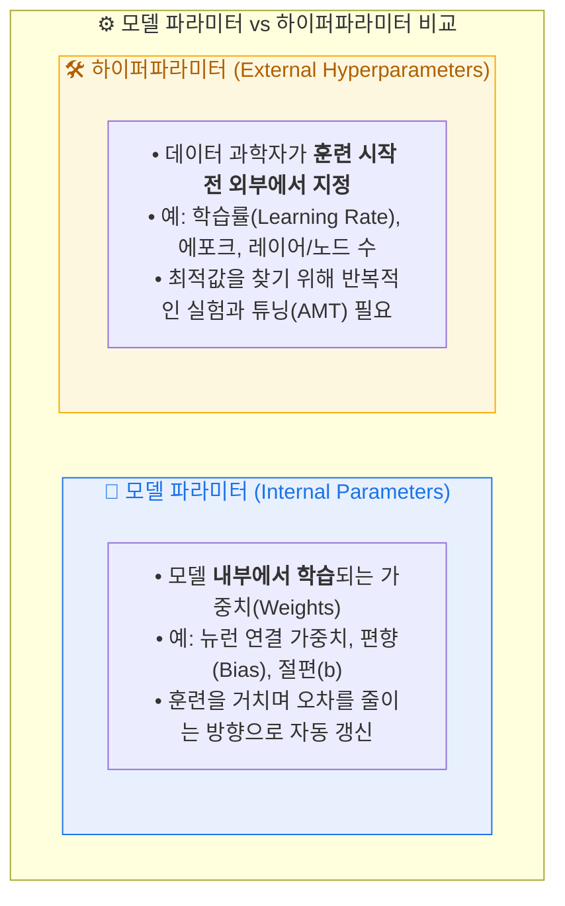
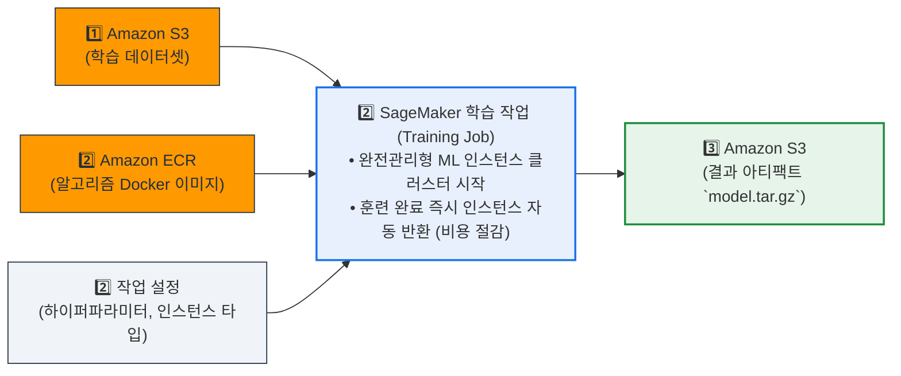
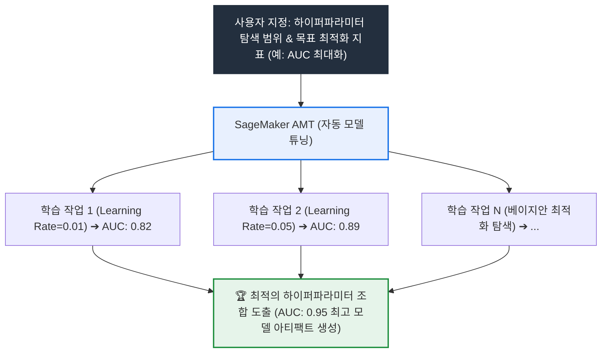
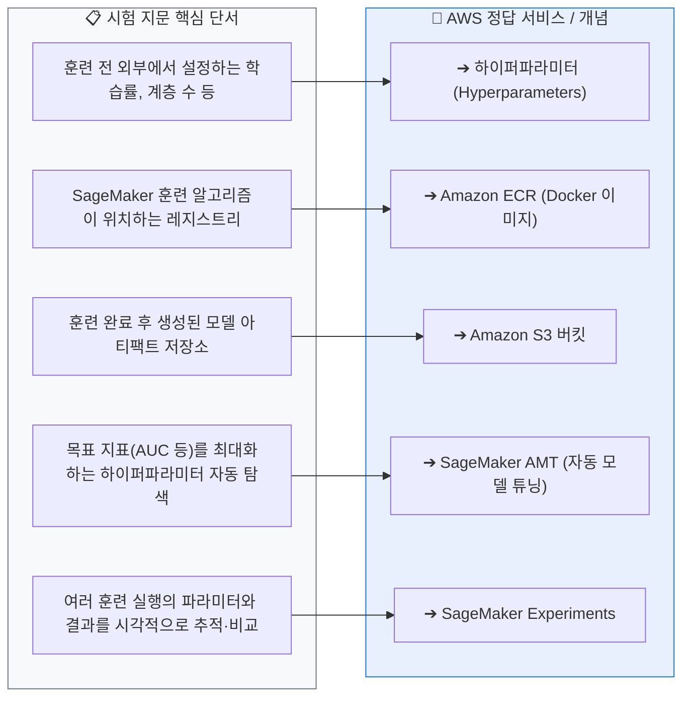
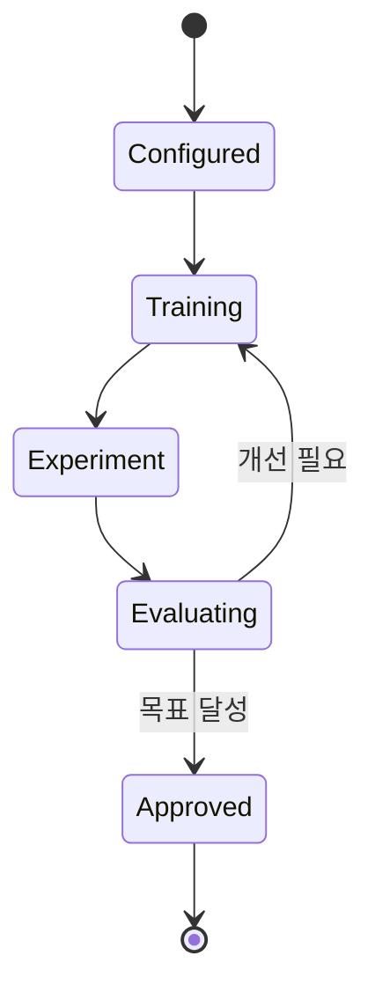

# AIF-C01 Task 1.3 Part 3 - 모델 훈련/조정/평가

> 파이프라인 다음 단계: 훈련, 조정, 평가의 반복 프로세스

## 1. 모델 훈련 원리

- **훈련 중 업데이트 대상:** 파라미터 또는 가중치라는 일련의 숫자
- **목표:** 추론이 예상 출력과 일치하도록 모델 파라미터 업데이트
- **반복 필요 이유:** 알고리즘 아직 학습 안했으므로 한 번 반복으로 불가. 가중치 변경이 출력이 예상 값에 가까워지는 방식에 대한 지식 없음. 따라서 이전 반복에서 가중치/출력 관찰하고 가중치를 생성된 출력 오류 낮추는 방향으로 이동
- **중지 조건:** 정의된 반복 횟수 실행되었거나 오류 변화가 목표 값 미만일 때 중지

## 2. 실험과 하이퍼파라미터

- **여러 알고리즘 고려 필요:** 모범 사례는 다양한 알고리즘/설정 사용해 많은 훈련 작업 **병렬 실행** = **실행 실험**, 성능 가장 좋은 솔루션 찾기
- **하이퍼파라미터:** 성능에 영향 미치는 외부 파라미터 세트, 데이터 과학자가 모델 훈련 전 설정
  - 예) 딥러닝 모델 신경 계층/노드 수 조정
  - 최적 값은 서로 다른 설정으로 여러 실험 실행해야만 결정 가능

## 3. SageMaker로 모델 훈련

### 훈련 작업 생성 과정

1. **SageMaker 관리 ML 컴퓨팅 인스턴스 플릿**에서 훈련 코드 실행하는 훈련 작업 생성
2. **입력:** 훈련 데이터 포함된 **S3 버킷 URL** 지정
3. **리소스 지정:** 훈련 사용할 컴퓨팅 리소스 + 모델 아티팩트 출력 버킷 지정
4. **알고리즘 지정:** 훈련 알고리즘 포함된 **Docker 컨테이너 이미지 경로** 제공
   - **Amazon ECR (Elastic Container Registry)** 에서 위치 지정:
     - SageMaker 제공 알고리즘과 딥러닝 컨테이너 위치
     - 또는 사용자 지정 알고리즘 포함 사용자 지정 컨테이너 위치
5. **하이퍼파라미터 설정:** 알고리즘 필요 하이퍼파라미터 설정
6. **실행:** 훈련 작업 생성되면 SageMaker가 ML 컴퓨팅 인스턴스 시작, 훈련 코드/데이터세트 사용해 모델 훈련
7. **저장:** 결과 모델 아티팩트와 기타 출력을 지정 S3 버킷에 저장

### 반복 실험의 규모

- ML은 반복적 프로세스: 데이터/알고리즘/파라미터 여러 조합 실험하며 증분 변경이 모델 정확도 미치는 영향 관찰
- 이 반복 실험에서 **수천 개 모델 훈련 실행 및 모델 버전** 생성될 수 있음

## 4. SageMaker 실험 관리 및 자동 튜닝

### SageMaker Experiments (실험)

- ML 실험 생성/관리/분석/비교 기능
- **실험 = 각각 입력/파라미터/구성 다른 훈련 실행 그룹**
- 시각적 인터페이스 통해 활성/과거 실험 탐색, 주요 성능 지표 실행 비교, 최고 성능 모델 식별 가능

### SageMaker 자동 모델 튜닝 (AMT) = 하이퍼파라미터 튜닝

- **정의:** 데이터세트에서 많은 훈련 작업 실행해 최상 모델 버전 찾기
- **작동:** 사용자가 지정한 알고리즘/하이퍼파라미터 범위 사용, 선택 지표로 측정 시 성능 가장 좋은 모델 생성하는 하이퍼파라미터 값 선택
  - 예) 이진 분류 모델 튜닝 시 **곡선 아래 면적(AUC, Area Under Curve)** 지표 최대화하는 하이퍼파라미터 조합 찾기
- **사용 방법:** 루프 내 여러 훈련 작업 실행하는 **튜닝 작업** 알아내야 함
- **완료 기준 지정:** 더 이상 지표 개선 안하는 작업 수 같은 기준, 완료 기준 충족까지 작업 실행

## 5. 시험 체크포인트

- 훈련=파라미터/가중치 업데이트, 오류 낮추는 방향으로 이동, 반복 횟수 또는 오류 변화 목표 미만 시 중지
- 모범 사례=다양한 알고리즘/설정 병렬 실행=실행 실험
- 하이퍼파라미터=외부 파라미터, 훈련 전 설정, 예) 신경 계층/노드 수, 여러 실험으로 최적값 결정
- SageMaker 훈련 작업: S3 URL 입력, 컴퓨팅 리소스+출력 버킷 지정, Docker 컨테이너 이미지 경로 (ECR에서 SageMaker 제공 또는 커스텀), 하이퍼파라미터 설정, 인스턴스 시작->훈련->S3에 아티팩트 저장, 수천 개 실행/버전 생성 가능
- Experiments=입력/파라미터/구성 다른 훈련 실행 그룹, 시각적 인터페이스 비교
- AMT=하이퍼파라미터 튜닝, 많은 훈련 작업 실행, 성능 가장 좋은 값 선택, 예) AUC 최대화, 완료 기준 지정 (더 이상 개선 안하는 작업 수)

## 학습 문서 메타데이터

- 도메인: D1 — AI 및 ML의 기초
- 원본 보존 링크: [AIF-C01-Task1-3-Part3.md](../../../docs/Refs/AIF-C01-Task1-3-Part3.md)
- 이 문서는 원본 본문을 보존한 복사본이며, 이 섹션·도식·네비게이션은 학습용으로 추가했습니다.

이 상태 다이어그램은 모델 훈련이 실험·튜닝·평가를 반복하며 승인 가능한 아티팩트로 전환되는 상태를 보여 줍니다. Mermaid가 렌더링되지 않아도 각 상태와 중지 조건을 읽을 수 있습니다.

---

[이전](part-2.md) | [인덱스](README.md) | [다음](part-4.md)
