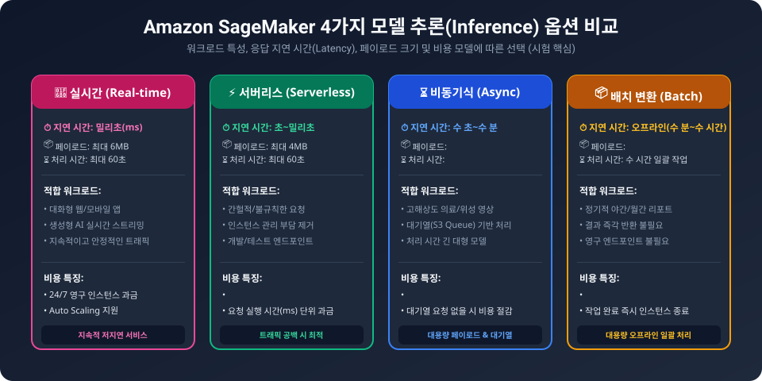
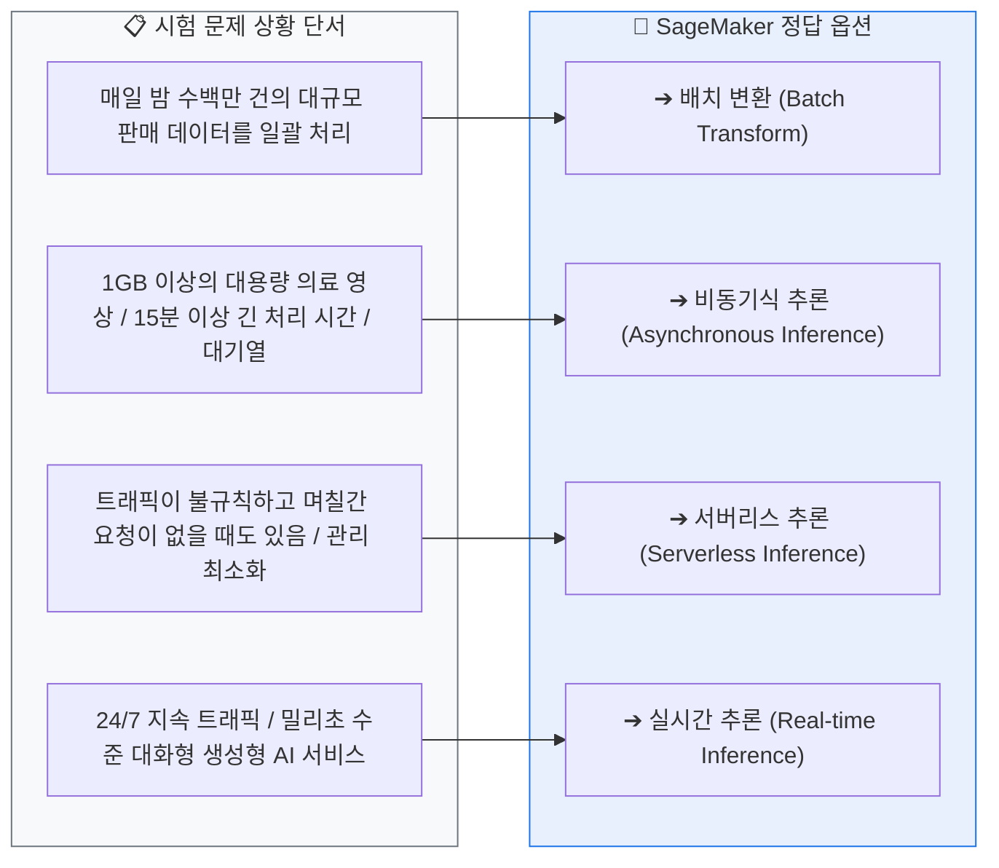
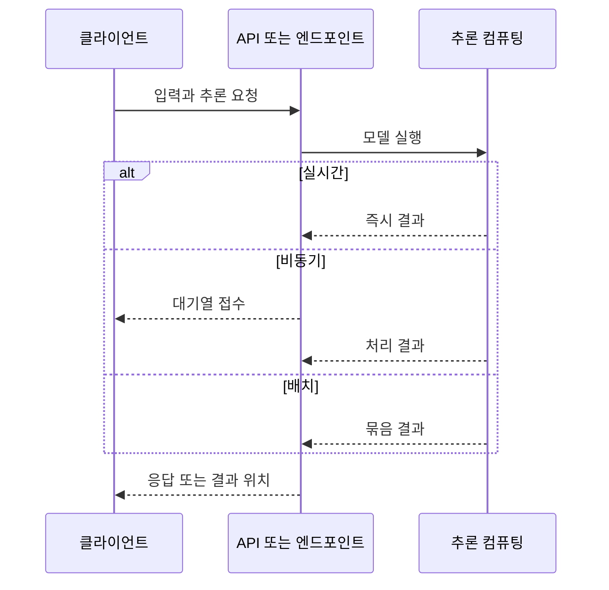

  

# AIF-C01 Task 1.3 Part 4 - 모델 배포와 추론 옵션

> 파이프라인 다음 단계: 완전히 훈련/튜닝/평가된 모델 사용 가능하도록 배포

## 1. 첫 번째 결정: 추론 방식 선택

| 구분 | 언제 사용 | 특징 |
| :--- | :--- | :--- |
| **배치 (Batch)** | 많은 수 추론 필요, 결과 기다릴 수 있을 때. 전날 판매 데이터 기반 하룻밤 사이 실행 등 | 클라우드 리소스 하루 한 번만 실행 -> **가장 비용 효율적** |
| **실시간 (Real-time)** | 요청에 즉시 응답 필요, 예) 생성형 AI | 지속적 엔드포인트, 낮은 지연 |
| **중간 (비동기/서버리스)** | 그 중간 - 큰 페이로드/긴 처리 시간 또는 트래픽 변동 | 대기열, 0으로 축소 가능 등 |

## 2. 실시간 추론 작동 방식

- **REST API:** 클라이언트는 REST API로 모델과 상호 작용. API=HTTP 연결 통해 사용 가능한 작업 세트
- **흐름:** 웹 앱이 입력 데이터 + 엔드포인트 포함 **POST 요청** -> 엔드포인트가 모델 실행 컴퓨팅 리소스에 요청 전달 -> 결과 모델 출력이 응답으로 클라이언트에 다시 보내짐
- **예시:** **Amazon API Gateway**가 클라이언트 인터페이스 역할, 모델 실행 **AWS Lambda** 함수에 요청 전달

```mermaid
flowchart LR
  Client["📱 클라이언트 앱 (웹/모바일)"] -->|POST 요청 (입력 데이터)| APIGW["Amazon API Gateway"]
  APIGW --> SMEP["SageMaker 실시간 엔드포인트<br/>(ML 인스턴스 클러스터)"]
  SMEP --> Model["Docker 컨테이너 ➔ 모델 추론"]
  Model --> SMEP
  SMEP -->|밀리초 즉시 응답 (JSON)| Client

  style Client fill:#F0F4F8,stroke:#232F3E
  style APIGW fill:#FF9900,color:#232F3E
  style SMEP fill:#E8F0FE,stroke:#1A73E8,stroke-width:1.5px
  style Model fill:#E6F4EA,stroke:#1E8E3E
```

## 3. 배포 공통: Docker 컨테이너

- 추론 코드 + 모델 아티팩트는 일반적으로 **Docker 컨테이너**로 배포
- 매우 다양, 컨테이너 런타임 설치된 모든 컴퓨팅 리소스에서 실행 가능
- AWS 옵션: **AWS Batch, ECS, EKS, Lambda, EC2** 등
- 서비스에 따라 추론 엔드포인트 구성/관리 필요: 업데이트, 패치, 확장성, 네트워크 라우팅, 보안 관리 포함

## 4. 운영 오버헤드 줄이기 - SageMaker 호스팅

- **SageMaker** 선택 시 사용자를 대신해 완전 관리하는 호스팅된 엔드포인트에 모델 자동 배포
- **사용법:** S3 버킷 모델 아티팩트 + ECR Docker 컨테이너 이미지를 SageMaker로 가리키기만 하면 됨
- 추론 옵션(배치/비동기/서버리스/실시간) 선택하면 SageMaker가 엔드포인트 생성, 모델 코드 설치
- **실행 위치:**
  - 실시간/비동기/배치 추론: **EC2 ML 인스턴스**에서 실행 (Auto Scaling 그룹 내 가능), 인스턴스 수/유형 선택
  - 서버리스 추론: **Lambda 함수**에서 코드 실행
- **추론 추천 도구:** 모델에서 다양한 구성 옵션 테스트 가능해 가장 적합 옵션 선택

## 5. SageMaker 4가지 추론 옵션 (시험 핵심)

> 엔드포인트 또는 엔드포인트 구성 생성 시 추론 옵션 선택. 4가지 모두 **완전관리형 + Auto Scaling 지원**. 비즈니스 요구사항에 따라 선택



```mermaid
flowchart TD
  Req{"추론 요청의 특성과 요구 지연 시간은?"}

  Req -->|대용량 데이터 일괄 처리 / 지연 허용| Batch["📦 <b>배치 변환 (Batch Transform)</b><br/>• 영구 엔드포인트 없음<br/>• GB 단위 대규모 오프라인 작업<br/>• 작업 완료 시 컴퓨팅 자동 종료"]
  
  Req -->|대용량 페이로드 / 긴 처리 시간 (최대 1시간)| Async["⏳ <b>비동기 추론 (Asynchronous)</b><br/>• 내부 S3 대기열(Queue) 기반 처리<br/>• 트래픽 없을 시 <b>인스턴스 0개로 축소</b> 가능 (비용 0원)"]

  Req -->|간헐적/불규칙 트래픽 / 밀리초 지연| Serverless["⚡ <b>서버리스 추론 (Serverless)</b><br/>• 인스턴스 관리 없이 자동 확장<br/>• 트래픽 없을 시 <b>0으로 축소</b><br/>• 실제 추론 실행 시간(ms)만 과금"]

  Req -->|지속적이고 일정한 트래픽 / 초저지연 필수| RealTime["🚀 <b>실시간 추론 (Real-time)</b><br/>• 24/7 가동되는 영구 REST 엔드포인트<br/>• 대화형 챗봇, 생성형 AI 서비스<br/>• Auto Scaling 지원"]

  style Req fill:#232F3E,color:#FFFFFF,stroke:#232F3E
  style Batch fill:#FEF7E0,stroke:#F9AB00,color:#B06000
  style Async fill:#E8F0FE,stroke:#1A73E8,color:#1A73E8
  style Serverless fill:#E6F4EA,stroke:#1E8E3E,color:#1E8E3E
  style RealTime fill:#FCE8E6,stroke:#D93025,stroke-width:2px,color:#D93025
```

| 옵션 | 설명 | 적합한 경우 | 비용 특징 |
| :--- | :--- | :--- | :--- |
| **배치 변환 (Batch Transform)** | 대규모 데이터세트에 대한 **오프라인 추론**. 영구 엔드포인트 불필요, 결과 기다릴 수 있을 때 | 기가바이트 크기 대규모 데이터세트 지원 | - |
| **비동기식 추론 (Asynchronous Inference)** | 요청 **대기열에 넣음**, 처리 시간 긴 **대용량 페이로드** 필요 시 적합 | 긴 처리 시간/큰 페이로드 | SageMaker가 엔드포인트 **0으로 축소** -> 요청 없는 기간 요금 청구 안됨 |
| **서버리스 추론 (Serverless Inference)** | 컴퓨팅 인스턴스 직접 프로비저닝/크기 조정 정책 구성 없이 **실시간** 추론 제공. Lambda 사용 | 트래픽 변동 처리, 모델 요청 없는 기간 있음 | 함수 실행 중 또는 사전 프로비저닝 시에만 비용 지불 |
| **실시간 추론 (Real-time Inference)** | 실시간 **대화형 응답** 필요 워크로드에 이상적. 지속적 완전관리형 엔드포인트 **REST API**로 지속 트래픽 처리 | 지속 트래픽, 낮은 지연 필요, 예) 생성형 AI | ML 인스턴스 실시간으로 요청 받고 응답 반환 위해 계속 사용 가능 |

## 6. 시험 체크포인트

- 첫 결정=배치 vs 실시간 vs 중간
- 배치=많고 기다릴 수 있음/하룻밤 실행/가장 비용 효율/오프라인
- 실시간=즉시 응답/생성형 AI/REST API POST 요청->엔드포인트->컴퓨팅->응답, API Gateway+Lambda 예시
- 공통=Docker 컨테이너, Batch/ECS/EKS/Lambda/EC2에서 실행, 엔드포인트 관리(업데이트/패치/확장성/네트워크/보안)
- SageMaker=완전관리형 호스팅, S3+ECR 가리키기만 하면 됨, 추론 추천 도구
- 4가지 옵션 구분:
  - Batch=오프라인/대규모/기가바이트/영구 엔드포인트 불필요
  - Async=대기열/대용량 페이로드/긴 처리/0으로 축소->요금 없음
  - Serverless=프로비저닝 없이 실시간/Lambda/요청 없을 때 좋은 선택/실행 중에만 비용
  - Real-time=대화형/지속적 엔드포인트 REST API/지속 트래픽/계속 사용 가능



## 학습 문서 메타데이터

- 도메인: D1 — AI 및 ML의 기초
- 원본 보존 링크: [AIF-C01-Task1-3-Part4.md](../../../docs/Refs/AIF-C01-Task1-3-Part4.md)
- 이 문서는 원본 본문을 보존한 복사본이며, 이 섹션·도식·네비게이션은 학습용으로 추가했습니다.

이 시퀀스 다이어그램은 클라이언트가 추론 방식에 따라 엔드포인트와 컴퓨팅 리소스에서 응답을 받는 시간 순서의 상호작용을 보여 줍니다. Mermaid가 렌더링되지 않아도 배치·비동기·실시간 호출의 흐름을 읽을 수 있습니다.



---

[이전](part-3.md) | [인덱스](README.md) | [다음](part-5.md)
