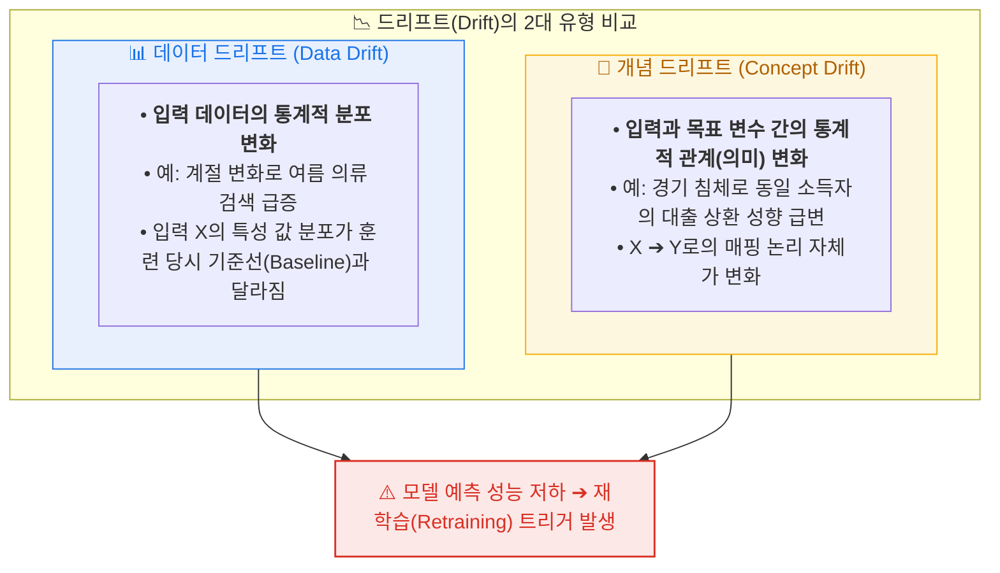
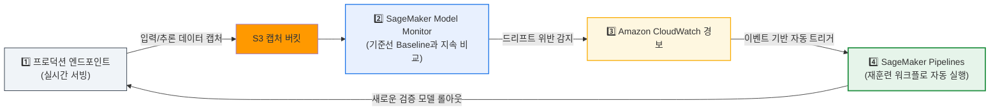
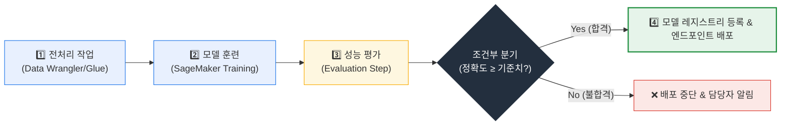
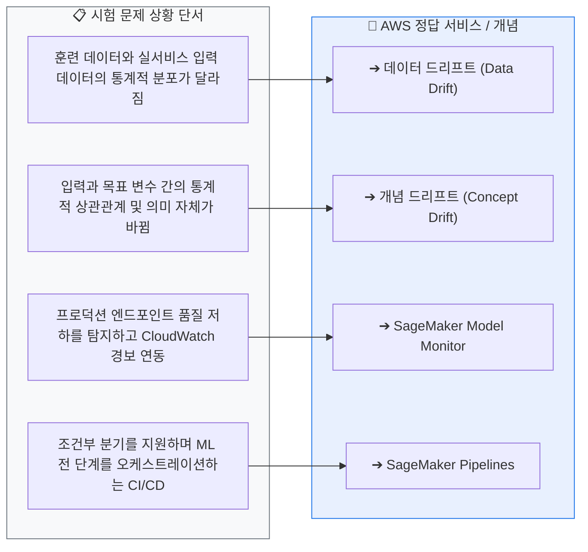
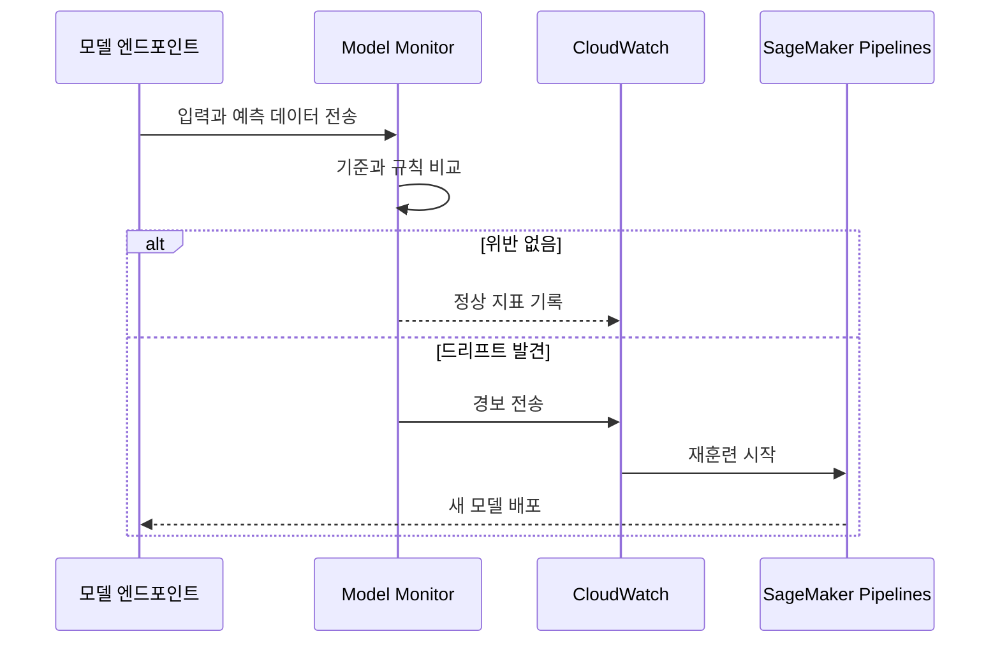

  

# AIF-C01 Task 1.3 Part 5 - 모델 모니터링, MLOps, SageMaker Pipelines

> 파이프라인 마지막 단계: 모니터링 + 자동화

## 1. 모델 모니터링 - 왜 필요한가?

- 초기 성능 아무리 뛰어나도 시간 지나며 **데이터 품질, 모델 품질, 모델 편향** 등으로 성능 저하 가능
- **모니터링 시스템 필수 기능:**
  1. 데이터 캡처
  2. 데이터를 훈련 집합과 비교
  3. 문제 탐지 규칙 정의
  4. 알림 보내기
- **실행 방식:** 이벤트에 의해 시작되거나 사람 개입에 의해 시작될 때 정의된 일정에 따라 반복
- **일반적 접근:** 대부분 ML 모델은 매일/매주/매월 재훈련하는 **간단한 예약 접근**으로 충분

### 드리프트 탐지 (시험 핵심)

- 모니터링 시스템은 **데이터 및 개념 드리프트** 탐지 -> 경고 발령 -> 경보 관리자 시스템으로 보내 **자동 재훈련 주기 시작**
- **데이터 드리프트:** 훈련 사용 데이터와 비교해 **데이터 분포에 상당한 변화**
- **개념 드리프트:** **목표 변수 속성 변경**
- 모든 종류 드리프트 = 모델 성능 저하 초래

### Amazon SageMaker Model Monitor

- SageMaker 기능, 프로덕션 모델 모니터링, 오류 탐지해 수정 작업 수행 가능
- **작동:** 엔드포인트에서 데이터 수집, 기준에 대한 변경 탐지하는 모니터링 일정 정의
- **분석:** 기본 제공 규칙 또는 사용자 정의 규칙에 따라 데이터 분석
- **확인:** SageMaker Studio에서 결과 보고 어떤 규칙 위반했는지 확인
- **연동:** 결과 **CloudWatch**에도 전송, 이를 통해 재훈련 프로세스 시작 등 수정 조치 위한 경보 구성 가능

## 2. 자동화와 MLOps

- **자동화 중요성:** 반복 가능하고 신뢰할 수 있는 비즈니스 프로세스 구현/운영에 중요

### MLOps 정의

- **MLOps = 소프트웨어 엔지니어링 확립된 모범 사례를 ML 모델 개발에 적용**
- 의미:
  - 릴리스 전 수동 태스크 자동화
  - 코드 테스트/평가
  - 인시던트 자동 대응
- ML 개발 수명 주기 전반 모델 제공 간소화

### 클라우드와 MLOps 원칙

- 클라우드는 **API 기반 서비스** 사용 -> 모든 작업 소프트웨어로 처리, ML 파이프라인 인프라 포함
- 전체 인프라 **소프트웨어로 설명 가능**, 반복 가능한 방식으로 배포/재배포 가능 -> 데이터 과학자가 모델 구축/테스트 필요 인프라 신속 가동, 실험 실행, 지속 개선
- **버전 관리:** DevOps처럼 계보 추적, 과거 구성 검사에 매우 중요. MLOps에선 **훈련 데이터 포함 모든 것이 버전 관리됨**
- **모니터링/자동 재훈련:** 배포 모니터링해 잠재 문제 탐지, 문제 또는 데이터/코드 변경으로 재훈련 자동화

### MLOps 이점 4가지

1. **생산성/자동화:** 셀프 서비스 환경/인프라 제공, 데이터 엔지니어/과학자 앞으로 나아가도록 도움
2. **반복성:** ML 수명 주기 모든 단계 자동화 -> 모델 훈련/평가/버전 관리/배포 방법 포함 반복 가능한 프로세스 보장. 빠른 배포 + 품질/일관성 향상 배포 -> **안정성 향상**
3. **규정 준수/감사 가능성:** 데이터 과학 실험 모든 입/출력 소스 데이터부터 훈련된 모델까지 버전 관리 -> 모델 구축 방법/배포 위치 정확히 보여줄 수 있음, 감사 가능성 개선
4. **데이터/모델 품질 향상:** 모델 편향 방지, 시간 지나며 데이터 통계 속성/모델 품질 변화 추적 정책 적용 가능

## 3. Amazon SageMaker Pipelines

- **정의:** SageMaker 작업 오케스트레이션, **재현 가능한 ML 파이프라인** 작성 기능 제공
- **기능:**
  - 짧은 지연 시간 실시간 추론 위한 사용자 지정 구축 모델 배포
  - 배치 변환 사용 오프라인 추론 실행
  - **아티팩트 계보 추적**
- **장점:** 간단 인터페이스 통해 프로덕션 워크플로 배포/모니터링, 모델 아티팩트 배포, 아티팩트 계보 추적 건전한 운영 사례 마련
- **생성 방법:** SageMaker SDK for Python 사용해 파이프라인 생성 또는 JSON 사용해 파이프라인 정의
- **구성:** 모델 구축/배포 모든 단계 포함 가능, 이전 단계 출력 기반 **조건부 브랜치**도 포함 가능
- **확인:** SageMaker Studio에서 볼 수 있음
- **예제:** 전복 크기 기반 나이 추론 모델 파이프라인

## 4. 시험 체크포인트

- 모니터링 필수 기능: 캡처, 훈련 집합 비교, 규칙 정의, 알림 / 일정: 매일/매주/매월 재훈련 간단 예약
- 드리프트: 데이터 드리프트=데이터 분포 변화, 개념 드리프트=목표 변수 속성 변경, 모두 성능 저하
- Model Monitor=프로덕션 모니터링/오류 탐지/수정, 엔드포인트 데이터 수집/기준 변경 탐지 일정, 빌트인/사용자 정의 규칙, Studio에서 확인, CloudWatch 전송->재훈련 경보
- MLOps=소프트웨어 엔지니어링 모범 사례를 ML에 적용, 수동 태스크 자동화/코드 테스트/인시던트 자동 대응, 인프라 소프트웨어로 설명/반복 배포, 모든 것 버전 관리(훈련 데이터 포함), 배포 모니터링+자동 재훈련
- MLOps 이점: 생산성/자동화, 반복성(빠른 배포+품질/일관성->안정성), 규정 준수/감사 가능성(소스부터 모델까지 버전 관리), 품질 향상(편향 방지/통계 속성 추적)
- SageMaker Pipelines=오케스트레이션/재현 가능한 파이프라인, 실시간/배치/계보 추적, SDK Python 또는 JSON, 조건부 브랜치, Studio에서 보기, 전복 나이 예제

## 학습 문서 메타데이터

- 도메인: D1 — AI 및 ML의 기초
- 원본 보존 링크: [AIF-C01-Task1-3-Part5.md](../../../docs/Refs/AIF-C01-Task1-3-Part5.md)
- 이 문서는 원본 본문을 보존한 복사본이며, 이 섹션·도식·네비게이션은 학습용으로 추가했습니다.

이 시퀀스 다이어그램은 모델 엔드포인트의 관측·규칙 평가·알림·재훈련이 시간 순서로 상호작용하는 방식을 보여 줍니다. Mermaid가 렌더링되지 않아도 MLOps 자동화의 반복 흐름을 이해할 수 있습니다.

## 초보자 학습 보조

### 한 줄 요약과 선수 지식

- 선수 지식: 모니터링은 배포 후 입력·출력·성능 변화를 관찰해 문제를 발견하는 운영 활동입니다.
- 한 줄 요약: **MLOps는 데이터·코드·모델·평가·배포를 반복 가능하게 만들고, 드리프트를 감지해 안전한 개선을 돕습니다.**

### 자주 하는 오해

- **오해:** 데이터 드리프트와 개념 드리프트는 같은 현상이다.
- **바로잡기:** 데이터 드리프트는 입력 분포 변화이고, 개념 드리프트는 입력과 목표 사이 관계 변화입니다.

### 스스로 답하는 확인 질문

1. 실서비스 입력의 분포가 훈련 데이터와 달라졌다면 어떤 유형의 드리프트를 의심하나요?
2. 재현 가능한 훈련·평가·배포 절차와 계보 추적이 필요한 이유는 무엇인가요?

### 공식 범위와 출처

- **시험 핵심:** AIF-C01 Domain 1 Task 1.3의 MLOps, 모델 모니터링, 반복 가능한 프로세스와 지표 설명에 연결됩니다.
- [콘텐츠 도메인 1: AI 및 ML의 기초 — AWS 공식 시험 안내서](https://docs.aws.amazon.com/ko_kr/aws-certification/latest/ai-practitioner-01/ai-practitioner-01-domain1.html), 확인일: 2026-09-09

---

[이전](part-4.md) | [인덱스](README.md) | 없음
