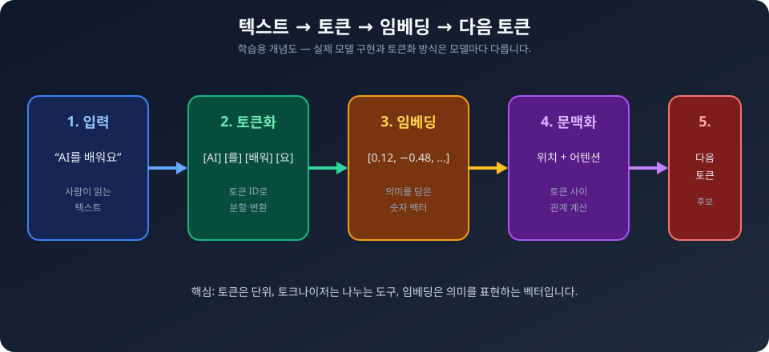
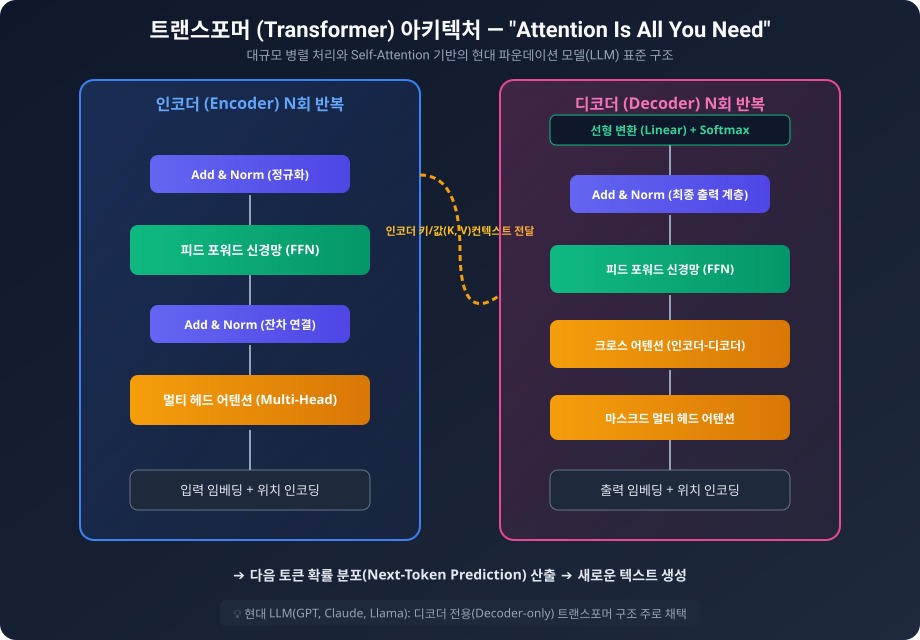
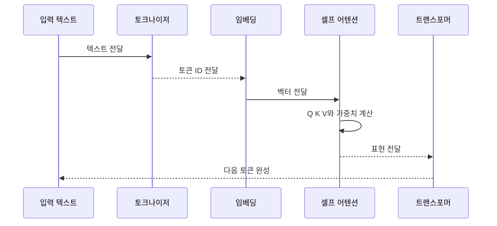

# AIF-C01 Task 2.1 Part 2 - 토크나이저/벡터/임베딩/트랜스포머 핵심

> 생성형 AI 기본 개념, AI 프로젝트 시작/데이터 선택, JumpStart는 2.3에서 자세히

## 1. 토크나이저와 벡터 기초

### 토크나이저

- 모든 언어 기반 생성형 AI 모델에는 **토크나이저** 있음
- 사람이 입력한 텍스트 -> **토큰 ID 또는 입력 ID 포함된 벡터**로 변환
- 각 입력 ID는 모델 **어휘의 토큰**을 나타냄
- SageMaker JumpStart 같이 공개 사용 가능한 사전 훈련된 파운데이션 모델 있음 (2.3에서 자세히)

### 벡터란?

- **정의:** 특정 엔터티/개념 특성/속성 나타내는 **숫자의 순서가 지정된 목록**
- 생성형 AI 컨텍스트에서 벡터는 단어/문구/문장/기타 단위 나타낼 수 있음
- **벡터 표현의 힘:** 항목 간 관련 관계 인코딩, 의미 있는 연관성/추론/계층 구조 캡처
  - 예) 해우와 듀공의 벡터 차이 ≈ 큰귀상어와 귀상어의 차이
- 벡터 = 숫자 목록 + 공간 내 위치 나타냄
  - Excel 스프레드시트 생각: 숫자/벡터 목록은 특정 공간 또는 **벡터 데이터베이스**의 특정 위치 나타냄
  - 열/행 번호가 스프레드시트 특정 셀 나타내듯

## 2. 임베딩 (Embedding)

- **과정:** 모델은 토크나이저 사용해 입력 텍스트 -> 벡터 변환
- **임베딩 벡터 = 임베딩:** 각 토큰 고차원 표현 얻기 위해 필요한 입력 ID 집합
- **정의:** 모든 엔터티를 수치적으로 **벡터화하여 표현**
- **시맨틱 의미 캡처:** 텍스트/이미지/비디오/오디오 같은 토큰의 의미
  - 예) 벡터는 대규모 텍스트 본문 내 토큰 의미/컨텍스트 인코딩
  - 모델이 이 방식으로 인간 언어 통계적 표현/이해 가능
- **벡터 공간 특성:** 토큰이 서로 가까울수록 시맨틱 의미 더 비슷함
- 모델은 이러한 벡터 간 관계 따라 텍스트 생성 가능
- 임베딩은 트랜스포머 또 다른 핵심 구성 요소인 **셀프 어텐션 계층**으로 전달

## 3. 트랜스포머와 셀프 어텐션

### 트랜스포머 = 현재 생성형 AI 핵심

- 본질적으로 생성형 AI는 인간이 할 수 있는 것 모방한 콘텐츠 생성하는 ML 기법
- **트랜스포머 혁신 = 셀프 어텐션 메커니즘**
- 각 출력 토큰 생성 시 입력 여러 부분 중요성 평가 도움
- **RNN 같은 이전 아키텍처에서 학습 어려웠던 장거리 종속성/컨텍스트 관계 캡처 가능**

### 셀프 어텐션 작동 방식

1. 각 입력 토큰에 대한 **쿼리(Query), 키(Key), 값(Value) 벡터 세트 계산**
2. 이러한 벡터 간 **점곱(dot product)** 사용해 **어텐션 가중치** 결정
3. 각 토큰 출력 = **값 벡터 가중치 합계**, 가중치는 어텐션 점수에서 나옴
4. 이 프로세스 **여러 계층에서 반복** -> 모델이 입력에 대한 복잡한 표현 작성 가능

### 위치 임베딩 (Positional Embedding)

- 시퀀스에서 각 토큰 상대적 위치 인코딩하는 **위치 임베딩** 개념 도입
- 모델이 서로 다른 위치 나타나는 동일한 토큰 구별 도움
- 문장 구조/단어 순서 이해에 중요

## 4. 추론 시 트랜스포머 역할

- 모델 추론 중 트랜스포머는 모델이 입력 프롬프트에 대한 **완성(Completion) 생성 돕는 데 중점**
- 셀프 어텐션 사용해 입력 시퀀스 표현 계산, 장기 종속성 캡처/계산 병렬화 도움
- **"Attention is all you need" 논문:** 여러 기계 번역 작업에서 뛰어난 성능 달성, RNN/CNN 의존 이전 모델보다 성능 뛰어남 보여줌

## 5. 트랜스포머 아키텍처 상세 (개념 수준)

- **구성:** 각각 여러 개 계층 가진 **인코더와 디코더**로 구성
- 각 계층 = **2개 하위 계층**으로 구성
- **잔여 연결(Residual Connection) + 계층 정규화(Layer Normalization)** 사용해 훈련 용이/과대 적합 방지
- **위치 인코딩(Positional Encoding) 체계:** 입력 시퀀스 각 토큰 위치 인코딩, 반복적 연산/합성곱 연산 없이 모델이 시퀀스 순서 파악 도움
- 사전 훈련/미세 조정 과정에서 트랜스포머는 모델이 입력 훈련/튜닝에서 언어 컨텍스트 이해 도움
- **시험 대비:** 낮은 수준 트랜스포머 아키텍처 세부 사항 이해 필요 없지만, 복잡한 구현 내부적으로 이루어진다는 것 이해 도움
- 플래시 카드 개념: 입력, 컨텍스트 창, 임베딩 계층, 인코더, 셀프 어텐션, 디코더, 소프트맥스 출력 등

## 6. 시험 체크포인트

- 토크나이저=텍스트->토큰 ID/입력 ID 벡터, 각 ID=어휘 토큰
- 벡터=숫자 순서 목록/특성/속성/단어/문구/문장, 관련 관계 인코딩/연관성/추론/계층, 해우-듀공 ≈ 큰귀상어-귀상어, Excel 비유=공간/벡터 DB 특정 위치
- 임베딩=임베딩 벡터=수치적 벡터화 표현/고차원 표현/시맨틱 의미 캡처/텍스트/이미지/비디오/오디오/대규모 본문 의미/컨텍스트 인코딩/통계적 표현/벡터 공간 가까울수록 시맨틱 유사/관계 따라 텍스트 생성/셀프 어텐션 계층으로 전달
- 트랜스포머=현재 핵심/인간 모방 콘텐츠 생성 ML 기법/혁신=셀프 어텐션/각 출력 토큰 생성 시 입력 여러 부분 중요성 평가/RNN 어려웠던 장거리 종속성 캡처
- 셀프 어텐션=쿼리/키/값 벡터 계산->점곱->어텐션 가중치->값 벡터 가중치 합계=출력/여러 계층 반복 복잡 표현
- 위치 임베딩/인코딩=상대적 위치 인코딩/동일 토큰 구별/문장 구조/단어 순서 이해/반복/합성곱 없이 순서 파악
- 추론=완성 생성 도움/입력 시퀀스 표현 계산/장기 종속성 캡처/병렬화
- 아키텍처=인코더+디코더 각각 여러 계층 각 계층 2개 하위 계층/잔여 연결+계층 정규화 훈련 용이 과대 적합 방지/Attention is all you need 뛰어난 성능 RNN/CNN보다 우수

## 시각 학습 보조

이 그림은 텍스트가 토큰화된 뒤 임베딩으로 바뀌고 모델의 표현 계산으로 이어지는 **개념적 순서**를 요약합니다. 실제 모델 내부 구현은 아키텍처마다 다를 수 있습니다.

이 그림은 입력 임베딩, 어텐션 계층, 출력 생성의 관계를 보여 줍니다. 인코더·디코더 구성은 모델 계열에 따라 달라질 수 있으므로, 시험에서는 세부 구현보다 “문맥 관계를 반영해 다음 출력을 생성한다”는 역할을 우선 이해합니다.

## 학습 문서 메타데이터

- 도메인: D2 — GenAI의 기초
- 원본 보존 링크: [AIF-C01-Task2-1-Part2.md](../../../docs/Refs/AIF-C01-Task2-1-Part2.md)
- 이 문서는 원본 본문을 보존한 복사본이며, 이 섹션·도식·네비게이션은 학습용으로 추가했습니다.

이 시퀀스 다이어그램은 텍스트가 토큰화·임베딩·QKV 계산을 거쳐 셀프 어텐션과 다음 토큰 완성으로 이어지는 시간 순서의 내부 상호작용을 보여 줍니다. Mermaid가 렌더링되지 않아도 처리 순서를 읽을 수 있습니다.

---

[이전](part-1.md) | [인덱스](README.md) | [다음](part-3.md)
