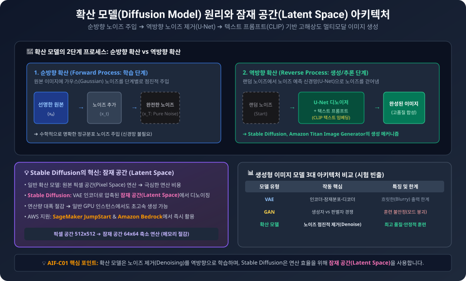
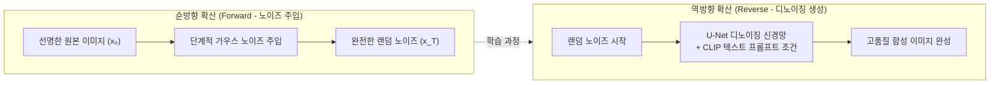
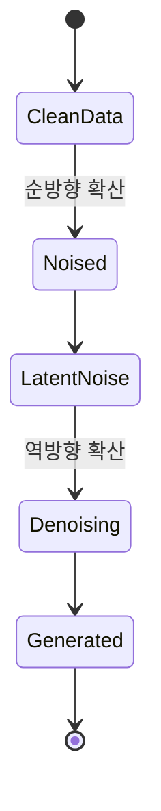

  

# AIF-C01 Task 2.1 Part 3 - 모델 크기 확장/사전 훈련/유니모달-멀티모달/확산 모델

> 모델 클수록 추가 학습 없이 작동 가능성 ↑, 파운데이션 모델 수명 주기 심화

## 1. 모델 크기와 확장성

- **발견:** 모델 클수록 **추가 컨텍스트 내 학습 또는 추가 훈련 없이도 작동 가능성 높음**
- 기능은 크기 따라 증가 -> 점점 더 큰 모델 개발 지원
- 결과: **확장성 뛰어난 트랜스포머 아키텍처 도입 + 방대한 데이터 액세스 + 더 강력한 컴퓨팅 리소스 개발**
- **한계 질문:** 성능 높이려고 파라미터 계속 추가 가능? 대규모 모델 훈련 어렵고 비용 많이 듦, 지속적으로 큰 모델 훈련 어려움
- **성장 방향 질문:** 모델 성장 어디로 이어질까?

## 2. LLM 사전 훈련 복습

- **LLM = 언어 심층 통계 표현 인코딩**
- 이해는 **사전 훈련 단계**에서 개발, 방대한 양 비정형 데이터 학습
- 데이터 크기: **기가바이트, 테라바이트, 심지어 페타바이트** 단위 텍스트
- 데이터 소스: 인터넷 + 언어 모델 훈련 위해 특별 수집 대규모 텍스트 등 다양한 소스
- **자가 지도 학습 단계:** 모델은 언어 패턴/구조 내재화
- 패턴은 모델 아키텍처 따라 달라지는 **훈련 목표 완료** 도움
- 사전 훈련 중 모델 가중치 업데이트되어 훈련 목표 **손실 최소화**
- 인코더는 각 토큰 임베딩/벡터 표현 생성
- 사전 훈련에 많은 컴퓨팅 + **GPU** 사용 필요
- 인터넷 같은 퍼블릭 사이트에서 훈련 데이터 수집 시 데이터 처리 필요: 품질 높이기/편향 해결/기타 유해 콘텐츠 제거
- **중요 수치:** 토큰 **1~3%**가 데이터 품질 큐레이션 단계 이후 사전 훈련에 사용됨. 이 추정치 모델 사전 훈련 위해 수집해야 하는 데이터 양 결정 시 포함 중요

## 3. 유니모달 vs 멀티모달

| 구분 | 정의 | 예시 |
| :--- | :--- | :--- |
| **유니모달** | 하나의 데이터 모달리티로 작동 | **LLM:** 입력/출력=텍스트 -> 유니모달 생성형 AI 예 |
| **멀티모달** | 이미지/비디오/오디오 등 다른 모달리티 추가 | 다양한 데이터 소스 이해, 더 강력한 예측 제공 |

- **멀티모달 사용 사례:** 마케팅, 이미지 캡션, 제품 디자인, 고객 서비스, 챗봇, 아바타

### 멀티모달과 확산 모델 = 텍스트 넘어서는 2가지 중요한 생성형 AI 클래스

- 멀티모달 모델은 여러 형식 데이터 처리/생성 가능, 이 유형 작업 서로 결합 수행도 가능
- 협업 기능은 인간 지능 더 밀접 반영하는 **교차 모델 추론, 번역, 검색, 생성** 추가

### 멀티모달 태스크 예시

1. **이미지 캡션:** 이미지에 대한 텍스트 설명 생성
2. **비주얼 질의 응답 (VQA):** 이미지 콘텐츠에 대한 질문 답변
3. **텍스트-이미지 합성:** 텍스트 설명으로부터 이미지 생성
   - 모델: **DALL-E, Stable Diffusion, Midjourney** - 자연어 프롬프트에서 사실적/다양한 이미지 생성

## 4. 확산 모델 (Diffusion Model)

### 정의와 태스크

- 이미지 생성/업스케일링/인페인팅 등 멀티모달 태스크 지원
- **확산 모델 = 점진적 노이즈 프로세스 반전 방법 학습하는 생성형 모델 클래스**
- 확산 기반 아키텍처는 생성된 이미지 품질/다양성에 대해 더 높은 수준 제어 제공

### 3가지 주요 구성 요소 (시험 필수)

1. **순방향 확산 (Forward Diffusion):** 가우스 노이즈 사용해 이미지 인코딩
2. **역방향 확산 (Reverse Diffusion):** 노이즈 예측기 + 역방향 확산 프로세스 함께 사용해 이미지 재생성
3. **안정 확산 (Stable Diffusion):** 랜덤 노이즈부터 시작해 노이즈 반복 제거해 고품질 이미지/오디오 클립 같은 일관된 출력 생성. 모델은 이전 단계에서 노이즈 부분 제거된 출력 조건으로 각 단계 추가된 노이즈 예측 시도

### Stable Diffusion 특징

- 다른 많은 이미지 생성 모델과 다름
- **원칙:** 확산 모델은 가우스 노이즈 사용해 이미지 인코딩 -> 노이즈 예측기+역방향 확산으로 이미지 재생성
- **차별점:** 이미지 **픽셀 공간 사용 안함**, 대신 선명도 낮은 **잠재 공간(Latent Space)** 사용
- **SageMaker JumpStart** 통해 Stable Diffusion 모델 사용해 텍스트에서 이미지 쉽게 생성 가능

### 확산 모델 장점 vs GAN/VAE

- **GAN (Generative Adversarial Networks)** 및 **VAE (Variational Autoencoder)** 같은 다른 생성형 접근 방식 대비:
  - 더 다양하고 일관성 있는 고품질 출력 생성 경향
  - 더 안정적, 훈련하기 쉬움

### 확산 모델 예시

- 이미지 생성: **Stable Diffusion**
- 음성 인식/번역: **Whisper** (강의에서 확산 예시로 언급)
- 오디오 생성: **AudioLM**

## 5. AWS에서 멀티모달/확산 모델 지원

- **SageMaker:** 멀티모달 데이터 작업 모듈 사전 구축된 **TensorFlow, PyTorch** 같은 딥러닝 프레임워크 지원
- AWS는 단 몇 줄 코드로 미세 조정/배포 가능한 Stable Diffusion 같은 사전 훈련 모델 제공
- 구축/배포 위한 다양한 서비스/도구 제공

## 6. 시험 체크포인트

- 모델 클수록 추가 컨텍스트 내 학습/추가 훈련 없이 작동 가능, 크기↑=기능↑, 확장성 뛰어난 트랜스포머+방대 데이터+강력 컴퓨팅, 그러나 대규모 훈련 어렵고 비용 많이 듦
- LLM 사전 훈련=언어 심층 통계 표현/GB/TB/PB 텍스트/인터넷+대규모 텍스트/자가 지도/패턴 내재화/훈련 목표 손실 최소화/인코더 임베딩/컴퓨팅+GPU 많이 필요/품질/편향/유해 콘텐츠 제거 처리/토큰 1~3%만 큐레이션 후 사전 훈련 사용
- 유니모달=하나 모달리티 LLM 텍스트 입출력 예, 멀티모달=이미지/비디오/오디오 추가 다양한 소스 이해 강력한 예측, 사용 사례 마케팅 이미지 캡션 제품 디자인 고객 서비스 챗봇 아바타, 교차 모델 추론 번역 검색 생성
- 멀티모달 태스크: 이미지 캡션, VQA, 텍스트-이미지 합성 DALL-E Stable Diffusion Midjourney
- 확산 모델=점진적 노이즈 프로세스 반전 학습/이미지 생성 업스케일링 인페인팅/품질 다양성 높은 제어/3대 구성 요소 순방향 확산 역방향 확산 안정 확산/랜덤 노이즈부터 시작 노이즈 반복 제거 일관 출력/이전 단계 부분 제거 출력 조건 각 단계 노이즈 예측/가우스 노이즈 인코딩 노이즈 예측기+역방향으로 재생성/Stable Diffusion=픽셀 공간 X 잠재 공간 O/JumpStart로 텍스트->이미지/장점 GAN VAE 대비 다양 일관 고품질 안정적 훈련 쉬움/예시 Stable Diffusion Whisper AudioLM
- AWS=SageMaker TensorFlow PyTorch 모듈/몇 줄 코드로 미세 조정 배포

## 학습 문서 메타데이터

- 도메인: D2 — GenAI의 기초
- 원본 보존 링크: [AIF-C01-Task2-1-Part3.md](../../../docs/Refs/AIF-C01-Task2-1-Part3.md)
- 이 문서는 원본 본문을 보존한 복사본이며, 이 섹션·도식·네비게이션은 학습용으로 추가했습니다.

이 상태 다이어그램은 확산 모델의 이미지가 노이즈 상태에서 시작해 역방향 제거를 거쳐 생성 결과로 전환되는 상태를 보여 줍니다. Mermaid가 렌더링되지 않아도 순방향·역방향 확산과 잠재 공간의 개념을 이해할 수 있습니다.

## 초보자 학습 보조

### 한 줄 요약과 선수 지식

- 선수 지식: 모달리티는 텍스트·이미지·오디오처럼 데이터가 표현되는 형식입니다.
- 한 줄 요약: **멀티모달 모델은 여러 형식의 정보를 함께 다루며, 확산 모델은 노이즈를 점차 제거해 이미지를 생성하는 접근입니다.**

### 자주 하는 오해

- **오해:** 모델 크기를 키우면 비용이나 데이터 품질 문제도 자동으로 해결된다.
- **바로잡기:** 큰 모델은 더 많은 데이터·컴퓨팅·평가가 필요하며 품질과 안전성 검토가 계속 필요합니다.

### 스스로 답하는 확인 질문

1. 이미지와 질문을 함께 받아 답하는 모델은 유니모달인가요, 멀티모달인가요?
2. 확산 모델이 이미지 생성에서 노이즈를 다루는 방식은 무엇인가요?

### 공식 범위와 출처

- **시험 핵심:** AIF-C01 Domain 2 Task 2.1의 멀티모달 모델과 확산 모델 개념에 연결됩니다.
- [콘텐츠 도메인 2: GenAI의 기초 — AWS 공식 시험 안내서](https://docs.aws.amazon.com/ko_kr/aws-certification/latest/ai-practitioner-01/ai-practitioner-01-domain2.html), 확인일: 2026-09-09

---

[이전](part-2.md) | [인덱스](README.md) | [다음](part-4.md)
