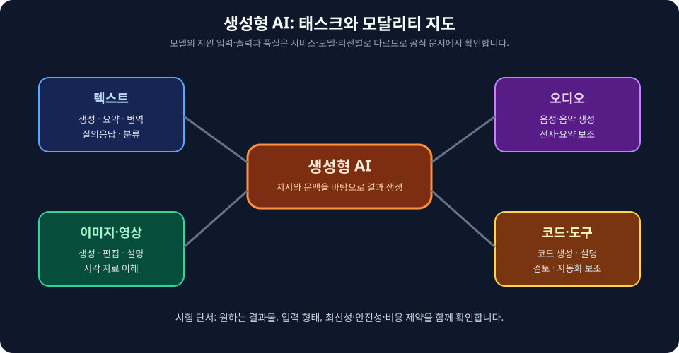
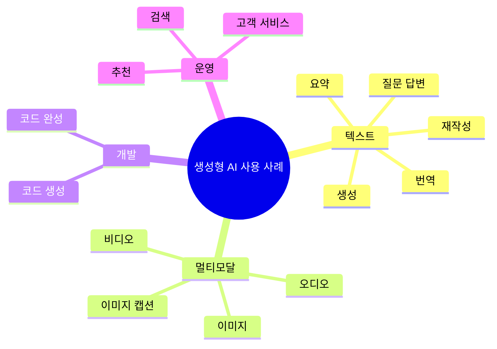

# AIF-C01 Task 2.1 Part 4 - 생성형 태스크와 사용 사례

> LLM은 미세 조정 없이 다양한 문제 영역/태스크 적용 가능한 생성형 AI 유형

## 1. 주요 사용 사례: 텍스트 생성/변환/요약

### (1) 텍스트 생성 및 재작성

- **정의:** 다양한 대상에 맞게 텍스트 작성/다시 작성
- **예시:** 스쿠버 다이빙 부력 장치 설계/사양 기술 문서 각색/변환
  - 구체적: 스쿠버 다이빙 자격증 취득 시작 사람들 위해 기술 용어 덜 사용하도록 변환
- **핵심:** 대상 맞춤 재작성/적응

### (2) 텍스트 요약

- **정의:** 비교적 긴 정보 제공 -> 주요 아이디어 유지하면서 짧은 출력 생성
- **예시:** 기술 문서/재무 보고서/법률 문서/뉴스 기사 등 요약

## 2. AWS 생성형 AI 서비스 맵 (시험 연결)

| 카테고리 | 서비스 | 제공 기능 |
| :--- | :--- | :--- |
| **콘텐츠 생성 파운데이션** | **Amazon Bedrock + Amazon Titan** | 텍스트/이미지/오디오 생성 위한 사전 훈련 모델 제공, 특정 사용 사례 맞게 미세 조정 가능 |
| **코드 생성** | **SageMaker + Amazon Q Developer** (이전 CodeWhisperer) | 코드 생성/완성(Completion) 지원 |
| **3D/가상 프로덕션** | **Amazon Nimble Studio + Amazon Sumerian** | 가상 프로덕션/3D 콘텐츠 생성 제공 |
| **인프라** | AWS | 기본 인프라/데이터 관리/모델 훈련/추론 처리 -> 특정 사용 사례/애플리케이션 집중 가능 |

## 3. 기타 주요 사용 사례 (시험 빈출)

- **정보 추출**
- **질의 응답 (Q&A)**
- **분류**
- **유해 콘텐츠 식별**
- **번역**
- **추천 엔진**
- **맞춤형 마케팅 및 광고**
- **챗봇/고객 서비스 에이전트**
- **검색**

## 4. 코드 생성 - 개발자 도구 사용 사례

- **정의:** 소스 코드 생성 위한 개발자 도구로 생성형 AI 사용, 소프트웨어 개발 가속 위해 생성형 AI 적용
- **기능:**
  - 자연어 설명/예제에서 함수형 코드 조각, 심지어 전체 프로그램 생성
  - 일상 프로그래밍 태스크 자동화
  - 코드 완성(Completion) 제안
  - 코드 다른 언어 간 번역
- **Amazon Q Developer 특징:**
  - 주석/기존 코드 기반
  - 코드 조각부터 전체 함수까지 다양한 범위 실시간 코드 제안 생성
  - AWS가 인프라/데이터 관리/훈련/추론 처리

## 5. 아키텍처 선택 (시험 필수)

- **다양한 아키텍처 존재 이해 필요:**
  - **GAN (Generative Adversarial Networks)**
  - **VAE (Variational Autoencoder)**
  - **트랜스포머 (Transformer)**
- 각 아키텍처 고유 장점/한계 -> **목표/데이터세트 평가 후 적절한 아키텍처 선택** 필요

## 6. 시험 체크포인트

- LLM=미세 조정 없이 다양한 문제 영역/태스크 적용 가능 생성형 AI 유형
- 사용 사례: 텍스트 생성/재작성 (대상 맞춤/스쿠버 기술 문서->초보자용), 텍스트 요약 (긴 정보->주요 아이디어 유지 짧은 출력/기술/재무/법률/뉴스)
- AWS: Bedrock+Titan=텍스트/이미지/오디오 사전 훈련+미세 조정, SageMaker+Q Developer=코드 생성/완성, Nimble Studio+Sumerian=가상 프로덕션/3D 콘텐츠, AWS=인프라/데이터/훈련/추론 처리
- 기타: 정보 추출/Q&A/분류/유해 콘텐츠 식별/번역/추천 엔진/맞춤 마케팅 광고/챗봇 고객 서비스 에이전트/검색
- 코드 생성=개발자 도구/소프트웨어 개발 가속/자연어->코드 조각/전체 프로그램/일상 태스크 자동화/완성 제안/언어 간 번역/Q Developer 주석+기존 코드 기반 조각~전체 함수 실시간 제안
- 아키텍처 GAN VAE 트랜스포머 장점 한계 목표 데이터세트 평가 후 선택

## 시각 학습 보조

이 그림은 생성·변환·요약·코드·멀티모달 같은 활용 범주를 비교합니다. 그림에 적힌 AWS 서비스명이나 지원 범위는 시험 범위를 확정하지 않으며, 실제 제공 기능은 최신 공식 문서에서 확인해야 합니다.

확산 모델은 노이즈를 점차 제거하여 결과를 구성하는 방식으로 설명할 수 있는 생성 모델의 한 예입니다. 이 자료에서는 텍스트 생성 모델과 다른 생성 방식도 존재한다는 점을 이해하는 데만 사용합니다.

## 학습 문서 메타데이터

- 도메인: D2 — GenAI의 기초
- 원본 보존 링크: [AIF-C01-Task2-1-Part4.md](../../../docs/Refs/AIF-C01-Task2-1-Part4.md)
- 이 문서는 원본 본문을 보존한 복사본이며, 이 섹션·도식·네비게이션은 학습용으로 추가했습니다.

이 마인드맵은 생성형 AI의 태스크와 텍스트·이미지·오디오·코드 모달리티에서 중심 개념으로 가지가 뻗는 사용 사례를 보여 줍니다. Mermaid가 렌더링되지 않아도 기능의 계층을 읽을 수 있습니다.

---

[이전](part-3.md) | [인덱스](README.md) | [다음](part-5.md)
