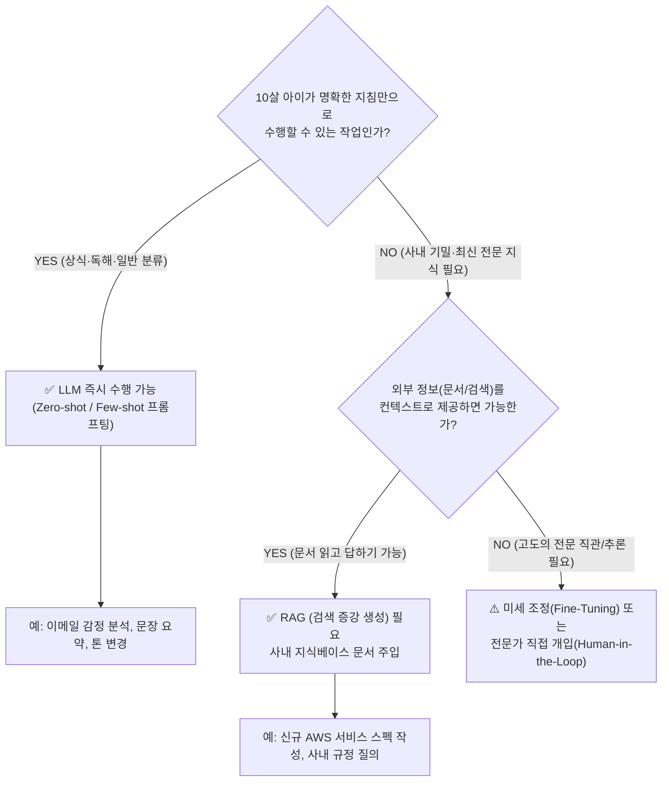
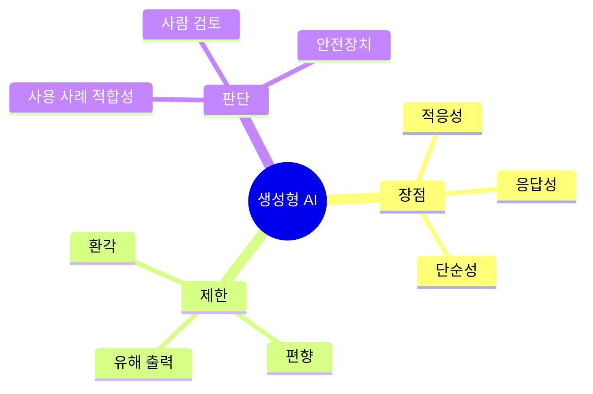

<!-- metadata-badges -->

<kbd>도메인 D2</kbd> <kbd>입문</kbd> <kbd>초안</kbd>

# AIF-C01 Task 2.2 Part 1 - 생성형 AI 기능/제한 - 범용 기술과 장점

> 비즈니스 문제 해결 위한 생성형 AI 기능/제한, 3개 강의 중 1번째

## 1. 생성형 AI = 범용 기술 (General-Purpose Technology)

- 딥 러닝 같은 다른 범용 기술과 마찬가지로 여러 용도
- 단일 애플리케이션뿐만 아니라 **경제 여러 분야 걸쳐 다양한 애플리케이션** 유용
- 지금까지 강의에서 생성형 AI/LLM이 범용 기술이라는 점 알아봄

## 2. 생성형 AI 장점 3가지

### (1) 적응성 (Adaptability)
- 다양한 문제 영역/태스크 적용 가능, 미세 조정 없이도 가능 (2.1에서 배움)

### (2) 응답성 (Responsiveness)
- 실시간 상호작용, 빠른 완성 생성

### (3) 단순성 (Simplicity)
- **가장 중요한 비즈니스 이점**
- 영역 1: 거의 매일 AI 사용 - 웹 검색 시 AI, 신용 카드 사용 시 실제 사용 확인 AI, Amazon.com 방문 시 제품 추천 AI
- 많은 AI 시스템 복잡/빌드 비용 많이 듦
- 그러나 **생성형 AI는 많은 AI 애플리케이션 훨씬 더 간단하게 빌드 가능**
- 기업에서 가치 있는 AI 애플리케이션 저렴한 비용/더 빠르게 빌드 도움

- 플래시카드 추가: 생성형 AI 사용 모범 사례 검토

## 3. 생성형 AI 제한 사항 - 왜 이해해야 하는가?

- 매력적 기술이지만 모든 것 할 수 없음
- **책임감 있고 윤리적/공정한 모델 빌드하려면 제한 사항 이해 필요**
- AI 책임감 있게 사용/사람들에게 이점 제공해야 함
- 영역 4에서 책임감 있는 AI 더 자세히

## 4. LLM 능력 판단 프레임워크 - 10살 아이 테스트

**질문:** 10살 아이가 프롬프트 안내 따라 태스크 완료할 수 있을까?

### 예시 1: 할 수 있음 - LLM도 할 수 있음

- **태스크:** 지침 따라 이메일 읽고 이메일이 불만 사항인지 판단
- **판단:** 대부분 사람 할 수 있음 -> **LLM도 할 수 있음**
- 특징: 일반적인 이해/판단 능력 필요, 외부 특정 지식 불필요

### 예시 2: 할 수 없음 - LLM도 할 수 없음

- **태스크:** 새 AWS 서비스 정보 없이 이 서비스에 대한 기사 작성
- **판단:** 아마 아닐 것, 일반 문서 작성 가능하지만 새 AWS 서비스 구체적 내용 포함 안됨
- **해결:** 주제에 대한 블로그 게시물/보도 자료 읽었다면 훨씬 자세한 내용 포함 문서 작성 가능 -> **LLM도 마찬가지**
- **교훈:** LLM은 훈련 데이터에 없는 새로운 특정 정보 모름, 컨텍스트 제공(RAG/프롬프트) 필요

## 5. LLM 기억 한계

- 메시지 LLM에 보낼 때마다 **LLM은 실제로 이전 대화 기억 못함**
- 다른 자녀에게 모든 단일 태스크 요청하는 것과 비슷
- 비즈니스 세부 사항/작성하려는 스타일 시간 지나며 훈련 불가
- **하지만 미세 조정하면 가능**

## 6. 시험 체크포인트

- 생성형 AI=범용 기술 딥 러닝처럼 여러 용도 단일 앱 아닌 경제 여러 분야 다양한 애플리케이션 유용
- 장점 적응성 응답성 단순성/매일 AI 사용 웹 검색 신용 카드 Amazon 추천/많은 AI 복잡 비용 많이 듦 생성형 AI 훨씬 간단 빌드 저렴 비용 더 빠르게 빌드/모범 사례 플래시카드
- 제한 사항 모든 것 할 수 없음 책임감 윤리적 공정 모델 빌드 제한 이해 필요 책임감 있게 사용 이점 제공 영역 4 책임감 AI 자세히
- 10살 아이 테스트 프롬프트 안내 태스크 완료 가능? 이메일 불만 판단 대부분 가능 LLM 가능 vs 새 AWS 서비스 정보 없이 기사 작성 불가 일반 문서 가능 구체 내용 불가 블로그 보도 자료 읽으면 자세히 가능 LLM도 마찬가지
- LLM 이전 대화 기억 못함 다른 자녀에게 매번 태스크 요청 비즈니스 세부 사항 스타일 시간 지나 훈련 불가 미세 조정하면 가능

## 학습 문서 메타데이터

- 도메인: D2 — GenAI의 기초
- 원본 보존 링크: [AIF-C01-Task2-2-Part1.md](../../../docs/Refs/AIF-C01-Task2-2-Part1.md)
- 이 문서는 원본 본문을 보존한 복사본이며, 이 섹션·도식·네비게이션은 학습용으로 추가했습니다.

이 마인드맵은 생성형 AI의 기능과 제한에서 사용 사례 판단으로 이어지는 중심 개념의 가지를 보여 줍니다. Mermaid가 렌더링되지 않아도 장점·한계·안전장치의 계층을 읽을 수 있습니다.

---

[이전](../task-2-1/part-5.md) | [인덱스](README.md) | [다음](part-2.md)
