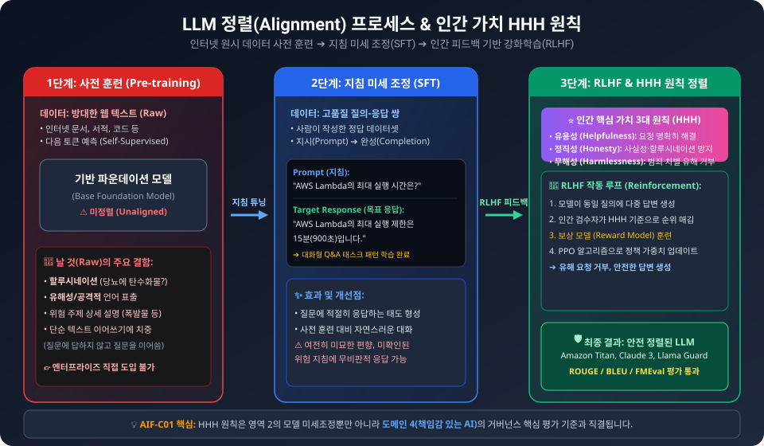
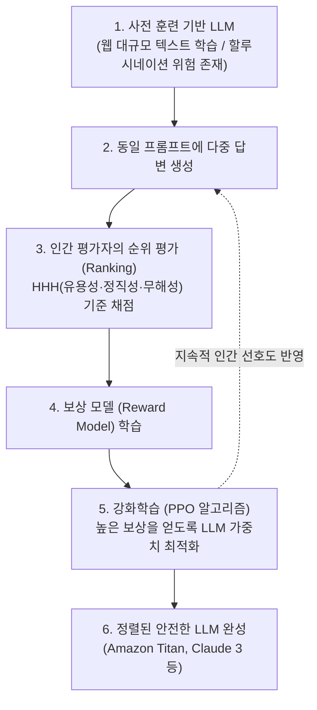
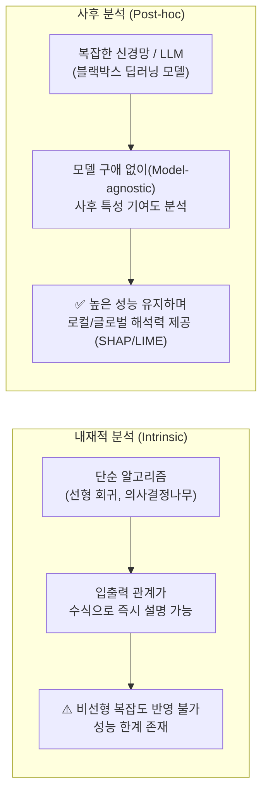
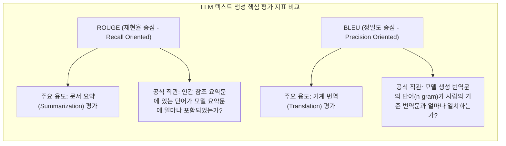
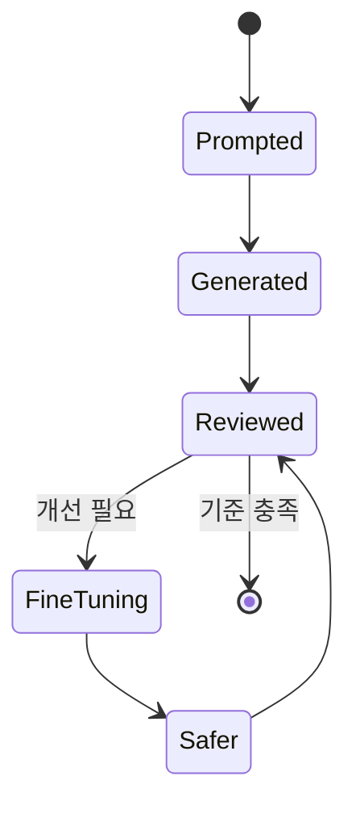

# AIF-C01 Task 2.2 Part 2 - 미세 조정/환각/HHH/해석 가능성/평가 지표

> 생성형 AI 프로젝트 수명 주기 재방문, LLM 애플리케이션 사용법

## 1. 지침을 사용한 미세 조정 (Instruction Fine-Tuning)

- **목표:** 모델 추가 훈련해 인간과 유사한 프롬프트 더 잘 이해 + 인간과 더 유사한 응답 생성
- **효과:** 원래 사전 훈련 기반 버전보다 **모델 성능 지속 가능성 향상**, 더욱 자연스러운 언어 생성
- 자연스러운 인간 언어는 어려움, 일부 LLM 제대로 작동 안하는 기사 있음

### LLM 문제 사례

- 완성물에서 **유해 언어 사용**
- **전투적/공격적 목소리**로 답변
- **위험 주제 상세 정보** 제공
- **원인:** 대규모 모델이 인터넷에서 이러한 언어 자주 나타나는 방대한 텍스트 데이터에서 훈련되기 때문
- 결과: LLM은 **오해 소지/잘못된 답변** 제공 가능

### 환각 (Hallucination)

- **예시:** 탄수화물 위주 식단이 당뇨병 건강 열쇠라는 입증 안된 건강 조언에 대해 LLM에게 질문
  - 모델은 이 사례 반박해야 함
  - 대신 **확실하고 완전히 잘못된 응답** 제공 가능
  - 사람이 찾는 진실/정직 답변 절대 아님
  - 이 작업 = **할루시네이션**
- **대처:** 정답 얻으려면 믿기 전에 **권위 있는 소스 통해 답변 재확인** 필요
- 또한 LLM은 공격적/차별적/불법 범죄 행위 같은 **유해 완성물 생성하면 안됨**

## 2. 인간 가치 HHH - 영역 4 예고

- **중요 인간 가치 3가지:**
  - **유용성 (Helpfulness)**
  - **정직성 (Honesty)**
  - **무해성 (Harmlessness)**
- 이러한 가치는 개발자가 AI 책임감 있게 사용하도록 안내하는 원칙 세트
- **인간 피드백 통한 미세 조정 (RLHF)** 추가해 모델 인간 선호도 더 잘 맞추고 완성물 유용성/정직성/무해성 높일 수 있음
- 추가 교육 = 유해성/잘못된 정보 생성 줄임

> [!TIP]
> **AIF-C01 암기 팁 (HHH):**
> 1. **Helpfulness (유용성):** 사용자의 요청 사항을 정확하고 유용하게 수행하는가?
> 2. **Honesty (정직성):** 거짓 정보를 지어내지 않고(할루시네이션 방지), 모르는 것은 모른다고 하는가?
> 3. **Harmlessness (무해성):** 차별, 편향, 범죄 조장, 유해 언어를 출력하지 않는가?

## 3. 모델 해석 가능성 (Interpretability) - 모델 선택 시 고려

- 해석 가능성 높을수록 모델 예측 더 쉽게 이해 가능하지만 **단점 고려 필요**
- 관계: **모델에서 예측한 것 = 모델 성능** vs **모델에서 이러한 예측 한 이유 = 모델 해석 가능성**

### 해석 가능성 방법 2분류

| 방법 | 적용 대상 | 특징 |
| :--- | :--- | :--- |
| **내재적 분석 (Intrinsic)** | 입력 변수-예측 간 복잡성 낮거나 단순 관계 모델 해석 | 해석 가능성 높은 경우 입력/변수/출력/예측 단순 관계로 성능 저하 가능, 알고리즘 복잡한 비선형 상호작용 캡처 불가 이유 |
| **사후 분석 (Post-hoc)** | 단순 관계 모델 + 비선형 상호작용 캡처 가능한 신경망 같은 복잡 모델 해석 모두 적용 가능 | **모델에 구애받지 않는 경우 많음**, 입력/출력 예측 따라 훈련 모델 해석 메커니즘 제공, **로컬 수준** 단일 데이터 포인트 확대 or **글로벌 수준** 전체 동작 보기 |

## 4. 성능 공식화 - 기존 ML vs LLM 평가 차이

### 기존 ML

- 출력 이미 알려진 교육/검증 데이터세트에서 모델 얼마나 잘 수행 평가
- 기본 지표 **정확도** 등 계산 가능
- 모델 **결정적** -> 정확도 = 정확한 모든 예측 비율

### LLM

- 출력 **비결정적**, 언어 기반 평가 훨씬 더 어려움
- 예) 두 변수: "저는 커피를 마시고" vs "커피를 마시지 않습니다" - 인간은 차이/유사점 이해 가능
- 하지만 모델 수백만 문장 훈련 시 측정 위해 **자동화/구조화된 방법 필요**

## 5. LLM 평가 지표 2대장 - ROUGE / BLEU (3.4에서 계속)

| 지표 | 풀네임 | 용도 |
| :--- | :--- | :--- |
| **ROUGE** | Recall-Oriented Understudy for Gisting Evaluation | 사람 생성 참조 요약 vs 자동 생성 요약 품질 평가 주로 사용 |
| **BLEU** | Bilingual Evaluation Understudy | 사람 생성 번역 vs 기계 번역 텍스트 품질 평가 설계 알고리즘 |

- LLM 개발자 특정 지표 사용해 모델 성능 평가/전 세계 다른 모델과 비교 가능
- 향상된 미세 조정 모델 성능을 사전 훈련 모델 대비 공식화 방법 설명

## 6. 시험 체크포인트

- 지침 미세 조정 목표 인간 유사 프롬프트 더 잘 이해 인간 유사 응답 생성 원래 사전 훈련 기반 버전보다 성능 지속 가능성 향상 자연스러운 언어/문제 유해 언어 전투 공격 목소리 위험 주제 상세 정보 인터넷 방대 텍스트 훈련 원인 오해 잘못 답변/예시 탄수화물 위주 당뇨 건강 열쇠 반박해야 하는데 확실 완전히 잘못 응답 할루시네이션 권위 소스 재확인 유해 완성물 생성 안됨 공격 차별 불법 범죄
- HHH 유용성 정직성 무해성 영역 4 인간 가치 원칙 세트 RLHF 추가 인간 선호도 맞춤 유용 정직 무해 높임 유해 잘못 정보 감소
- 해석 가능성 모델 선택 시 고려 높을수록 예측 이해 쉽지만 단점/예측한 것=성능 이유=해석 가능성/내재적 단순 관계 복잡성 낮음 해석 가능성 높으면 성능 저하 단순 관계 비선형 캡처 불가/사후 분석 단순+복잡 신경망 비선형 캡처 해석 모델에 구애받지 않음 입력 출력 기반 해석 메커니즘 로컬 단일 데이터 확대 글로벌 전체 동작
- 기존 ML 결정적 정확도 정확한 예측 비율 교육 검증 데이터세트 평가/LLM 비결정적 언어 평가 어려움 커피 마시고 vs 안 마시고 인간 차이 이해 자동화 구조화 필요
- ROUGE 요약 평가 사람 참조 요약 vs 자동 요약 품질/ BLEU 번역 평가 사람 번역 vs 기계 번역 품질/3.4 계속/특정 지표 사용 성능 평가 전 세계 모델 비교

## 학습 문서 메타데이터

- 도메인: D2 — GenAI의 기초
- 원본 보존 링크: [AIF-C01-Task2-2-Part2.md](../../../docs/Refs/AIF-C01-Task2-2-Part2.md)
- 이 문서는 원본 본문을 보존한 복사본이며, 이 섹션·도식·네비게이션은 학습용으로 추가했습니다.

이 상태 다이어그램은 프롬프트 응답이 사실성·유해성 점검과 인간 피드백을 거쳐 더 안전한 모델 상태로 전환되는 과정을 보여 줍니다. Mermaid가 렌더링되지 않아도 미세 조정과 재검증의 반복을 읽을 수 있습니다.

---

[이전](part-1.md) | [인덱스](README.md) | [다음](part-3.md)
