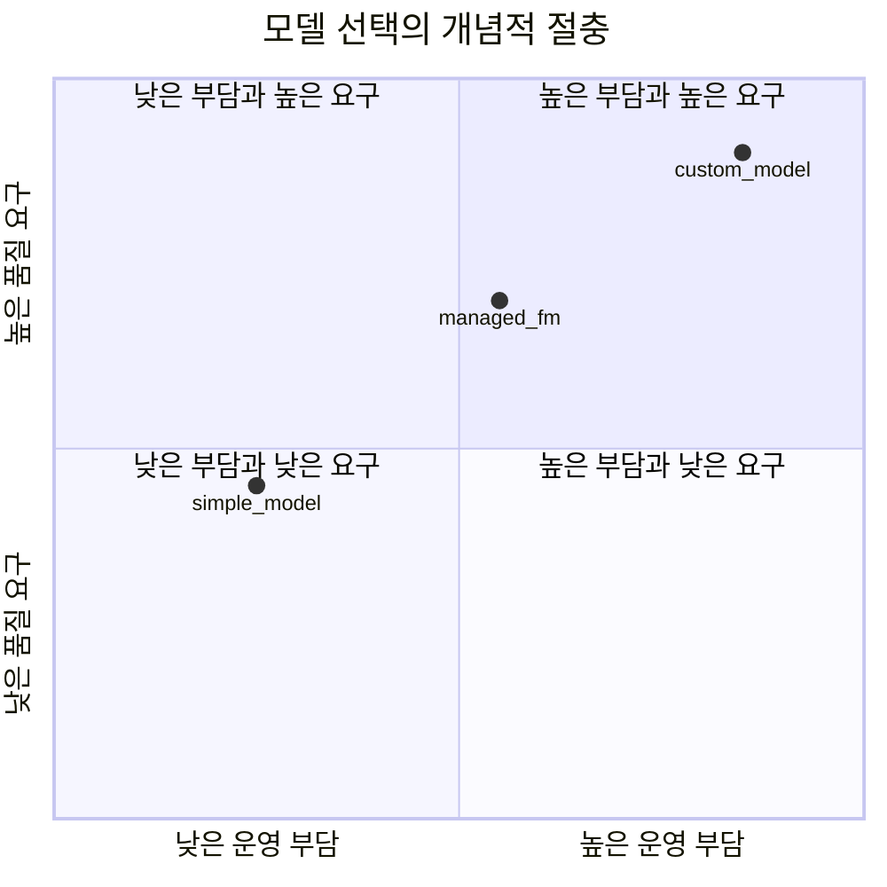

# AIF-C01 Task 2.2 Part 3 - 모델 선택 요소/비즈니스 지표/KPI (2.2 마무리)

> 적절한 생성형 AI 모델 선택 고려 요소: 모델 유형/성능 요구 사항/기능/제약/규정 준수

## 1. 모델 선택 고려 요소

- **생성형 AI 프로젝트 성공 보장 위해 올바른 모델 아키텍처 선택 어떻게?**
- 2.1에서 다양한 아키텍처 설명/플래시카드 제공, 여기서 더 자세히

### 파운데이션 모델 콘텐츠 유형별 설계

- 텍스트 및 채팅, 이미지, 코드, 비디오, 임베딩 등 다양한 유형 콘텐츠 생성 설계
- 알고리즘/모델 구조 조정해 특정 도메인/태스크 맞게 수정 가능

### 데이터 생성 관점 모델 선택 중요

- 데이터 품질 상당한 영향 받음
- **가장 많이 사용 모델 3가지:**
  1. **VAE (변이형 오토인코더, Variational Autoencoder)**
  2. **GAN (생성적 적대 신경망, Generative Adversarial Networks)**
  3. **자기 회귀 모델 (Autoregressive Model)**
- 각 모델 데이터 복잡성/품질 따른 장단점 있음
- 이 모델들은 몇 가지 유형 불과, 지속 연구/개발 통해 새로운 고급 생성형 모델로 발전
- 현재 출시 FM 수/크기 가파른 속도로 성장, 현재 수십 개 모델 사용 가능, AWS 따르면 2018 이후 출시 주요 파운데이션 모델 목록 포함

## 2. 비즈니스 지표 결정 - 왜 중요한가?

### 파운데이션 모델 특성

- 레이블 없는 방대한 데이터세트 훈련, 생성형 AI 기능 뒷받침
- 일반적으로 더 구체적 기능 사용되는 기존 ML 모델보다 훨씬 큼
- **FM = 모델 개발/생성 위한 기준 시작점**
- 언어 해석/이해/대화형 메시징 제공/이미지 생성 등 사용 가능
- 다양한 FM 다양한 분야 특화: 예) **Stability AI Stable Diffusion = 이미지 생성**, **ChatGPT GPT-4 = 자연어**
- FM은 프롬프트 따라 정확도 높은 출력 다양하게 생성 가능, 그러나 **지표/KPI 이해 필요**

### 지표 역할

- 생성형 AI 애플리케이션 성능/영향/성공 평가
- 앞부분 정확성 이야기
- 올바른 비즈니스 지표 추적/모니터링/분석하면 과거 학습/현재 모니터링/미래 계획 가능

### 비즈니스 데이터 분석 복잡성

- 대량 비즈니스 데이터 분석해 미래 가치 예측/이상치 감지/근본 원인 파악 복잡/시간 많이 걸림/항상 정확하지 않음
- **AWS 솔루션:**
  - **Amazon Lookout for Metrics** + **Amazon Forecast** 사용해 문제 해결
  - ML 사용해 대량 데이터 분석 + 변화하는 비즈니스 요구에 동적 적응

## 3. FM 기회와 도전 - 기업 통합

### 과제

- 비즈니스 니즈 부합 고품질 출력 보장/할루시네이션/잘못된 정보 최소화
- FM이 기업 컨텍스트 진정 유용하려면 **기존 비즈니스 시스템/워크플로와 통합/상호 운용 필요**
  - 예) 데이터베이스 데이터 액세스, **ERP (전사적 자원 관리)**, **CRM (고객 관계 관리)** 사용

### 필요 조건

- FM 구현/사용자 지정/유지 보수 가능한 **강력 기술 스킬 직원** 필요
- 경제적으로 배포/고객 가치 얻을 수 있게 **컴퓨팅 리소스/인프라** 필요
- 특히 챗봇 같은 고객 대상 앱에서는 **FM 출력 품질** 통해 채택/사용 결정

## 4. 출력 품질 및 효율성 지표 (시험 중요)

### 출력 품질 지표 4가지 - 사용자 만족도 기여

1. **관련성 (Relevance)**
2. **정확성 (Accuracy)**
3. **일관성 (Consistency)**
4. **적절성 (Appropriateness)**

- AI 시스템 효율성 요구 충족 확인하려면 미리 정의된 표준 사용해 출력 품질 측정 필요

### 효율성 지표

- 생성형 AI 워크플로 영향
- **태스크 완료율 / 수고 감소** 같은 지표 사용 추적 -> 운영 생산성 직접 기여
- **오류율 낮음** -> AI 애플리케이션 정확성/신뢰성 모두 유지 도움

## 5. 비용/ROI와 비즈니스 지표 예시

- 조직은 애플리케이션 고려해 **잠재적 투자 수익(ROI) 평가**, FM 비용/이점 가중치 필요
- 획득 운영 비용/효율성 비교 위한 지표 이해 중요

### 비즈니스 지표 예시 (시험 예시 그대로 암기)

- **교차 도메인 성능 (Cross-domain Performance)**
- **효율성 (Efficiency)**
- **전환율 (Conversion Rate)**
- **사용자당 평균 수익 (ARPU)**
- **정확도 (Accuracy)**
- **고객 평생 가치 (CLTV, Customer Lifetime Value)**

### CLTV 극대화 전략 문제

- **질문:** 고객 평생 가치 극대화 전략은?
- CLTV = 비즈니스 확장 핵심 지표
- 전략: **로열티 프로그램, 브랜드 충성도 생성, 피드백 수집, 교차 판매, 맞춤형 경험** 등

### 교차 도메인 성능 지표

- 교차 도메인 데이터/콘텐츠 생성/예측 위해 교차 도메인 성능 지표 = 다양한 도메인 전반 지식/스킬 이전/적용 평가 필요

## 6. 지속적 평가 필요성

- AI 진화 중, 비즈니스 요구 사항/목표 충족 확인 위해 모델 **측정/모니터링/검토/재평가** 필요

## 7. 시험 체크포인트

- 모델 선택 고려 요소 모델 유형 성능 요구 사항 기능 제약 규정 준수/콘텐츠 유형 텍스트 채팅 이미지 코드 비디오 임베딩/알고리즘 구조 조정 특정 도메인 태스크 맞춤/데이터 생성 관련 가장 적합 모델 선택 중요 데이터 품질 영향/VAE GAN 자기 회귀 모델 데이터 복잡성 품질 장단점 몇 가지 유형 불과 지속 연구 새로운 고급 모델 발전/수십 개 모델 가파른 성장 2018 이후 주요 FM 목록
- 비즈니스 지표 교차 도메인 성능 효율성 전환율 사용자당 평균 수익 정확도 고객 평생 가치/파운데이션 모델 레이블 없는 방대 데이터 훈련 기존 ML보다 훨씬 큼 기준 시작점 언어 해석 이해 대화형 메시징 이미지 생성/Stable Diffusion 이미지 GPT-4 자연어/지표 KPI 성능 영향 성공 평가 정확성/추적 모니터링 분석 과거 학습 현재 모니터링 미래 계획
- 대량 데이터 분석 미래 예측 이상치 근본 원인 복잡 시간 항상 정확 X/AWS Lookout for Metrics Forecast 대량 분석 동적 적응
- FM 기회 도전 고품질 출력 비즈니스 니즈 부합 할루시네이션 잘못 정보 최소화/기업 통합 기존 시스템 워크플로 통합 상호 운용 DB ERP CRM/강력 기술 스킬 직원 구현 사용자 지정 유지 보수/컴퓨팅 리소스 인프라 경제적 배포 고객 가치/챗봇 고객 대상 출력 품질 채택 사용 결정
- 출력 품질 지표 관련성 정확성 일관성 적절성 사용자 만족도/미리 정의 표준 측정/효율성 태스크 완료율 수고 감소 운영 생산성 오류율 낮음 정확성 신뢰성 유지/ROI 평가 비용 이점 가중치 운영 비용 효율성 비교 지표
- CLTV 극대화 전략 로열티 프로그램 브랜드 충성도 생성 피드백 수집 교차 판매 맞춤형 경험 비즈니스 확장 핵심/교차 도메인 성능 지표 다양한 도메인 지식 스킬 이전 적용 평가/측정 모니터링 검토 재평가 비즈니스 요구 목표 충족 확인

## 학습 문서 메타데이터

- 도메인: D2 — GenAI의 기초
- 원본 보존 링크: [AIF-C01-Task2-2-Part3.md](../../../docs/Refs/AIF-C01-Task2-2-Part3.md)
- 이 문서는 원본 본문을 보존한 복사본이며, 이 섹션·도식·네비게이션은 학습용으로 추가했습니다.

이 사분면 차트는 생성형 AI 모델을 선택할 때 품질 요구와 운영 부담의 두 축 절충을 개념적으로 비교합니다. 점의 위치는 실제 벤치마크 수치가 아닌 선택 판단을 위한 예시입니다.

---

[이전](part-2.md) | [인덱스](README.md) | [다음](../task-2-3/part-1.md)
