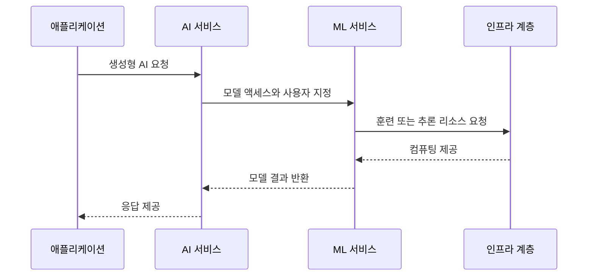

  

# AIF-C01 Task 2.3 Part 1 - 생성형 AI 애플리케이션 위한 AWS 인프라/기술

> AWS 생성형 AI 서비스로 애플리케이션 빌드 장점, 2개 강의 중 1번째

## 1. AWS 생성형 AI 서비스 장점 6가지

1. **접근성 (Accessibility)**
2. **낮은 진입 장벽 (Low Entry Barrier)**
3. **효율성 (Efficiency)**
4. **경제성 (Economy)**
5. **시장 출시 속도 (Time to Market)**
6. **비즈니스 목표 충족 능력**

## 2. 전이 학습 (Transfer Learning)

### LLM 훈련 이해

- LLM 훈련 -> 모든 데이터 처리 시간 오래 걸림
- 데이터에는 수백만 개 계산 포함 가능

### 전이 학습 정의

- 처음부터 훈련하지 않고 **사전 훈련된 모델을 새 데이터세트에서 미세 조정/훈련**하는 프로세스 = **전이 학습**
- 더 작은 데이터세트 + 더 짧은 교육 시간으로 **정확한 모델 생성 가능**
- 일부 유형 모델 훈련 가속화 위해 전이 학습 사용, 사전 훈련 모델을 새 데이터세트 훈련 출발점으로 사용 가능
- 사전 훈련된 집합 직접 만들거나 인터넷에서 가져올 수 있음
- 일반화된 데이터세트 일반화된 모델을 새 데이터세트와 함께 교육 프로세스로 전송 가능
- 그러면 모델 훈련 시 알고리즘에서 이미 일부 정보 인식 + 수행해야 하는 작업 파악
- 그런 다음 이러한 요소가 새 데이터세트에 매핑되는 방법만 파악하면 됨

### SageMaker JumpStart

- 업계 모범 사례 기반 **데이터세트/모델/알고리즘 유형/솔루션**으로 이미 빌드된 프로젝트 + 빠르게 빌드되는 프로젝트 찾는 데 도움

## 3. 생성형 AI 스택 3계층 보안 - 전체 프레임워크

### 비즈니스 맥락

- 2.2에서는 생성형 AI 애플리케이션 사용한 고객 경험 설명
- 그러나 고객은 LLM/FM 사용해 경험 개선해 생성형 AI 애플리케이션도 빌드 중
- 이러한 모델은 **운영 혁신/직원 생산성 개선/새 수익 창출** 가능
- **AWS CAF-AI (Cloud Adoption Framework for AI/ML/생성형 AI)** 링크 추가 - AI/ML/생성형 AI 여정 출발점/가이드, 팀/동료/AWS 파트너와 AI 전략 토론 리소스

### 파운데이션 모델 투자 가치와 우려

- FM + 기반 애플리케이션은 조직 소중한 투자
- 가장 많이 듣는 우려 = **민감 비즈니스 데이터 보호**
  - 예) 개인 데이터/규정 준수 데이터/운영 데이터/재무 정보
- **AWS 최우선 순위 = 보안과 고객 워크로드 기밀성 보장**

### AWS 생성형 AI 스택 3계층 보안

#### 하위 계층 - FM 빌드/훈련 인프라

- LLM 및 기타 FM 빌드/훈련 사용 도구 제공
- AI에는 훈련 대규모 하드웨어 요구 사항/추론 대량 컴퓨팅 리소스/소비 위한 가드레일 있을 수 있음
- **가성비**는 조직 표준 설정 핵심 요소 중 하나
- AWS는 기존 CPU/GPU보다 우수한 가성비 비용 절감 돕는 특수 하드웨어 사용 가능

**AWS Nitro System:**
- 보안 제한 적용 설계된 특수 하드웨어 + 관련 펌웨어
- 제한 사항 목적: 그 누구도 **EC2 인스턴스에서 실행 워크로드/데이터 액세스 불가**
- 보호는 모든 Nitro 기반 애플리케이션/인스턴스에 적용
- 포함: **AWS Inferentia, AWS Trainium** 같은 ML 액셀러레이터 있는 인스턴스 + **P4, P5, G5, G6** 같은 GPU 있는 인스턴스
- **AWS AI 인프라 보호 의미:** 권한 없는 사용자 AI 모델 가중치 및 해당 모델에서 처리된 데이터 같은 민감 AI 데이터 전혀 액세스 불가

#### 중간 계층 - 모델 액세스 + 빌드/확장 도구

- 생성형 AI 애플리케이션 빌드/크기 조정 필요 도구와 함께 **모든 모델에 대한 액세스** 제공
- 플랫폼에서 AWS ML/AI 서비스 개발/배포/반복 지원하는 방식 설계 가능
- 예) ML 서비스는 파운데이션 모델 훈련/조정
- 이 계층 모든 서비스는 생성형 AI 도메인에서 훈련 비용 많이 드는 대규모 FM 같은 모델/기능 사용

#### 최상위 계층 - 애플리케이션

- LLM 및 기타 FM 사용해 **코드 작성/디버그 + 콘텐츠 생성 + 인사이트 도출 + 작업 수행**하는 애플리케이션 포함
- 프롬프트 엔지니어링 사용 가능한 **대시보드** or 파운데이션 모델 or 특정 생성형 AI 아키텍처 **RAG** 같은 애플리케이션일 수 있음

## 4. AI 시스템 핵심 구성 요소와 보안 정책

### AI 시스템 3대 핵심 구성 요소

**입력 / 모델 / 출력**

### 보호 방법

- AI 워크로드 관련 역할/책임과 함께 **보안 정책/표준/지침 설정**해 구성 요소 보호

### AI 시스템 특정 취약점

- **프롬프트 인젝션**
- **데이터 포이즈닝**
- **모델 반전 취약성**

### AI 관련 위험 결과

- 개인정보 침해/데이터 조작/부정 사용/의사결정 침해 포함 결과 초래 -> 정책 검증 필요

### 필수 보안 구현

- **암호화**
- **다중 인증 (MFA)**
- **지속적 모니터링**
- **내결함성**
- **프레임워크에 대한 정렬**

이해 중요

## 5. 시험 체크포인트

- AWS 장점 접근성 낮은 진입 장벽 효율성 경제성 시장 출시 속도 비즈니스 목표 충족 능력
- LLM 훈련 모든 데이터 처리 시간 오래 수백만 계산 포함/전이 학습 처음부터 훈련 X 사전 훈련 모델 새 데이터세트 미세 조정 훈련 더 작은 데이터세트 더 짧은 교육 시간 정확한 모델 생성 일부 유형 가속 사전 훈련 모델 새 데이터세트 훈련 출발점 사전 훈련 집합 직접 만들거나 인터넷 일반화된 데이터세트 일반화된 모델 새 데이터세트 교육 프로세스 전송 알고리즘 이미 일부 정보 인식 수행 작업 파악 새 데이터세트 매핑 방법 파악/SageMaker JumpStart 업계 모범 사례 기반 데이터세트 모델 알고리즘 유형 솔루션 이미 빌드 빠르게 빌드 프로젝트 찾는 도움
- AWS 인프라 이점 보안 규정 준수 책임 안전/2.2 고객 경험 LLM FM 경험 개선 애플리케이션 빌드 운영 혁신 직원 생산성 개선 새 수익 창출/CAF-AI AI ML 생성형 AI 여정 출발점 가이드 팀 동료 파트너 AI 전략 토론 리소스/FM 투자 소중한 투자 우려 민감 비즈니스 데이터 보호 개인 규정 준수 운영 재무/AWS 최우선 보안 고객 워크로드 기밀성 보장
- 스택 3계층 보안 하위 FM 빌드 훈련 도구 대규모 하드웨어 훈련 대량 컴퓨팅 추론 가드레일 소비 가성비 핵심 조직 표준 특수 하드웨어 기존 CPU GPU보다 우수한 가성비 비용 절감/Nitro System 보안 제한 특수 하드웨어 펌웨어 그 누구도 EC2 워크로드 데이터 액세스 불가 모든 Nitro 기반 애플리케이션 인스턴스 적용 Inferentia Trainium ML 액셀러레이터 P4 P5 G5 G6 GPU/AI 인프라 보호 권한 없는 사용자 AI 모델 가중치 처리 데이터 전혀 액세스 불가/중간 모든 모델 액세스 빌드 크기 조정 도구 개발 배포 반복 설계 ML 서비스 FM 훈련 조정 비용 많이 드는 대규모 FM/최상위 LLM FM 코드 작성 디버그 콘텐츠 생성 인사이트 도출 작업 수행 대시보드 프롬프트 엔지니어링 FM RAG 애플리케이션
- AI 시스템 3대 구성 요소 입력 모델 출력/보안 정책 표준 지침 역할 책임 설정 보호/취약점 프롬프트 인젝션 데이터 포이즈닝 모델 반전/위험 개인정보 침해 데이터 조작 부정 사용 의사결정 침해 정책 검증/암호화 다중 인증 지속 모니터링 내결함성 프레임워크 정렬 구현 중요

## 학습 문서 메타데이터

- 도메인: D2 — GenAI의 기초
- 원본 보존 링크: [AIF-C01-Task2-3-Part1.md](../../../docs/Refs/AIF-C01-Task2-3-Part1.md)
- 이 문서는 원본 본문을 보존한 복사본이며, 이 섹션·도식·네비게이션은 학습용으로 추가했습니다.

이 시퀀스 다이어그램은 전이 학습과 AWS 생성형 AI 스택에서 모델·인프라·애플리케이션이 시간 순서로 상호작용하는 방식을 보여 줍니다. Mermaid가 렌더링되지 않아도 요청이 계층을 거치는 순서를 이해할 수 있습니다.

---

[이전](../task-2-2/part-3.md) | [인덱스](README.md) | [다음](part-2.md)
