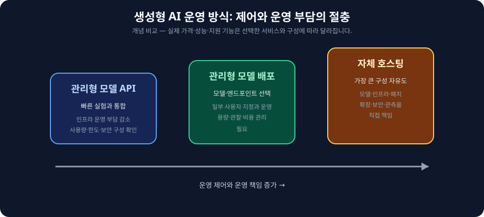
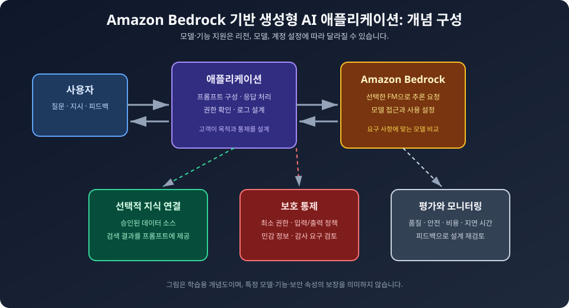
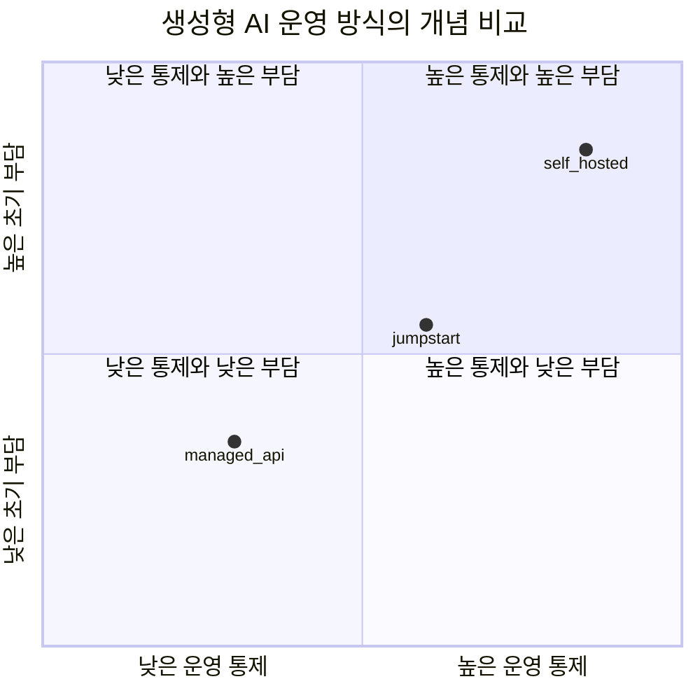

  

# AIF-C01 Task 2.3 Part 2 - 비용 절충/AWS 서비스/베드락/점프스타트 (2.3 마무리)

> AWS 생성형 AI 서비스 비용 절충 관계 상세, LLM 요금 모델

## 1. LLM 요금 모델 2가지

### (1) 자체 인프라 호스팅 모델

- LLM 실행 필요 컴퓨팅 리소스 요금 지불
- LLM 자체 라이선스 요금 지불할 수도 있음

### (2) 토큰 요금 모델 (토큰별 지불)

- **토큰 기반 요금 = 처리된 토큰 수**
- 각 토큰 = 개별 정보 단위 나타냄
  - 예) 정보 단위 = 입력/출력 모두에 대한 텍스트 문자/단어, 이미지 픽셀 또는 둘 다 포함
- 토큰 = 벤더가 **API 호출 가격 책정** 사용 단위
- **AWS 토큰별 지불 모델 장점 = 확장성 향상**
- 자체 모델 호스팅 = 인프라 투자/유지 보수 필요

## 2. AWS ML 스택과 글로벌 인프라

### AWS 글로벌 인프라 구성 요소

- **리전, 엣지 로케이션, 가용 영역** 같은 아키텍처 구성 요소
- **전역 복원력, 리전 복원력, 가용 영역 복원력** 있는 서비스
- 많은 **AWS 관리형 서비스(AMS)** 특정 용도 위해 빌드되지만 **고가용성 기본 제공**
- AWS 글로벌 인프라에서 고가용성/내결함성 추가 방법/이유 학습 필요

### AWS ML 스택 3계층

1. **인프라 계층:** 리전/AZ/엣지 등 글로벌 인프라
2. **기계 학습 계층:** **Amazon SageMaker** 같은 AWS ML 서비스
3. **AI 서비스 계층:** 사전 빌드된 서비스/사전 빌드된 알고리즘/모델/사용 가능 서비스인 **AWS AI 서비스**
   - 이러한 서비스 사용/애플리케이션 통합 가능
   - **API 통합 + 코드 작성 + AWS SDK 사용 방법 알면 ML/AI 사용하지 않고도 서비스 사용 가능**

## 3. LLM 애플리케이션 빌드 도움 AWS 서비스

### SageMaker JumpStart - 모델 허브

- 모델 허브, 서비스 내 사용 가능 파운데이션 모델 **빠르게 배포/애플리케이션 통합** 도움
- 모델 **미세 조정/배포** + 프로덕션 빠르게 들어가 대규모 운영 도움
- 블로그/비디오/노트북 예시 측면 많은 리소스 제공
- **주의사항:**
  - JumpStart 모델 미세 조정/배포하려면 **GPU 필요**
  - 사용할 컴퓨팅 선택 전 **SageMaker 요금 페이지 참조** 필요
  - 사용하지 않을 때 **SageMaker 모델 엔드포인트 삭제**, 비용 모니터링 모범 사례 따라 비용 최적화 필요

### Amazon Bedrock - 관리형 FM 액세스

- **API 사용해 다양한 FM 사용/액세스** 가능하게 하는 관리형 AWS 서비스
- FM에는 **Cohere, Stability AI** 같은 서드 파티 FM + 다양한 사용 사례에서 서로 다른 모델 상호 작용 기능 제공 AWS 큐레이팅 모델 포함
- 자체 FM 처음부터 빌드 필요 없이 생성형 AI 애플리케이션 **대규모 개발 가능**

**Bedrock 신기능:**
- 지원 모델 아키텍처에 대한 **사용자 지정 가중치 가져오기**
- **온디맨드 모드** 사용해 사용자 지정 모델 제공 기능 추가
- **시간 기반 약정 없이 사용한 만큼만 요금 지불**

### Amazon Titan - 아마존 자체 FM

- 아마존 제공 **Amazon Titan 파운데이션 모델 = 범용 FM** 작동
- **텍스트 생성** 기능 필요한 경우 훌륭한 옵션
- 대다수 FM 특히 텍스트 생성 관련 유사 사용 사례 제공, **사용 사례 가장 적합 FM 식별 중요**

**Bedrock에서 적합 FM 찾는 방법:**

1. **플레이그라운드:** 서비스 내 지원 다양한 기본 FM에 대해 **모델 추론 실행**해 사용 사례 가장 높은 정확도 정렬 도움 실험 수행 가능, 선택 모델 따라 조정 가능한 올바른 유형 추론 파라미터 결정, 추론 파라미터 수 변경해 다양한 완성 결과 확인 가능
2. **모델 평가:** 사용 사례 적합 모델 식별 도움 기능 제공

### PartyRock - Bedrock 기반 플레이그라운드

- **PartyRock = Amazon Bedrock에 빌드된 플레이그라운드**
- 플레이그라운드 사용해 생성형 AI 애플리케이션 빌드해 FM에서 다양한 프롬프트 응답 방식 이해 같은 기본 기법 학습 가능
- 빌드 가능 앱 예: **재생 목록, 일반 상식 게임, 레시피 만들기** 등

## 4. 왜 대부분 자체 LLM 훈련/호스팅 안하나? + 벡터 DB

- 훈련하려면 **투자/연구/양질 데이터 수집 정리/시간** 필요 -> 대부분 자체 LLM 훈련 안함
- 대부분 **하드웨어 비용/데이터 저장 비용**으로 자체 모델 호스팅 안함
- 생성형 AI 사용 시 **벡터 데이터베이스** 사용 가능, 데이터는 **임베딩으로 저장**
- 임베딩 = 고급 검색 위해 **압축/저장/인덱싱**될 수 있는 벡터
- AWS는 새로운 고객/직원 경험 제공 생성형 AI 애플리케이션 빌드/크기 조정 도움 가능
- **데이터/사용 사례 사용자 지정 가능**
- 규모/유형 관계없이 **업계를 선도하는 FM/LLM + 엔터프라이즈급 보안/개인 정보 보호** 기능 갖춘 생성형 AI 기반 복제 사용 가능

## 5. 시험 체크포인트

- LLM 요금 모델 자체 인프라 호스팅 컴퓨팅 리소스 요금 라이선스 요금 vs 토큰 요금 모델 토큰별 지불 처리된 토큰 수 개별 정보 단위 문자 단어 픽셀 입력 출력 모두 포함 토큰 벤더 API 호출 가격 책정 단위 AWS 토큰별 지불 확장성 향상 자체 호스팅 인프라 투자 유지 보수 필요
- AWS 글로벌 인프라 리전 엣지 로케이션 가용 영역 전역 복원력 리전 복원력 가용 영역 복원력 AMS 특정 용도 빌드 고가용성 기본 제공 고가용성 내결함성 추가 방법 이유/인프라 계층 글로벌 인프라/ML 계층 SageMaker/AI 서비스 계층 사전 빌드 서비스 알고리즘 모델 API 통합 코드 작성 SDK 사용 방법 알면 ML AI 없이 서비스 사용 가능
- JumpStart 모델 허브 파운데이션 모델 빠르게 배포 애플리케이션 통합 미세 조정 배포 프로덕션 빠르게 대규모 운영 블로그 비디오 노트북 리소스 GPU 필요 SageMaker 요금 페이지 참조 엔드포인트 삭제 비용 모니터링 최적화
- Bedrock API 다양한 FM 사용 액세스 관리형 AWS 서비스 Cohere Stability AI 서드 파티 FM AWS 큐레이팅 모델 다양한 사용 사례 서로 다른 모델 상호 작용 자체 FM 처음부터 빌드 없이 대규모 개발/사용자 지정 가중치 가져오기 온디맨드 모드 사용자 지정 모델 제공 시간 약정 없이 사용한 만큼 요금
- Titan 아마존 자체 FM 범용 FM 텍스트 생성 훌륭 옵션 대다수 FM 유사 사용 사례 가장 적합 FM 식별 중요/플레이그라운드 모델 추론 실행 사용 사례 높은 정확도 정렬 실험 추론 파라미터 조정 파라미터 수 변경 다양한 완성 결과 모델 평가 적합 식별/PartyRock Bedrock 빌드 플레이그라운드 기본 기법 학습 다양한 프롬프트 응답 방식 이해 재생 목록 일반 상식 게임 레시피 만들기
- 대부분 자체 LLM 훈련 안함 투자 연구 양질 데이터 수집 정리 시간/자체 호스팅 안함 하드웨어 비용 데이터 저장 비용/벡터 DB 임베딩 저장 고급 검색 압축 저장 인덱싱 벡터/AWS 새로운 고객 직원 경험 빌드 크기 조정 도움 데이터 사용 사례 사용자 지정 업계 선도 FM LLM 엔터프라이즈급 보안 개인 정보 보호 생성형 AI 기반 복제

## 시각 학습 보조

이 그림은 더 많은 제어가 일반적으로 더 많은 운영 책임을 동반한다는 선택 관점을 보여 줍니다. 비용, 지원 모델, 리전, 보안 구성은 서비스와 시점에 따라 달라지므로 최신 공식 문서를 확인합니다.

이 그림은 애플리케이션이 모델 추론, 선택적 지식 연결, 보호 통제, 평가·모니터링을 조합할 수 있음을 보여 주는 학습용 구성도입니다. 특정 모델·기능·보안 특성의 제공 또는 보장을 의미하지 않습니다.

## 학습 문서 메타데이터

- 도메인: D2 — GenAI의 기초
- 원본 보존 링크: [AIF-C01-Task2-3-Part2.md](../../../docs/Refs/AIF-C01-Task2-3-Part2.md)
- 이 문서는 원본 본문을 보존한 복사본이며, 이 섹션·도식·네비게이션은 학습용으로 추가했습니다.

이 사분면 차트는 관리형 API와 자체 호스팅을 토큰 비용·운영 통제라는 두 축의 절충으로 개념적으로 비교합니다. 점의 위치는 실제 가격이나 성능 수치가 아니라 선택 기준을 설명하는 예시입니다.

## 초보자 학습 보조

### 한 줄 요약과 선수 지식

- 선수 지식: 토큰 기반 과금은 모델이 처리하는 입력·출력 단위와 사용량에 따라 비용이 달라지는 방식입니다.
- 한 줄 요약: **관리형 FM API와 자체 호스팅은 제어 범위, 운영 부담, 성능·비용 요구를 함께 비교해 선택합니다.**

### 자주 하는 오해

- **오해:** 토큰 기반 과금은 항상 자체 호스팅보다 저렴하다.
- **바로잡기:** 요청량·트래픽 예측 가능성·모델 사용자 지정·운영 인력과 인프라 비용을 함께 비교해야 합니다.

### 스스로 답하는 확인 질문

1. 요청이 매우 불규칙한 초기 애플리케이션에서 관리형 API를 먼저 검토할 수 있는 이유는 무엇인가요?
2. 자체 호스팅 선택에서 비용 외에 반드시 고려할 운영 책임은 무엇인가요?

### 공식 범위와 출처

- **시험 핵심:** AIF-C01 Domain 2 Task 2.3의 AWS GenAI 비용 절충과 서비스 선택에 연결됩니다.
- [콘텐츠 도메인 2: GenAI의 기초 — AWS 공식 시험 안내서](https://docs.aws.amazon.com/ko_kr/aws-certification/latest/ai-practitioner-01/ai-practitioner-01-domain2.html), 확인일: 2026-09-09

---

[이전](part-1.md) | [인덱스](README.md) | [다음](../task-2-reference/ref.md)
