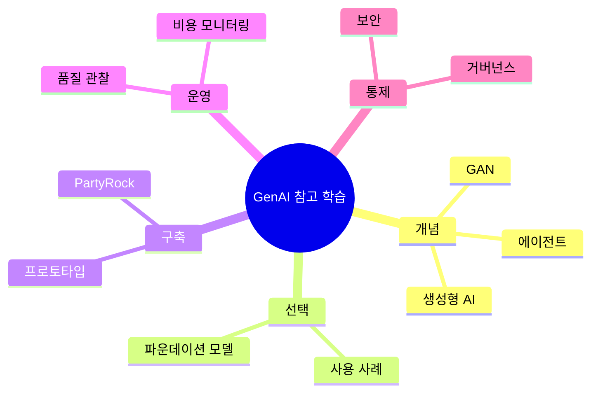

  

# Task 2 Ref Doc
- https://aws.amazon.com/ko/blogs/startups/selecting-the-right-foundation-model-for-your-startup/
- https://www.xenonstack.com/insights/generative-adversarial-networks
- https://www.xenonstack.com/blog/agentic-ai-in-architecture
- https://partyrock.aws/
- https://aws.amazon.com/ko/blogs/mt/monitoring-generative-ai-applications-using-amazon-bedrock-and-amazon-cloudwatch-integration/
- https://aws.amazon.com/what-is/gan/
- https://docs.aws.amazon.com/whitepapers/latest/aws-caf-for-ai/aws-caf-for-ai.html

## 학습 문서 메타데이터

- 도메인: D2 — GenAI의 기초
- 원본 보존 링크: [AIF-C01-Task2-Ref-doc.md](../../../docs/Refs/AIF-C01-Task2-Ref-doc.md)
- 이 문서는 원본 본문을 보존한 복사본이며, 이 섹션·도식·네비게이션은 학습용으로 추가했습니다.

이 마인드맵은 참고 자료를 개념 비교, 모델 선택, 프로토타입, 관찰, 거버넌스로 연결하는 중심 학습 경로를 보여 줍니다. Mermaid가 렌더링되지 않아도 자료의 역할과 피드백 가지를 읽을 수 있습니다.

---

[이전](../task-2-3/part-2.md) | [인덱스](README.md) | 없음
