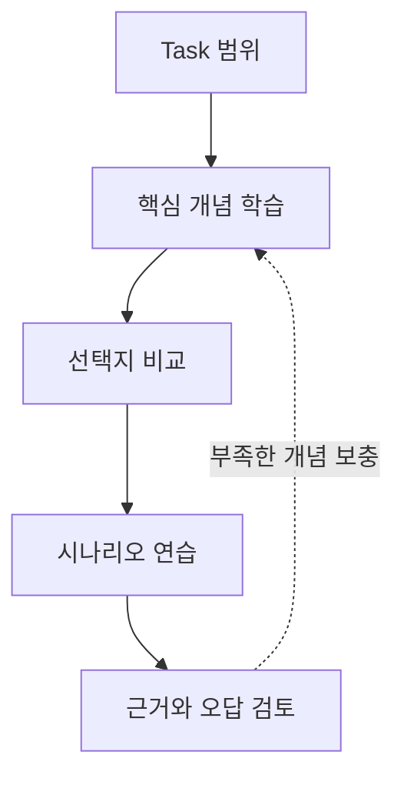

# Task 3.1 FM 애플리케이션 설계

- 도메인: [D3 — 파운데이션 모델의 적용](../README.md)
- 상태: `draft`
- 원본은 docs/Refs에 보존하며 이 폴더의 문서는 학습용 복사본입니다.

## 포함 문서

| 학습 문서 | 보존된 원본 |
|---|---|
| [part-1.md](./part-1.md) | [AIF-C01-Task3-1-Part1.md](../../../docs/Refs/AIF-C01-Task3-1-Part1.md) |
| [part-2.md](./part-2.md) | [AIF-C01-Task3-1-Part2.md](../../../docs/Refs/AIF-C01-Task3-1-Part2.md) |
| [part-3.md](./part-3.md) | [AIF-C01-Task3-1-Part3.md](../../../docs/Refs/AIF-C01-Task3-1-Part3.md) |
| [part-4.md](./part-4.md) | [AIF-C01-Task3-1-Part4.md](../../../docs/Refs/AIF-C01-Task3-1-Part4.md) |

## 학습 순서

이 Task는 위 표의 순서대로 읽습니다. 각 문서에는 원본 링크와 도메인 전체 순서의 이전·인덱스·다음 네비게이션이 있습니다.

## 선택적 시각 자료와 추가 출처

다음 이미지는 Transformer의 전체 구조를 보조적으로 보여 줍니다. 이미지를 볼 수 없는 환경에서도 위의 Mermaid 도식과 본문 설명으로 학습할 수 있습니다.

이미지 출처: [Wikimedia Commons — Transformer, full architecture.png](https://commons.wikimedia.org/wiki/File:Transformer,_full_architecture.png), 저자 **dvgodoy**, 라이선스 **CC BY 4.0**. 구조의 원 논문은 [Attention Is All You Need](https://arxiv.org/abs/1706.03762)입니다. 이 링크들은 학습 보조 출처이며, AIF-C01 공식 시험 범위를 확정하는 근거가 아닙니다.
