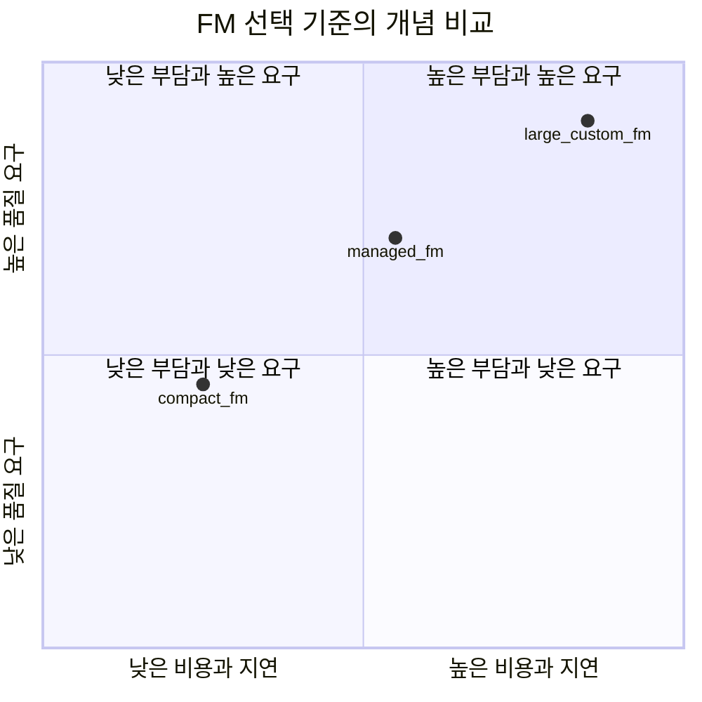

  

# AIF-C01 Task 3.1 Part 1 - FM 애플리케이션 설계 고려 사항 / 모델 선택 기준

> FM 사용 애플리케이션 설계 고려 사항 이해, 4개 강의 중 1번째

## 1. Task 3.1 핵심 - 선택 기준

**선택 기준 식별:**

- **비용 (Cost)**
- **모달리티 (Modality)**
- **지연 시간 (Latency)**
- **다국어 (Multilingual)**
- **모델 크기 (Model Size)**
- **모델 복잡성 (Model Complexity)**
- **사용자 지정 (Customization)**
- **입력 및 출력 길이 (Input/Output Length)**

## 2. 사전 훈련 모델 고려 사항 복습 - 영역 2

- 사전 훈련 모델은 규모 큼, 교육/추론 위해 많은 컴퓨팅 리소스 필요
- 컴퓨팅 기능 제한된 개인/조직에 문제 될 수 있음
- 요구 사항에 맞춰야 하는 고려 사항 설명했음, 이번 태스크에서는 **비용/지연 시간 제약/필수 모달리티** 중점

## 3. 비용 고려 사항 (Cost)

- 모델 훈련 기간/비용 중요 고려 사항, 하드웨어 스토리지 등 많은 비용

**질문:** 정확성 98%이지만 훈련 비용 수십만 달러 모델 vs 정확성 97%이지만 비용 몇 천 달러 모델 중 선택?

- **답은 요구 사항 따라 달라짐**
- 교육 시간/비용/모델 성능 간 **균형 찾아야 함**
- 목표: 효율적이면서 모델 성능 저하시키지 않는 **확장 가능한 솔루션 설계**
- 모델 빌드/유지 보수 비용 = 프로젝트 성공 중요 고려 사항
- 모델 복잡해질수록 모델 수명 주기 전체 미치는 영향 커짐

## 4. 지연 시간 제약 / 추론 속도 / 실시간 요구 사항 (Latency)

- AI 애플리케이션에서 데이터 처리/실시간 결과 제공 필요 경우 모델 선택 시 고려해야 하는 또 다른 사항
- 일부 복잡 모델 추론 시간 더 길어 지연 시간 요구 사항 충족 안될 수 있음
- **추론 속도** = 모델에서 데이터 처리/예측 생성 걸리는 시간, 또 다른 고려 사항

**질문:** 즉각 결정 필요한 자율 주행 자동차 시스템 있고 추론 시간 느린 모델에서는 요구 사항 충족 못한다고 가정, 어떤 모델 선택?

- 예시: 추론 단계에서 대부분 계산 작업 수행하는 **k-최근접 이웃(KNN) 모델** 사용 가능, 그러나 예측 생성 더 느릴 수 있음
- 자율 주행 자동차 시스템은 매우 **고차원적 문제**, KNN 모델 최선 선택 아님
- 따라서 AI 모델 결정 시 **추론 속도 측면 사용 사례 요구 사항 이해 중요**

## 5. 모달리티 (Modality)

- 염두에 둘 고려 사항:
  - 대부분 AI 시스템에서는 **모달리티마다 구체적 임베딩** 있음
  - **앙상블 방법** = 여러 모델 결합해 단일 모델보다 더욱 우수한 성능 제공
- 또 다른 고려 사항 = 관련 언어 대해 학습한 **다국어 모델 선택** 필요

## 6. 아키텍처와 복잡성

- 아키텍처마다 서로 다른 강점/약점, 다양한 유형 태스크 더 적합할 수 있음 설명
  - 예) 영상 인식 위해 **CNN (합성곱 신경망)** 선택, 자연어 처리 위해 **RNN (순환 신경망)** 선택
- 모델 복잡성 = **파라미터/계층/작업 수**로 측정 가능
- 모든 요소는 **속도/메모리/정확성** 영향, 모델 복잡해질수록 정확성 높지만 계산 리소스/데이터 더 많이 필요

### 성능/지표 - 아키텍처/복잡성 하위 집합

- 원본 데이터세트/새 데이터세트에서 사전 학습 모델 성능/지표
- 표준 지표 사용해 다양한 모델 평가/비교 가능

**지표 예시:**
- 정확성 (Accuracy)
- 정밀도 (Precision)
- 재현율 (Recall)
- F1 점수
- 평균 제곱 오차 **RMSE**
- 평균 정밀도 평균 **MAP (Mean Average Precision)**
- 평균 절대 오차 **MAE**

- 그러나 지표 간 **장단점 고려**해 태스크 가장 관련성 높은 지표 선택 필요
  - 예) 물체 감지 수행 시 **MAP**는 모델이 이미지에서 여러 객체 얼마나 잘 찾고 분류하는지 측정하므로 정확성보다 MAP에 더 신경 쓸 수 있음
  - **균등 분포 안되거나 불균형 데이터세트에서는 정확성 권장 안됨**
- 정확성은 모델 선택 전 모델 성능 평가 위해 적절한 지표/지표 세트 선택 시 중요

## 7. 시험 체크포인트

- 선택 기준 비용 모달리티 지연 시간 다국어 모델 크기 모델 복잡성 사용자 지정 입력 출력 길이
- 사전 훈련 모델 규모 큼 교육 추론 많은 컴퓨팅 리소스 컴퓨팅 제한 개인 조직 문제 요구 사항 맞춰야 고려 사항
- 비용 훈련 기간 비용 중요 하드웨어 스토리지 비용/98% 수십만 달러 vs 97% 몇 천 달러 요구 사항 따라 답 달라 교육 시간 비용 성능 균형 효율적이면서 성능 저하 안하는 확장 가능한 솔루션 빌드 유지 보수 비용 프로젝트 성공 중요 복잡해질수록 수명 주기 영향 커짐
- 지연 시간 추론 속도 실시간 요구 데이터 처리 실시간 결과 제공 고려 복잡 모델 추론 시간 길어 지연 요구 충족 안될 수 추론 속도 데이터 처리 예측 생성 시간/자율 주행 즉각 결정 추론 느린 모델 요구 충족 못함 KNN 추론 단계 대부분 계산 더 느릴 수 고차원 문제 KNN 최선 아님 추론 속도 사용 사례 요구 이해 중요
- 모달리티 모달리티마다 구체적 임베딩 앙상블 여러 모델 결합 단일보다 우수한 성능 다국어 관련 언어 학습 다국어 모델 선택
- 아키텍처 복잡성 아키텍처 강점 약점 태스크 적합 CNN 영상 인식 RNN 자연어 처리 복잡성 파라미터 계층 작업 수 속도 메모리 정확성 영향 복잡↑ 정확↑ 계산 리소스 데이터 많이 필요/성능 지표 원본 새 데이터세트 성능 지표 표준 지표 평가 비교 정확성 정밀도 재현율 F1 RMSE MAP MAE 장단점 고려 태스크 관련성 높은 지표 선택 물체 감지 MAP 여러 객체 찾기 분류 정확성보다 MAP 불균형 데이터세트 정확성 권장 안됨 적절한 지표 세트 선택 중요

## 학습 문서 메타데이터

- 도메인: D3 — 파운데이션 모델의 적용
- 원본 보존 링크: [AIF-C01-Task3-1-Part1.md](../../../docs/Refs/AIF-C01-Task3-1-Part1.md)
- 이 문서는 원본 본문을 보존한 복사본이며, 이 섹션·도식·네비게이션은 학습용으로 추가했습니다.

이 사분면 차트는 FM 선택에서 품질 요구와 비용·지연 시간의 두 축 절충을 개념적으로 비교합니다. 점의 위치는 문서에 없는 실제 측정값이 아닌 판단 기준을 설명하는 예시입니다.

---

[이전](../task-3/intro.md) | [인덱스](README.md) | [다음](part-2.md)
