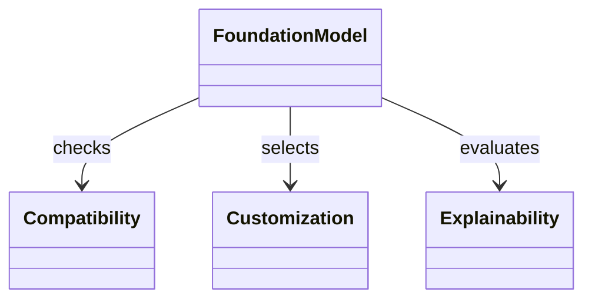

  

# AIF-C01 Task 3.1 Part 2 - 편향/가용성·호환성/사용자 지정/해석·설명 가능성

> FM 애플리케이션 설계 고려 사항 계속, 4개 강의 중 2번째

## 1. 교육 데이터 편향 (Bias)

- 또 다른 고려 사항 = 교육 데이터에 있을 수 있는 **편향**
- **위험 완화 + 윤리적 문제 해결 + 모델 선택/미세 조정 정보 기반 결정** 방법 이해 중요

## 2. 사전 훈련 모델 가용성과 호환성

- 온라인에서 다수 사전 훈련 모델 찾을 수 있음: **TensorFlow Hub, PyTorch Hub, Hugging Face** 또는 기타 리포지토리
- 하지만 확인 필요:

### 호환성 체크리스트

- 프레임워크/언어/환경과 **호환**되는지
- **라이선스/문서** 있는지
- 모델이 **정기적 업데이트/유지 보수** 되는지
- 알려진 **문제/제한 사항** 있는지

## 3. 사용자 지정과 설명 가능성 (Customization & Explainability)

- 사전 훈련 모델을 태스크 적합하도록 **수정/확장**하려 할 수 있음: 새 계층/클래스/기능 추가 등
- 사전 학습 모델 작동 방식 + 예측/의사 결정 방식 이해하려 할 수 있음
- 이러한 목적 위해 **유연하고 투명하고 모듈식이며 내부 작업 시각화/해석 가능 도구/방법 제공 모델** 찾아야 함

### 해석 vs 설명 - 핵심 구분 (시험 빈출)

| 개념 | 정의 | FM 해당 여부 |
| :--- | :--- | :--- |
| **투명성 = 해석 가능성 (Interpretability)** | 모델에서 특정 예측 하는 이유를 **계수/공식 통해 수학적 설명** 가능 | 모델 충분히 단순하면 가능, **파운데이션 모델 매우 복잡 설계상 해석 불가**, 투명성 반대 개념 **블랙 박스**라고도 함 |
| **설명 가능성 (Explainability)** | 해석 가능한 더 간단한 모델 사용해 **로컬에서 근사화해 블랙 박스 설명** 시도 | 해석 가능성과 다름, 사전 훈련 모델 설계상 투명할 수 없음 |

### 해석 가능성 필요한 경우 FM은 최선 아님

- 예) **선형 회귀/의사결정 트리** 같은 특정 모델이 설명 가능성 면에서 더욱 우수할 수 있음

## 4. 모델 복잡성 트레이드오프

- 모델 복잡성 중요, 데이터 내 복잡 패턴 밝히는 데 도움 가능하지만 **유지 보수/해석 가능성 문제 더할 수 있음**

### 주요 고려 사항

- 복잡성↑ -> 성능 향상 가능 but 비용 증가
- 모델 복잡할수록 모델 출력 설명하기 더 어려움
- 추가 고려 사항: **하드웨어 제약 조건, 유지 보수 업데이트, 데이터 개인 정보 보호, 전이 학습** 등

## 5. 시험 체크포인트

- 편향 교육 데이터 있을 수 있는 편향 위험 완화 윤리적 문제 해결 모델 선택 미세 조정 정보 기반 결정 이해 중요
- 가용성 호환성 온라인 다수 사전 훈련 모델 TensorFlow Hub PyTorch Hub Hugging Face 리포지토리 프레임워크 언어 환경 호환 라이선스 문서 정기 업데이트 유지 보수 알려진 문제 제한 사항 확인
- 사용자 지정 설명 가능성 새 계층 클래스 기능 추가 수정 확장 작동 방식 예측 의사 결정 이해 유연 투명 모듈식 내부 작업 시각화 해석 도구 방법 제공 모델 찾아야 결과 해석 설명 능력 중요 투명=해석 가능성 계수 공식 수학적 설명 모델 충분히 단순하면 가능 FM 매우 복잡 설계상 해석 불가 투명 반대 블랙 박스 설명 가능성 더 간단 모델 로컬 근사 블랙 박스 설명 해석 가능성과 다름 사전 훈련 모델 설계상 투명 불가 해석 가능성 필요 시 사전 훈련 FM 최선 아님 선형 회귀 의사결정 트리 설명 가능성 더욱 우수
- 복잡성 복잡 패턴 도움 유지 보수 해석 가능성 문제 복잡↑ 성능↑ 비용↑ 복잡↑ 출력 설명 어려움 하드웨어 제약 유지 보수 업데이트 데이터 개인 정보 보호 전이 학습 등 고려

## 학습 문서 메타데이터

- 도메인: D3 — 파운데이션 모델의 적용
- 원본 보존 링크: [AIF-C01-Task3-1-Part2.md](../../../docs/Refs/AIF-C01-Task3-1-Part2.md)
- 이 문서는 원본 본문을 보존한 복사본이며, 이 섹션·도식·네비게이션은 학습용으로 추가했습니다.

이 클래스 다이어그램은 FM 선택에서 데이터·호환성·설명 가능성·사용자 지정이라는 정적 고려 요소의 관계를 보여 줍니다. Mermaid가 렌더링되지 않아도 복잡한 FM과 단순 모델의 역할 차이를 읽을 수 있습니다.

## 초보자 학습 보조

### 한 줄 요약과 선수 지식

- **한 줄 요약:** FM을 고를 때는 성능뿐 아니라 훈련 데이터 편향, 사용 환경 호환성, 라이선스, 유지 보수, 설명 요구를 확인합니다.
- **선수 지식:** 편향은 데이터나 판단이 특정 집단에 불공정하게 기울 수 있는 문제이며, 해석 가능성은 모델 결과의 이유를 이해할 수 있는 정도입니다.

### 자주 하는 오해

- **오해:** 설명이 필요하면 복잡한 FM의 내부 계산을 모두 설명할 수 있다.
  **바로잡기:** 복잡한 FM은 블랙박스 성격이 강할 수 있습니다. 엄격한 설명 가능성이 핵심이면 단순한 모델이나 별도 설명 기법을 검토합니다.

### 스스로 답하는 확인 질문

1. 외부 모델을 도입하기 전에 호환성·라이선스·유지 보수를 확인해야 하는 이유는 무엇인가요?
2. 높은 성능의 복잡한 FM 대신 단순 모델을 선택할 수 있는 업무 조건은 무엇인가요?

### 공식 범위와 출처

- 공식 Task 3.1의 모델 선택·사용자 지정 관련 설계 고려 사항을 보완합니다.
- [AWS Certified AI Practitioner(AIF-C01) — 콘텐츠 도메인 3](https://docs.aws.amazon.com/ko_kr/aws-certification/latest/ai-practitioner-01/ai-practitioner-01-domain3.html) — 확인일: 2026-09-09

---

[이전](part-1.md) | [인덱스](README.md) | [다음](part-3.md)
