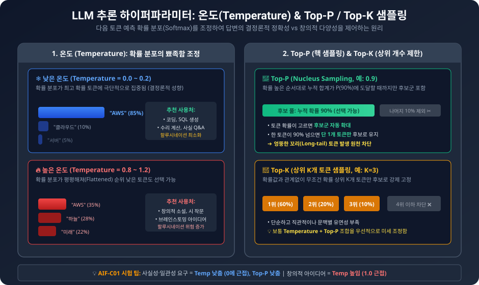
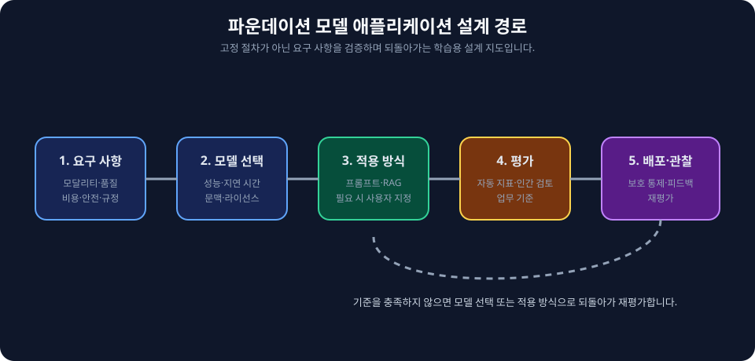
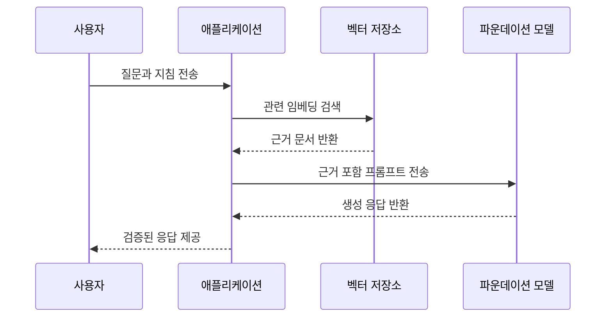

<!-- metadata-badges -->

# AIF-C01 Task 3.1 Part 3 - 추론 파라미터/프롬프트/RAG/벡터 DB

> 무작위성/다양성/길이 등 추론 파라미터가 응답 미치는 영향, 4개 강의 중 3번째

## 1. 추론 정의

- **추론 = 모델 통해 새 데이터 처리해 예측 수행, 모델에 제공 입력에서 출력 생성 프로세스**
- Amazon Bedrock은 선택 FM에서 추론 실행 기능 제공
- **질문:** 추론 실행 시 어떤 입력 제공? **입력인 프롬프트**가 모델에 제공되어 응답 생성
- **추론 파라미터 = 모델 응답 제한/영향 미치도록 조정 가능한 값 집합**
- 기본 모델/사용자 지정 모델/프로비저닝 모델 사용해 추론 실행해 다양한 프롬프트/추론 파라미터로 FM 응답 테스트 가능
- 충분히 살펴본 후 API 호출해 애플리케이션에서 모델 추론 실행 설정 가능

## 2. Amazon Bedrock 추론 파라미터

### 무작위성/다양성 제어

- **온도 (Temperature)**
- **상위 K (Top K)**
- **상위 P (Top P)**

### 응답 길이 제한

- **응답 길이**
- **페널티**
- **중지 시퀀스 (Stop Sequence)**

### 운영 모범 사례

- 다양한 파라미터 설정 고려/실험해 **다양성/일관성/리소스 효율성 간 최적 균형** 찾기 중요
- 프로덕션 환경에서 파라미터 **지속적 모니터링/조정**해 최적 성능 유지/변화 요구 사항 맞춤
- 추가 리소스: 추론 파라미터 플래시카드/링크

## 3. 프롬프트 엔지니어링 기본 (다음 강의 자세히)

- **AWS 정의:** 프롬프트 = 사용자 제공 특정 입력 세트, LLM에서 지정 태스크/명령 적절한 응답/출력 생성하도록 안내
- 내부 데이터베이스 컨텍스트 데이터 추가해 프롬프트 강화 가능
- 데이터 저장소/벡터 데이터 저장소 추가 도메인별 데이터 통합해 프롬프트 의미상 관련 입력 추가 가능
- 이 방법 = **검색 증강 생성(RAG)** - 몇 분 후 설명
- 가장 적합 AI 모델은 요구 사항/리소스/제약 조건 따라 달라짐, 프로젝트 목표/요구 사항 충족 올바른 균형 찾는 게 관건
- 실험 경우 사전 훈련/미세 조정/컨텍스트 내 학습/RAG 같은 FM 사용자 지정 다양한 방법 **비용 절충점** 이해 필요

## 4. 벡터 데이터베이스 vs 기계 학습 모델

**질문:** 벡터 데이터베이스와 ML 모델 차이점은?

| 구분 | 설명 |
| :--- | :--- |
| **벡터 DB** | 수학적 표현 저장 데이터 모음, Excel 스프레드시트처럼 다룸, 벡터 임베딩 포함 텍스트/이미지 같은 구조화/비구조화 데이터 저장 |
| **벡터 임베딩** | 단어/문장/기타 데이터 숫자 변환 방법, 의미/관계 나타내는 해당 데이터 수치 표현 |
| **관계** | 벡터 DB는 일반적으로 텍스트 데이터인 입력 데이터 처리 + 일반적으로 임베딩 모델인 ML 모델 사용해 밀도 높은 벡터로 채워짐, **ML 모델은 벡터 DB/인덱싱 기술 자체 만들기 전제 조건** |

### 벡터 DB 역할

- **FM 기반 애플리케이션 사실적 참조**, 모델에서 신뢰 데이터 검색 도움
- FM은 벡터 DB를 **외부 데이터 소스**로 사용해 검색 권장 사항/텍스트 생성 사용 사례 개선해 기능 강화
- 벡터 DB는 효율적/빠른 조회 기능 추가 + **데이터 관리/내결함성/인증/액세스 제어/쿼리 엔진** 제공
- 예) **Amazon Bedrock 지식 기반** = 데이터 소스 정보 리포지토리 수집 기능 제공, RAG 활용 애플리케이션 빌드 가능
- **RAG = 생성 프로세스 중 외부 지식 검색/사용할 수 있도록 언어 모델 개선, 데이터 소스 정보 검색 통해 모델 응답 생성 향상 기법**

## 5. 시험 체크포인트

- 추론 모델 통해 새 데이터 처리 예측 수행 입력에서 출력 생성 프로세스 Bedrock 선택 FM 추론 실행/입력 프롬프트 응답 생성/추론 파라미터 모델 응답 제한 영향 조정 값 집합 기본 사용자 지정 프로비저닝 모델 추론 실행 다양한 프롬프트 파라미터 FM 응답 테스트 API 호출 애플리케이션 모델 추론 실행 설정
- Bedrock 추론 파라미터 온도 상위 K 상위 P 무작위성 다양성 제어 응답 길이 페널티 중지 시퀀스 응답 길이 제한 다양성 일관성 리소스 효율성 최적 균형 실험 프로덕션 지속 모니터링 조정 최적 성능 변화 요구 맞춤 플래시카드
- 프롬프트 사용자 제공 특정 입력 세트 LLM 지정 태스크 명령 적절한 응답 출력 안내 내부 DB 컨텍스트 데이터 추가 프롬프트 강화 데이터 저장소 벡터 저장소 추가 도메인별 데이터 통합 의미상 관련 입력 추가 방법 RAG/가장 적합 모델 요구 사항 리소스 제약 올바른 균형 실험 사전 훈련 미세 조정 컨텍스트 내 학습 RAG FM 사용자 지정 비용 절충 이해
- 벡터 DB 수학적 표현 저장 데이터 모음 Excel 스프레드시트 벡터 임베딩 포함 텍스트 이미지 구조화 비구조화 저장 임베딩 단어 문장 데이터 숫자 변환 의미 관계 수치 표현 벡터 DB 입력 데이터 처리 임베딩 모델 ML 모델 밀도 높은 벡터 채워짐 ML 모델 벡터 DB 인덱싱 기술 만들기 전제 조건/FM 기반 앱 사실적 참조 신뢰 데이터 검색 도움 외부 데이터 소스 검색 권장 텍스트 생성 개선 효율 빠른 조회 데이터 관리 내결함성 인증 액세스 제어 쿼리 엔진/Bedrock 지식 기반 데이터 소스 정보 리포지토리 수집 RAG 활용 앱 빌드 RAG 생성 중 외부 지식 검색 사용 언어 모델 개선 데이터 소스 정보 검색 모델 응답 생성 향상 기법

## 시각 학습 보조

이 그림은 세 파라미터가 후보 토큰 선택을 다르게 조절한다는 원리를 비교합니다. 파라미터의 유효 범위·기본값·상호 작용은 모델마다 다르며, 특정 설정만으로 사실성이나 안전성이 보장되지는 않습니다.

이 그림은 프롬프트, 검색 증강 생성(RAG), 모델 맞춤화 중 어떤 접근을 검토할지 연결합니다. 정답은 요구 정확도, 데이터 접근 권한, 운영 제약과 평가 결과에 따라 달라집니다.

## 학습 문서 메타데이터

- 도메인: D3 — 파운데이션 모델의 적용
- 원본 보존 링크: [AIF-C01-Task3-1-Part3.md](../../../docs/Refs/AIF-C01-Task3-1-Part3.md)
- 이 문서는 원본 본문을 보존한 복사본이며, 이 섹션·도식·네비게이션은 학습용으로 추가했습니다.

이 시퀀스 다이어그램은 사용자 질문이 검색·프롬프트 구성·FM 생성·사실성 검증을 거쳐 응답으로 돌아오는 시간 순서의 RAG 상호작용을 보여 줍니다. Mermaid가 렌더링되지 않아도 검색 증강의 순서를 이해할 수 있습니다.

---

[이전](part-2.md) | [인덱스](README.md) | [다음](part-4.md)
