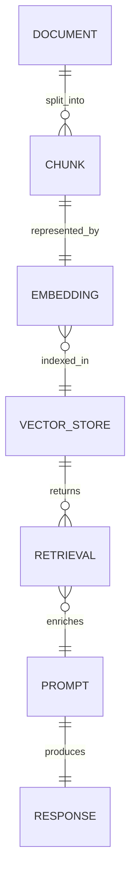

<!-- metadata-badges -->

# AIF-C01 Task 3.1 Part 4 - RAG 2요소/벡터 DB 활용/임베딩 저장 AWS 서비스/에이전트 (3.1 마무리)

> RAG 지식 기반 검색, 4개 강의 중 4번째

## 1. RAG 구성 요소 2가지

- **검색기 (Retriever):** 지식 기반 검색
- **생성기 (Generator):** 검색된 정보 기반 출력 생성
- 조합 통해 모델은 **교육 데이터 이외 최신 지식/도메인별 지식 액세스** 가능

## 2. 벡터 데이터베이스 실세계 사용 예 - 흐름

1. 모델 쿼리하려는 경우 **프롬프트가 쿼리 인코더로 전달**
2. 쿼리 인코더는 데이터를 외부 데이터와 같은 형식으로 **인코딩/포함**
3. 임베딩을 **벡터 DB로 전달**해 모델 통해 생성된 유사 임베딩 검색/반환
4. 해당 임베딩이 **새 쿼리에 연결**되고 원래 위치로 다시 매핑될 수도 있음
5. 벡터 DB에서 유사 데이터 찾으면 **검색기에서 해당 데이터 검색**, LLM은 새 데이터/텍스트를 **원래 프롬프트와 결합/보강**
6. 완성물 반환되도록 프롬프트가 LLM에 전송

### RAG가 할루시네이션 해결

- 생성형 LLM 할루시네이션 취약: 믿을 수 있지만 실제로 잘못된 응답 생성 상황
- **RAG 해결:** 벡터로 코딩된 지식 문서로 하이드레이트된 벡터 DB 통해 빌드된 외부 지식 기반으로 생성형 LLM 보완
- Amazon Bedrock은 사용자 지정 지식 기반 통합 RAG 모델 제공
- RAG 애플리케이션 영역: **질문과 답변/언어 시스템/외부 지식 사용 콘텐츠 생성** 등, 정확하고 상황에 맞는 응답 제공

## 3. 벡터 DB 내 임베딩 저장 도움 AWS 서비스 (시험 암기)

- **Amazon OpenSearch Service**
- **Amazon Aurora**
- **Redis**
- **Amazon Neptune**
- **MongoDB 호환 Amazon DocumentDB**
- **PostgreSQL 포함 Amazon RDS**

### Amazon OpenSearch Service 상세

- OpenSearch 검색 엔진 = **지연 시간 짧은 검색/집계 + OpenSearch 대시보드 + 시각화/대시보드 도구** 제공
- 플러그인: 알림/세분화된 액세스 제어/관찰 가능성/보안 모니터링/**벡터 저장/처리** 등 고급 기능 제공
- 벡터 DB 기능 사용 시 구현 가능:
  - **시맨틱 검색:** 검색 문서에 언어 기반 임베딩 사용 검색 결과 개선
  - **증강 생성 검색**
  - **LLM 사용 RAG**
  - **추천 엔진**
  - **검색 미디어**
- ML과 검색 관련성 높이기 워크숍 예제 링크 추가: **BERT (Bidirectional Encoder Representations from Transformers)** 기반 키워드 검색 vs 시맨틱 검색 차이, 벡터 생성/OpenSearch 저장하도록 **SageMaker 호스팅**

### Amazon OpenSearch Serverless - 벡터 엔진

- 벡터 스토리지/검색 기능 제공
- 벡터 DB 인프라 관리 필요 없이 **ML/증강 검색 경험/생성형 AI 애플리케이션 빌드** 가능
- **Bedrock용 지식 기반에서 제공 완전관리형 RAG** 사용 시 FM을 안전하게 회사 데이터 연결 가능
- 벡터 엔진에 임베딩 저장되므로 FM 지속 재훈련 없이도 관련성 높고 정확한 문맥별 응답 획득 가능

### Amazon RDS for PostgreSQL - pgvector

- 임베딩 저장/효율적 검색 수행하도록 **pgvector 확장** 지원
- 고급 벡터 추가 옵션 링크 추가

## 4. 모델 크기 복습 - 영역 2 / 2.1

- 일반적으로 아키텍처 모델 클수록 태스크 더 잘 수행
- 연구원들: 추가 컨텍스트 내 학습/추가 교육 없이도 모델 필요하므로 모델 클수록 작동 가능성 높음 발견

## 5. 다단계 태스크에서 에이전트 역할

### 왜 FM만으로 실제 태스크 완료 불가?

- FM은 사전 훈련 지식 기반 쿼리 이해/응답 가능
- 그러나 **항공편 예약/구매 주문 처리** 같은 실제 태스크 완료 불가
- 이유: 이러한 태스크에는 일반적으로 사용자 지정 프로그래밍 필요 조직별 데이터/워크플로 필요

### Amazon Bedrock용 에이전트 - 완전관리형 AI 기능

- 애플리케이션 FM 빌드 도움
- 에이전트는:
  - 태스크 **자동 분류**
  - 필요한 **오케스트레이션 로직 생성/사용자 지정 코드 작성**
  - **API 통해 안전하게 DB 연결**
  - 머신 사용 위해 데이터 **수집/구조화**
  - 상황에 맞는 세부 정보로 데이터 **보강해 더 정확한 응답 생성/요청 수행**

### 에이전트 정의

- **프롬프트 완료 워크플로 + 사용자 요청/파운데이션 모델/외부 데이터 소스/애플리케이션 간 상호 작용 조정 추가 소프트웨어**
- 자동 **API 호출해 작업 수행**, 지식 기반 간접 호출해 작업 필요 정보 보완
- 예) 고객 다음 **스쿠버 다이빙 휴가 예약 처리 도움 에이전트** 만들기 가능

## 6. 시험 체크포인트

- RAG 2요소 검색기 지식 기반 검색 생성기 검색 정보 기반 출력 생성 조합 교육 데이터 이외 최신 지식 도메인별 지식 액세스
- 벡터 DB 사용 예 프롬프트 쿼리 인코더 전달 외부 데이터 같은 형식 인코딩 포함 임베딩 벡터 DB 전달 모델 생성 유사 임베딩 검색 반환 임베딩 새 쿼리 연결 원래 위치 매핑 유사 데이터 찾으면 검색기 검색 LLM 새 데이터 텍스트 원래 프롬프트 결합 보강 완성물 반환 프롬프트 LLM 전송/할루시네이션 믿을 수 있지만 잘못된 응답 RAG 벡터 코딩 지식 문서 하이드레이트 벡터 DB 외부 지식 기반 LLM 보완 Bedrock 사용자 지정 지식 기반 통합 RAG 모델 Q&A 언어 시스템 외부 지식 콘텐츠 생성 정확 상황 맞는 응답
- 임베딩 저장 AWS 서비스 OpenSearch Service Aurora Redis Neptune MongoDB 호환 DocumentDB PostgreSQL 포함 RDS/OpenSearch 지연 짧은 검색 집계 대시보드 시각화 도구 플러그인 알림 세분화 액세스 제어 관찰 가능성 보안 모니터링 벡터 저장 처리 시맨틱 검색 언어 기반 임베딩 검색 결과 개선 증강 생성 검색 LLM RAG 추천 엔진 검색 미디어 BERT 키워드 vs 시맨틱 차이 벡터 생성 OpenSearch 저장 SageMaker 호스팅/OpenSearch Serverless 벡터 엔진 벡터 스토리지 검색 인프라 관리 없이 ML 증강 검색 경험 생성형 AI 빌드 Bedrock 지식 기반 완전관리형 RAG FM 안전 회사 데이터 연결 벡터 엔진 임베딩 저장 지속 재훈련 없이 관련 정확 문맥 응답/RDS PostgreSQL pgvector 확장 임베딩 저장 효율 검색
- 모델 크기 클수록 태스크 잘 수행 추가 컨텍스트 내 학습 추가 교육 없이 작동 가능성 높음
- 다단계 태스크 에이전트 역할 FM 사전 훈련 지식 쿼리 이해 응답 가능 항공편 예약 구매 주문 처리 실제 태스크 완료 불가 사용자 지정 프로그래밍 조직별 데이터 워크플로 필요/Bedrock용 에이전트 완전관리형 AI FM 빌드 도움 태스크 자동 분류 오케스트레이션 로직 생성 사용자 지정 코드 작성 API 안전 DB 연결 데이터 수집 구조화 세부 정보 보강 정확한 응답 요청 수행/에이전트 프롬프트 완료 워크플로 사용자 요청 FM 외부 데이터 소스 애플리케이션 상호 작용 조정 추가 소프트웨어 자동 API 호출 작업 수행 지식 기반 간접 호출 정보 보완 스쿠버 다이빙 휴가 예약 처리 도움 에이전트

## 학습 문서 메타데이터

- 도메인: D3 — 파운데이션 모델의 적용
- 원본 보존 링크: [AIF-C01-Task3-1-Part4.md](../../../docs/Refs/AIF-C01-Task3-1-Part4.md)
- 이 문서는 원본 본문을 보존한 복사본이며, 이 섹션·도식·네비게이션은 학습용으로 추가했습니다.

이 ER 다이어그램은 문서가 청크·임베딩·벡터 저장소를 거쳐 검색 근거와 생성 응답으로 연결되는 데이터 관계를 보여 줍니다. Mermaid가 렌더링되지 않아도 RAG 데이터 계보와 관계를 읽을 수 있습니다.

---

[이전](part-3.md) | [인덱스](README.md) | [다음](../task-3-2/part-1.md)
