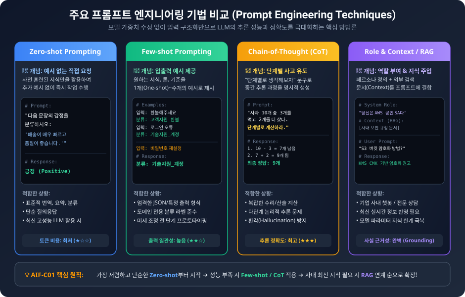
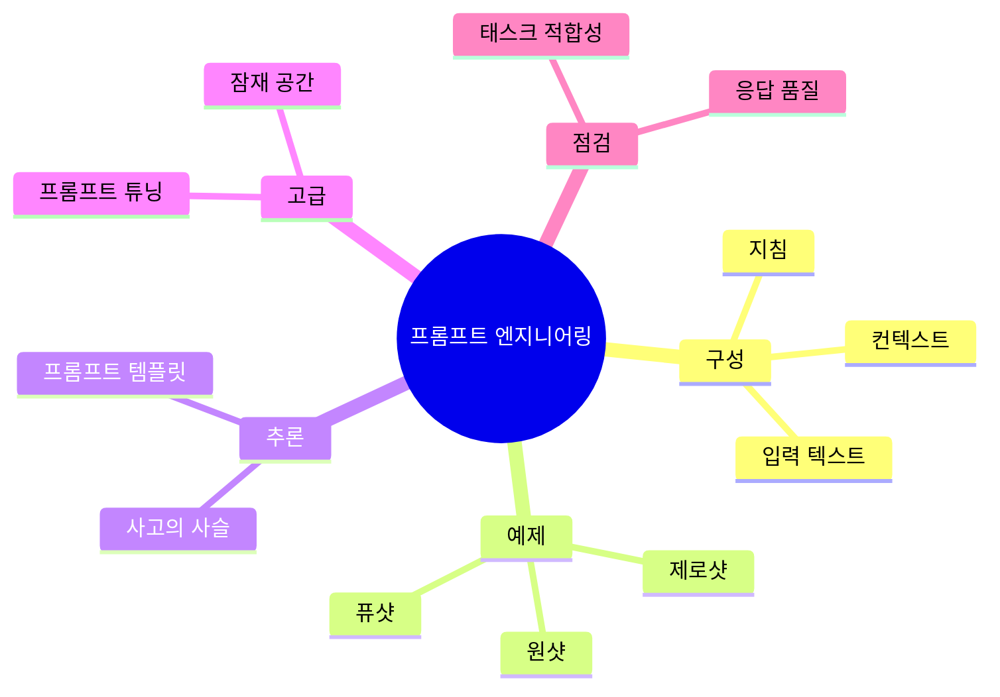

<!-- metadata-badges -->

# AIF-C01 Task 3.2 Part 1 - 프롬프트 엔지니어링 기법 선택 / 개념/구조

> 효과적인 프롬프트 엔지니어링 기법 선택, 2개 강의 중 1번째

## 1. 프롬프트란?

- **정의:** 사용자 제공 특정 입력 집합, LLM에서 제공 태스크/지침 적절한 응답/출력 생성하도록 안내
- **구성 요소:**
  - LLM에서 수행하도록 하려는 **태스크/지침**
  - 태스크/지침의 **컨텍스트**
  - 응답/출력 필요한 **입력 텍스트**
- 사용 사례/데이터 가용성/태스크 따라 프롬프트는 구성 요소 중 하나 이상 결합 필요

## 2. 프롬프팅 기법 기초

### 퓨샷 프롬프팅 (Few-shot Prompting)

- LLM 모델에서 **성능 높이고 기대에 맞게 출력 보정** 도움되는 몇 가지 예제 제공하는 경우

### 제로샷 프롬프팅 (Zero-shot Prompting)

- 프롬프트 제공 예제 없는 감정 분류 프롬프트 등

### 프롬프트 템플릿

- 다양한 사용 사례 대한 **지침/몇 가지 예제/특정 콘텐츠/질문** 포함 가능

### 사고의 사슬 프롬프트 (Chain-of-Thought, CoT)

- 더 복잡 태스크 있는 경우 **추론 프로세스 중간 단계로 나눔**
- 최종 출력 품질/일관성 향상 가능

### 프롬프트 튜닝 (Prompt Tuning) - 고급 기법

- 실제 프롬프트 텍스트를 **훈련 중 최적화된 연속 임베딩 벡터로 대체**
- 프롬프트를 특정 태스크 맞게 **미세 조정 가능**
- 동시에 나머지 모델 파라미터 고정 있어 **전체 미세 조정보다 더 효율적**

## 3. 프롬프트 엔지니어링 정의 - AWS 관점

- LLM과 **대화/소통하는 방식**
- AWS 정의: **입력 프롬프트 만들고 최적화하는 사례**
- 다양한 애플리케이션에서 LLM 효과적 사용 위해 **적절한 단어/문구/문장/문장 부호/구분 기호 선택**
- LLM 모델 제공 프롬프트 품질은 **응답 품질 영향**
- 시험 위해 필요한 모든 정보/도구와 함께 제공 지침 이해 필요
- 도구: Amazon Bedrock에서 LLM 사용할 때 **사용 사례 가장 적합 프롬프트 형식 찾는 데 도움**

### 사용 사례에 따른 전략

- 사용 사례 프롬프트 엔지니어링 전략은 **태스크/데이터 따라 달라짐**

**Bedrock에서 LLM 통해 지원 일반 태스크:**
- 분류
- 컨텍스트 유무 질문과 답변
- 요약
- 개방형 텍스트 생성
- 코드 생성
- 수학
- 추론/논리적 사고

## 4. 모델 잠재 공간 (Latent Space)

- 사용할 수 있는 다양한 프롬프트 전략 많이 있음
- **잠재 공간 = LLM에서 인코딩된 언어 지식**
- 관계 캡처, 프롬프트 표시되면 해당 패턴에서 언어 재구성 저장된 데이터 패턴

**예시: 스쿠버 휴가 모델 구축**

- AI가 고객 다양한 스쿠버 휴가 추천하도록 모델 구축 가정
- 스쿠버 다이빙 휴가/특정 다이빙 데이터 입력해 스쿠버 다이빙 목적지 데이터베이스 획득 가능
- 모델은 **목적지/다이빙 깊이/가시성/평균 수온/평균 날씨/기온** 등에서 훈련될 수 있음, 이를 통해 스쿠버 휴가 데이터베이스 획득
- 누군가 매너티와 함께 스노클링 하고 싶다 메시지 입력하면 모델에서 통계 카탈로그 참조 가능
- 여기서 권장 사항 쿼리 가능
- 이 통계 데이터베이스 = **잠재 공간**, 모델에서 새 출력 생성 사용 가능한 패턴 이해이며 통계 데이터베이스

## 5. 시험 체크포인트

- 프롬프트 사용자 제공 특정 입력 집합 LLM 제공 태스크 지침 적절한 응답 출력 생성 안내 구성 요소 태스크 지침 컨텍스트 입력 텍스트 사용 사례 데이터 가용성 태스크 따라 하나 이상 결합
- 퓨샷 성능 높이고 기대 맞게 출력 보정 도움 몇 가지 예제 제공 제로샷 예제 없는 감정 분류 프롬프트 템플릿 지침 예제 특정 콘텐츠 질문 포함 CoT 복잡 태스크 추론 프로세스 중간 단계 나눔 최종 출력 품질 일관성 향상 프롬프트 튜닝 고급 실제 프롬프트 텍스트 훈련 중 최적화 연속 임베딩 벡터 대체 특정 태스크 미세 조정 나머지 파라미터 고정 전체 미세 조정보다 효율적
- 프롬프트 엔지니어링 LLM 대화 소통 방식 AWS 정의 입력 프롬프트 만들고 최적화 사례 다양한 앱 LLM 효과적 사용 적절한 단어 문구 문장 문장 부호 구분 기호 선택 프롬프트 품질 응답 품질 영향 시험 필요한 정보 도구 지침 이해 Bedrock 사용 사례 가장 적합 형식 찾는 도움 전략 태스크 데이터 따라 달라 분류 컨텍스트 유무 Q&A 요약 개방형 텍스트 생성 코드 생성 수학 추론 논리적 사고
- 잠재 공간 LLM 인코딩 언어 지식 관계 캡처 프롬프트 표시 해당 패턴 언어 재구성 저장 데이터 패턴 스쿠버 휴가 모델 목적지 깊이 가시성 수온 날씨 기온 훈련 스쿠버 휴가 DB 매너티 스노클링 메시지 통계 카탈로그 참조 권장 쿼리 통계 DB 잠재 공간 새 출력 생성 사용 가능 패턴 이해 통계 DB

## 시각 학습 보조

이 그림은 프롬프트를 개선할 때 사용할 수 있는 기법을 정리합니다. 한 기법이 모든 모델과 과제에서 최선인 것은 아니므로, 대표 입력으로 결과를 평가하며 선택합니다.

## 학습 문서 메타데이터

- 도메인: D3 — 파운데이션 모델의 적용
- 원본 보존 링크: [AIF-C01-Task3-2-Part1.md](../../../docs/Refs/AIF-C01-Task3-2-Part1.md)
- 이 문서는 원본 본문을 보존한 복사본이며, 이 섹션·도식·네비게이션은 학습용으로 추가했습니다.

이 마인드맵은 프롬프트를 지침·컨텍스트·예제로 구성하고 태스크별 기법을 선택하는 중심 구조를 보여 줍니다. Mermaid가 렌더링되지 않아도 기법의 계층과 적용 범위를 읽을 수 있습니다.

---

[이전](../task-3-1/part-4.md) | [인덱스](README.md) | [다음](part-2.md)
