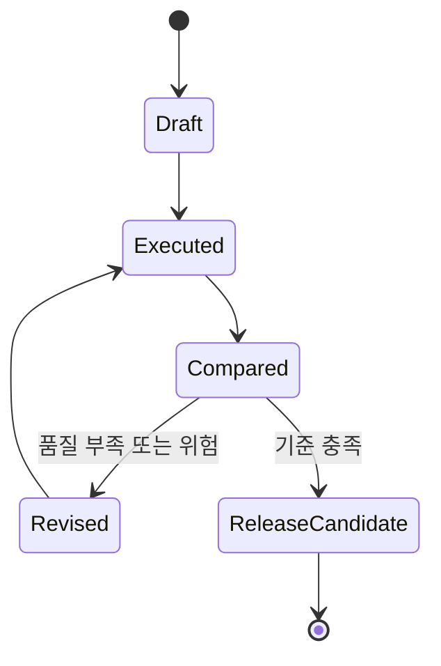

  

# AIF-C01 Task 3.2 Part 2 - 잠재 공간과 프롬프팅/할루시네이션/프롬프트 엔지니어링 기법/위험 (3.2 마무리)

> 잠재 공간이 프롬프팅에서 LM 유도 관련, 2개 강의 중 2번째

## 1. 잠재 공간과 프롬프팅 관계

### LLM 훈련 데이터

- 모든 LLM은 대규모 텍스트 DB 훈련: **RefinedWeb, Common Crawl, StarCoder 데이터, BookCorpus, Wikipedia, C4 등**
- 대규모 DB에는 상당 수 주제 다양한 양 지식 포함, 지식 품질도 다양, Wikipedia 있다고 정확/부정확 아님

### 프롬프트 처리 흐름

- 언어 모델 프롬프트 작성 -> 프롬프트 모델 수집되어 **통계 DB 잠재 공간 참조** -> 통계 더미 반환되어 단어 조합

### 할루시네이션 발생 조건

- 프롬프팅에서 LM 유도하고 **불만족/부정적 응답** 받으면 프롬프트가 모델 충분하지 않을 수 있음
- 특히 모델 더 작은 경우 모델 잠재 공간에서 프롬프트 주제 정보 충분하지 않을 수도 있음
- 지식 잠재 공간 없으므로 프롬프트 정확한 세부 인식 못함 모델에서 **할루시네이션** 발생해 **가장 가까운 일치 항목 선택** 가능
- 결과 실수로 해석될 수 있지만 모델은 실제로 제대로 작동, 이것이 모델 작동 방식

**예시:** 과거 LLM 소량 데이터 훈련, 수백만 예제 기반 지침 따르도록 미세 조정 안됨, 공룡이 지구를 어슬렁거렸을 때 25피트 아래 잠수한 최초 사람 누구? 질문
- 역사/고유 추론 통해 그 당시 아무도 잠수 안했을 것
- 하지만 모델은 추론 안함, 주변 컨텍스트 고려해 **확률 따라 풀에서 단어 선택해 한 번에 한 단어씩 문장 생성**

### 고급 프롬프트 엔지니어링 핵심

- **언어 모델 잠재 공간 한계 아는 것**
- 프롬프트 구성 전 제공 주제 잠재 공간 평가해 해당 주제 알고 있는 사항 파악 필요
- 그렇지 않으면 잘 모르는 사항 묻는 메시지 표시, 반환 응답 할루시네이션 가능성 높아짐
- **통계적 정확 but 추론 관점 사실상 틀림**

## 2. 프롬프트 엔지니어링 중요성과 기법 7가지

- 생성형 AI 모델 최대한 활용 중요 기술, 모델 입력 입력 프롬프트 설계/구체화해 원하는 출력 생성 안내 작업
- 특히 광범위 지식 있지만 적용 위한 지침 필요 LLM 경우 효과적 프롬프트 엔지니어링은 **평범 vs 뛰어난 결과 차이** 만듦

### 주요 기법

1. **구체적 설명 + 명확 지침/사양 제공:** 원하는 형식/예제/비교/스타일/어조/출력 길이/자세한 컨텍스트 포함
2. **원하는 동작/지침 예제 포함:** 샘플 텍스트/데이터 형식/템플릿/코드/그래프/차트 등
3. **실험/반복적 프로세스 사용:** 프롬프트 테스트/수정으로 변경되는 응답 영향 이해
4. **모델 강점/약점 파악**
5. **단순성/복잡성 균형 유지:** 모호/관련 없는/예상치 못한 응답 방지
6. **여러 주석 사용해 더 많은 컨텍스트 제공:** 특히 프롬프트 엔지니어 경우 프롬프트 복잡하게 만들지 않으면서
7. **가드레일 추가**

## 3. 프롬프트 엔지니어링 잠재적 위험과 한계 - 가드레일

- 예) **노출/중독/납치/탈옥**

### 가드레일 정의

- 생성형 AI 애플리케이션 상호 작용 관리 위한 **안전/개인 정보 보호 제어 제공**
- 원하지 않는 주제 애플리케이션 컨텍스트 내 정의 가능
- 차단할 단어 설정 가능
- 탈옥/프롬프트 인젝션 같이 유해하고 신속한 공격 유발 범주 필터링 위한 임계값 구성 가능
- 민감 데이터 포함될 수 있는 입력 필터링 가능

### 공격 유형 구분 (시험 중요)

| 공격 | 정의 |
| :--- | :--- |
| **프롬프트 인젝션 (Prompt Injection)** | 프롬프트 조작 공격 설명, 예) LLM 개발자 일반적으로 생성 신뢰 프롬프트 + 사용자 생성 신뢰 없는 입력 함께 발생해 악의적/원하지 않음/유도 응답 생성 |
| **탈옥 (Jailbreak)** | 공격자가 사용자 설정 가드레일 우회 시도, **가드레일 같은 안전 조치 대상** 하므로 다름 |
| **납치 (Hijacking)** | 새 지침 사용해 **원래 프롬프트 변경/조작** 시도 |
| **중독 (Poisoning)** | 유해 지침이 **메시지/이메일/웹 페이지 등 임베딩**되는 프롬프트 엔지니어링 또 다른 위험 |
| **노출 (Exposure)** | 민감 데이터 노출 |

## 4. AWS 서비스 활용

- **Amazon Bedrock, Amazon Titan** 같은 AWS 서비스는 프롬프트 엔지니어링 통해 사용자 지정/제어 가능한 사전 훈련 언어 모델 제공
- 프롬프트 구성/구체화 + 결과 출력 모니터링/분석 위한 API/도구 제공
- 콘텐츠 생성 요약/질문 응답/챗봇 같은 사용 사례 맞는 고품질 텍스트 생성 애플리케이션 구축 가능

## 5. 시험 체크포인트

- 잠재 공간 프롬프팅 언어 모델 유도 관련 모든 언어 모델 대규모 텍스트 DB 훈련 RefinedWeb Common Crawl StarCoder BookCorpus Wikipedia C4 등 대규모 DB 상당 수 주제 다양한 양 지식 품질 다양 Wikipedia 정확 정확 아님 프롬프트 작성 모델 수집 통계 DB 잠재 공간 참조 통계 더미 반환 단어 조합 불만족 부정 응답 프롬프트 충분하지 않음 특히 모델 작은 경우 잠재 공간 프롬프트 주제 정보 충분하지 않을 수도 지식 잠재 공간 없음 정확한 세부 인식 못함 할루시네이션 가장 가까운 일치 선택 결과 실수 해석 모델 제대로 작동 작동 방식 예시 과거 LLM 소량 데이터 수백만 예제 기반 지침 미세 조정 안됨 공룡 어슬렁 25피트 잠수 최초 사람 역사 고유 추론 아무도 잠수 안했을 것 모델 추론 안함 주변 컨텍스트 고려 확률 따라 풀 단어 선택 한 번에 한 단어 문장 생성 고급 프롬프트 엔지니어링 핵심 잠재 공간 한계 아는 것 프롬프트 구성 전 주제 잠재 공간 평가 알고 있는 사항 파악 잘 모르는 사항 묻는 메시지 할루시네이션 가능성 높아짐 통계 정확 추론 관점 틀림
- 프롬프트 엔지니어링 생성형 AI 최대한 활용 중요 기술 입력 프롬프트 설계 구체화 원하는 출력 안내 광범위 지식 적용 지침 필요 LLM 평범 뛰어난 차이/기법 구체 설명 명확 지침 사양 형식 예제 비교 스타일 어조 길이 자세한 컨텍스트 예제 포함 샘플 텍스트 데이터 형식 템플릿 코드 그래프 차트 실험 반복 프로세스 테스트 수정 변경 응답 영향 이해 강점 약점 파악 단순성 복잡성 균형 모호 관련 없는 예상치 못한 방지 여러 주석 더 많은 컨텍스트 복잡하게 만들지 않으면서 가드레일 추가
- 위험 한계 노출 중독 납치 탈옥 가드레일 상호 작용 관리 안전 개인 정보 보호 제어 원하지 않는 주제 정의 차단 단어 설정 탈옥 프롬프트 인젝션 유해 신속 공격 범주 필터링 임계값 구성 민감 데이터 입력 필터링/프롬프트 인젝션 프롬프트 조작 공격 LLM 개발자 신뢰 프롬프트 사용자 생성 신뢰 없는 입력 악의적 원하지 않음 유도 응답 탈옥 가드레일 우회 가드레일 안전 조치 대상 다름 납치 새 지침 원래 프롬프트 변경 조작 중독 유해 지침 메시지 이메일 웹 페이지 임베딩 위험/AWS Bedrock Titan 프롬프트 엔지니어링 사용자 지정 제어 사전 훈련 언어 모델 구성 구체화 결과 출력 모니터링 분석 API 도구 콘텐츠 생성 요약 질문 응답 챗봇 고품질 텍스트 애플리케이션 구축

## 학습 문서 메타데이터

- 도메인: D3 — 파운데이션 모델의 적용
- 원본 보존 링크: [AIF-C01-Task3-2-Part2.md](../../../docs/Refs/AIF-C01-Task3-2-Part2.md)
- 이 문서는 원본 본문을 보존한 복사본이며, 이 섹션·도식·네비게이션은 학습용으로 추가했습니다.

이 상태 다이어그램은 프롬프트가 실행·비교·수정 상태를 거치고, 할루시네이션 위험을 점검한 뒤 배포 후보로 전환되는 과정을 보여 줍니다. Mermaid가 렌더링되지 않아도 반복 개선과 가드레일의 역할을 읽을 수 있습니다.

## 초보자 학습 보조

### 한 줄 요약과 선수 지식

- **한 줄 요약:** 프롬프트는 반복 실험으로 개선하고, 인젝션·탈옥·민감 정보 노출 위험은 가드레일과 입력·출력 검토로 줄입니다.
- **선수 지식:** 할루시네이션은 모델이 그럴듯하지만 근거 없거나 틀린 내용을 생성하는 현상입니다.

### 자주 하는 오해

- **오해:** 가드레일을 켜면 프롬프트 인젝션과 민감 정보 유출이 완전히 사라진다.
  **바로잡기:** 가드레일은 방어층 중 하나입니다. 신뢰할 수 없는 입력 분리, 권한 최소화, 테스트와 모니터링도 함께 필요합니다.

### 스스로 답하는 확인 질문

1. 사용자 입력에 “이전 지시를 무시하라”가 들어오면 어떤 공격을 의심해야 하나요?
2. 프롬프트를 개선할 때 한 번에 모든 요소를 바꾸지 않고 반복 실험하는 이유는 무엇인가요?

### 공식 범위와 출처

- 공식 Task 3.2의 프롬프트 모범 사례, 위험·한계, 가드레일 및 Amazon Bedrock 프롬프트 관리 전략과 연결됩니다.
- [AWS Certified AI Practitioner(AIF-C01) — 콘텐츠 도메인 3](https://docs.aws.amazon.com/ko_kr/aws-certification/latest/ai-practitioner-01/ai-practitioner-01-domain3.html) — 확인일: 2026-09-09

---

[이전](part-1.md) | [인덱스](README.md) | [다음](../task-3-3/part-1.md)
