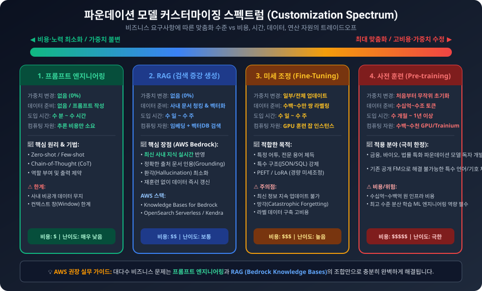
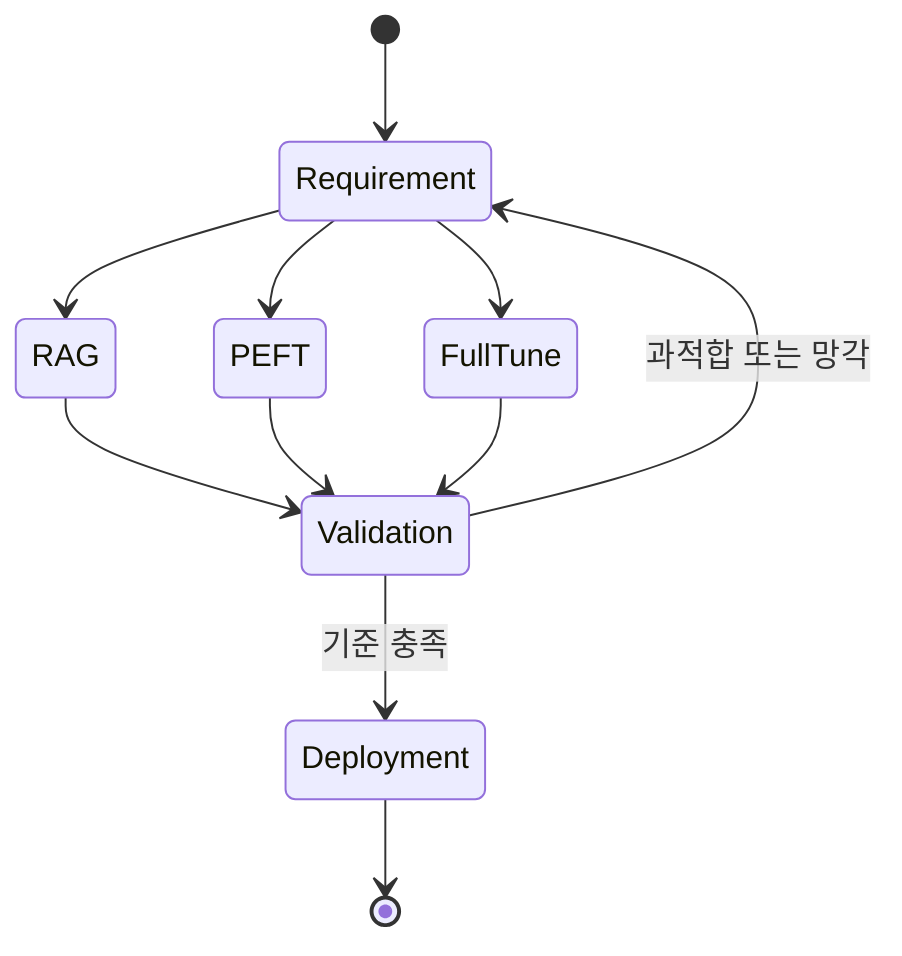

  

# AIF-C01 Task 3.3 Part 1 - FM 훈련/미세 조정 프로세스 / PEFT·LoRA·RLHF

> FM 훈련 및 미세 조정 프로세스 설명, 2개 강의 중 1번째

## 1. 파운데이션 모델 훈련 핵심 요소 3가지

1. **사전 훈련 (Pretraining)**
2. **미세 조정 (Fine-tuning)**
3. **지속적 사전 훈련 (Continual Pretraining)**

## 2. 사전 훈련 - 복잡한 프로세스

- 수백만 GPU/컴퓨팅 시간/테라바이트·페타바이트 규모 데이터/수조 토큰/시행착오/시간 필요
- 사전 훈련 동안 생성형 AI 모델 해당 기능 학습

### 사전 훈련 vs 미세 조정 차이

| 구분 | 설명 |
| :--- | :--- |
| **사전 훈련** | 자체 지도 학습, 방대한 양 비정형 데이터 사용 LLM 훈련 |
| **미세 조정** | FM이 수백만 문서·비디오·이미지·파일·오디오 훈련 인간 언어 기본 학습했더라도 영역·데이터세트 추가 훈련/지침 필요, 인간 태스크·추론 수행 방법 학습 필요 |

- **미세 조정 정의:** 특정 태스크 컴플리션 생성 개선 위해 모델 훈련 확장 프로세스, **지도 학습 프로세스**, 레이블 지정 예제 데이터세트 사용 LLM 가중치 업데이트
- FM을 사용자 지정 데이터세트/사용 사례 맞게 조정 도움

### 지침 기반 미세 조정

- 레이블 지정 예제 사용 특정 태스크 성능 개선
- LLM은 단일 모델 내 다양한 태스크 수행 가능, 하지만 앱에서 단일 태스크 수행 필요 경우?
- 사전 훈련 모델 미세 조정해 사용 사례별 태스크 성능 개선 가능
- 그러나 단일 태스크 미세 조정 한계 = **치명적 망각 (Catastrophic Forgetting)**

**치명적 망각:**
- 전체 미세 조정 프로세스에서 원본 LLM 가중치 수정 시 발생
- 단일 태스크 미세 조정 성능 개선될 수 있지만 다른 태스크 성능 저하될 수 있음
- 고려 사항: 치명적 망각이 사용 사례 영향 여부 결정, 단일 태스크 신뢰 성능 필요 경우 모델 다른 태스크 일반화 불가 걱정 안해도 됨
- 전체 미세 조정 중 지도 학습 통해 모델 모든 파라미터 업데이트

## 3. 파라미터 효율적 미세 조정 (PEFT)

### 배경 - 비용 증가

- FM 훈련/튜닝 시 모델 파라미터 로드 + 옵티마이저/그래디언트/순방향 활성화/시간 메모리 위한 메모리 추가
- 구성 요소는 각 모델 파라미터 대해 추가 GPU 메모리 바이트 추가, 미세 조정 컴퓨팅 비용 증가

### PEFT 정의

- 원본 LLM 파라미터/가중치 **고정/보존**, 소수 태스크별 **어댑터 계층/파라미터 미세 조정/훈련** 프로세스/기법 세트
- 작은 모델 파라미터 세트 미세 조정하므로 필요한 컴퓨팅/메모리 줄여줌

### LoRA - 저순위 적응 (Low-Rank Adaptation)

- 인기 PEFT 기법
- FM 원래 가중치 보존/고정 + 훈련 가능한 **저순위 행렬을 변환기 아키텍처 각 계층에 새로 생성**
- PEFT/LoRA는 모델 가중치 수정 but 표현 수정 안함
- 표현 = 임베딩과 비슷한 시맨틱 정보 인코딩

### 표현 미세 조정 (Representation Fine-Tuning, ReFT)

- 기본 모델 고정 + 숨겨진 표현에 대한 태스크별 개입 학습 미세 조정 프로세스
- **선형 표현 가설:** 개념은 신경망 표현에 대한 선형 부분 공간 인코딩

## 4. 멀티태스크 미세 조정

- 단일 태스크 미세 조정 확장
- 많은 데이터 필요
- 훈련 데이터세트에는 **여러 태스크 입력/출력 예제** 있음
  - 예) 리뷰/평가/요약/코드 번역 등 여러 태스크 완료 지시 예제 포함
- 다양한 여러 태스크 동시 완료 방법 학습한 **지침 튜닝 모델 생성**
- 예제에서 손실 계산해 모델 가중치 업데이트 가능, **치명적 망각 완화/방지**

## 5. 영역 적응 미세 조정

**질문:** 영역별 데이터 적응 위해 모델 가중치 수정 미세 조정 프로세스는?

- **영역 적응 미세 조정** 통해 사전 훈련 FM 사용 + 제한된 영역별 데이터 사용 특정 태스크 적응 가능
- 모델이 **업계 전문 용어/기술 용어/기타 특수 데이터** 같은 영역별 언어 작동 지원

## 6. Amazon SageMaker JumpStart 미세 조정

- 대규모 언어 모델 특히 영역별 데이터세트에서 텍스트 생성 모델 미세 조정 기능 제공
- 모델 사용자 지정 데이터세트 미세 조정해 특정 영역 성능 개선 가능

## 7. RLHF - 인간 피드백 통한 강화 학습

- 인간 피드백 통한 강화 학습(RLHF) 미세 조정 가능
- 모델 성능 개선, **인간 유사 프롬프트 더 잘 이해해 인간 유사 응답 생성** 지원
- **RLHF 정의:** 강화 학습(RL) 사용해 LLM을 인간 피드백 데이터로 미세 조정해 모델 인간 선호도 더 잘 맞춤

## 8. 시험 체크포인트

- 훈련 핵심 요소 사전 훈련 미세 조정 지속적 사전 훈련/사전 훈련 복잡 수백만 GPU 컴퓨팅 시간 TB PB 데이터 수조 토큰 시행착오 시간 기능 학습 사전 훈련 자체 지도 방대 비정형 LLM 훈련 FM 수백만 문서 비디오 이미지 파일 오디오 인간 언어 기본 학습 영역 데이터세트 추가 훈련 지침 인간 태스크 추론 학습 필요 미세 조정 특정 태스크 컴플리션 생성 개선 훈련 확장 지도 학습 레이블 예제 데이터세트 가중치 업데이트 사용자 지정 데이터세트 사용 사례 조정 지침 기반 미세 조정 레이블 예제 특정 태스크 성능 개선 단일 모델 다양한 태스크 앱 단일 태스크 필요 시 사전 훈련 모델 미세 조정 사용 사례별 성능 개선 단일 태스크 미세 조정 한계 치명적 망각 전체 미세 조정 원본 가중치 수정 발생 단일 성능 개선 다른 성능 저하 사용 사례 영향 여부 결정 단일 신뢰 성능 필요 다른 일반화 걱정 X 전체 미세 조정 지도 학습 모든 파라미터 업데이트
- FM 훈련 튜닝 모델 파라미터 로드 옵티마이저 그래디언트 순방향 활성화 시간 메모리 각 파라미터 추가 GPU 메모리 바이트 컴퓨팅 비용 증가 PEFT 원본 파라미터 가중치 고정 보존 소수 태스크별 어댑터 계층 파라미터 미세 조정 훈련 작은 세트 컴퓨팅 메모리 감소 LoRA 인기 PEFT 원래 가중치 보존 고정 훈련 가능 저순위 행렬 변환기 아키텍처 각 계층 새로 생성 가중치 수정 표현 수정 안함 표현 임베딩 비슷한 시맨틱 정보 인코딩 ReFT 기본 모델 고정 숨겨진 표현 태스크별 개입 학습 선형 표현 가설 개념 신경망 표현 선형 부분 공간 인코딩
- 멀티태스크 단일 확장 많은 데이터 필요 훈련 데이터세트 여러 태스크 입력 출력 예제 리뷰 평가 요약 코드 번역 여러 태스크 완료 지시 지침 튜닝 모델 생성 다양한 여러 태스크 동시 완료 학습 손실 계산 가중치 업데이트 치명적 망각 완화 방지
- 영역 적응 영역별 데이터 적응 가중치 수정 사전 훈련 FM 제한 영역별 데이터 특정 태스크 적응 업계 전문 용어 기술 용어 특수 데이터 영역별 언어 작동 지원
- JumpStart 대규모 LLM 특히 영역별 데이터세트 텍스트 생성 미세 조정 사용자 지정 데이터세트 특정 영역 성능 개선
- RLHF 인간 피드백 강화 학습 미세 조정 성능 개선 인간 유사 프롬프트 더 잘 이해 인간 유사 응답 생성 지원 강화 학습 인간 피드백 데이터 미세 조정 인간 선호도 맞춤

## 시각 학습 보조

이 그림은 맞춤화 수준이 높아질수록 데이터, 시간, 운영 부담을 함께 검토해야 한다는 절충 관계를 보여 줍니다. 특정 방식이 자동으로 더 정확하거나 안전한 것은 아니며, 평가 결과를 근거로 결정합니다.

## 학습 문서 메타데이터

- 도메인: D3 — 파운데이션 모델의 적용
- 원본 보존 링크: [AIF-C01-Task3-3-Part1.md](../../../docs/Refs/AIF-C01-Task3-3-Part1.md)
- 이 문서는 원본 본문을 보존한 복사본이며, 이 섹션·도식·네비게이션은 학습용으로 추가했습니다.

이 상태 다이어그램은 FM 사용자 지정 방식이 요구 사항에 따라 선택되고 평가·배포 후보로 전환되는 상태를 보여 줍니다. Mermaid가 렌더링되지 않아도 RAG·PEFT·전체 미세 조정의 선택과 검증 반복을 읽을 수 있습니다.

---

[이전](../task-3-2/part-2.md) | [인덱스](README.md) | [다음](part-2.md)
