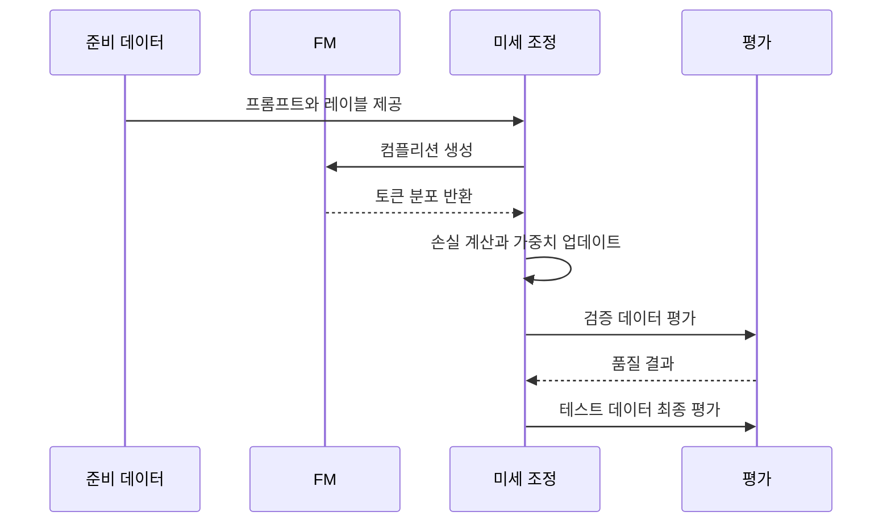

# AIF-C01 Task 3.3 Part 2 - 데이터 준비/미세 조정 프로세스/지속적 사전 훈련/AWS 준비 옵션 (3.3 마무리)

> FM 미세 조정 데이터 준비 중점, 2개 강의 중 2번째

## 1. 미세 조정 데이터 준비 - 전체 흐름

### 첫 번째 단계: 훈련 데이터 준비

- 공개 사용 가능 많은 데이터세트/프롬프트 템플릿 라이브러리가 LLM 훈련 사용
- 프롬프트 템플릿 라이브러리에는 다양한 태스크/데이터세트 많은 템플릿 포함
- 지침 데이터세트 준비되면 데이터세트를 **훈련/검증/테스트 분할**로 나눔

### 미세 조정 프로세스 상세

1. 훈련 데이터세트에서 **프롬프트 선택** LLM에 전달해 **컴플리션 생성**
2. **컴플리션 분포와 훈련 레이블 비교**해 두 토큰 분포 간 **손실 계산**
3. 계산된 손실 사용해 **모델 가중치 업데이트**
4. 여러 배치 프롬프트 컴플리션 페어 완료되면 태스크 모델 성능 개선되도록 가중치 업데이트
5. 표준 지도 학습처럼 **홀드아웃 검증 데이터세트** 사용 LLM 성능 측정 위한 별도 평가 단계 정의 가능
   - 검증 정확도 획득
6. 미세 조정 완료되면 **홀드아웃 테스트 데이터세트** 사용 최종 성능 평가 수행
   - 마지막 결과 = **테스트 정확도** 제공

## 2. AWS 데이터 준비 기본 정의

- **기계 학습에서 데이터 준비 = 모델 위해 원시 데이터 수집/전처리/구성**
- 플래시카드 추가, 지금 AWS 데이터 준비 몇 가지 옵션 간단히 살펴봄

## 3. AWS 데이터 준비 옵션 6가지 (시험 암기)

| 시나리오 | AWS 서비스 / 프레임워크 |
| :--- | :--- |
| **로우 코드 데이터 준비** | **Amazon SageMaker Canvas** - ML 데이터 전처리 정의 데이터 흐름 생성, 코딩 거의/전혀 없는 엔지니어링 워크플로 특징 |
| **규모 조정 필요 데이터 준비** | **Apache Spark/Hive/Presto** 같은 오픈 소스 프레임워크, **SageMaker Studio Classic**은 **Amazon EMR** 기본 제공 통합 |
| **서버리스 필요** | **AWS Glue 대화형 세션**에서 Apache Spark 기반 서버리스 엔진 사용, SageMaker Studio Classic에서 여러 소스 데이터 집계/변환/준비 |
| **SQL 사용 필요** | **Jupyter Lab**에서 정형 쿼리 언어(SQL) 사용 |
| **특성 검색/저장** | **Amazon SageMaker Feature Store** - 모델 훈련 위한 특성 발견/검색/회수, 특성 데이터 표준화 형식 저장 중앙 집중식 리포지토리 제공 |
| **편향 탐지 필요** | **Amazon SageMaker Clarify** - 데이터 분석 여러 측면 잠재적 편향 탐지, 예) 성별/인종/연령 그룹 간 불균형 표현/레이블링 편향 훈련 데이터 포함 여부 탐지 |
| **레이블 지정 필요** | **SageMaker Ground Truth** - 훈련 데이터세트 데이터 레이블링 워크플로 관리 |

## 4. 지속적 사전 훈련 중요성

### 왜 중요?

- 생성형 AI 모델 출력 **비결정적**이어서 검증 더 어려워짐
- 모델 기능 평가/유해 출력 생성 안하도록 도움 되는 **지표/벤치마크/데이터세트 선택** 필요

### 효과

- 모델을 다양한 주제/장르/컨텍스트 데이터에서 지속적 사전 훈련하면 시간 지나 모델 더 강력해짐
- 더 광범위 지식/적응성 축적해 **영역 외 데이터 더 잘 사용하는 방법 학습**
- 가치 조직 창출

**예시:** Amazon Bedrock에서 사전 훈련 계속하면 **Amazon Titan Text Express / Amazon Titan Text Lite FM** 훈련 도움
- 이러한 모델은 안전/관리 환경에서 레이블 지정 안된 고유 데이터 사용해 사용자 지정 가능

## 5. 시험 체크포인트

- 데이터 준비 훈련 데이터 준비 공개 많은 데이터세트 프롬프트 템플릿 라이브러리 다양한 태스크 데이터세트 많은 템플릿 지침 데이터세트 준비 훈련 검증 테스트 분할 미세 조정 훈련 데이터세트 프롬프트 선택 LLM 전달 컴플리션 생성 컴플리션 분포 훈련 레이블 비교 두 토큰 분포 간 손실 계산 손실 가중치 업데이트 여러 배치 프롬프트 컴플리션 페어 완료 태스크 성능 개선 가중치 업데이트 표준 지도 학습 홀드아웃 검증 데이터세트 성능 측정 별도 평가 단계 검증 정확도 미세 조정 완료 홀드아웃 테스트 데이터세트 최종 성능 평가 테스트 정확도
- ML 데이터 준비 원시 데이터 수집 전처리 구성
- AWS 옵션 로우 코드 Canvas ML 전처리 데이터 흐름 코딩 거의 없는 엔지니어링 워크플로 규모 조정 Spark Hive Presto 오픈 소스 Studio Classic EMR 통합 서버리스 Glue 대화형 세션 Spark 기반 서버리스 엔진 Studio Classic 여러 소스 집계 변환 준비 SQL Jupyter Lab SQL 특성 검색 저장 Feature Store 특성 발견 검색 회수 표준화 형식 저장 중앙 리포지토리 편향 탐지 Clarify 데이터 분석 잠재적 편향 탐지 성별 인종 연령 그룹 불균형 표현 레이블링 편향 훈련 데이터 포함 여부 레이블 지정 Ground Truth 레이블링 워크플로 관리
- 지속적 사전 훈련 생성형 AI 중요 출력 비결정적 검증 어려움 기능 평가 유해 출력 안하도록 지표 벤치마크 데이터세트 선택 필요 다양한 주제 장르 컨텍스트 데이터 지속 사전 훈련 시간 지나 더 강력 광범위 지식 적응성 축적 영역 외 데이터 더 잘 사용 학습 가치 조직 창출 Bedrock 사전 훈련 계속 Titan Text Express Titan Text Lite FM 훈련 안전 관리 환경 레이블 안된 고유 데이터 사용자 지정 가능

## 학습 문서 메타데이터

- 도메인: D3 — 파운데이션 모델의 적용
- 원본 보존 링크: [AIF-C01-Task3-3-Part2.md](../../../docs/Refs/AIF-C01-Task3-3-Part2.md)
- 이 문서는 원본 본문을 보존한 복사본이며, 이 섹션·도식·네비게이션은 학습용으로 추가했습니다.

이 시퀀스 다이어그램은 미세 조정 데이터가 프롬프트·컴플리션·손실 계산·가중치 업데이트를 거쳐 검증과 배포로 이어지는 시간 순서의 상호작용을 보여 줍니다. Mermaid가 렌더링되지 않아도 훈련·검증·테스트의 순서를 읽을 수 있습니다.

---

[이전](part-1.md) | [인덱스](README.md) | [다음](../task-3-4/part-1.md)
