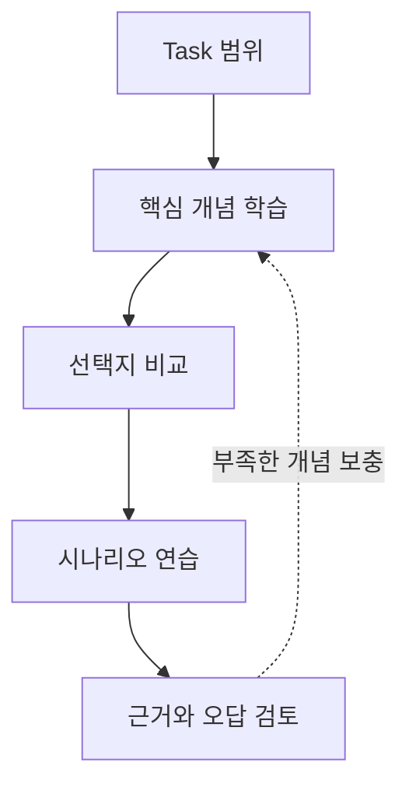

# Task 3.4 성능 평가

- 도메인: [D3 — 파운데이션 모델의 적용](../README.md)
- 상태: `draft`
- 원본은 docs/Refs에 보존하며 이 폴더의 문서는 학습용 복사본입니다.

## 포함 문서

| 학습 문서 | 보존된 원본 |
|---|---|
| [part-1.md](./part-1.md) | [AIF-C01-Task3-4-Part1.md](../../../docs/Refs/AIF-C01-Task3-4-Part1.md) |
| [part-2.md](./part-2.md) | [AIF-C01-Task3-4-Part2.md](../../../docs/Refs/AIF-C01-Task3-4-Part2.md) |

## 학습 순서

이 Task는 위 표의 순서대로 읽습니다. 각 문서에는 원본 링크와 도메인 전체 순서의 이전·인덱스·다음 네비게이션이 있습니다.

