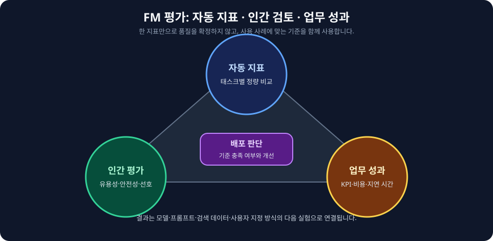
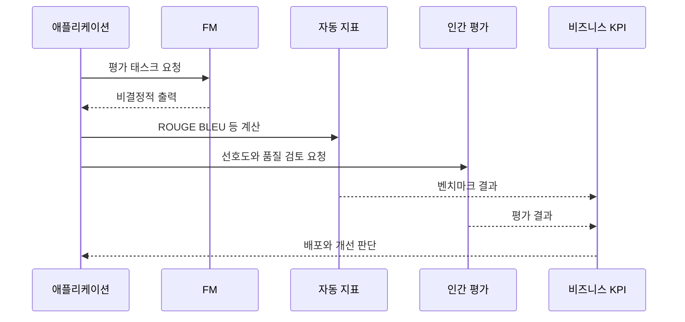

<!-- metadata-badges -->

<kbd>도메인 D3</kbd> <kbd>입문</kbd> <kbd>초안</kbd>

# AIF-C01 Task 3.4 Part 1 - FM 성능 평가 / 배포 고려 / 지표 / 벤치마크

> FM 성능 평가 방법 설명, 2개 강의 중 1번째

## 1. 모델 애플리케이션 통합 고려 - 배포 질문

- 첫 번째 질문 세트 = 배포 시 모델 작동 방식 관련
  - 모델에서 컴플리션 얼마나 빨리 생성해야 하는가?
  - 사용할 수 있는 컴퓨팅 예산 얼마인가?
  - 추론 속도 향상/스토리지 감소 위해 모델 성능 희생 의향 있는가?
  - 온프레미스/클라우드/엣지 디바이스 배포 시 LLM 추론 과제 있을 수 있음
  - 과제에는 앱 사용 사용자 컴퓨팅 스토리지/짧은 지연 시간 요구 사항 포함될 수 있음

### 최적화 기법 (트레이드오프 있음)

1. **LLM 크기 줄여 앱 성능 개선:** 크기 작은 모델 더 빨리 로드되므로 추론 지연 시간 줄일 수 있음, 그러나 크기 줄이면 성능 저하될 수 있음
2. **더 간결한 프롬프트 만들기**
3. **검색된 코드 조각 크기/개수 줄이기**
4. **추론 파라미터와 프롬프트 통한 생성 줄이기**
- 일부 기법 생성형 모델에서 다른 기법보다 효과적 but **정확도/성능 상호 절충**될 수 있음

## 2. 생성형 AI 성능 평가 어려움

- 언급: 정확도/RMSE 같은 평가 지표 계산 더 간단, 예측 결정적 레이블 비교 가능 때문
- 생성형 AI 모델 출력 **비결정적**이어서 평가 결정 더 어려움
- 생성형 AI 모델 평가 지표는 **태스크별 더 구체적**

### 태스크별 평가 지표

| 지표 | 정의/용도 |
| :--- | :--- |
| **ROUGE (Recall Oriented Understudy for Gisting Evaluation)** | 지표+소프트웨어 패키지, 자연어 처리 자동 요약 태스크/기계 번역 소프트웨어 평가 사용, 입력 생성 출력 얼마나 잘 비교되는지 평가 |
| **BLEU (Bilingual Evaluation Understudy)** | 번역 태스크 사용 알고리즘, 한 자연어→다른 자연어 기계 번역 텍스트 품질 평가 |

## 3. LLM 평가/비교 위한 벤치마크·데이터세트 (시험 암기)

태스크 초점 안하고 LLM 평가 비교하려면 LLM 연구원 특별히 설정 기존 벤치마크/데이터세트 사용

| 벤치마크 | 설명 |
| :--- | :--- |
| **GLUE (General Language Understanding Evaluation)** | 여러 태스크 걸쳐 일반화 모델 개발 지원 위해 생성, 감정 분석/Q&A 같은 자연어 태스크 컬렉션, 일련 언어 태스크 모델 성능 평가 비교, 리더보드 있음 |
| **SuperGlue** | 2019 도입, 여러 문장 추론/독해 등 추가 태스크 추가, GLUE와 함께 리더보드 비교 대조 사용 |
| **MMLU (Massive Multitask Language Understanding)** | 모델 지식/문제 해결 능력 평가, 잘 수행하려면 광범위 세계 지식/문제 해결 필요, 역사/수학/법률/컴퓨터 과학 등 기본 언어 이해 이상 테스트 |
| **BIG-bench (Beyond the Imitation Game Benchmark)** | 현재 LM 기능 넘어서는 태스크 초점, 수학/생물학/물리학/편향/언어학/추론/아동 발달/소프트웨어 개발 등 |
| **HELM (Holistic Evaluation of Language Models)** | 모델 투명성 개선 도움 벤치마크, 지정 태스크 어떤 모델 잘 수행되는지 사용자 지침 제공, 요약/Q&A/감정 분석/편향 탐지 같은 태스크 지표 결합 |

## 4. 인간 평가 + AWS 평가 서비스

### 인간 작업자 수동 평가

- 인간 작업자 사용 모델 응답 수동 평가 가능
- 예) 인간 작업자 사용 **SageMaker JumpStart 모델 응답 비교** 가능, AWS 외부 모델 응답 지정 가능

### Amazon SageMaker Clarify

- 대규모 언어 모델(LLM) 평가/모델 평가 작업 생성 가능
- 모델 평가 작업은 **SageMaker JumpStart 텍스트 기반 FM 모델 품질/지표 평가/비교** 도움

### Amazon Bedrock 평가 모듈

- 생성된 응답 자동 비교 + 인간 참조 기준 **시맨틱 유사성 기본 점수인 BertScore** 계산 제공
- **텍스트 생성 태스크 충실도/할루시네이션 평가 적합**

## 5. 시험 체크포인트

- 배포 고려 컴플리션 얼마나 빨리 생성 컴퓨팅 예산 얼마 추론 속도 향상 스토리지 감소 위해 성능 희생 의향 온프레미스 클라우드 엣지 추론 과제 컴퓨팅 스토리지 짧은 지연 시간 요구 최적화 LLM 크기 줄여 성능 개선 크기 작은 모델 빨리 로드 추론 지연 감소 크기 줄이면 성능 저하 간결 프롬프트 만들기 검색 코드 조각 크기 개수 줄이기 추론 파라미터 프롬프트 통한 생성 줄이기 일부 기법 더 효과적 정확도 성능 절충
- 평가 정확도 RMSE 계산 간단 예측 결정적 레이블 비교 생성형 AI 출력 비결정적 평가 어려움 평가 지표 태스크별 구체적 ROUGE 지표 소프트웨어 패키지 자동 요약 기계 번역 평가 입력 생성 출력 비교 평가 BLEU 번역 알고리즘 한 자연어 다른 자연어 기계 번역 품질 평가
- 벤치마크 GLUE 여러 태스크 일반화 모델 개발 지원 감정 분석 Q&A 자연어 컬렉션 일련 태스크 성능 평가 비교 리더보드 SuperGlue 2019 여러 문장 추론 독해 추가 태스크 리더보드 MMLU 지식 문제 해결 평가 광범위 세계 지식 문제 해결 필요 역사 수학 법률 컴퓨터 과학 기본 이해 이상 테스트 BIG-bench 현재 LM 기능 넘어서는 태스크 수학 생물 물리 편향 언어학 추론 아동 발달 소프트웨어 개발 HELM 모델 투명성 개선 도움 어떤 모델 잘 수행 사용자 지침 요약 Q&A 감정 분석 편향 탐지 지표 결합
- 인간 평가 인간 작업자 수동 평가 JumpStart 모델 응답 비교 AWS 외부 모델 지정 가능 Clarify LLM 평가 모델 평가 작업 생성 JumpStart 텍스트 기반 FM 품질 지표 평가 비교 Bedrock 평가 모듈 생성 응답 자동 비교 인간 참조 기준 시맨틱 유사성 BertScore 계산 텍스트 생성 충실도 할루시네이션 평가 적합

## 시각 학습 보조

이 그림은 생성형 AI 평가가 하나의 점수만으로 끝나지 않고, 과제 품질·안전성·운영 제약을 함께 확인해야 함을 보여 줍니다. 측정 기준과 허용 수준은 사용 사례의 위험도에 맞게 정합니다.

## 학습 문서 메타데이터

- 도메인: D3 — 파운데이션 모델의 적용
- 원본 보존 링크: [AIF-C01-Task3-4-Part1.md](../../../docs/Refs/AIF-C01-Task3-4-Part1.md)
- 이 문서는 원본 본문을 보존한 복사본이며, 이 섹션·도식·네비게이션은 학습용으로 추가했습니다.

이 시퀀스 다이어그램은 FM 출력이 자동 지표·인간 평가·벤치마크를 거쳐 비즈니스 KPI 판단으로 이어지는 시간 순서의 평가 상호작용을 보여 줍니다. Mermaid가 렌더링되지 않아도 평가와 개선의 연결을 읽을 수 있습니다.

---

[이전](../task-3-3/part-2.md) | [인덱스](README.md) | [다음](part-2.md)
