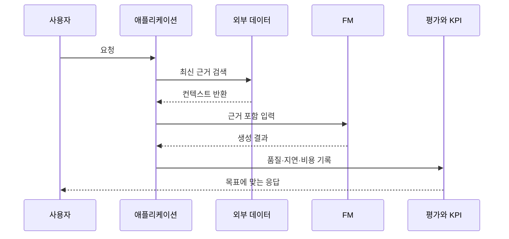

# AIF-C01 Task 3.4 Part 2 - 애플리케이션 통합/RAG 오래된 지식 해결/스택 구성/비즈니스 목표 (3.4 마무리)

> 모델 애플리케이션 통합 두 번째 질문 세트, 2개 강의 중 2번째

## 1. 모델 애플리케이션 통합 두 번째 질문 세트

- 모델에 필요한 **추가 리소스**는 무엇인가?
- 모델이 **외부 데이터/다른 애플리케이션과 상호 작용**하도록 하겠는가? 그렇다면 이러한 리소스에 어떻게 연결하겠는가?

### RAG 복습 - 왜 필요한가?

- 이전 RAG 언급: LLM 시스템에서 **외부 데이터 소스 사용 프레임워크**
- **내부 지식 오래됨 문제 해결:** 모델 오래되면 최신 정보 인식 불가
- **복잡 수학 어려움:** 모델 정답 가까운 숫자 반환 but 정답 아님 수 있음
- **할루시네이션 방지/사실성 개선:** RAG는 컨텍스트 제공해 근거 있는 응답 통해 사실성 개선 도움
- 그러나 LLM 외부 구성 요소 연결 + 애플리케이션 내 배포 통합하려면 **더 많은 구성 필요**
- **오케스트레이션 라이브러리** 사용해 사용자 입력 LLM 전달 + 컴플리션 결과 반환 구성/관리 가능

### RAG vs 재훈련 비용

- RAG는 모델 오래된 정보 사용 경우 **오래된 지식 문제 해결**
- 모델 새 데이터 재훈련하면 **추가 비용 발생**, 새 지식 업데이트하려면 **반복 재훈련 필요**
- 그러나 RAG는 모델에서 **추론 시 추가 외부 데이터 액세스** 도움, 추가 외부 데이터는 컴플리션 **관련성/정확도 개선** 도움

## 2. 생성형 AI 애플리케이션 구축 스택 개략

- 이를 사용해 FM에서 **생산성/사용자 참여/태스크 엔지니어링** 같은 비즈니스 목표 효과적 충족하는지 확인 가능

### 비즈니스 목표 충족 확인 질문

- 모델이 어떻게 사용됨?
- 모델 사용할 대상 **애플리케이션/API 인터페이스 설계**는?
- FM/LLM 사용해 다양한 비즈니스 목표 충족/사용자 경험 향상 가능, 앞에서 논의 평가 기법 사용 목표 충족 여부 확인 가능

### 비즈니스 목표 정의 프로세스

1. 비즈니스 목표를 해결하려는 **특정 문제로 정의**
2. **성공 지표**와 모델/애플리케이션 지원 **인프라 결정**
3. 지표 **측정/모니터링/검토해 성능 평가**

### 생성형 AI 통합 요구

- API/인터페이스 사용해 기존 시스템/소프트웨어 애플리케이션/서비스와 **실시간 상호 작용** 가능해야 함

## 3. 엔드 투 엔드 솔루션 구축 주요 구성 요소 (계층 구조)

### 1) 인프라 계층

- LLM 제공·호스팅 + 애플리케이션 구성 요소 호스팅 위한 **컴퓨팅/스토리지/네트워크 제공**
- 보안 권장 고려: **데이터 준비/훈련/추론 AI 수명 주기 전반 데이터 안전 처리** 확인 필요

### 2) 모델 + 인프라 선택 계층

- 앱 사용할 **대규모 언어 모델 + 추론 요구 적합 인프라 선택**
- 추가 스토리지 포함 + 모델과 **실시간/거의 실시간 상호 작용** 필요한지 고려
- **질문: 추가 스토리지 필요한 이유?** 추가 미세 조정 평가/목표 맞춤 조정 사용 **사용자 컴플리션/피드백 수집/저장 구현** 필요할 수도 있음, 데이터 격리 위한 보안 추가 필요

### 3) 도구/프레임워크 계층

- 대규모 언어 모델 위한 **추가 도구/프레임워크** 필요
- **모델 허브** 사용해 애플리케이션 모델 **중앙 관리/공유** 필요할 수도 있음

### 4) 사용자 인터페이스 계층

- 웹 사이트/REST API 같이 애플리케이션 사용 위한 **사용자 인터페이스** 필요
- 보안 연결 보장 위해 보안 초점

### 추가 스택 구성 요소 고려

- RAG 같은 외부 소스 데이터 검색 + 모델과 실시간/거의 실시간 상호 작용 요구 사항 고려
- 목표 따라 출력 수집/저장 위한 스토리지 추가 필요할 수도 있음
- 또는 앱 성숙해짐에 따라 추가 미세 조정/맞춤/평가 유용할 수 있는 **사용자 피드백 저장**

### 전체 계층 재정리 (시험용)

1. **인프라 계층:** 컴퓨팅/스토리지/네트워크, 보안, 데이터 안전 처리
2. **모델/인프라 선택 + 추가 스토리지:** LLM 선택/추론 요구 적합 인프라, 실시간/거의 실시간 상호 작용, 추가 미세 조정 평가/목표 맞춤 사용자 컴플리션/피드백 수집 저장, 데이터 격리 보안
3. **도구/프레임워크/모델 허브:** 추가 도구/프레임워크, 모델 중앙 관리/공유
4. **UI 계층:** 웹사이트/REST API, 보안 연결, 인간 최종 사용자 또는 API 통해 앱 액세스 다른 시스템, 사용자 전체 스택 상호 작용

## 4. 시험 체크포인트

- 통합 두 번째 질문 추가 리소스 무엇 외부 데이터 다른 애플리케이션 상호 작용 리소스 어떻게 연결 RAG LLM 외부 데이터 소스 프레임워크 내부 지식 오래 문제 해결 오래되면 최신 인식 불가 복잡 수학 어려움 정답 가까운 숫자 정답 아님 RAG 컨텍스트 할루시네이션 방지 근거 응답 사실성 개선 외부 구성 요소 연결 배포 통합 더 많은 구성 오케스트레이션 라이브러리 사용자 입력 LLM 전달 컴플리션 결과 반환 구성 관리 오래된 지식 해결 새 데이터 재훈련 추가 비용 새 지식 업데이트 반복 재훈련 필요 RAG 추론 시 추가 외부 데이터 액세스 관련성 정확도 개선
- 스택 개략 생산성 사용자 참여 태스크 엔지니어링 비즈니스 목표 효과적 충족 확인 모델 어떻게 사용 애플리케이션 API 인터페이스 설계 FM LLM 다양한 비즈니스 목표 충족 사용자 경험 향상 평가 기법 목표 충족 확인 비즈니스 목표 특정 문제 정의 성공 지표 모델 애플리케이션 지원 인프라 결정 지표 측정 모니터링 검토 성능 평가 생성형 AI 통합 API 인터페이스 기존 시스템 소프트웨어 애플리케이션 서비스 실시간 상호 작용
- 엔드 투 엔드 주요 구성 요소 인프라 계층 LLM 제공 호스팅 애플리케이션 구성 요소 호스팅 컴퓨팅 스토리지 네트워크 보안 데이터 준비 훈련 추론 AI 수명 주기 전반 안전 처리 모델 인프라 선택 대규모 언어 모델 추론 요구 적합 인프라 추가 스토리지 실시간 거의 실시간 상호 작용 필요 추가 스토리지 필요 이유 추가 미세 조정 평가 목표 맞춤 조정 사용자 컴플리션 피드백 수집 저장 구현 데이터 격리 보안 도구 프레임워크 계층 대규모 언어 모델 추가 도구 프레임워크 모델 허브 중앙 관리 공유 UI 계층 웹사이트 REST API 사용자 인터페이스 보안 연결 보장 보안 초점 추가 스택 구성 요소 필요 RAG 외부 소스 데이터 검색 실시간 거의 실시간 상호 작용 요구 출력 수집 저장 스토리지 추가 성숙 추가 미세 조정 맞춤 평가 유용 사용자 피드백 저장 도구 프레임워크 모델 허브 중앙 관리 공유 마지막 계층 웹사이트 REST API 사용자 인터페이스 보안 구성 요소 포함 인간 최종 사용자 API 통해 앱 액세스 다른 시스템 사용자 전체 스택 상호 작용

## 학습 문서 메타데이터

- 도메인: D3 — 파운데이션 모델의 적용
- 원본 보존 링크: [AIF-C01-Task3-4-Part2.md](../../../docs/Refs/AIF-C01-Task3-4-Part2.md)
- 이 문서는 원본 본문을 보존한 복사본이며, 이 섹션·도식·네비게이션은 학습용으로 추가했습니다.

이 시퀀스 다이어그램은 사용자 요청이 애플리케이션·RAG 데이터·모델·검토를 거쳐 비즈니스 KPI로 연결되는 시간 순서의 상호작용을 보여 줍니다. Mermaid가 렌더링되지 않아도 외부 데이터와 모델 통합의 흐름을 읽을 수 있습니다.

---

[이전](part-1.md) | [인덱스](README.md) | [다음](../task-3-reference/ref.md)
