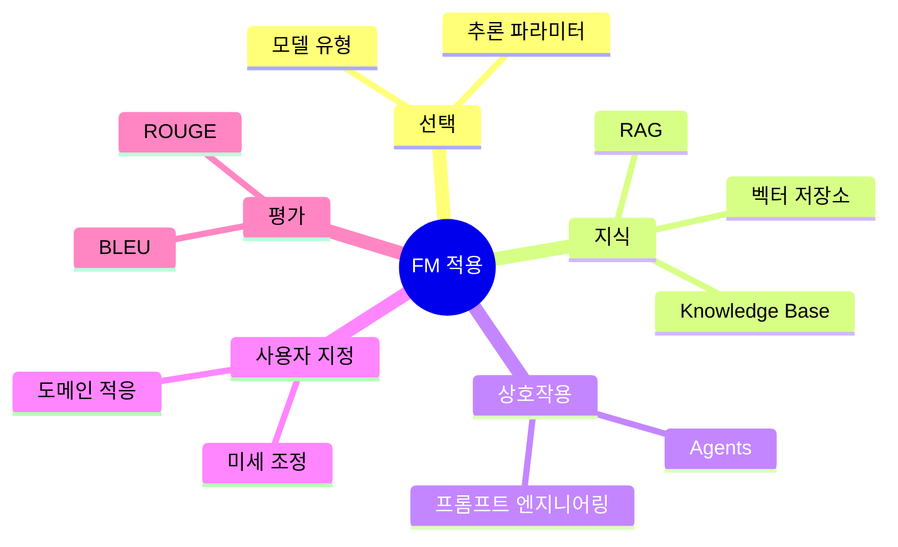

# Task 3 Ref Doc
- https://aws.amazon.com/what-is/foundation-models/
- https://docs.aws.amazon.com/bedrock/latest/userguide/inference-parameters.html
- https://docs.aws.amazon.com/bedrock/latest/userguide/knowledge-base.html
- https://docs.aws.amazon.com/bedrock/latest/userguide/agents.html
- https://aws.amazon.com/ko/blogs/big-data/amazon-opensearch-services-vector-database-capabilities-explained/
- https://aws.amazon.com/ko/blogs/database/the-role-of-vector-datastores-in-generative-ai-applications/
- https://aws.amazon.com/opensearch-service/serverless-vector-engine/
- https://aws.amazon.com/what-is/prompt-engineering/
- https://aws.amazon.com/ko/blogs/machine-learning/domain-adaptation-fine-tuning-of-foundation-models-in-amazon-sagemaker-jumpstart-on-financial-data/
- https://huggingface.co/spaces/evaluate-metric/bleu
- https://huggingface.co/spaces/evaluate-metric/rouge
- https://huggingface.co/papers/2404.03592

## 학습 문서 메타데이터

- 도메인: D3 — 파운데이션 모델의 적용
- 원본 보존 링크: [AIF-C01-Task3-Ref-doc.md](../../../docs/Refs/AIF-C01-Task3-Ref-doc.md)
- 이 문서는 원본 본문을 보존한 복사본이며, 이 섹션·도식·네비게이션은 학습용으로 추가했습니다.

이 마인드맵은 FM 적용 학습을 모델 선택, 추론, RAG, 프롬프트, 미세 조정, 평가로 나누어 중심 개념에서 가지가 뻗는 구조를 보여 줍니다. Mermaid가 렌더링되지 않아도 참고 자료의 주제 계층을 읽을 수 있습니다.

---

[이전](../task-3-4/part-2.md) | [인덱스](README.md) | 없음
