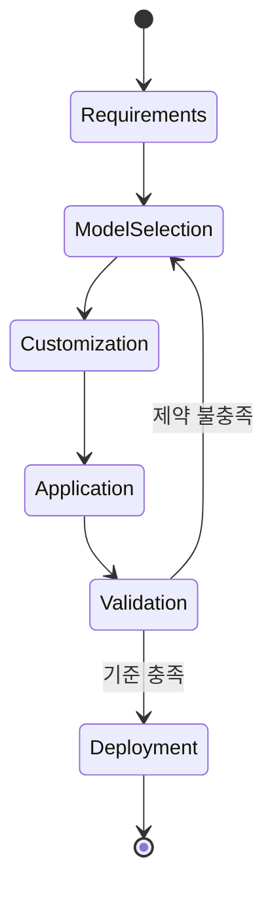

  

# AIF-C01 Task 3 Intro - 영역 3 개요 / 파운데이션 모델 적용 (4개 태스크 목표)

> 파운데이션 모델 계속 설명, 영역 2에서는 FM/수명 주기 설명

## 1. 파운데이션 모델 복습

- **FM = 사용할 준비된 사전 훈련 모델**
- 대규모 데이터세트 훈련
- **정의:** 새 애플리케이션 더 빠르고 경제적으로 지원 ML 모델 개발 위한 시작점 제공 대규모 딥 러닝 신경망

### 독특한 점은? - 적응성

- 입력 프롬프트 따라 높은 정확도 다양한 태스크 수행 가능
- 태스크: **자연어 처리(NLP), 질문과 답변, 이미지 분류** 포함
- FM 크기/범용성으로 기존 ML 모델과 다름
- 기존 ML 모델은 감정 텍스트 분석/이미지 분류/추세 예측 같은 **특정 태스크 수행**

### 적용 분야

- 고객 지원, 언어 번역, 콘텐츠 생성, 코드 생성, 카피라이팅, 이미지 분류, 고해상도 이미지 만들기/편집, 비디오/오디오 생성, 문서 추출, 의료, 자율 주행 차량, 로봇 공학

## 2. 영역 3 - 4가지 태스크 목표 개요

### Task 3.1 - FM 사용 애플리케이션 설계 고려 사항 설명

- 사전 훈련 모델 선택 방법 + 추론 파라미터가 모델 응답 미치는 영향 이해
- **Amazon Bedrock 사용해 RAG 정의** + 비즈니스 애플리케이션 설명
- RAG/사전 훈련/미세 조정 등 FM 사용자 지정 비용 절충 관계
- 임베딩을 벡터 데이터베이스 내 저장 AWS 서비스
- 다단계 태스크에서 에이전트 역할

### Task 3.2 - 효과적인 프롬프트 엔지니어링 기법 선택

- 프롬프트 엔지니어링 모범 사례/기법/위험/제한 사항 이해
- 프롬프트 엔지니어링 개념/구조 설명

### Task 3.3 - FM 교육/미세 조정 프로세스 설명

- FM 훈련 요소/방법 이해
- FM 미세 조정 위해 데이터 준비 방법 이해

### Task 3.4 - FM 성능 평가 방법 설명

- FM 성능 평가 방법/지표 이해
- FM에서 비즈니스 목표 충족 여부 확인 방법 이해

## 3. 학습 방향

- 다음 몇 개 비디오 걸쳐 각 태스크 목표 개별적으로 다루면서 실제 직무 성공 위해 익혀야 하는 지식/기술 분석
- 영역 3 첫 번째 태스크 목표 다루는 다음 강의에서 시험 준비 상태 평가

## 4. 시험 체크포인트

- FM 사용할 준비 사전 훈련 대규모 데이터세트 대규모 딥 러닝 신경망 새 애플리케이션 더 빠르고 경제적으로 지원 ML 모델 개발 시작점
- 독특한 점 적응성 입력 프롬프트 따라 높은 정확도 다양한 태스크 NLP Q&A 이미지 분류 크기 범용성 기존 ML과 다름 기존 ML 감정 텍스트 분석 이미지 분류 추세 예측 특정 태스크
- 적용 분야 고객 지원 언어 번역 콘텐츠 생성 코드 생성 카피라이팅 이미지 분류 고해상도 이미지 만들기 편집 비디오 오디오 생성 문서 추출 의료 자율 주행 차량 로봇 공학
- Task 3.1 설계 고려 사항 사전 훈련 모델 선택 방법 추론 파라미터 응답 영향 Bedrock RAG 정의 비즈니스 애플리케이션 RAG 사전 훈련 미세 조정 비용 절충 임베딩 벡터 DB AWS 서비스 다단계 태스크 에이전트 역할
- Task 3.2 프롬프트 엔지니어링 모범 사례 기법 위험 제한 사항 개념 구조
- Task 3.3 훈련 요소 방법 데이터 준비 미세 조정
- Task 3.4 성능 평가 방법 지표 비즈니스 목표 충족 여부 확인

## 학습 문서 메타데이터

- 도메인: D3 — 파운데이션 모델의 적용
- 원본 보존 링크: [AIF-C01-Task3-Intro.md](../../../docs/Refs/AIF-C01-Task3-Intro.md)
- 이 문서는 원본 본문을 보존한 복사본이며, 이 섹션·도식·네비게이션은 학습용으로 추가했습니다.

이 상태 다이어그램은 파운데이션 모델 적용이 요구 사항과 모델 선택에서 검증·배포로 이어지는 상태 전이를 보여 줍니다. Mermaid가 렌더링되지 않아도 영역 3의 학습 방향과 검증 지점을 읽을 수 있습니다.

## 초보자 학습 보조

### 한 줄 요약과 선수 지식

- **한 줄 요약:** D3는 FM을 고른 뒤, 프롬프트·외부 지식·맞춤화·평가를 연결해 실제 애플리케이션으로 만드는 판단을 다룹니다.
- **선수 지식:** FM은 많은 데이터를 미리 학습한 범용 모델이며, 프롬프트는 FM에 주는 작업 요청입니다. 둘만 알아도 다음 문서를 시작할 수 있습니다.

### 자주 하는 오해

- **오해:** FM을 선택하면 바로 신뢰할 수 있는 서비스가 완성된다.
  **바로잡기:** 모델 선택 뒤에도 입력 설계, 최신 근거 연결, 안전 통제, 품질·비용·지연 시간 평가는 별도로 필요합니다.

### 스스로 답하는 확인 질문

1. D3의 네 작업(Task 3.1~3.4)을 각각 한 문장으로 설명할 수 있나요?
2. 같은 FM이라도 프롬프트, RAG, 미세 조정, 평가가 필요한 이유는 무엇인가요?

### 공식 범위와 출처

- 이 문서는 공식 D3의 전체 범위(Task 3.1~3.4, 채점 콘텐츠 28%)를 소개합니다.
- [AWS Certified AI Practitioner(AIF-C01) — 콘텐츠 도메인 3: 파운데이션 모델의 적용](https://docs.aws.amazon.com/ko_kr/aws-certification/latest/ai-practitioner-01/ai-practitioner-01-domain3.html) — 확인일: 2026-09-09

---

없음 | [인덱스](README.md) | [다음](../task-3-1/part-1.md)
