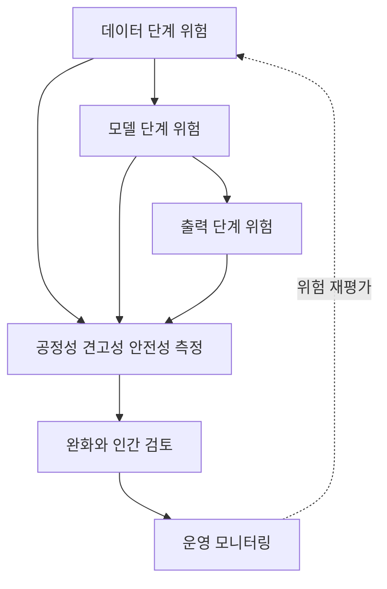

<!-- metadata-badges -->

<kbd>도메인 D4</kbd> <kbd>입문</kbd> <kbd>초안</kbd>

# D4 — 책임 있는 AI에 대한 가이드라인

- 공식 도메인: [책임 있는 AI에 대한 가이드라인](https://docs.aws.amazon.com/ko_kr/aws-certification/latest/ai-practitioner-01/ai-practitioner-01-domain4.html)
- 공식 가중치: **14%**
- 문서 상태: `draft` — 공식 출처 revision과 기술 행은 현재 sources/ 기록에 따라 검증 보류 상태입니다.

## 학습 순서

- [Task 4 책임 있는 AI 개요](./task-4/README.md)
- [Task 4.1 책임 있는 AI 시스템 개발](./task-4-1/README.md)
- [Task 4.2 투명하고 설명 가능한 모델](./task-4-2/README.md)

## 원본 보존

원본 57개는 모두 docs/Refs/에 그대로 보존합니다. 이 디렉터리의 문서는 원본을 복사한 뒤 메타데이터·도식·네비게이션만 추가한 학습용 파생본입니다.

렌더러 없이도 노드와 화살표로 도메인의 학습 흐름을 읽을 수 있습니다.

---

[이전 도메인](../D3/README.md) | [Contents 인덱스](../README.md) | [다음 도메인](../D5/README.md)
