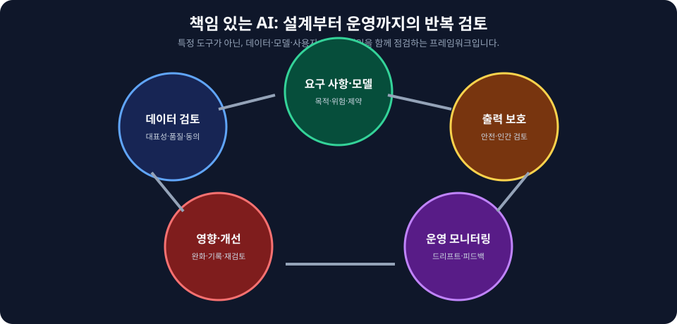
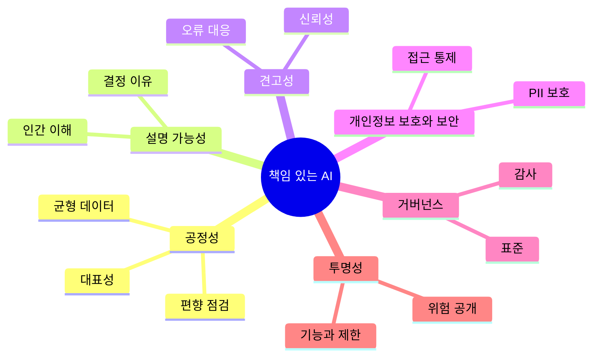

  

# AIF-C01 Task 4.1 Part 1 - 윤리적·공정한 AI 시스템 개발 / 책임감 있는 AI 차원/편향/데이터세트/모델 선택

> 책임감 있는 AI 무엇이고 핵심 차원, 3개 강의 중 1번째

## 1. 책임감 있는 AI 정의

- **책임감 있는 AI = AI 시스템이 안전/신뢰/윤리적 방식 작동 보장 위한 일련 지침/원칙**

## 2. 책임감 있는 AI 핵심 차원 (시험 암기)

| 차원 | 설명 |
| :--- | :--- |
| **공정성 (Fairness)** | 모델에서 연령/거주지/성별/민족성 관계없이 모든 사람 편견 없이 공평 대우 목표, 사회적 편견/차별 영구화/증폭 방지, 여러 그룹 결과 편향/분산으로 측정, 인구 통계적 격차=연령/인종/성별 다양한 그룹 불평등 결과/처리, 정확도 일부 그룹 더 정확 다른 덜 정확 편향 나타낼 수도 있음 |
| **설명 가능성 (Explainability)** | 모델에서 특정 결정 내린 이유 인간 관점 설명 가능해야 함, 예) 대출 신청 거부 주된 이유 무엇? |
| **견고성 (Robustness)** | 사용자 AI 신뢰/사용함에 따라 AI 시스템 장애 견디고 오류 최소화 가능하도록 함 |
| **개인정보 보호/보안 (Privacy & Security)** | 주로 사용자 개인정보 보호/PII 노출 안함 |
| **거버넌스 (Governance)** | 적절한 추정/위험 완화 포함 산업 표준/모범 사례 준수 충족/감사 |
| **투명성 (Transparency)** | 이해 관계자에 모델 기능/제한 사항/잠재적 위험 명확 정보 제공, 사용자 AI와 상호 작용 시 알 수 있도록 함 포함 |

## 3. 공정성 - 과대/과소 적합 문제

- 훈련 데이터세트 실제 세계 대표 안하면 **과대 적합** 문제: 모델 훈련 데이터 비슷한 입력에서만 제대로 작동, 적절 표현 안된 그룹 잠재적 더 부정적 결과 경험
- 일부 그룹 특성 일치 훈련 데이터 충분하지 않아 모델 제대로 작동 안하면 **과소 적합** 발생
- 편향/일관되지 않은 출력 → 사용자 신뢰↓
- AI 시스템 공정성/차별 금지/평등 처리 원칙 위반 → 윤리적 문제
- AI 모델 편향/분산 영향 이해/해결 매우 중요, 시스템 정확/공정/신뢰 보장

## 4. 클래스 불균형 - 모델 편향 주요 원인

- 다른 값 비교 시 특성 값 훈련 샘플 더 적으면 **클래스 불균형** 발생
- 예) 성별 특성 여성 훈련 데이터 32.4% 구성, 남성 67.6% 구성 보여줌
- 결과 모델 훈련 중 여성보다 남성 데이터 레코드 더 많이 확인 → 남성과 관련된 추론 더 나은 성능
- 모델 여성 레코드 과소 샘플링 → 여성 레코드 과대 적합 가능 → 여성 오류율 더 높을 수 있음
- 질병 예측이라면 여성 부정확 진단 비율 높아질 수 있음
- 훈련 데이터세트 편향 = 출력 편향 → **윤리적 데이터세트는 책임감 있는 AI 기반**

## 5. 윤리적 데이터세트 특성 7가지 (시험 암기)

| 특성 | 설명 |
| :--- | :--- |
| **포용성 (Inclusivity)** | 훈련 데이터 다양한 인구/관점/경험 표현 |
| **다양성 (Diversity)** | 편향 방지 위해 광범위 속성/특성/변수 통합 |
| **큐레이팅된 데이터 소스** | 품질/무결성 보장 신중 선택/검증 |
| **균형 잡힌 데이터세트** | 다양한 그룹 동등 표현 왜곡된 분포 방지 |
| **개인정보 보호** | 민감 정보 보호 데이터 보호 규제 준수 필수 |
| **동의/투명성** | 데이터 주체 정보 근거 동의 얻고 데이터 사용 명확 정보 제공 포함 |
| **정기적 감사** | 데이터세트 정기 검토 잠재적 문제/편향 식별/해결 매우 중요 |

- AI 전문가 책임: 모델 훈련 사용 데이터세트 이러한 윤리적 특성 갖추도록 함, 공정/편견 없음/개인정보/동의 존중 AI 시스템 구축

## 6. AI 모델 선택 시 윤리적 사례/요소

- 크고 복잡 모델 훈련 필요 컴퓨팅 리소스 상당 → **환경적 영향 큼**
- 모델 **탄소 발자국/에너지 소비 평가** 필요
- 이미 훈련된 모델 시작점 사용해 모델 필요 훈련량 줄이는 것 고려
- **지속 가능성:** 환경적 영향 최소화 장기 생존 가능 모델 우선 순위
- **기존 작업 재사용:** 지속 가능성 핵심 원칙
- **투명성:** 모델 기능/제한 사항/잠재적 위험 명확 정보 제공, 사용자 AI 사용 시 알 수 있도록 함 의미
- **책임성:** AI 모델 결과/의사결정 명확 책임 한계 설정
- **이해 관계자 참여:** 모델 선택/배포 프로세스 다양한 관점 포함
- 시스템 기술적 건전뿐 아니라 사회적 책임 갖출 수 있도록 AI 모델 선택 시 이러한 윤리적 사례 고려하는 것은 책임

## 7. 시험 체크포인트

- 책임감 있는 AI AI 시스템 안전 신뢰 윤리적 방식 작동 보장 일련 지침 원칙 핵심 차원 공정성 모델 연령 거주지 성별 민족성 관계없이 모든 사람 편견 없이 공평 대우 목표 결정 이유 인간 관점 설명 설명 가능성 대출 거부 주된 이유 사용자 신뢰 사용 견고성 장애 견디고 오류 최소화 개인정보 보호 보안 사용자 개인정보 보호 PII 노출 안함 거버넌스 적절한 추정 위험 완화 산업 표준 모범 사례 준수 충족 감사 투명성 이해 관계자 모델 기능 제한 사항 잠재적 위험 명확 정보 제공 사용자 AI 상호 작용 알 수 있도록 공정성 사회적 편견 차별 영구화 증폭 방지 공정성 여러 그룹 결과 편향 분산 측정 인구 통계적 격차 연령 인종 성별 다양한 그룹 불평등 결과 처리 정확도 일부 더 정확 다른 덜 정확 편향 과대 적합 실제 세계 대표 안함 훈련 데이터 비슷한 입력만 제대로 작동 적절 표현 안된 그룹 더 부정적 과소 적합 일부 그룹 특성 일치 훈련 데이터 충분 X 제대로 작동 X 편향 일관되지 않은 출력 신뢰↓ 공정성 차별 금지 평등 처리 원칙 위반 윤리적 문제 편향 분산 영향 이해 해결 중요 정확 공정 신뢰
- 클래스 불균형 편향 주요 원인 다른 값 비교 특성 값 훈련 샘플 더 적으면 클래스 불균형 여성 32.4% 남성 67.6% 훈련 중 여성보다 남성 레코드 더 많이 확인 남성 추론 더 나은 성능 여성 과소 샘플링 과대 적합 오류율 높음 질병 예측 여성 부정확 진단 비율 높음 훈련 편향 출력 편향 윤리적 데이터세트 기반
- 윤리적 데이터세트 포용성 다양한 인구 관점 경험 표현 다양성 광범위 속성 특성 변수 통합 편향 방지 큐레이팅 품질 무결성 신중 선택 검증 균형 다양한 그룹 동등 표현 왜곡 방지 개인정보 보호 민감 보호 규제 준수 필수 동의 투명성 정보 근거 동의 데이터 사용 명확 정보 정기 감사 정기 검토 잠재 문제 편향 식별 해결 AI 전문가 책임 윤리적 특성 갖추도록 공정 편견 없음 개인정보 동의 존중 시스템 구축
- 모델 선택 윤리적 사례 크고 복잡 훈련 컴퓨팅 상당 환경 영향 큼 탄소 발자국 에너지 소비 평가 이미 훈련 모델 시작점 훈련량 줄이기 지속 가능성 환경 영향 최소화 장기 생존 가능 모델 우선 순위 기존 작업 재사용 지속 가능성 핵심 원칙 투명성 기능 제한 잠재적 위험 명확 정보 사용자 AI 사용 알 수 있도록 책임성 결과 의사결정 명확 책임 한계 이해 관계자 참여 선택 배포 다양한 관점 포함 기술 건전뿐 아니라 사회적 책임 갖출 수 있도록 윤리적 사례 고려 책임

## 시각 학습 보조

이 그림은 책임 있는 AI를 배포 전 한 번만 확인하는 체크리스트가 아니라, 데이터·모델·출력·사용자 영향·운영을 반복적으로 검토하는 활동으로 정리합니다. 공정성이나 안전성은 단일 도구만으로 보장되지 않습니다.

## 학습 문서 메타데이터

- 도메인: D4 — 책임 있는 AI에 대한 가이드라인
- 원본 보존 링크: [AIF-C01-Task4-1-Part1.md](../../../docs/Refs/AIF-C01-Task4-1-Part1.md)
- 이 문서는 원본 본문을 보존한 복사본이며, 이 섹션·도식·네비게이션은 학습용으로 추가했습니다.

이 마인드맵은 책임 있는 AI 원칙에서 공정성·설명 가능성·보안·거버넌스·투명성으로 가지가 뻗는 구조를 보여 줍니다. Mermaid가 렌더링되지 않아도 각 원칙과 데이터·모델 선택의 연결을 읽을 수 있습니다.

---

[이전](../task-4/intro.md) | [인덱스](README.md) | [다음](part-2.md)
