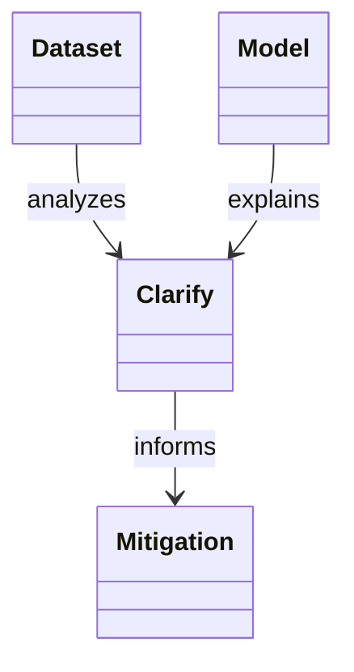

  

# AIF-C01 Task 4.1 Part 2 - 편향·신뢰성·진실성 측정/모니터링 AWS 서비스 / SageMaker Clarify / 지표

> 편향/신뢰성/진실성 측정 모니터링 AWS 서비스/기능, 3개 강의 중 2번째

## 1. 편향 정의 + SageMaker Clarify 완화

- **편향 = 데이터 불균형 또는 여러 그룹 간 모델 성능 격차**
- **SageMaker Clarify** 사용 특정 속성 검사해 **데이터 준비 중 / 모델 훈련 후 / 배포된 모델**에서 잠재적 편향 탐지해 편향 완화 가능
- 모델 설명 가능성은 모델 결정 편향 안됐는지 확인 중요
- SageMaker Clarify는 모델 자체 **블랙박스로 취급**해 모델 입력/출력 살펴봄으로써 설명 가능성 개선
- 관찰 통해 각 특성 **상대적 중요도 결정**, 예) 가장 중요한 2가지 특성 소득/미결제 부채 임계값 충족 못해 대출 거부 말할 수 있음
- 내부 작동 이해 없이도 딥러닝 모델 예측 방식 기초 이해 가능
- 비정형 데이터 사용하는 **컴퓨터 비전/자연어 처리 모델도 설명** 가능

### SageMaker Clarify 처리 작업 아키텍처

1. **S3 버킷**에 입력 데이터세트 + SageMaker 추론 엔드포인트 배포 모델 포함
2. SageMaker Clarify 처리 작업은 **Clarify 처리 컨테이너** 사용 S3 버킷과 상호 작용
3. 처리 컨테이너는 S3에서 분석 위한 입력 데이터세트/구성 가져옴
4. 특성 분석 위해 Clarify 처리 컨테이너 **요청을 모델 컨테이너에 보냄** + 모델 컨테이너 응답에서 **모델 예측 검색**
5. 단계 완료되면 처리 컨테이너 **분석 결과 계산해 S3 저장**
   - 결과 포함: 편향 지표/글로벌 특성 기여도 포함 JSON 파일 + 비주얼 보고서 + 로컬 특성 기여도 추가 파일
6. 출력 위치에서 결과 다운로드해 볼 수 있음

## 2. 훈련 데이터세트 분석 시 Clarify 측정 지표 예

### 균형 잡힌 데이터세트 중요

- 특정 클래스 발생 오류 방지 중요
- 예) 주로 중년층 데이터 훈련 ML 모델은 청년층/노년층 대상 예측 시 정확도↓ 가능
- 또 다른 불균형 유형: 레이블에서 한 클래스 긍정 결과 다른 클래스보다 선호 시 발생
- 예) 훈련 데이터 중년층 대출 더 높은 이자율 승인 보여주는 원치 않는 패턴 보일 수 있음

### 인구통계적 격차 지표 (Demographic Disparity)

- 데이터세트 허용 결과 비율보다 더 큰 거부 결과 비율 특정 클래스 있는지 여부 나타냄
- 예) 대학 입학 경우: 여성 지원자 불합격 지원자 46% 차지 but 합격 32%에 불과
- 여성 불합격 비율 > 여성 합격 비율 → 인구 통계적 격차 보인다고 함

## 3. 훈련된 모델 검토 시 Clarify 지표

| 지표 | 설명 |
| :--- | :--- |
| **예측 지표 긍정 비율 차이 (Difference in Positive Proportions in Predicted Labels)** | 모델에서 각 클래스 긍정 결과 다르게 예측하는지 여부 나타냄, 훈련 데이터 레이블 불균형과 비교 가능, 목표 훈련 후 긍정 비율 편향 변하는지 또는 편향 데이터에도 있는지 확인 |
| **특이도 (Specificity)** | 모델 부정적 결과 정확 예측 빈도 측정, 중년 남성 특이도 다른 연령대보다 낮으면 다른 연령대 편향 보이고 있음 |
| **재현율 차이 (Difference in Recall)** | 두 클래스 간 모델 재현율 차이, 편향 잠재 형태, 재현율 = 긍정 결과 받아야 하는 사례 정확 예측 빈도 측정 **참 긍정 비율(TPR)** , 한 클래스 재현 높 but 다른 낮으면 차이 통해 편향 측정 |
| **정확도 차이 (Accuracy Difference)** | 여러 클래스 예측 정확도 간 차이, 클래스 불균형 데이터 있을 때 발생 가능, 모델 정확도 클래스 간 다를 수 있고 차이도 편향 형태 |
| **처리 평등 (Treatment Equality)** | 거짓 부정/거짓 긍정 비율 차이, 두 클래스 모델 정확도 같더라도 비율 차이 있을 수 있음, 여러 클래스 발생 오류 유형 차이 편향 구성, 대출 승인 예: 한 클래스 더 많은 부정확 대출 거부 + 다른 클래스 더 많은 부정확 대출 승인 = 클래스 간 편향 보여주는 매우 다른 2가지 결과 |

## 4. 시험 체크포인트

- 편향 데이터 불균형 여러 그룹 간 모델 성능 격차 Clarify 특정 속성 검사 데이터 준비 중 모델 훈련 후 배포 모델 잠재적 편향 탐지 편향 완화 설명 가능성 결정 편향 안됐는지 확인 중요 Clarify 모델 블랙박스 취급 입력 출력 살펴 설명 가능성 개선 관찰 각 특성 상대 중요도 결정 가장 중요한 2 소득 미결제 부채 임계값 충족 못해 대출 거부 내부 작동 이해 없이 딥러닝 예측 방식 기초 이해 비정형 컴퓨터 비전 자연어 처리 모델 설명 가능 Clarify 처리 작업 데이터세트 모델 검사 처리 작업 Clarify 처리 컨테이너 S3 버킷 상호 작용 S3 입력 데이터세트 추론 엔드포인트 배포 모델 포함 컨테이너 S3 분석 입력 데이터세트 구성 가져옴 특성 분석 요청 모델 컨테이너 보냄 응답 모델 예측 검색 완료 분석 결과 계산 S3 저장 편향 지표 글로벌 특성 기여도 JSON 파일 비주얼 보고서 로컬 특성 기여도 추가 파일 출력 위치 다운로드 볼 수 있음
- 균형 데이터세트 특정 클래스 오류 방지 중요 중년층 데이터 훈련 청년 노년 예측 정확도↓ 레이블 한 클래스 긍정 결과 다른 선호 발생 훈련 데이터 중년층 대출 더 높은 이자율 승인 원치 않는 패턴 인구통계적 격차 지표 데이터세트 허용 결과 비율보다 큰 거부 결과 비율 특정 클래스 여부 대학 입학 여성 불합격 46% 합격 32% 불합격 비율 합격 비율 초과 인구 통계적 격차
- 훈련 모델 검토 지표 예측 지표 긍정 비율 차이 모델 각 클래스 긍정 결과 다르게 예측 여부 훈련 레이블 불균형 비교 훈련 후 긍정 비율 편향 변하는지 편향 데이터에도 있는지 확인 특이도 부정적 결과 정확 예측 빈도 중년 남성 특이도 다른 연령대보다 낮으면 다른 연령대 편향 재현율 차이 두 클래스 모델 재현율 차이 편향 잠재 형태 재현율 긍정 결과 받아야 사례 정확 예측 빈도 참 긍정 비율 TPR 한 클래스 재현 높 다른 낮 차이 편향 측정 정확도 차이 여러 클래스 예측 정확도 차이 클래스 불균형 있을 때 발생 정확도 클래스 간 다를 수 차이 편향 형태 처리 평등 거짓 부정 거짓 긍정 비율 차이 두 클래스 정확도 같더라도 비율 차이 여러 클래스 오류 유형 차이 편향 구성 대출 승인 한 클래스 더 많은 부정확 거부 다른 더 많은 부정확 승인 클래스 간 편향 매우 다른 2가지 결과

## 학습 문서 메타데이터

- 도메인: D4 — 책임 있는 AI에 대한 가이드라인
- 원본 보존 링크: [AIF-C01-Task4-1-Part2.md](../../../docs/Refs/AIF-C01-Task4-1-Part2.md)
- 이 문서는 원본 본문을 보존한 복사본이며, 이 섹션·도식·네비게이션은 학습용으로 추가했습니다.

이 클래스 다이어그램은 데이터·모델·그룹 결과를 점검하고 Clarify 결과로 완화하는 정적 역할 관계를 보여 줍니다. Mermaid가 렌더링되지 않아도 입력 분석, 모델 설명, 공정성 측정의 연결을 읽을 수 있습니다.

---

[이전](part-1.md) | [인덱스](README.md) | [다음](part-3.md)
