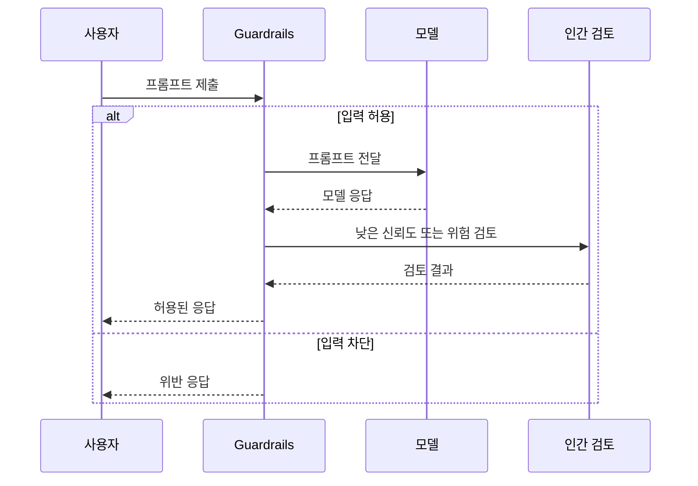

<!-- metadata-badges -->

<kbd>도메인 D4</kbd> <kbd>입문</kbd> <kbd>초안</kbd>

# AIF-C01 Task 4.1 Part 3 - 생성형 AI 과제/위험/할루시네이션/저작권/편향/유해/개인정보/Bedrock 가드레일/Clarify 평가 5차원 (4.1 마무리)

> 생성형 AI 사용 과제/위험, 3개 강의 중 3번째

## 1. 생성형 AI 모델 과제/위험

### 기본 원칙

- 모든 AI 모델은 훈련 데이터만큼만 신뢰 가능
- 생성형 AI에는 **할루시네이션 위험** 있음: 사실적 들리지만 실제 허구인 것 만들면 발생, 훈련 데이터 무언가 누락 시 AI가 누락 채우려 시도 결과, 생성 콘텐츠 사용 방법 따라 치명적 가능

**사례 2023 변호사 사건:**
- 변호사들 생성형 AI 얻은 발췌문/판례 인용 포함 변론 취지서 뉴욕 법원 제출
- 판례/인용문 가짜였음
- 법원 의뢰인 소송 기각 + 변호사 제재 + 소속 회사 벌금 부과

### 저작권 위험

- AI 생성 저작물 인간 저작물 아니므로 **저작권 부여 불가**
- 그러나 생성형 AI 모델은 저작권/특허/상표 보호 데이터에서 훈련되었을 수 있으며 이러한 데이터 출력 포함 가능
- 사용자 저작권 있는 저작물 입력 제출 가능, 생성형 AI 라이선스 없는 파생물 생성 가능

**사례 Getty Images vs Stable Diffusion 2023:**
- Getty Images 텍스트-이미지 생성형 AI Stable Diffusion 개발자 상대로 소송
- 모델 구축 시 **1,200만 장 사진 + 관련 캡션/메타데이터 사용 침해** 혐의

### 편향된 모델 출력 - 법적 위험

- 개인/그룹 차별적/불공정 처리 이어질 수 있음, 중대 법적 위험
- **평등 고용 기회 위원회 EEOC** 고령 지원자 차별 AI 채용 프로그램 사용 3개 회사 고소
- 지원자 55세 이상 여성 또는 60세 이상 남성이면 프로그램 자동 거부

### 유해 콘텐츠

- 공격적/불쾌/심지어 외설 콘텐츠 훈련 데이터 있으면 생성형 AI 해당 유형 콘텐츠 생성 가능
- 유해 콘텐츠 최종 사용자 정신적/정서적 건강 문제 실제 피해, 특정 개인/소외 그룹 폭력 성향 증가 가능

### 데이터 개인정보 위험

- 대규모 언어 모델 유입 민감 데이터 유출되어 출력 통합 가능
- 예) **PII/지적 재산권/영업 비밀/의료 기록** 포함 가능
- 정보 훈련 데이터 있거나 사용자 프롬프트 입력해 모델 포함될 수 있음
- 문제: FM 훈련되거나 일부 데이터 확인 즉시 데이터 삭제해도 **잊어버리게 할 수 없음**
- 위험 하나라도 발생 → 무책임 AI 사례/의도치 않은 결과 → **고객 신뢰 상실/평판 손상**

## 2. Amazon Bedrock 가드레일

- FM에서 부적절 콘텐츠 필터링/차단하도록 **가드레일 구성** 가능
- 가드레일 사용 **증오/모욕/성적 콘텐츠/폭력** 콘텐츠 필터 임계값 정의 가능
- 주제 모두 차단 가능, 주제 경우 일반 텍스트 사용 거부해야 할 주제 설명 가능
- 흐름:
  1. 사용자 프롬프트 제출 → 먼저 가드레일 통과
  2. 프롬프트 가드레일 허용 안되면 사용자 구성한 **위반 응답** 받음, 프롬프트 모델 전달 안됨
  3. 가드레일은 **프롬프트/모델 응답 모두 설정** 가능 → 프롬프트 통과하더라도 응답 여전히 차단 가능
  4. 그렇지 않으면 그대로 통과

## 3. SageMaker Clarify 평가 작업 - LLM 비교

### 4가지 태스크 유형

- **텍스트 생성**
- **텍스트 분류**
- **질문 응답**
- **텍스트 요약**

### 5가지 평가 차원 (시험 암기)

| 차원 | 설명 |
| :--- | :--- |
| **프롬프트 고정화 (Prompt Stereotyping)** | 모델 편향 응답 포함 확률 측정, 인종/성별/성적 취향/종교/연령/국적/장애/외모/사회경제적 지위 편향 포함 |
| **유해성 (Harmfulness)** | 성적 언급/무례/비합리적/증오/공격 댓글/욕설/모욕/유혹/신원 공격/위협 모델 있는지 확인 |
| **사실적 지식 (Factual Knowledge)** | 모델 응답 진실성 확인 |
| **시맨틱 견고성 (Semantic Robustness)** | 키워드 오타/임의 대문자 변경/임의 공백 추가·삭제 인해 모델 출력 변경되는지 여부 확인 |
| **정확도 (Accuracy)** | 데이터 올바르게 분류/요약 등 모델 출력 예상 응답 비교 |

- 빌트인 프롬프트 데이터세트 사용 또는 직접 제공 가능
- 직원/주제 전문가 같은 **인적 인력 피드백** 제공하도록 할 수도 있음
- Amazon Bedrock 사용 경우 **Bedrock 콘솔**에서 동일 기능 사용 Bedrock 사전 훈련 LLM 평가 가능

## 4. 시험 체크포인트

- 과제 위험 모든 AI 모델 훈련 데이터만큼 신뢰 생성형 AI 할루시네이션 위험 사실적 허구 만들면 발생 누락 채우려 시도 결과 사용 방법 따라 치명적 2023 변호사 발췌문 판례 인용 변론 취지서 뉴욕 법원 제출 판례 인용 가짜 소송 기각 제재 벌금 저작권 AI 생성 저작물 인간 저작물 아님 저작권 부여 불가 모델 저작권 특허 상표 보호 데이터 훈련 출력 포함 사용자 저작권 입력 라이선스 없는 파생 생성 Getty Images Stable Diffusion 소송 1,200만 장 사진 캡션 메타데이터 사용 침해 편향 출력 차별 불공정 처리 법적 위험 EEOC 고령 차별 AI 채용 3회사 고소 55세 이상 여성 60세 이상 남성 자동 거부 유해 콘텐츠 공격 불쾌 외설 훈련 데이터 있으면 생성 가능 정신 정서 건강 피해 폭력 성향 증가 개인정보 민감 데이터 유출 출력 통합 PII 지적 재산 영업 비밀 의료 기록 훈련 데이터 프롬프트 입력 포함 FM 훈련 일부 데이터 확인 즉시 삭제해도 잊어버리게 할 수 없음 위험 발생 무책임 AI 의도치 않은 결과 신뢰 상실 평판 손상
- Bedrock 가드레일 부적절 필터링 차단 가드레일 구성 증오 모욕 성적 폭력 콘텐츠 필터 임계값 정의 주제 모두 차단 일반 텍스트 거부 주제 설명 프롬프트 제출 먼저 가드레일 통과 허용 안되면 위반 응답 받음 모델 전달 안됨 프롬프트 응답 모두 설정 프롬프트 통과 응답 차단 가능 그렇지 않으면 통과
- Clarify 평가 작업 모델 비교 4가지 태스크 텍스트 생성 분류 질문 응답 요약 5가지 차원 프롬프트 고정화 편향 응답 포함 확률 인종 성별 성적 취향 종교 연령 국적 장애 외모 사회경제 지위 유해성 성적 언급 무례 비합리 증오 공격 댓글 욕설 모욕 유혹 신원 공격 위협 사실적 지식 응답 진실성 시맨틱 견고성 키워드 오타 임의 대문자 공백 추가 삭제 출력 변경 여부 정확도 올바르게 분류 요약 출력 예상 응답 비교 빌트인 프롬프트 데이터세트 직접 제공 인적 인력 피드백 직원 주제 전문가 Bedrock 콘솔 동일 기능 사전 훈련 LLM 평가

## 학습 문서 메타데이터

- 도메인: D4 — 책임 있는 AI에 대한 가이드라인
- 원본 보존 링크: [AIF-C01-Task4-1-Part3.md](../../../docs/Refs/AIF-C01-Task4-1-Part3.md)
- 이 문서는 원본 본문을 보존한 복사본이며, 이 섹션·도식·네비게이션은 학습용으로 추가했습니다.

이 시퀀스 다이어그램은 사용자 프롬프트와 모델 응답이 Bedrock Guardrails와 인간 검토를 시간 순서로 통과하는 상호작용을 보여 줍니다. Mermaid가 렌더링되지 않아도 입력·출력 양쪽의 안전 점검 순서를 읽을 수 있습니다.

---

[이전](part-2.md) | [인덱스](README.md) | [다음](../task-4-2/part-1.md)
