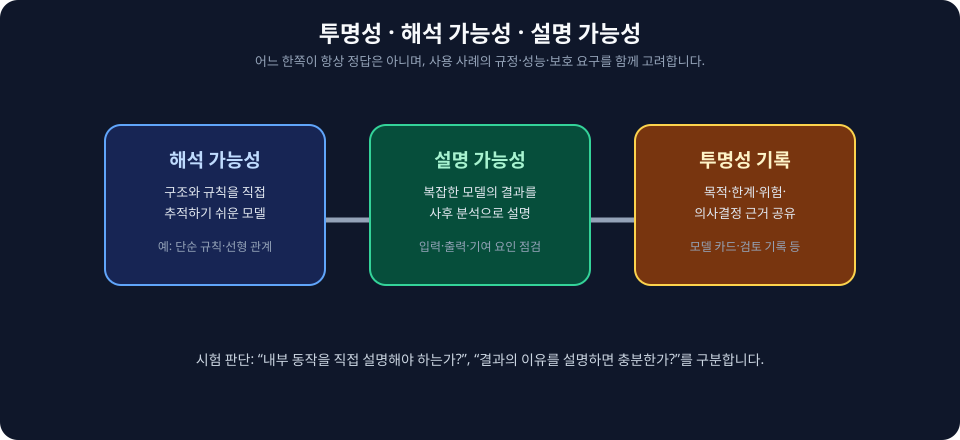
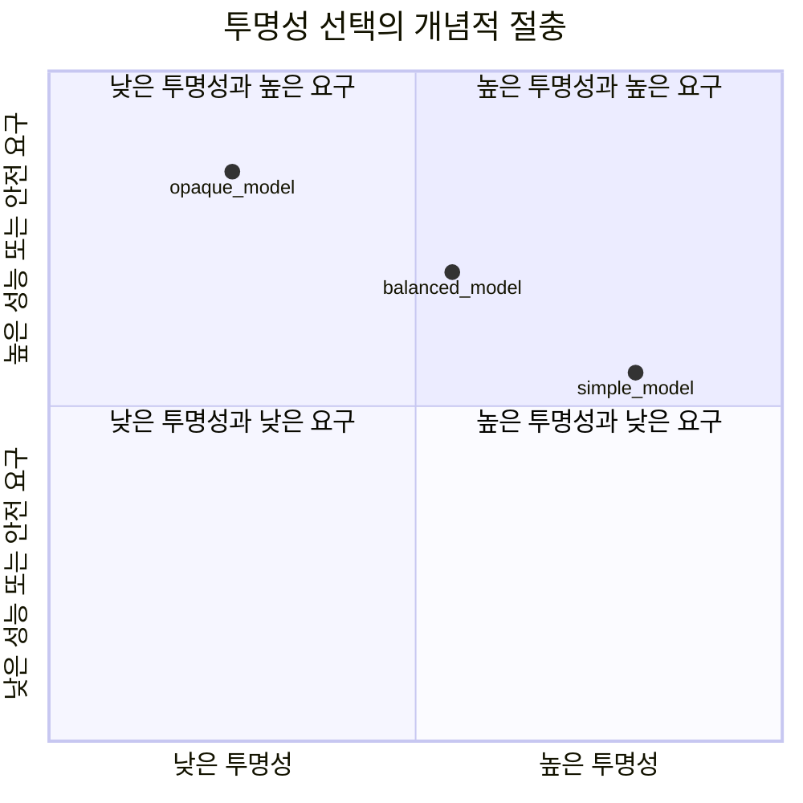

<!-- metadata-badges -->

<kbd>도메인 D4</kbd> <kbd>입문</kbd> <kbd>초안</kbd>

# AIF-C01 Task 4.2 Part 1 - 투명·설명 가능한 모델 중요도 / 투명성 vs 해석 vs 설명 / 절충 관계

> 투명/설명 가능한 모델 중요도 인식, 2개 강의 중 1번째

## 1. AI 신뢰 과제 - 의사결정 방법·이유 이해 능력

- AI 직면 가장 큰 과제이자 신뢰받을 수 있는 능력 = AI 모델 의사결정 내리는 방법·이유 이해 능력

### 모델 투명성 정의

- ML 소유자/이해 관계자 모델 작동 방식/모델에서 출력 생성 이유 이해할 수 있는 정도 측정
- 소비자 편향/불공정 보호 위해 필요한 투명성 정도 **규제 요구 사항 따라 달라지는 경우 많음**

## 2. 투명성 2가지 척도 (시험 중요)

| 척도 | 설명 | 예시 |
| :--- | :--- | :--- |
| **해석 가능성 (Interpretability)** | 매우 투명한 모델, 해석하기 쉬운 알고리즘 사용, 내부 메커니즘이 출력 미치는 영향 문서화 가능 | **선형 회귀:** 가장 기본 형태 선 기울기/절편, 이러한 기울기/절편 모델 어떻게 사용 보임 / **의사결정 트리:** 약간 더 복잡 but 기본적/이해 쉬운 규칙 생성 |
| **설명 가능성 (Explainability)** | 방법 정확히 알지 못한 채 모델 수행 작업 설명 가능, 모델 블랙박스 취급, 모든 모델 관찰/설명 가능, 내부 메커니즘 고려 안함, 모델 독립적 접근 방식 사용 실제 질문 답 가능, 이 수준 설명 가능성만으로도 비즈니스 목표 충족 충분한 경우 많음 | 예) 이메일 스팸 플래그된 이유 / 개인 대출 신청 거부 이유 알고 싶음 / 해석 가능성 낮은 모델도 특정 입력 기준 출력 관찰해 설명 가능 |

- 스펙트럼 반대쪽: 인간 뇌 작동 방식 모방 **신경망**, 뇌 약 1,000억 개 뉴런 네트워크 통해 전파 전기 신호 작동 이해 가능 but 해당 프로세스 어떻게 특정 생각 변환되는지 정말 이해 못함

### 프로젝트 시작 시 고려

- 새 AI/ML 프로젝트 시작 시 **해석 가능성 어려운 비즈니스 요구 사항인지** 알아야 함
- 완전한 모델 투명성 규정/비즈니스 요구 있으면 **해석 가능한 모델 선택** 필요
- 해석 가능성 통해 내부 메커니즘이 출력 미치는 영향 문서화 가능, 설명 가능성은 내부 메커니즘 고려 안함

## 3. 투명 모델 선택 시 절충 관계 2가지 (시험 암기)

### 1) 성능 vs 투명성

- 복잡도 낮은 모델 해석 쉬움, 그러나 단순 모델 기능/성능 제한적
- 예) 언어 번역 모델: 각 단어 찾아 다른 언어 단어로 대체 가능, 몇 가지 기본 문법 규칙 따를 수도 있지만 유창 번역 생성 못함
- 전체 문장 컨텍스트 이해 신경망은 유창 번역 생성
- **덜 복잡 알고리즘 선택하면 투명성 개선 but 일반적으로 성능 저하** 그래프 보여줌

### 2) 안전성 vs 투명성

- 투명성 부족 단점 있지만 투명한 AI 모델은 **해커 내부 메커니즘 더 많은 정보 + 취약성 찾을 수 있어 공격 더 취약**
- 더 불투명 모델은 공격자 모델 출력 연구해 학습할 수 있는 것으로만 제한
- 모델 아티팩트 적절 보호하는 것은 투명한 모델 중요
- 또 다른 우려 = **독점 알고리즘 노출**, 공격자 액세스 가능 AI 모델 동작 설명 많을수록 AI 모델 더 쉽게 **리버스 엔지니어링** 가능
- 투명성 유지하면서 고객 데이터 개인정보 보호 보장 어려움, 투명성 위해 모델 훈련 사용 데이터 세부 공유 필요할 수 있으며 이로 인해 데이터 개인정보 보호 우려 제기

## 4. 시험 체크포인트

- AI 과제 신뢰 능력 AI 모델 의사결정 방법 이유 이해 능력 투명성 ML 소유자 이해 관계자 모델 작동 방식 출력 생성 이유 이해 정도 측정 소비자 편향 불공정 보호 필요 투명성 정도 규제 요구 사항 따라 달라 투명성 2척도 해석 가능성 설명 가능성 매우 투명한 모델 선형 회귀 해석 쉬운 알고리즘 기울기 절편 기울기 절편 모델 사용 보임 의사결정 트리 약간 더 복잡 기본 이해 쉬운 규칙 생성 반대 신경망 인간 뇌 작동 모방 1,000억 뉴런 네트워크 전파 전기 신호 작동 이해 해당 프로세스 특정 생각 변환 이해 못함 해석 가능성 낮은 모델 특정 입력 기준 출력 관찰 설명 가능 설명 가능성 방법 정확히 알지 못한 채 수행 작업 설명 가능 블랙박스 취급 모든 모델 관찰 설명 가능 모델 독립적 접근 실제 질문 답 이메일 스팸 플래그 이유 개인 대출 거부 이유 알고 싶음 수준 설명 가능성 비즈니스 목표 충족 충분 많은 경우
- 프로젝트 시작 해석 가능성 어려운 비즈니스 요구 사항 알아야 완전 모델 투명성 규정 비즈니스 요구 있으면 해석 가능한 모델 선택 해석 가능성 내부 메커니즘 출력 미치는 영향 문서화 설명 가능성 내부 메커니즘 고려 안함
- 절충 관계 성능 보안 복잡도 낮은 모델 해석 쉬움 단순 모델 기능 성능 제한 예) 언어 번역 각 단어 찾아 다른 언어 단어 대체 기본 문법 따를 수도 유창 생성 못함 전체 문장 컨텍스트 이해 신경망 유창 생성 덜 복잡 선택 투명성 개선 일반적으로 성능 저하 그래프 안전성 관점 투명성 부족 단점 투명한 모델 해커 내부 메커니즘 더 많은 정보 취약성 찾을 수 공격 더 취약 불투명 모델 공격자 출력 연구 학습 제한 아티팩트 적절 보호 투명한 모델 중요 또 다른 우려 독점 알고리즘 노출 공격자 액세스 동작 설명 많을수록 쉽게 리버스 엔지니어링 투명성 유지 고객 데이터 개인정보 보호 보장 어려움 투명성 위해 훈련 사용 데이터 세부 공유 필요 개인정보 보호 우려

## 시각 학습 보조

이 그림은 투명성을 늘릴 때에도 민감 정보 노출과 오해 가능성을 함께 고려해야 한다는 절충 관계를 나타냅니다. 적절한 공개 수준은 사용자, 위험, 규정 준수 요구에 따라 달라집니다.

## 학습 문서 메타데이터

- 도메인: D4 — 책임 있는 AI에 대한 가이드라인
- 원본 보존 링크: [AIF-C01-Task4-2-Part1.md](../../../docs/Refs/AIF-C01-Task4-2-Part1.md)
- 이 문서는 원본 본문을 보존한 복사본이며, 이 섹션·도식·네비게이션은 학습용으로 추가했습니다.

이 사분면 차트는 모델 선택에서 성능·투명성 및 안전성·투명성의 두 축 절충을 개념적으로 비교합니다. 점의 위치는 실제 수치가 아니라 설명 가능성과 보호 요구를 판단하는 예시입니다.

---

[이전](../task-4-1/part-3.md) | [인덱스](README.md) | [다음](part-2.md)
