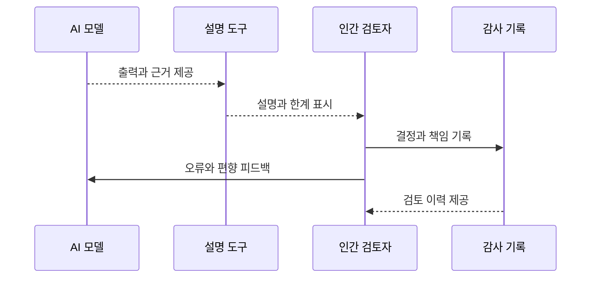

  

# AIF-C01 Task 4.2 Part 2 - 투명성·설명 가능성 목표 충족 도구 / 오픈 소스·서비스 카드·Model Cards·Shapley·PDP·인간 중심·A2I·RLHF (4.2 마무리)

> 투명성·설명 가능성 목표 충족 모델 선택 도움 도구, 2개 강의 중 2번째

## 1. 오픈 소스 소프트웨어 - 투명성 극대화

- 협업 통해 공개적 개발, **GitHub** 같은 플랫폼 오픈 소스 AI 프로젝트 리포지토리 제공
- 모든 것 공유→사용자 모델 구성/내부 작동 이해 가능→**투명성 극대화**
- AI 모델 내부 작동 면밀 검토 가능→**공정성 확신 심어줌**
- 전 세계 많은 사용자 기여→개발자 다양성 증가→**편향 감소**
- 더 많은 사람 참여→편향/코딩 문제 발견 가능성↑

### 단점 - 안전성 우려

- 투명성 극대화하므로 일부 회사 모델 안전성 우려
- 직원들 오픈 소스 코드 사용 개발 또는 이러한 코드로 개발된 모델 사용 못하도록 차단
- 독점 개발 선호→안전 이유 모델 투명성 제한

## 2. AWS 호스팅 완전 훈련 모델 - API만 상호 작용

- 완전히 훈련 모델 사용 경우 API와만 상호 작용 모델 직접 액세스 불가
- AWS는 책임감 있는 AI 핵심 차원 처리 방법 관련 **투명해야 함**

### AI 서비스 카드 (AI Service Cards)

- 책임감 있는 AI 문서 형태
- **의도 사용 사례/제한 사항/책임감 있는 AI 설계 선택/배포·성능 최적화 모범 사례** 알아볼 수 있는 단일 장소 고객 제공
- 현재 여러 AI 서비스 API에 대한 카드 있음
  - **Amazon Rekognition 얼굴 일치**
  - **Amazon Textract ID 분석**
  - **Amazon Comprehend PII 탐지**
  - **Amazon Bedrock Amazon Titan Text** FM에 대한 카드

### SageMaker Model Cards

- 사용자 생성 모델 경우 **SageMaker Model Cards** 사용 설계/구축/훈련/평가까지 모델 **수명 주기 문서화** 가능
- 모델 카드 생성 시 SageMaker는 SageMaker에서 훈련 모델 세부 정보 카드 자동 채움
  - 예) 모델 훈련 방법/사용 데이터세트/컨테이너 포함

## 3. SageMaker Clarify 설명 가능성 보고

### Shapley 값 기반 특성 기여도

- 편향 보고 외 설명 가능성 보고도 수행 가능
- **Shapley 값 개념 기반 특성 기여도** 제공
- Shapley 값 사용 각 특성 모델 예측 기여 정도 확인 가능
- 막대 차트 예) 모델 사용 가장 영향력 있는 **상위 4가지 특성** 보여줌

### 부분 종속성 도표 (Partial Dependence Plot, PDP)

- Clarify 사용 가능 또 다른 분석 유형
- 특성 값 따라 모델 예측 변하는 방식 보여줌
- 예) 연령 살펴봄

## 4. 인간 중심 AI

- 더 많은 사람 AI 개발/설계 참여 방법 집중
- **인간 중심 AI = 인간 요구 사항/가치 우선 처리 AI 시스템 설계**
- 설계자/개발자 **학제 간 협업 참여**, 다양한 관점/전문 지식 수집 위해 **심리학자/윤리학자/도메인 전문가 참여** 많음
- 사용자 AI 진정 유익/사용자 친화적 확인 위해 개발 프로세스 참여
- 목표 = 인간 능력 **대체 아닌 향상**
- 지금까지 논의 윤리적 AI 원칙 일치, AI가 투명/설명 가능/공정/편향 없음/개인정보 유지 가능하도록 인간 개발 각 단계 참여

## 5. Amazon Augmented AI (A2I) - 인간 검토 통합

- AWS AI 서비스/사용자 지정 모델 수행 추론 샘플 인간 검토 통합
- **신뢰도 점수 낮은 추론** 클라이언트 보내기 전 인간 검토자 보내도록 구성 가능
- 피드백 훈련 데이터 추가해 모델 재훈련 가능
- 신뢰도 낮은 추론 검토 외 인간 검토자 모델 감사 방법 **무작위 예측 검토**하도록 할 수 있음
- 조직 검토자 풀 사용 또는 **Mechanical Turk** 사용 가능
- 각 예측 검토 필요 검토자 수 구성

**사용 사례 예:**
- Amazon Rekognition 사용 노골적/공격적 콘텐츠 포함 이미지 탐지 가정
- 인간 통과 못하는 노골적 특정 콘텐츠 될 신뢰도 낮은 Rekognition 예측 검토 가능

## 6. RLHF - 인간 피드백 통한 강화 학습

- 대규모 언어 모델 진실/무해/유용한 콘텐츠 생성 위한 **산업 표준 기법**
- **강화 학습(RL) 기법 = 보상 최대화 결정 내리도록 모델 훈련해 출력 더 정확**하게 만듦
- **RLHF = 인간 피드백 보상 기능 통합**→ML 모델 인간 목표/필요/요구 더 부합 태스크 수행

### 보상 모델 훈련 프로세스

1. **보상 모델 역할 별도 모델 훈련**
2. 보상 모델은 동일 프롬프트 LLM 여러 응답 검토 + 선호 응답 표시 사람 훈련
3. 선호도 보상 모델 훈련 데이터 됨, 훈련되면 인간 프롬프트 응답 얼마나 높은 점수 줄지 예측 가능
4. LLM에서 보상 모델 사용 최대 보상 위해 응답 구체화

### SageMaker Ground Truth로 선호도 수집

- RLHF 인간 선호도 가장 쉽게 수집 가능
- 훈련 데이터 레이블 지정 논의 시 설명한 서비스
- 스크린샷 예) 인간 작업자 여러 응답 제시 + 명확성 위해 각 응답 순위 매기도록 요청

## 7. 시험 체크포인트

- 오픈 소스 협업 공개적 개발 GitHub 리포지토리 제공 모든 것 공유 구성 내부 작동 이해 가능 투명성 극대화 내부 작동 면밀 검토 공정성 확신 전 세계 많은 사용자 기여 다양성 증가 편향 감소 더 많은 사람 편향 코딩 문제 발견 가능성↑ 단점 투명성 극대화 일부 회사 안전성 우려 직원 오픈 소스 사용 개발 코드로 개발 모델 사용 차단 독점 선호 안전 이유 투명성 제한
- AWS 호스팅 완전 훈련 모델 API만 상호 작용 직접 액세스 불가 AWS 책임감 있는 AI 핵심 차원 처리 방법 투명해야 AI 서비스 카드 책임감 있는 AI 문서 형태 의도 사용 사례 제한 사항 설계 선택 배포 성능 최적화 모범 사례 단일 장소 고객 제공 여러 AI 서비스 API 카드 Rekognition 얼굴 일치 Textract ID 분석 Comprehend PII 탐지 Bedrock Titan Text FM 카드 사용자 생성 모델 SageMaker Model Cards 설계 구축 훈련 평가 수명 주기 문서화 생성 SageMaker 훈련 모델 세부 정보 자동 채움 훈련 방법 데이터세트 컨테이너 포함
- Clarify 설명 가능성 보고 편향 보고 외 설명 가능성 보고 Shapley 값 개념 특성 기여도 제공 Shapley 값 각 특성 예측 기여 정도 확인 막대 차트 가장 영향 상위 4 특성 PDP 부분 종속성 도표 특성 값 따라 예측 변하는 방식 연령
- 인간 중심 AI 더 많은 사람 참여 방법 인간 요구 가치 우선 처리 설계 학제 간 협업 심리학자 윤리학자 도메인 전문가 참여 다양한 관점 전문 지식 수집 사용자 진정 유익 사용자 친화 확인 개발 프로세스 참여 목표 능력 대체 아닌 향상 윤리적 AI 원칙 일치 투명 설명 가능 공정 편향 없음 개인정보 유지 인간 개발 각 단계 참여
- A2I 인간 검토 통합 AWS AI 서비스 사용자 지정 모델 추론 샘플 인간 검토 통합 신뢰도 낮은 추론 클라이언트 전 인간 검토자 보내도록 구성 피드백 훈련 데이터 추가 재훈련 신뢰도 낮은 검토 외 감사 방법 무작위 예측 검토 조직 검토자 풀 Mechanical Turk 사용 각 예측 검토 필요 검토자 수 구성 사용 사례 Rekognition 노골 공격 콘텐츠 포함 이미지 탐지 인간 통과 못하는 노골 특정 콘텐츠 신뢰도 낮은 예측 검토
- RLHF 대규모 언어 모델 진실 무해 유용 생성 산업 표준 RL 보상 최대화 결정 모델 훈련 출력 더 정확 RLHF 인간 피드백 보상 기능 통합 인간 목표 필요 요구 부합 태스크 수행 보상 모델 역할 별도 모델 훈련 보상 모델 동일 프롬프트 여러 응답 검토 선호 표시 사람 훈련 선호도 훈련 데이터 훈련되면 인간 점수 예측 가능 LLM 보상 모델 사용 최대 보상 응답 구체화 Ground Truth 인간 선호도 가장 쉽게 수집 훈련 데이터 레이블 지정 설명 서비스 여러 응답 제시 명확성 순위 매기도록 요청

## 학습 문서 메타데이터

- 도메인: D4 — 책임 있는 AI에 대한 가이드라인
- 원본 보존 링크: [AIF-C01-Task4-2-Part2.md](../../../docs/Refs/AIF-C01-Task4-2-Part2.md)
- 이 문서는 원본 본문을 보존한 복사본이며, 이 섹션·도식·네비게이션은 학습용으로 추가했습니다.

이 시퀀스 다이어그램은 AI 출력이 설명·인간 검토·결정 기록으로 이어지고 피드백이 다시 모델 개선으로 돌아오는 시간 순서의 상호작용을 보여 줍니다. Mermaid가 렌더링되지 않아도 책임과 감사 증적의 흐름을 읽을 수 있습니다.

---

[이전](part-1.md) | [인덱스](README.md) | 없음
