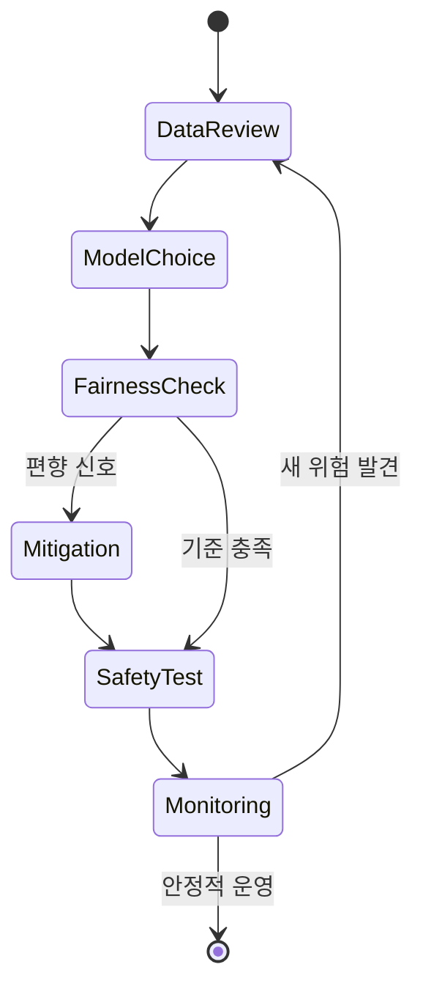

<!-- metadata-badges -->

<kbd>도메인 D4</kbd> <kbd>입문</kbd> <kbd>초안</kbd>

# AIF-C01 Task 4.0 Overview - 영역 4 : 책임감 있는 AI 가이드라인

> 윤리/공정/투명/설명 가능, 2개 태스크 목표

## 영역 4 구성

- **Task 4.1:** 윤리적이고 공정한 AI 시스템 개발 설명
- **Task 4.2:** 투명하고 설명 가능한 모델 중요도 인식

## Task 4.1 요구 사항 - 윤리적이고 공정한 AI 시스템 개발

- 책임감 있는 AI 개념 이해
- 책임감 있는 AI 시스템 특성/특징 + 도움 되는 도구 사용 방법 식별 가능해야 함
- 책임감 있는 AI 원칙이 **모델 선택/위험 평가/데이터세트 특성** 미치는 영향 이해
- 책임감 있는 AI 컨텍스트에서 **편향과 분산 개념** 이해
- 편향 모니터링/탐지 + 모델 신뢰성/진실성 평가 사용 가능한 도구 이해

## Task 4.2 요구 사항 - 투명/설명 가능한 모델

- 책임감 있는 AI 큰 태스크인 **모델 추론 투명성/설명 가능성** 이해
- 모델을 투명/설명 가능하게 만드는 요소 + 모델 출력 설명 사용 가능한 도구 이해
- 모델 **안전성 vs 투명성 절충 관계** 식별 가능
- **인간 중심 설계**가 더 설명 가능한 AI 생성 도움 방식 이해

## 시험 체크포인트

- 영역 4 책임감 있는 AI 가이드라인 2개 태스크 목표 4.1 윤리적 공정한 AI 시스템 개발 설명 4.2 투명 설명 가능한 모델 중요도 인식 4.1 책임감 있는 AI 개념 특성 특징 도움 도구 사용 방법 식별 책임감 있는 AI 원칙 모델 선택 위험 평가 데이터세트 특성 영향 편향 분산 개념 이해 편향 모니터링 탐지 모델 신뢰성 진실성 평가 도구 이해 4.2 책임감 있는 AI 큰 태스크 모델 추론 투명성 설명 가능성 이해 모델 투명 설명 가능하게 만드는 요소 출력 설명 도구 안전성 투명성 절충 관계 식별 인간 중심 설계 더 설명 가능한 AI 생성 도움

## 학습 문서 메타데이터

- 도메인: D4 — 책임 있는 AI에 대한 가이드라인
- 원본 보존 링크: [AIF-C01-Task4-Intro.md](../../../docs/Refs/AIF-C01-Task4-Intro.md)
- 이 문서는 원본 본문을 보존한 복사본이며, 이 섹션·도식·네비게이션은 학습용으로 추가했습니다.

이 상태 다이어그램은 책임 있는 AI가 대표성 있는 데이터에서 시작해 공정성·견고성 검토와 배포 후 모니터링으로 전환되는 과정을 보여 줍니다. Mermaid가 렌더링되지 않아도 위험 완화와 피드백의 순서를 읽을 수 있습니다.

---

없음 | [인덱스](README.md) | [다음](../task-4-1/part-1.md)
