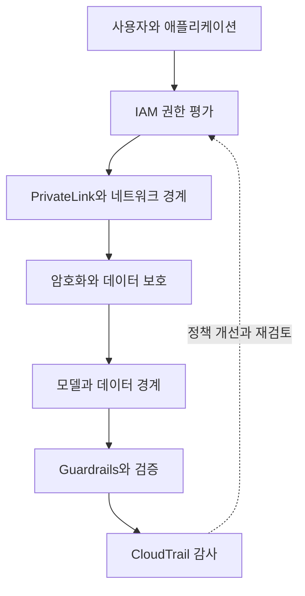

  

# D5 — AI 솔루션의 보안, 규정 준수 및 거버넌스

- 공식 도메인: [AI 솔루션의 보안, 규정 준수 및 거버넌스](https://docs.aws.amazon.com/ko_kr/aws-certification/latest/ai-practitioner-01/ai-practitioner-01-domain5.html)
- 공식 가중치: **14%**
- 문서 상태: `draft` — 공식 출처 revision과 기술 행은 현재 sources/ 기록에 따라 검증 보류 상태입니다.

## 학습 순서

- [Task 5 보안·규정 준수·거버넌스 개요](./task-5/README.md)
- [Task 5.1 AI 시스템 보안](./task-5-1/README.md)
- [Task 5.2 AI 시스템 거버넌스와 규정 준수](./task-5-2/README.md)

## 원본 보존

원본 57개는 모두 docs/Refs/에 그대로 보존합니다. 이 디렉터리의 문서는 원본을 복사한 뒤 메타데이터·도식·네비게이션만 추가한 학습용 파생본입니다.

렌더러 없이도 노드와 화살표로 도메인의 학습 흐름을 읽을 수 있습니다.

---

[이전 도메인](../D4/README.md) | [Contents 인덱스](../README.md) | 다음: 없음
