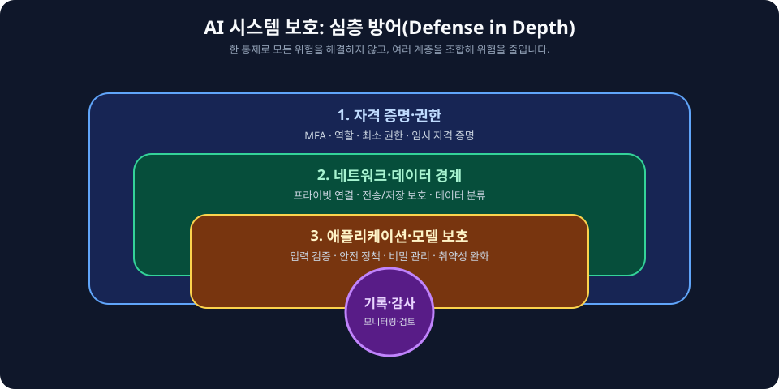
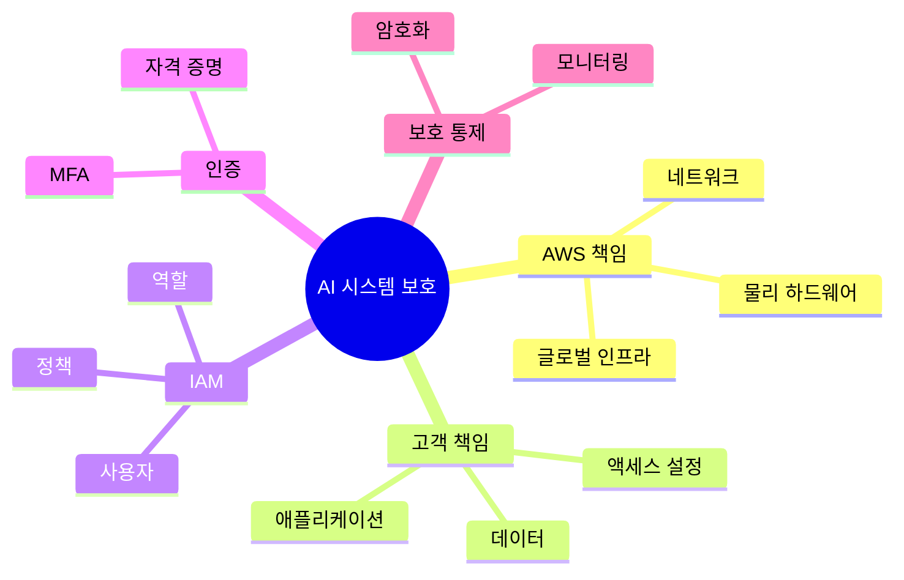

# AIF-C01 Task 5.1 Part 1 - AI 시스템 보호 / 공동 책임 모델 / 클라우드 자체 vs 클라우드 내 / IAM / 루트 / MFA / IAM 사용자

> AI 시스템 보호 방법, 6개 강의 중 1번째

## 1. 공동 책임 모델 (Shared Responsibility Model)

- AWS 보안/규정 준수 AWS와 고객 공동 책임
- **공동 책임 모델 생성:** 고객 책임/ AWS 책임 분담 보여줌
- **분담 책임:**
  - **고객 책임 = 클라우드 내 보안 (Security IN the cloud)**
  - **AWS 책임 = 클라우드 자체 보안 (Security OF the cloud)**
- **클라우드 자체 AWS 보호:** 데이터 센터/네트워킹/물리적 하드웨어 같은 클라우드 자체 AWS 보호, AWS 이러한 리소스 클라우드 기반 웹 서비스로 고객 제공
- **고객 책임:** 액세스 제한/암호화 사용/권장 모범 준수해 서비스 안전한 방식 사용 책임

### AWS 책임 상세

- 건물 물리 보안까지 포함 AWS 리전/가용 영역/데이터 센터 포함 **글로벌 인프라 보호/보안**
- 물리 서버/호스트 OS/가상화 계층/AWS 네트워킹 구성 요소 같은 AWS 서비스 실행 하드웨어/소프트웨어/네트워킹 구성 요소 관리

### 고객 책임 - 구성 책임 + 서비스 따라 달라짐

- AWS 서비스 사용 시 데이터 보안 보장 외 서비스/애플리케이션 올바르게 구성 책임
- 책임 수준 서비스 따라 달라짐
  - **EC2에 AI 모델 배포 선택:** 인스턴스 OS/보안 패치/크기 조정/실행 애플리케이션 보안 책임 사용자
  - **SageMaker 서버리스 추론 사용 모델 호스팅:** 완전관리형 서비스 고객 거의 관리 필요 없음, AWS 모든 기본 인프라 관리→인스턴스/크기 조정 정책 관리 필요 없음

## 2. IAM - 자격 증명/액세스 관리 기본

- 고객 AWS 안전한 방식 사용 책임
- **IAM (Identity and Access Management)** = 고객 계정 권한 관리 방법, AWS 계정/리소스 액세스 관리/보호 도움 웹 서비스
- IAM 사용 AWS 사용자 생성/관리 + 계정 서비스 사용 권한 부여 가능
- **IAM 권한 정책 할당**해 사용자 리소스 수행 작업 결정→수행 작업 제어
- **IAM 글로벌 리소스** 특정 리전 국한 X, 그러나 사용자 권한 특정 리전 제한 가능
- AWS 서비스와 통합, 사용자 계정 리소스 수행 작업 관리 사용
- 암호/액세스 키 공유 않고 다른 사용자 AWS 계정 리소스 관리/사용 권한 부여 가능
- **다중 인증(MFA) 지원**, 보안 강화 위해 MFA 계정/개별 사용자 추가 가능
- **ID 페더레이션 지원**, 암호 이미 기업 네트워크/인터넷 자격 증명 공급자 같은 다른 위치 사용자 AWS 계정 일시 액세스 허용 가능
- **추가 비용 없음** AWS 계정 기능, IAM 사용자 사용 다른 AWS 서비스 액세스 시만 요금 청구

## 3. 루트 사용자 (Root User)

- AWS 계정 처음 생성 시 계정 모든 서비스/리소스 완전 액세스 단일 자격 증명으로 시작 = **AWS 루트 사용자**
- 루트 계정 생성 사용 이메일 주소/암호 로그인 액세스
- **루트 권한 제한 불가**→자격 증명 안전 보관 필요
- 안전 보장:
  - 계정 생성 시 **강력한 암호 선택 + MFA 사용**
  - 루트 암호/액세스 키 누구와도 공유 X
  - 루트 연결 액세스 키 다른 사용자 생성되면 필요 없으므로 **사용 중지/삭제**
  - 결제 계정 관리 같이 필요 몇 가지 작업 제외 루트 사용자 사용 안하는 것이 가장 좋음
  - 대신 **IAM 사용자 생성 일상 태스크 사용**, 관리 액세스 권한 정책 해당 사용자 할당 필요 모든 권한 부여 가능

## 4. 인증 - 단일 요소 vs MFA

- 사용자 이름/암호 로그인 = **단일 요소 인증**, 가장 간단/가장 일반 인증 형태
- 루트 강력 암호 선택해도 계정 여전히 위험 상태
  - 악의적 행위자 소셜 엔지니어링/봇/스크립트 통해 암호 알아내면 계정 액세스 중요 데이터 삭제 가능, 비용 많이 드는 가상 화폐 채굴 작업 가동 요금 청구 가능
- 보호 위해 **MFA 사용**
  - MFA 사용 시 누군가 사용자 이름/암호 추측/알아내더라도 계정 액세스 불가
  - 소유 물리/가상 MFA 디바이스 생성 번호 필요
  - AWS 계정 생성 직후 MFA 사용 권장

## 5. IAM 사용자 생성 원칙

- IAM 사용자 = AWS 생성 자격 증명, AWS 서비스/리소스 상호 작용 사람 나타냄, 이름/자격 증명 구성
- 여러 사용자 동일 수준 액세스 필요해도 AWS 액세스 필요 각 사용자 개별 IAM 사용자 생성 가장 좋음
- 각 사용자 고유 보안 자격 증명 제공, 자격 증명 공유 안됨, 공유 시 어떤 사용자 작업 수행 알 수 없게 됨
- 기본 새 IAM 사용자 생성 시 연결 권한 없음
- IAM 사용자 특정 작업 수행 허용하려면 필요 권한 부여 필요

## 6. 시험 체크포인트

- 보안 규정 준수 AWS 고객 공동 책임 공동 책임 모델 고객 책임 AWS 책임 분담 고객 책임 클라우드 내 보안 AWS 책임 클라우드 자체 보안 클라우드 자체 데이터 센터 네트워킹 물리 하드웨어 AWS 보호 클라우드 기반 웹 서비스 고객 제공 고객 액세스 제한 암호화 모범 준수 안전한 방식 사용 책임 AWS 글로벌 인프라 리전 가용 영역 데이터 센터 물리 보안까지 보호 보안 물리 서버 호스트 OS 가상화 계층 네트워킹 구성 요소 하드웨어 소프트웨어 네트워킹 관리 고객 데이터 보안 보장 외 서비스 애플리케이션 올바르게 구성 책임 책임 수준 서비스 따라 달라 EC2 AI 모델 배포 OS 보안 패치 크기 조정 애플리케이션 보안 책임 사용자 SageMaker 서버리스 추론 모델 호스팅 완전관리형 거의 관리 필요 없음 AWS 모든 기본 인프라 관리 인스턴스 크기 조정 정책 관리 필요 없음
- IAM 고객 안전한 방식 사용 책임 IAM 자격 증명 액세스 관리 계정 권한 관리 방법 계정 리소스 액세스 관리 보호 도움 웹 서비스 사용자 생성 관리 서비스 사용 권한 부여 권한 정책 할당 수행 작업 결정 제어 글로벌 리소스 특정 리전 국한 X 권한 특정 리전 제한 가능 서비스와 통합 암호 액세스 키 공유 않고 다른 사용자 리소스 관리 사용 권한 부여 MFA 지원 보안 강화 MFA 계정 개별 사용자 추가 ID 페더레이션 지원 암호 기업 네트워크 인터넷 자격 증명 공급자 다른 위치 사용자 일시 액세스 허용 추가 비용 없음 계정 기능 다른 서비스 액세스 시만 요금
- 루트 사용자 계정 처음 생성 모든 서비스 리소스 완전 액세스 단일 자격 증명 이메일 암호 로그인 액세스 권한 제한 불가 자격 증명 안전 보관 강력한 암호 MFA 사용 암호 액세스 키 공유 X 액세스 키 다른 사용자 생성되면 필요 없으므로 중지 삭제 결제 계정 관리 필요 작업 제외 사용 안함 IAM 사용자 생성 일상 태스크 사용 관리 액세스 권한 정책 할당 필요 권한 부여
- 인증 사용자 이름 암호 단일 요소 인증 가장 간단 일반 강력 암호 선택해도 위험 소셜 엔지니어링 봇 스크립트 암호 알아내면 액세스 데이터 삭제 가상 화폐 채굴 가동 요금 청구 보호 MFA 소유 물리 가상 MFA 디바이스 생성 번호 필요 계정 생성 직후 MFA 권장
- IAM 사용자 AWS 생성 자격 증명 서비스 리소스 상호 작용 사람 이름 자격 증명 구성 여러 사용자 동일 수준 액세스 필요해도 각 사용자 개별 생성 가장 좋음 고유 보안 자격 증명 제공 공유 안됨 공유 시 어떤 사용자 작업 알 수 없음 기본 새 사용자 권한 없음 특정 작업 수행 허용 필요 권한 부여 필요

## 시각 학습 보조

이 그림은 AI 시스템 보안을 한 가지 설정이 아니라 여러 계층의 통제로 보는 관점을 요약합니다. AWS와 고객의 책임 경계는 사용한 서비스와 구성에 따라 달라지므로, 해당 서비스의 공동 책임 안내를 확인합니다.

## 학습 문서 메타데이터

- 도메인: D5 — AI 솔루션의 보안, 규정 준수 및 거버넌스
- 원본 보존 링크: [AIF-C01-Task5-1-Part1.md](../../../docs/Refs/AIF-C01-Task5-1-Part1.md)
- 이 문서는 원본 본문을 보존한 복사본이며, 이 섹션·도식·네비게이션은 학습용으로 추가했습니다.

이 마인드맵은 AI 시스템 보호를 공동 책임, IAM, MFA, 데이터 보호, 애플리케이션 보안으로 나누어 중심 개념에서 가지가 뻗는 구조를 보여 줍니다. Mermaid가 렌더링되지 않아도 AWS와 고객 책임의 계층을 읽을 수 있습니다.

---

[이전](../task-5/intro.md) | [인덱스](README.md) | [다음](part-2.md)
