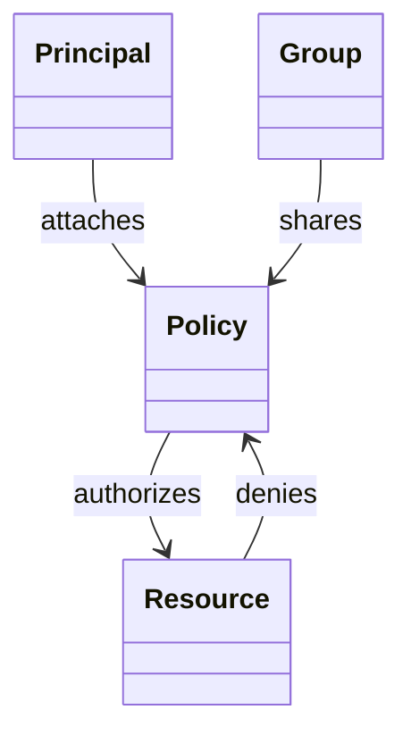

  

# AIF-C01 Task 5.1 Part 2 - IAM 정책 JSON·최소 권한·IAM 그룹·IAM 역할·임시 자격 증명·신뢰 정책·자격 증명 기반 vs 리소스 기반

> AI 시스템 보호, 6개 강의 중 2번째

## 1. IAM 정책

- IAM 정책 = AWS 서비스/리소스 권한 허용/거부 **JSON 문서**
- 리소스 사용자 액세스 수준 사용자 지정 가능
- **최소 권한 원칙:** 태스크 완료 필요 권한만 부여 가장 좋음
- 예) EC2 인스턴스 시작/중지 허용 JSON 문서 예

### IAM 그룹 필요성

- 사용자 수준 정책 할당 권한 부여 좋지만 3,000명 사용자 있으면 관리 어려움
- 완화 위해 **IAM 그룹 생성**
- IAM 그룹 = IAM 사용자 모음
- IAM 정책 그룹 할당→정책 지정 권한 그룹 모든 사용자 부여
- 관리: **작업 기능별 그룹 구성** 권장
  - 예) 개발자=IAM 개발자 그룹 / 테스터=IAM QA 그룹 / 관리자=IAM 관리자 그룹
  - 고유 IAM 정책 생성 개별 사용자 아닌 그룹 할당 가능
- **그룹 여러 사용자 포함 가능, 사용자 여러 그룹 속 가능, 그룹 다른 그룹 속 불가**
- 정책 그룹 연결 + 사용자 있어야 고유 권한 해당 사용자만 연결 가장 좋음

## 2. IAM 역할 - 임시 보안 자격 증명

- 사용자/그룹 연결 권한 정책 = **수명 긴 자격 증명** 사용 AWS 리소스 액세스
- 자격 증명 손상되면 다른 사용자 사용 가능
- 예) 개발자 AWS 자격 증명 자신이 작성 소프트웨어 포함 코드 공유 전 자격 증명 삭제 잊음

### 더 좋은 방법 IAM 역할

- **IAM 역할 = 개인 또는 AWS 서비스 다른 AWS 리소스/서비스 임시 액세스 위해 맡을 수 있는 자격 증명**
- 역할 맡으면 세션 임시 보안 자격 증명 얻음, **자동 만료**
- IAM 역할은 **IAM 사용자 / AWS 서비스 / 외부 자격 증명 제공업체 인증 받은 사용자** 사용 가능
- 각 IAM 역할에는 역할 맡을 수 있는 엔터티 결정 연결된 **신뢰 정책 (Trust Policy)** 있음

## 3. 자격 증명 기반 vs 리소스 기반 정책

- IAM 사용자/그룹/역할 연결 권한 정책 = **자격 증명 기반 정책**
- 권한 정책 리소스 수준에서도 적용 가능
  - 예) AWS 정책 버킷/객체 액세스 가능 사용자/서비스 제어 S3 버킷 적용 = **리소스 기반 정책**

### 결과 권한 계산

- 결과 권한 = 두 유형 총 권한
- 자격 증명 기반 정책 / 리소스 기반 정책 / 둘 다에서 작업 허용 → AWS 해당 작업 허용
- 이러한 정책 중 하나에서 **명시적 거부 시 허용 재정의** → 거부됨 (Explicit Deny overrides Allow)

## 4. 시험 체크포인트

- IAM 정책 AWS 서비스 리소스 권한 허용 거부 JSON 문서 리소스 사용자 액세스 수준 사용자 지정 최소 권한 보안 원칙 태스크 완료 필요 권한만 부여 가장 좋음 EC2 시작 중지 허용 JSON 예 사용자 수준 정책 할당 권한 부여 좋지만 3,000명 액세스 관리 어려움 완화 IAM 그룹 생성 IAM 그룹 IAM 사용자 모음 정책 그룹 할당 권한 그룹 모든 사용자 부여 그룹 관리 작업 기능별 구성 권장 개발자 개발자 그룹 테스터 QA 그룹 관리자 관리자 그룹 고유 IAM 정책 생성 개별 아닌 그룹 할당 그룹 여러 사용자 포함 가능 사용자 여러 그룹 속 가능 그룹 다른 그룹 속 불가 정책 그룹 연결 고유 권한 해당 사용자만 연결 가장 좋음
- 사용자 그룹 연결 권한 정책 수명 긴 자격 증명 사용 자격 증명 손상 다른 사용자 사용 가능 소프트웨어 개발자 자격 증명 소프트웨어 포함 코드 공유 전 삭제 잊음 더 좋은 방법 IAM 역할 개인 AWS 서비스 다른 리소스 서비스 임시 액세스 맡을 수 있는 자격 증명 역할 맡으면 세션 임시 보안 자격 증명 얻음 자동 만료 역할 IAM 사용자 AWS 서비스 외부 자격 증명 제공업체 인증 사용자 사용 가능 각 역할 맡을 수 있는 엔터티 결정 연결된 신뢰 정책 있음
- 사용자 그룹 역할 연결 권한 정책 자격 증명 기반 정책 권한 정책 리소스 수준 적용 가능 AWS 정책 버킷 객체 액세스 가능 사용자 서비스 제어 S3 버킷 적용 리소스 기반 정책 결과 권한 두 유형 총 권한 자격 증명 기반 리소스 기반 둘 다 작업 허용 AWS 허용 정책 중 하나 명시적 거부 허용 재정의

## 학습 문서 메타데이터

- 도메인: D5 — AI 솔루션의 보안, 규정 준수 및 거버넌스
- 원본 보존 링크: [AIF-C01-Task5-1-Part2.md](../../../docs/Refs/AIF-C01-Task5-1-Part2.md)
- 이 문서는 원본 본문을 보존한 복사본이며, 이 섹션·도식·네비게이션은 학습용으로 추가했습니다.

이 클래스 다이어그램은 IAM 사용자·그룹·역할·정책이 권한 평가와 AI 리소스 접근에 연결되는 정적 관계를 보여 줍니다. Mermaid가 렌더링되지 않아도 최소 권한과 명시적 거부의 역할을 읽을 수 있습니다.

## 초보자 학습 보조

### 한 줄 요약과 선수 지식

- **한 줄 요약:** IAM 정책은 권한을 정의하고, 역할은 자동 만료되는 임시 자격 증명으로 사람·서비스·외부 사용자의 접근을 안전하게 연결합니다.
- **선수 지식:** 최소 권한은 업무에 필요한 작업과 리소스에만 접근을 허용하는 원칙입니다.

### 자주 하는 오해

- **오해:** 어떤 정책에서든 허용되면 AWS 작업은 실행된다.
  **바로잡기:** 정책 평가에 명시적 거부가 있으면 허용보다 우선합니다. 허용과 거부, 자격 증명 기반·리소스 기반 정책을 함께 봐야 합니다.

### 스스로 답하는 확인 질문

1. 장기 액세스 키보다 IAM 역할의 임시 자격 증명이 유리한 이유는 무엇인가요?
2. S3 버킷 정책의 명시적 거부가 사용자 정책의 허용보다 우선하는 이유는 무엇인가요?

### 공식 범위와 출처

- **시험 핵심:** 공식 Task 5.1의 IAM 역할, 정책, 권한, 데이터 액세스 제어 범위를 다룹니다.
- [콘텐츠 도메인 5: AI 솔루션의 보안, 규정 준수 및 거버넌스 — AWS 공식 시험 안내서](https://docs.aws.amazon.com/ko_kr/aws-certification/latest/ai-practitioner-01/ai-practitioner-01-domain5.html), 확인일: 2026-09-09

---

[이전](part-1.md) | [인덱스](README.md) | [다음](part-3.md)
