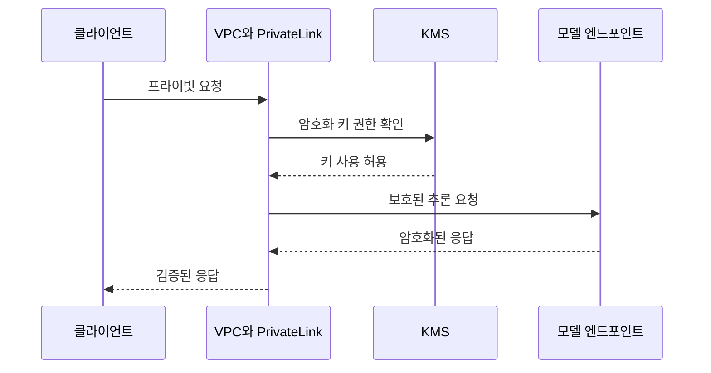

<!-- metadata-badges -->

<kbd>도메인 D5</kbd> <kbd>입문</kbd> <kbd>초안</kbd>

# AIF-C01 Task 5.1 Part 4 - 암호화 저장 시·전송 중·클라이언트 vs 서버 측·기본 암호화·KMS·TLS·분산 훈련 노드 간 암호화·Macie·VPC·PrivateLink

> AI 시스템 보호, 6개 강의 중 4번째

## 1. 암호화 - 고객 책임 + 규정 준수 공통 요구

- 데이터 안전 유지 또 다른 고객 책임 = **데이터 암호화**, 규정 준수 표준 일반적 요구
- 모든 AWS 서비스 **저장 시 암호화 + 전송 중 암호화 기능 제공**
- 저장 시 암호화→누군가 스토리지 볼륨 데이터 액세스 가능해도 **읽을 수 없음**

### 암호화 키 개념

- 암호화 키는 데이터 스토리지에 쓰기 전 암호화 알고리즘 함께 사용
- 암호 해독하려면 암호화 키 다시 액세스 필요 → 데이터 액세스만으로 읽을 수 없음

### 클라이언트 측 vs 서버 측

- **클라이언트 측 암호화:** 고객 데이터 AWS 서비스 보내기 전 암호화 수행
- **서버 측 암호화:** AWS 서비스에서 데이터 암호화 수행, **가장 쉬운 방법**→암호화 제대로 구현/일관 적용 보장, 일반적으로 리소스 구성 시 사용 옵션
- 일부 서비스 **기본적으로 암호화** 옵션 사용 않고도 암호화: **S3 / DynamoDB / SageMaker**
  - 예) SageMaker 노트북 인스턴스 / SageMaker 작업 / 엔드포인트 사용 데이터 포함 ML 스토리지 볼륨 모든 데이터 암호화
  - 기본 암호화 사용 서비스 = 고객 아닌 서비스 소유 키 사용

### AWS KMS - 추가 제어

- 추가 제어 필요 → **AWS KMS (Key Management Service)** 사용 계정 속한 암호화 키 사용 가능
- KMS 사용 AWS 계정 암호화 키 생성/관리/사용 가능
- **IAM 정책 사용 키 사용 제어**→또 다른 보호 계층 추가
  - 예) 누군가 실수로 S3 버킷 읽기 권한 부여→데이터 암호 해독 필요 KMS 키 사용 권한 없으면 데이터 읽을 수 없음
- S3 / SageMaker 같이 기본 암호화 사용 서비스는 사용 KMS 키 지정 경우 제외 자체 키 사용
- KMS 사용 시 AWS 관리형 또는 고객 제어 키 사용 가능
  - **고객 관리형 키:** 키 정책 / 키 / 키 교체 / 키 사용 / 사용 중지 대한 IAM 정책 제어

### 전송 중 암호화 - TLS

- 모든 AWS 서비스 엔드포인트 **TLS 지원** API 요청 보안 **HTTPS 연결** 생성
- API / 콘솔 통한 S3 / SageMaker 모든 요청 안전 암호화 연결 통해 수행

### SageMaker 분산 훈련 노드 간 암호화

- 클러스터 여러 노드 사용, **기본 노드 간 트래픽 암호화 안됨** but 사용 옵션 있음
- 매우 민감 데이터 필요 가능 but 노드 간 암호화 사용 시 일부 알고리즘 특히 **딥 러닝 알고리즘 훈련 시간 늘어날 수 있음**

## 2. Amazon Macie - 민감 데이터 탐지

- **Macie = S3 버킷 지속 평가 + 버킷 크기/상태 인벤토리 자동 생성**
  - 포함: 프라이빗/퍼블릭 액세스 / 다른 AWS 계정 공유 액세스 / 암호화 상태
- **ML + 패턴 일치 사용 PII 같은 민감 데이터 식별 + 사용자 알림**
- 알림 ML 워크플로 통합 자동화된 수정 작업 수행 가능
- 일반적으로 **PII 수집/변환 시점 훈련 데이터에서 제거**해야 함
  - 예) 모델 신용 카드 번호/이름/주소/주민등록번호 훈련 이유 없음
- Macie S3 버킷 민감 데이터 찾으면 알림→훈련 데이터 있으면 해당 데이터 제거 필요

## 3. VPC - 클라우드 인프라 보안 구성 관리

- 고객 클라우드 인프라 보안 구성 관리 책임
- AWS 자체 프라이빗 네트워크 구성 가능 **VPC (Virtual Private Cloud)** 제공

### SageMaker Studio / 노트북 인스턴스 VPC

- SageMaker Studio / 노트북 인스턴스는 SageMaker 통해 관리되는 VPC 실행
- 기본 인터넷 직접 액세스 가능 → 인기 패키지 다운로드 가능 but 인터넷 통해 데이터 보내는 **악성 코드 다운로드 위험**
- **가장 좋음:** VPC 계정 생성 + Studio / 노트북 시작 시 VPC 지정
  - 탄력적 네트워크 인터페이스 (ENI) VPC 생성 + 노트북 인스턴스 연결
  - 자체 VPC 사용 → **보안 그룹 / 네트워크 ACL / 네트워크 방화벽 구성** 인터넷 액세스 가능 트래픽 제어 가능
  - 네트워크 액세스 유형 VPC만 지정 → SageMaker 인터넷 액세스 노트북 인스턴스 제공 못하도록 방지 가능

### VPC 전용 모드 + PrivateLink

- SageMaker Studio 일반적으로 퍼블릭 네트워크 사용 S3 / CloudWatch / SageMaker 런타임 / SageMaker API 같은 필수 서비스 연결
- **VPC 전용 모드** 사용 시 이러한 서비스 퍼블릭 엔드포인트 더 이상 연결 불가
- 모든 네트워크 트래픽 프라이빗 네트워크 통해서만 이동하도록 → **VPC 인터페이스 엔드포인트** 사용 가능
- **VPC 인터페이스 엔드포인트 = AWS PrivateLink 사용 VPC를 AWS 서비스 직접 연결**
- SageMaker Studio VPC 실행되므로 VPC 인터페이스 엔드포인트 사용 외부 서비스 액세스 가능

## 4. 시험 체크포인트

- 데이터 안전 유지 고객 책임 데이터 암호화 규정 준수 일반 모든 서비스 저장 시 암호화 전송 중 암호화 기능 제공 저장 시 암호화 스토리지 볼륨 액세스 가능해도 읽을 수 없음 암호화 키 데이터 스토리지에 쓰기 전 암호화 알고리즘 함께 사용 암호 해독 키 다시 액세스 필요 데이터 액세스만으로 읽을 수 없음 클라이언트 측 암호화 고객 데이터 서비스 보내기 전 암호화 서버 측 암호화 서비스에서 데이터 암호화 가장 쉬운 방법 제대로 구현 일관 적용 보장 일반적으로 리소스 구성 시 옵션 일부 서비스 기본 암호화 옵션 않고도 암호화 S3 DynamoDB SageMaker 노트북 작업 엔드포인트 사용 데이터 포함 ML 스토리지 볼륨 모든 데이터 암호화 기본 암호화 서비스 고객 아닌 서비스 소유 키 사용 추가 제어 KMS 계정 속한 키 사용 KMS 계정 키 생성 관리 사용 IAM 정책 키 사용 제어 또 다른 보호 계층 실수로 S3 읽기 권한 부여 KMS 키 사용 권한 없으면 읽을 수 없음 기본 암호화 서비스 KMS 키 지정 경우 제외 자체 키 사용 KMS AWS 관리 고객 제어 키 사용 가능 고객 관리형 키 정책 키 교체 사용 사용 중지 IAM 정책 제어 모든 엔드포인트 TLS 지원 API 요청 보안 HTTPS 연결 생성 API 콘솔 통한 S3 SageMaker 모든 요청 안전 암호화 연결 수행 분산 훈련 클러스터 여러 노드 기본 노드 간 트래픽 암호화 안됨 사용 옵션 매우 민감 필요 노드 간 암호화 일부 알고리즘 특히 딥러닝 훈련 시간 늘어날 수 있음
- Macie S3 버킷 지속 평가 크기 상태 인벤토리 자동 생성 프라이빗 퍼블릭 액세스 다른 계정 공유 액세스 암호화 상태 포함 ML 패턴 일치 PII 민감 데이터 식별 알림 알림 워크플로 통합 자동 수정 작업 수행 PII 수집 변환 시점 훈련 데이터 제거 신용 카드 번호 이름 주소 주민등록번호 훈련 이유 없음 Macie S3 민감 데이터 찾으면 알림 훈련 데이터 있으면 제거 필요
- 고객 클라우드 인프라 보안 구성 관리 책임 자체 프라이빗 네트워크 구성 VPC 제공 SageMaker Studio 노트북 인스턴스 SageMaker 통해 관리 VPC 실행 기본 인터넷 직접 액세스 인기 패키지 다운로드 가능 인터넷 통해 데이터 보내는 악성 코드 다운로드 위험 가장 좋음 VPC 계정 생성 Studio 노트북 시작 시 VPC 지정 탄력적 네트워크 인터페이스 VPC 생성 노트북 연결 자체 VPC 보안 그룹 네트워크 ACL 네트워크 방화벽 구성 인터넷 액세스 트래픽 제어 네트워크 액세스 유형 VPC만 지정 인터넷 액세스 제공 못하도록 방지 Studio 일반적으로 퍼블릭 네트워크 S3 CloudWatch 런타임 API 같은 필수 서비스 연결 VPC 전용 모드 퍼블릭 엔드포인트 더 이상 연결 불가 모든 트래픽 프라이빗 통해서만 이동 VPC 인터페이스 엔드포인트 사용 PrivateLink 사용 VPC AWS 서비스 직접 연결 Studio VPC 실행 인터페이스 엔드포인트 사용 외부 서비스 액세스 가능

## 학습 문서 메타데이터

- 도메인: D5 — AI 솔루션의 보안, 규정 준수 및 거버넌스
- 원본 보존 링크: [AIF-C01-Task5-1-Part4.md](../../../docs/Refs/AIF-C01-Task5-1-Part4.md)
- 이 문서는 원본 본문을 보존한 복사본이며, 이 섹션·도식·네비게이션은 학습용으로 추가했습니다.

이 시퀀스 다이어그램은 AI 요청이 VPC·PrivateLink 연결, KMS 키, 모델 경계를 거쳐 검증된 응답으로 돌아오는 시간 순서의 보안 상호작용을 보여 줍니다. Mermaid가 렌더링되지 않아도 저장·전송 보호의 순서를 읽을 수 있습니다.

---

[이전](part-3.md) | [인덱스](README.md) | [다음](part-5.md)
