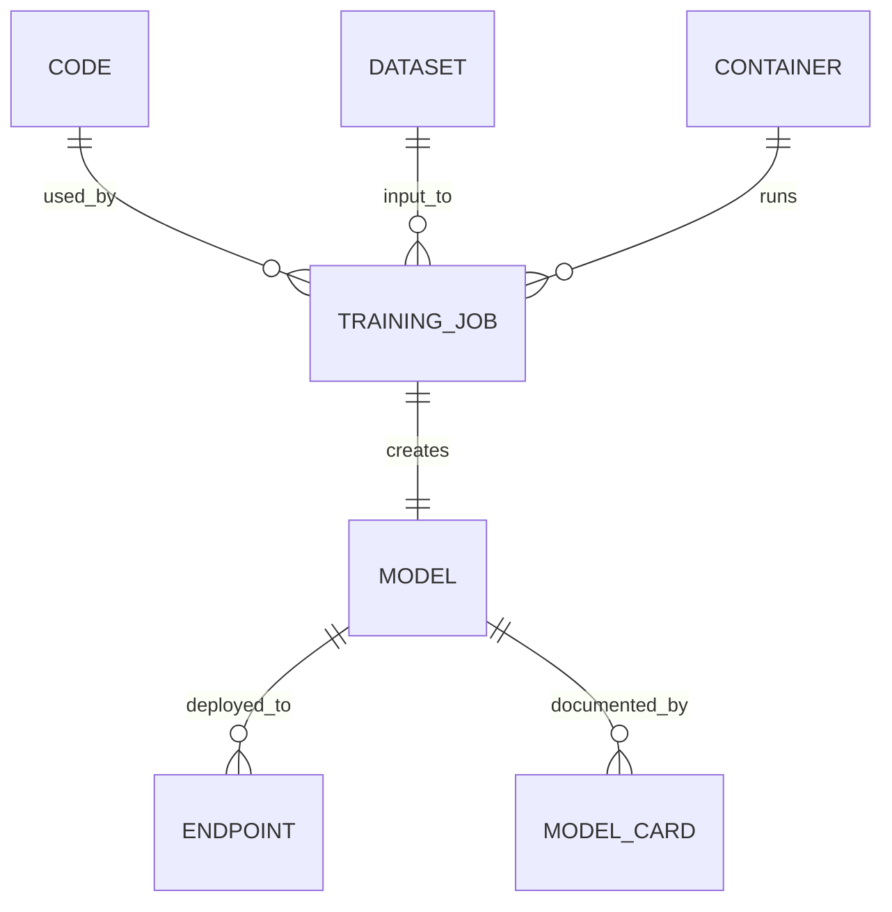

  

# AIF-C01 Task 5.1 Part 6 - 아티팩트 추적·버전 관리·재생성 / CodeCommit·S3 접두사·ECR·훈련 작업 ID·Model Registry·Model Cards·계보 추적·Feature Store·Model Dashboard (5.1 마무리)

> AI 시스템 보호, 6개 강의 중 6번째 (마무리)

## 1. 모델 제작 아티팩트 추적 - 규제·제어 요구사항 충족·재생성 필수

- 모델 제작 사용 모든 아티팩트 추적 = 규제·제어 요구 충족 모델 재생성 필수 요구
- 재생성 위해 개발 사용 다양한 아티팩트 모두 버전 관리/추적 필요

### 코드 리포지토리

- **GitHub / AWS CodeCommit** 같은 코드 리포지토리 소스 코드 버전 자동 유지
- 포함: **훈련 코드 / 추론 코드 / 실험 / 노트북**

### 데이터세트 식별

- 훈련 데이터세트 고유 식별 위해 **S3 저장 + 접두사(prefix) 파티션** 필요

### 컨테이너 이미지

- **ECR (Elastic Container Registry)** 저장 컨테이너 이미지 고유 ID 고유 식별 + 추가 정보 태그 지정 가능

### SageMaker 훈련 작업

- SageMaker 자동 각 훈련 작업 고유 식별 + 하이퍼파라미터 같은 다른 메타데이터 + 컨테이너/데이터세트/모델 출력 고유 식별자 저장

### 모델 버전 - Model Registry

- 모델 버전 **SageMaker Model Registry** 사용 모델 카탈로그 저장 가능
- **SageMaker 엔드포인트 모두 고유 식별자+메타데이터**, 사용 모델 자동 엔드포인트 구성 일부로 추적

## 2. SageMaker Model Registry - 모델 카탈로그

- 다양한 버전 모델 포함 **모델 그룹 모델 카탈로그 작성 가능**
- 모델 그룹 각 **모델 패키지 = 훈련된 모델 해당**
- 훈련 지표 포함 모델 메타데이터 연결/보기 가능
- 모델 레지스트리에서 직접 배포 가능
- **모델 상태 유지:** 보류 중 / 승인됨 / 거부됨

## 3. SageMaker Model Cards - 문서화/검색/공유

- 구상에서 배포까지 필수 모델 정보 **문서화/검색/공유**
- 위험 관리자/데이터 과학자/ML 엔지니어 Model Cards 사용 **의도 사용/위험 등급/훈련 세부/평가 결과 변경 불가능 레코드 생성 가능**
- **PDF로 내보내고 이해 관계자와 공유 가능**

## 4. SageMaker ML 계보 추적 (Lineage Tracking)

- 엔드 투 엔드 ML 워크플로 모든 요소 **그래픽 표현 자동 생성**
- 표현 사용 **모델 거버넌스 설정 / 워크플로 재현 / 작업 기록 레코드 유지**
- 계보 추적 시험 구성 요소/관련 시험/실험 대한 **추적 엔터티 자동 생성**
- 처리 작업/훈련 작업/배치 변환 작업 같은 SageMaker 작업 생성 시 사용 가능
- **계보 데이터 쿼리 실행** 엔터티 간 관계 검색 가능
  - 예) 특정 데이터세트 사용 모든 모델 검색 / 컨테이너 이미지 아티팩트 사용 데이터세트 검색

## 5. 특성 복습 + Feature Store

- 특성 = 모델 훈련/예측 위해 입력 중 하나 사용 데이터 속성, 데이터 테이블 열 설명 가능
- **SageMaker Feature Store = 특성/관련 메타데이터 중앙 집중식 저장소**→특성 쉽게 검색/재사용
- ML 개발 특성 생성/공유/관리 덜 복잡하게 만듦
- ML 알고리즘 훈련 위해 원시 데이터 특성 변환 필요 반복적 데이터 처리/큐레이션 작업 줄여 프로세스 가속
- 원시 데이터 특성 변환 + 특성 그룹 추가 워크플로 파이프라인 생성 가능
- **특성 그룹 계보 보기 가능:** 계보 특성 처리 워크플로 실행 코드 정보 포함, 사용 데이터 소스 + 특성 그룹/특성 수집 방법 포함
- **특정 시점 쿼리 지원:** 관심 과거 시점 각 특성 상태 검색

## 6. SageMaker Model Dashboard - 중앙 집중식 포털

- SageMaker 콘솔 액세스 가능 **중앙 집중식 포털**, 계정 모든 모델 보기/검색/탐색 가능
- **Model Monitor + Model Cards 포함 여러 특성 모델 관련 정보 집계**
- **워크플로 계보 시각화 + 엔드포인트 성능 추적 가능**
- 추론 배포 모델 + 해당 모델 배치 변환 작업 사용 여부 / 엔드포인트 호스팅 여부 추적 가능
- Model Monitor 사용 모니터 설정 시 모델 라이브 데이터 실시간 예측 시 성능 추적 가능
- 대시보드 사용 **데이터 품질 / 모델 품질 / 편향 / 설명 가능성 설정 임계값 위반 모델 찾기 가능**
- 모든 모니터링 결과 포괄 프레젠테이션 지표 구성 안된 모델 빠르게 식별 도움

## 7. 시험 체크포인트

- 아티팩트 추적 모델 제작 사용 모든 아티팩트 추적 규제 제어 요구 충족 재생성 필수 다양한 아티팩트 모두 버전 관리 추적 필요 코드 리포지토리 GitHub CodeCommit 소스 코드 버전 자동 유지 훈련 코드 추론 코드 실험 노트북 포함 훈련 데이터세트 고유 식별 S3 저장 접두사 파티션 ECR 저장 컨테이너 이미지 고유 ID 고유 식별 추가 정보 태그 지정 SageMaker 자동 각 훈련 작업 고유 식별 하이퍼파라미터 메타데이터 컨테이너 데이터세트 모델 출력 고유 식별자 저장 모델 버전 Model Registry 모델 카탈로그 저장 엔드포인트 모두 고유 식별자 메타데이터 사용 모델 자동 엔드포인트 구성 일부 추적
- Model Registry 다양한 버전 모델 포함 모델 그룹 모델 카탈로그 작성 모델 그룹 각 모델 패키지 훈련된 모델 해당 훈련 지표 포함 메타데이터 연결 보기 모델 레지스트리 직접 배포 모델 상태 보류 승인 거부
- Model Cards 구상 배포 필수 모델 정보 문서화 검색 공유 위험 관리자 데이터 과학자 ML 엔지니어 의도 사용 위험 등급 훈련 세부 평가 결과 변경 불가능 레코드 생성 PDF 내보내고 이해 관계자 공유
- ML 계보 추적 엔드 투 엔드 워크플로 모든 요소 그래픽 표현 자동 생성 표현 사용 거버넌스 설정 워크플로 재현 작업 기록 레코드 유지 계보 추적 시험 구성 요소 관련 시험 실험 추적 엔터티 자동 생성 처리 작업 훈련 작업 배치 변환 작업 생성 시 사용 계보 데이터 쿼리 실행 관계 검색 예) 특정 데이터세트 사용 모든 모델 검색 컨테이너 이미지 아티팩트 사용 데이터세트 검색
- 특성 모델 훈련 예측 입력 중 하나 사용 데이터 속성 테이블 열 설명 Feature Store 특성 관련 메타데이터 중앙 집중식 저장소 쉽게 검색 재사용 생성 공유 관리 덜 복잡 원시 데이터 특성 변환 필요 반복 처리 큐레이션 작업 줄여 가속 원시 데이터 특성 변환 특성 그룹 추가 워크플로 파이프라인 생성 특성 그룹 계보 보기 계보 특성 처리 워크플로 실행 코드 정보 포함 사용 데이터 소스 특성 그룹 특성 수집 방법 포함 특정 시점 쿼리 지원 관심 과거 시점 각 특성 상태 검색
- Model Dashboard 콘솔 액세스 중앙 집중식 포털 계정 모든 모델 보기 검색 탐색 Model Monitor Model Cards 포함 여러 특성 정보 집계 워크플로 계보 시각화 엔드포인트 성능 추적 추론 배포 모델 배치 변환 사용 여부 엔드포인트 호스팅 여부 추적 Monitor 사용 모니터 설정 라이브 데이터 실시간 예측 성능 추적 대시보드 데이터 품질 모델 품질 편향 설명 가능성 설정 임계값 위반 모델 찾기 모든 모니터링 결과 포괄 프레젠테이션 지표 구성 안된 모델 빠르게 식별 도움

## 학습 문서 메타데이터

- 도메인: D5 — AI 솔루션의 보안, 규정 준수 및 거버넌스
- 원본 보존 링크: [AIF-C01-Task5-1-Part6.md](../../../docs/Refs/AIF-C01-Task5-1-Part6.md)
- 이 문서는 원본 본문을 보존한 복사본이며, 이 섹션·도식·네비게이션은 학습용으로 추가했습니다.

이 ER 다이어그램은 코드·데이터·컨테이너·훈련 작업·모델·엔드포인트가 식별자와 메타데이터로 연결되는 데이터 계보 관계를 보여 줍니다. Mermaid가 렌더링되지 않아도 아티팩트 추적과 재생성에 필요한 관계를 읽을 수 있습니다.

---

[이전](part-5.md) | [인덱스](README.md) | [다음](../task-5-2/part-1.md)
